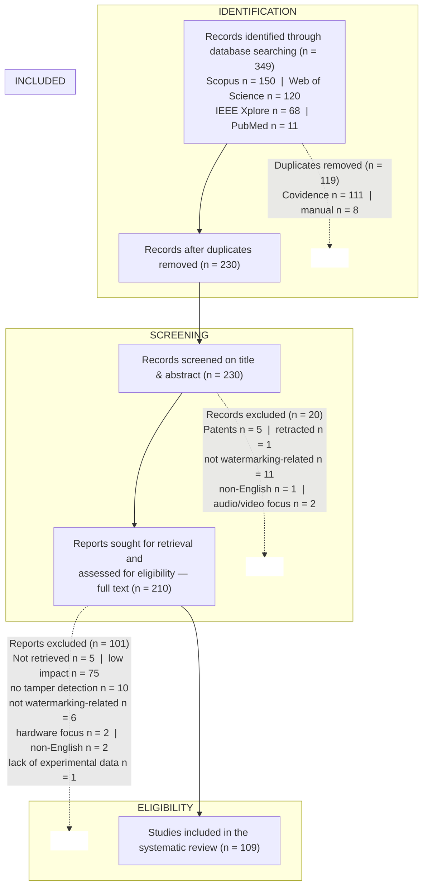
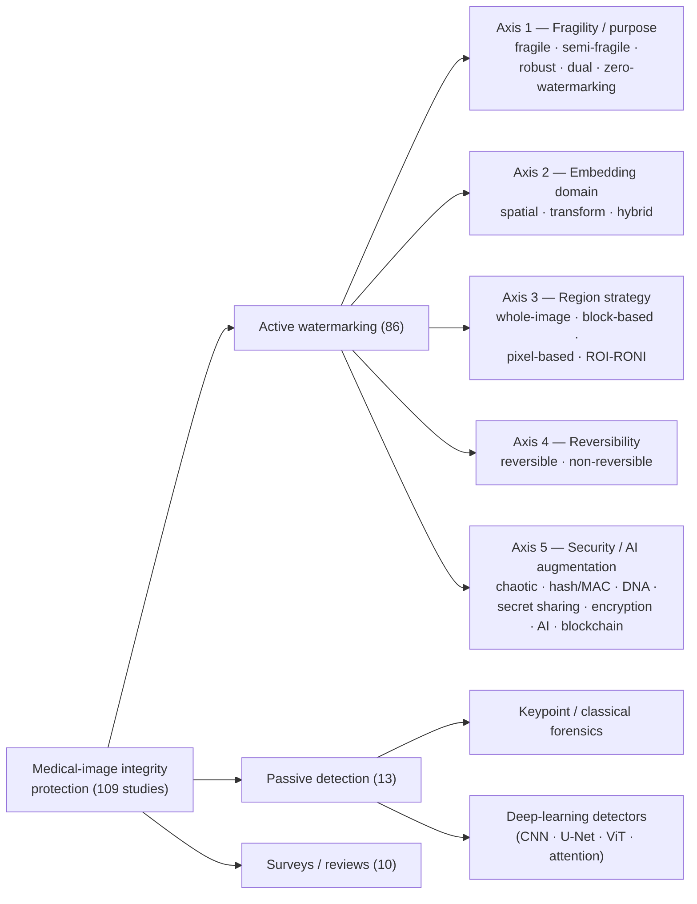

# Digital Watermarking Schemes for Tampering Detection, Localization, and Recovery in Medical Imaging: A Systematic Literature Review

---

## Abstract

**Context.** Medical images are now produced, transmitted, and archived almost exclusively in digital form, circulating through telemedicine links, Picture Archiving and Communication Systems (PACS), cloud repositories, and the Internet of Medical Things (IoMT). In these open environments a diagnostic image can be intercepted and altered before it reaches the radiologist, and even a small malicious change to a region of interest may precipitate misdiagnosis, insurance fraud, or the corruption of legal and research evidence. Digital watermarking, which embeds authentication information directly into the image, has emerged as a leading *active* defence that can not only flag tampering but also pinpoint *where* the image was altered and, in advanced designs, *reconstruct* the damaged content.

**Objective.** This Systematic Literature Review (SLR) consolidates the state of the art in digital watermarking for tamper **detection**, **localization**, and **recovery** of medical images, and characterizes how these schemes are designed, secured, and evaluated.

**Methods.** Following the PRISMA 2020 guidelines, 349 records were retrieved from Scopus, Web of Science, IEEE Xplore, and PubMed. After the removal of 119 duplicates, 230 records were screened and 210 reports were sought for retrieval; the application of explicit eligibility criteria yielded **109 primary studies published between 2018 and 2026**. Each study was charted against a structured extraction schema covering watermark type, embedding domain, region strategy, detection mechanism, localization granularity, recovery mechanism, security primitives, use of artificial intelligence, imaging modality, datasets, evaluation metrics, attacks, and reported limitations.

**Results.** The corpus comprises 86 active watermarking schemes, 13 passive deep-learning forgery detectors, and 10 review articles. Fragile watermarking dominates (54 schemes), followed by dual robust–fragile designs (16); hybrid transform pipelines (43 schemes) and pure spatial-domain methods (36) are the principal embedding strategies, and the Region-of-Interest / Region-of-Non-Interest (ROI-RONI) partition is the most common region model (39 schemes). Tamper localization is reported by 89 of 109 studies, but self-recovery of altered content is provided by only 47 — roughly 55% of the active schemes. Peak Signal-to-Noise Ratio (PSNR, 76 studies) and the Structural Similarity Index (SSIM, 41 studies) are the near-universal imperceptibility metrics, yet datasets and attack protocols remain highly fragmented, and clinically validated benchmarks are essentially absent. Artificial-intelligence components appear in 24 studies and blockchain in only one, both concentrated after 2021.

**Conclusion.** Watermarking can deliver high-imperceptibility, fine-grained tamper detection and localization for medical images, and a substantial minority of schemes add credible self-recovery. The field is nonetheless constrained by a persistent capacity–imperceptibility–recovery trilemma, inconsistent and non-clinical evaluation practice, weak resilience to emerging generative (GAN/diffusion) forgery, and limited integration with the DICOM standard. Standardized clinical benchmarks, lightweight schemes for edge and IoMT deployment, and recovery mechanisms robust to high tampering rates are identified as the most pressing research priorities.

**Keywords:** medical image security; digital watermarking; tamper detection; tamper localization; self-recovery; reversible data hiding; fragile watermarking; region of interest; telemedicine; Internet of Medical Things; systematic literature review; PRISMA.

---
## 1. Introduction

### 1.1 Background and Motivation

Medical imaging is one of the foundations of contemporary clinical practice. Computed tomography (CT), magnetic resonance imaging (MRI), X-ray radiography, ultrasound, mammography, and positron-emission tomography (PET) generate the visual evidence on which diagnosis, treatment planning, surgical guidance, and longitudinal patient monitoring depend. These images are no longer physical films: they are digital objects, encoded predominantly in the Digital Imaging and Communications in Medicine (DICOM) standard and managed through Picture Archiving and Communication Systems (PACS) [1], [2]. The same digitization that enables instant retrieval and computer-aided analysis also makes the image a *transmissible* and *editable* asset.

The clinical and economic forces of the last decade — telemedicine, electronic health records (EHR), cloud-hosted PACS, smart hospitals, and the Internet of Medical Things (IoMT) — have pushed medical images out of the closed hospital network and onto shared, bandwidth-constrained, and frequently untrusted infrastructure [3], [4], [5]. A radiograph acquired at a rural clinic may be relayed to a tertiary centre for a specialist opinion; a CT volume may be staged in a public cloud before a deep-learning triage service inspects it; an IoMT edge node may forward an ultrasound frame over a wireless channel. At every hop the image is exposed to interception, accidental corruption, and deliberate manipulation. Because a diagnostic decision — and, downstream, a patient's treatment — is taken on the assumption that the displayed pixels faithfully represent the patient's anatomy, the *integrity* and *authenticity* of a medical image are not secondary security properties but prerequisites for safe care [1], [2].

### 1.2 Threats to Medical Image Integrity

Several converging factors make medical images an attractive and tractable target for tampering. First, the consequences of a successful manipulation are severe: inserting or erasing a lesion can cause a healthy patient to be treated or a sick patient to be discharged. Second, the motivations are diverse and well documented — insurance and billing fraud, concealment of malpractice, ransomware leverage, falsification of clinical-trial or research data, and the manipulation of legal evidence have all been identified as drivers of medical-image forgery [4]. Third, the manipulation tools are widely available: classical copy–move and splicing operations require only consumer image editors, while inpainting and, more recently, generative adversarial networks (GANs) and diffusion models can synthesize or remove anatomically plausible structures that defeat the human eye [6], [7], [8].

The attack surface is correspondingly broad. Content-level forgeries include copy–move (cloning a region within the same image), splicing or collage (importing content from another image), and content removal or inpainting [6], [9], [10], [11]. Watermarking-specific attacks include the vector-quantization (VQ) attack, the collage attack, the constant-average attack, and content-only attacks, all of which are engineered to forge a region while leaving block-level authentication data superficially consistent [12], [13], [14]. Geometric and signal-processing operations — rotation, scaling, cropping, filtering, noise, and lossy compression — additionally stress any embedded authentication data [15]. Finally, the emergence of GAN- and diffusion-generated content, exemplified by the CT-GAN attack that injects or removes pulmonary nodules occupying less than one percent of the image, defines a new and difficult frontier [7], [8]. A robust integrity solution for medical imaging must therefore contend not with a single attack but with an evolving adversary.

### 1.3 Digital Watermarking as an Active Authentication Paradigm

Two broad families of techniques address image integrity. *Passive* (blind) forensics analyses an image for the statistical, geometric, or device-level traces left by manipulation, without requiring any information to have been inserted beforehand [16], [9], [11]. *Active* approaches, by contrast, deliberately attach verifiable information to the image at, or soon after, acquisition; digital watermarking is the dominant active paradigm for medical images [1], [2].

A digital watermark is a payload — a hospital logo, a cryptographic hash, the patient's electronic patient record (EPR), or self-referential recovery data — embedded into the host image so that its presence and integrity can later be verified. For tamper authentication the watermark is engineered to be *fragile* or *semi-fragile*: any modification of the image disturbs the watermark, and the pattern of that disturbance reveals not only *whether* the image was altered but *where*. The most capable schemes go one step further and embed a compressed self-representation of the image, so that the content of a tampered region can be approximately or losslessly reconstructed. This progression — **detection** (was the image altered?), **localization** (which pixels or blocks were altered?), and **recovery** (what did the altered region originally contain?) — defines the functional spectrum examined in this review. Medical applications add a distinctive constraint: the diagnostically critical region of interest (ROI) must not be perceptibly degraded, which has motivated ROI-RONI region models, reversible data hiding, and zero- or non-embedding watermarking, all of which feature prominently in the corpus.

### 1.4 Motivation for This Review

Watermarking and image forensics are mature enough to have attracted numerous surveys. The corpus reviewed here itself contains ten review articles: general medical-image watermarking and authentication surveys [3], [4], [1], [2]; fragile-watermarking-focused surveys [12]; deep-learning and forgery-detection surveys [6], [9], [10], [11]; and a survey of transform, machine-learning, and evolutionary watermarking methods [15]. These works are valuable, but they leave a specific gap. Several are not specific to medicine [6], [9], [15], [10], [11]; several treat detection and localization without a sustained, comparative analysis of *recovery* effectiveness [3], [1]; and, to the best of our knowledge, none combines (i) an explicit focus on the **detection–localization–recovery triad** for **medical** images, (ii) a transparent, reproducible **PRISMA 2020** selection protocol, and (iii) coverage extending through **2026**, a period in which AI-assisted watermarking and generative forgery have materially reshaped the field. The present SLR is designed to fill that gap by systematically charting, classifying, and synthesizing 109 primary studies under a single extraction schema.

### 1.5 Contributions

This review makes the following contributions:

1. It delivers, to the best of our knowledge, the first PRISMA-based systematic literature review focused specifically on the **detection, localization, and recovery triad** for medical-image watermarking, covering 109 primary studies published between 2018 and 2026.
2. It proposes a consolidated **taxonomy** of medical-image tamper-detection watermarking schemes along five axes — fragility class, embedding domain, region strategy, recovery capability, and security/AI augmentation — and positions every primary study within it.
3. It answers three research questions through **per-RQ synthesis**, supported by comparison tables that span the entire corpus, on watermarking techniques and their robustness (RQ1), recovery mechanisms and their effectiveness (RQ2), and evaluation metrics, datasets, and experimental protocols (RQ3).
4. It quantifies **trends and gaps** across the corpus — including the distribution of fragility classes, embedding domains, modalities, and metric usage; the 55% gap between localization-capable and recovery-capable schemes; and the concentration of AI adoption after 2021 — and distils them into an agenda of open challenges.
5. It provides a complete **data-extraction appendix** charting all 109 studies, intended as a reusable reference for researchers and practitioners.

### 1.6 Research Questions

The review is structured around three research questions (RQs):

- **RQ1.** What watermarking techniques have been developed for tamper detection and localization in medical images, and how are their performance and robustness evaluated?
- **RQ2.** What tamper recovery mechanisms are used in medical image watermarking schemes, and how effective are they in preserving diagnostic image integrity?
- **RQ3.** What evaluation metrics, datasets, and experimental protocols are commonly used to assess medical image watermarking techniques?

RQ1 is addressed in Section 5, RQ2 in Section 6, and RQ3 in Section 7; Section 8 consolidates the three answers.

### 1.7 Organization of the Paper

The remainder of this paper is organized as follows. **Section 2** establishes the background and preliminaries: the integrity-threat and attack taxonomy, watermarking fundamentals and properties, and the classification axes used throughout the review. **Section 3** details the review methodology, including the data sources, search strategy, inclusion and exclusion criteria, the PRISMA 2020 study-selection flow, the data-extraction schema, and threats to the validity of the review. **Section 4** gives a quantitative overview of the 109 selected studies and presents the proposed taxonomy. **Sections 5, 6, and 7** answer RQ1, RQ2, and RQ3 respectively, each closing with a synthesis and comparison tables. **Section 8** discusses the consolidated findings, cross-cutting trade-offs, and application contexts, and compares this review with the prior surveys in the corpus. **Section 9** sets out open challenges and future research directions, and **Section 10** concludes. A complete IEEE-numbered reference list and a study-characteristics appendix (Appendix A) covering all 109 studies follow.

---
## 2. Background and Preliminaries

This section establishes the conceptual vocabulary used throughout the review. All definitions, attack descriptions, and classification axes are synthesized from the primary corpus — in particular the ten review articles it contains [6], [3], [4], [9], [1], [15], [12], [10], [11], [2] — so that the review remains self-contained with respect to its sources.

### 2.1 Threats to Integrity and a Taxonomy of Attacks

A medical image is *authentic* if it originates from the claimed source and *has integrity* if its pixels have not been altered since acquisition. Attacks against integrity can be organized into three groups: content forgery, watermarking-specific attacks, and incidental signal-processing operations.

**Content forgery.** The three classical forgery operations recur across the forensic surveys [6], [9], [10], [11]. *Copy–move* duplicates a region within the same image — for example, cloning healthy tissue over a lesion or replicating a nodule; because the copied region shares the image's own statistics and illumination, it is difficult to detect by noise analysis alone [17], [18]. *Splicing* (also termed collage or compositing) imports content from a different image, such as transplanting a tumour from one patient's scan onto another's [19]. *Content removal / inpainting* deletes a structure and fills the gap with plausible texture [9]. In the medical setting these operations translate directly into lesion injection and lesion removal, the two manipulations of greatest clinical concern.

**Watermarking-specific attacks.** A second class of attacks is engineered specifically to defeat block-based fragile watermarks by forging content while keeping the embedded authentication data consistent [12]. In the *vector-quantization (VQ) attack* an adversary assembles a forged image from authenticated blocks drawn from a codebook of other watermarked images sharing the same key [13], [20]. The *collage attack* similarly pieces together a counterfeit from genuine watermarked fragments [21], [22], [14]. The *constant-average attack* modifies a block while preserving its mean so that mean-based authentication codes do not change [23], [14], [24]. *Content-only attacks* alter pixels without touching the embedded bits [12], [14]. Ustubioglu et al. additionally identified *border-region* and *block-replacement* attacks that exploit weakly protected image margins [25], and Fedoseev and Denisova characterized an *advanced tampering attack* that modifies content while leaving an LSB- or QIM-based fragile watermark intact, then defended against it with key-dependent variable quantization [26]. These attacks explain why detection accuracy, false-positive rate, and resilience to VQ/collage are emphasised so consistently in the corpus.

**Signal-processing and geometric attacks.** Independently of malicious intent, a medical image may undergo legitimate operations — JPEG or JPEG2000 compression, filtering, contrast or histogram adjustment, noise, rotation, scaling, and cropping [15]. A *fragile* authentication watermark must treat any such change as tampering, whereas a *semi-fragile* watermark must tolerate benign, content-preserving processing (notably standardized DICOM compression) while still rejecting malicious edits — a distinction made explicit by Fragoso-Navarro et al., who separate legitimate compression from attacks using a bit-error-rate threshold [27].

**Generative forgery.** Finally, GAN- and diffusion-generated manipulation is an emerging threat that the most recent studies in the corpus begin to address. Mahdi et al. detect GAN- and diffusion-generated forgeries across heterogeneous domains including medical CT [7], and Zhang et al. target the CT-GAN attack, in which a generative model injects or removes a tumour occupying under one percent of the image — a perturbation small enough to evade conventional detectors [8]. Capasso et al. frame this as an arms race in which deep generative models serve both attacker and defender [6].

### 2.2 Watermarking Fundamentals

A watermarking system has two processes. **Embedding** takes a host (cover) medical image, a payload, and a secret key, and produces a watermarked image perceptually indistinguishable from the host. **Extraction / verification** takes a received image and the key, recovers or regenerates the authentication data, and decides whether — and where — the image was tampered with.

The **payload** varies with purpose. Tamper-authentication schemes derive the payload from the image itself: a cryptographic hash of the ROI [28], [29], [30], a block checksum or parity code [5], [31], or content features [32]. Data-hiding schemes additionally embed the **electronic patient record (EPR)** or electronic health record so that demographic and diagnostic metadata travel inside the image [33], [34], [35]. Recovery-capable schemes embed a **compressed self-representation** of the image as recovery reference data [36], [37], [38].

Extraction schemes are classified by how much side information verification requires. A **blind** (public) scheme needs only the key [39], [40]; a **semi-blind** scheme needs the key and limited auxiliary data such as a verification matrix [39], [24]; a **non-blind** scheme needs the original image or original features [41], [42]. Blind operation is strongly preferred for telemedicine, because the verifier at the receiving end rarely has access to the original.

### 2.3 Properties of a Watermarking Scheme

Six properties govern the design of a medical-image watermarking scheme; the reviews consistently note that they cannot be maximized simultaneously [1], [12], [2].

- **Imperceptibility (fidelity).** The watermark must not introduce perceptible distortion, and in particular must not alter diagnostic features. It is quantified mainly by Peak Signal-to-Noise Ratio (PSNR) and the Structural Similarity Index (SSIM).
- **Robustness vs. fragility.** A *robust* watermark survives processing and is used for copyright and ownership; a *fragile* watermark is destroyed by the slightest change and is used for tamper authentication; a *semi-fragile* watermark occupies the middle ground, tolerating benign processing while rejecting malicious tampering [27], [12].
- **Capacity (payload).** The number of bits embeddable per pixel (bpp) or per image. High capacity is needed to carry the EPR and, especially, the recovery reference data.
- **Security.** The watermark must be inaccessible to an adversary without the key; this is reinforced by encryption, chaotic maps, hashing, and related primitives (Section 2.4).
- **Reversibility.** A *reversible* (lossless) scheme can restore the exact original host after the payload is extracted — a property of particular value in medicine, where any residual distortion in the ROI is undesirable [43], [26], [44].
- **Computational complexity.** Embedding and extraction must be fast enough for the deployment context, which is critical for real-time IoMT and edge scenarios [35], [5], [31].

A central message of the surveys is that these properties form a set of *trade-offs*: raising capacity tends to lower imperceptibility, robustness conflicts with fragility, and reserving space for recovery data competes with both [12], [2]. No single scheme optimizes all six, and design therefore amounts to choosing a defensible operating point.

### 2.4 Classification of Watermarking Schemes

The corpus is organized along five orthogonal axes used throughout this review.

**By fragility / purpose.** *Fragile* schemes are tuned for maximum tamper sensitivity and constitute the bulk of medical-image authentication work. *Semi-fragile* schemes distinguish benign from malicious change [45], [27]. *Robust* and *dual / multipurpose* schemes combine a robust watermark (ownership) with a fragile one (authentication) so that a single image carries both functions [28], [46], [47], [14]. *Zero-watermarking* schemes construct an authentication signature from image features and register it with a trusted authority **without modifying a single pixel**, thereby achieving perfect imperceptibility at the cost of external storage [48], [49], [44].

**By embedding domain.** *Spatial-domain* schemes modify pixel values directly — least-significant-bit (LSB) substitution, pixel differencing, interpolation-based reversible data hiding, histogram bin shifting, and most-significant-bit (MSB)-driven mapping [33], [50], [51], [52], [40]. They are simple, fast, and high-capacity but generally fragile to processing. *Transform-domain* schemes embed in the coefficients of a frequency or multiresolution transform — the discrete wavelet transform (DWT), discrete cosine transform (DCT), integer wavelet transform (IWT), redundant DWT (RDWT), Slantlet transform (SLT), curvelet, contourlet/NSCT, ridgelet, and even the quantum Fourier transform (QFT) [53], [54], [35], [55], [56], [42] — and trade capacity for better robustness and energy compaction. *Hybrid* schemes cascade a transform with a matrix factorization such as singular value decomposition (SVD), QR, or Schur decomposition, or combine a transform with spatial embedding, to balance the competing properties [57], [58], [14], [24].

**By region strategy.** *Whole-image* schemes treat every pixel uniformly [59], [60]. *Block-based* schemes partition the image into blocks (typically 2×2 to 16×16) and authenticate each block independently, which makes block size the principal lever on localization granularity and false-positive rate [23], [61], [12]. *Pixel-based* schemes authenticate individual pixels for the finest possible localization [50], [62], [63]. *ROI-RONI* schemes — the most common model in medicine — split the image into a diagnostically critical region of interest (ROI) and a region of non-interest (RONI), protecting the ROI while embedding authentication and recovery data in the RONI [29], [54], [30], [47]. ROI determination ranges from manual delineation through saliency and segmentation to fully automatic morphological or deep-learning methods [64], [65].

**By reversibility.** *Reversible* (lossless) schemes restore the bit-exact host once the payload is removed, often through difference expansion, prediction-error expansion, histogram shifting, or the Permutation Ordered Binary (POB) number system [29], [66], [67], [68]. *Non-reversible* schemes leave a small permanent distortion.

**By security augmentation.** Many schemes layer cryptographic primitives onto the watermark: chaotic maps (logistic, Hénon, Chen, Lorenz, and coupled variants) and the Arnold transform for scrambling [53], [21], [55]; cryptographic hashing and message authentication codes (SHA-1/256/512, MD5, CRC) for content signatures [23], [29], [69]; DNA encoding [21], [70]; secret sharing [71], [66], [25]; and conventional encryption (AES, RC4, ECDSA, compressive-sensing-based ciphers) [72], [5], [42]. Blockchain has also been proposed as an immutable ledger for watermark hashes [45].

### 2.5 Tamper Detection, Localization, and Self-Recovery

The functional core of the review is the progression from detection through localization to recovery; the conceptual framework follows the fragile-watermarking analysis of Raj and Shreelekshmi [12].

**Detection** answers the binary question *was the image altered?* The verifier regenerates the authentication data from the received image and compares it with the embedded or registered reference; any mismatch — typically signalled by a high bit-error rate or a failed hash comparison — declares the image inauthentic.

**Localization** answers *which parts were altered?* In block-based schemes each block carries its own authentication code, so the set of blocks whose codes fail identifies the tampered region; the granularity equals the block size, and pixel-based schemes push this to individual pixels [50], [63]. Localization quality is reported as tamper detection rate (TDR), false-positive rate (FPR), and false-negative rate (FNR), and there is an inherent tension: small blocks localize finely but raise the FPR, while large blocks are stable but coarse [12].

**Recovery (self-recovery)** answers *what did the altered region originally contain?* A recovery-capable scheme embeds, in addition to authentication data, a compressed approximation of each block — for example, its average intensity, quantized DCT coefficients, or a Block Truncation Coding (BTC) representation — in a *different*, key-determined location. When a region is found tampered, its content is reconstructed from the surviving copy [37], [38]. Two structural problems, both named by Raj and Shreelekshmi [12], shape this design. *Tamper coincidence* occurs when a block and the block holding its recovery data are both destroyed, leaving nothing to restore from; schemes counter it with multiple recovery copies, dual or hierarchical mapping, and reference sharing [36], [14]. *Reconstruction dependency* arises when recovery of one block depends on another that is itself tampered. The effectiveness of recovery is therefore reported as a function of the **tampering rate** — the fraction of the image altered — and the recovery-reference payload competes directly with imperceptibility, defining the capacity–imperceptibility–recovery trilemma examined in Sections 6 and 8.

With this vocabulary established, Section 3 describes how the 109 primary studies were identified and charted.

---
## 3. Review Methodology

This review was conducted as a Systematic Literature Review (SLR) following the Preferred Reporting Items for Systematic Reviews and Meta-Analyses (PRISMA 2020) guidelines. The methodology comprises three phases — *preparing* the review (research questions, sources, search strategy, eligibility criteria), *conducting* the review (the four-stage identification–screening–eligibility–inclusion flow), and *reporting* the review (data extraction and synthesis). Each phase is described below.

### 3.1 Research Questions

The review is driven by the three research questions stated in Section 1.6. RQ1 concerns the watermarking techniques used for tamper detection and localization and the evaluation of their performance and robustness; RQ2 concerns tamper recovery mechanisms and their effectiveness in preserving diagnostic integrity; and RQ3 concerns the evaluation metrics, datasets, and experimental protocols used across the field. The questions were designed to be complementary: together they trace a scheme from how it *finds* tampering, through how it *repairs* tampering, to how the community *measures* both.

### 3.2 Data Sources and Search Strategy

A comprehensive search was executed across four major academic databases selected for their coverage of computer science, engineering, and biomedical literature: **Scopus**, **Web of Science**, **IEEE Xplore**, and **PubMed**. The inclusion of PubMed alongside the three engineering-oriented indexes was intended to capture work appearing in biomedical-informatics venues.

The search used a single structured query combining three concept blocks — the *technique*, the *function*, and the *application domain* — joined by Boolean `AND`, with synonyms inside each block joined by `OR` and truncation (`*`) applied to capture morphological variants:

> (`"watermarking"` OR `"deep learning"` OR `"AI"` OR `"machine learning"` OR `"neural network"`) AND (`"tamper detect*"` OR `"tamper* localization"` OR `"tamper* recovery"` OR `"forgery detection"`) AND (`"medical imag"` OR `"CT"` OR `"MRI"` OR `"X-ray"` OR `"ultrasound"`)

The technique block deliberately admits both watermarking and learning-based terms so that *passive* deep-learning forgery detectors would be captured alongside *active* watermarking schemes; this is why the final corpus contains a distinct subset of passive-detection studies. The function block spans the detection–localization–recovery triad and forgery detection, and the domain block enumerates the principal imaging modalities in addition to the generic term. The search was restricted to the publication window 2018–2026.

### 3.3 Inclusion and Exclusion Criteria

Eligibility criteria were defined a priori to retain suitable manuscripts and remove unsuitable ones.

**Inclusion criteria.**
- **IC1 — Time window:** published between 2018 and 2026, to capture the most recent advancements.
- **IC2 — Publication type:** peer-reviewed journal articles and conference papers only.
- **IC3 — Functional scope:** the proposed scheme must explicitly address tamper detection and recovery capabilities, rather than focusing solely on robust watermarking for copyright protection.
- **IC4 — Technical breadth:** to ensure the technical analysis covers all categories of watermarking attacks, the application scope was expanded beyond strictly medical-imaging contexts where a study contributes attack-category coverage.

**Exclusion criteria.**
- **EC1:** papers focusing purely on cryptographic encryption without incorporating any watermarking or data-hiding mechanism.
- **EC2:** studies published in languages other than English.
- **EC3:** theoretical papers or proposals lacking adequate experimental validation and quantitative performance analysis.
- **EC4:** patents, retracted papers, and works outside the subject area (e.g., audio/video-only or hardware-only focus), excluded during screening and eligibility assessment.

Criterion IC4 explains the presence in the corpus of a small number of high-quality non-medical studies — for instance, document-image and high-dynamic-range watermarking schemes [45], [39], [73] and general-purpose splicing detectors [74], [19] — which are retained specifically for their coverage of attack categories and are flagged as such throughout the synthesis.

### 3.4 Study Selection: The PRISMA 2020 Flow

Study selection followed the four PRISMA stages — identification, screening, eligibility, and inclusion — summarized in Fig. 1.

**Identification.** The database search yielded **349 records**: 150 from Scopus, 120 from Web of Science, 68 from IEEE Xplore, and 11 from PubMed. During identification, **119 duplicate records were removed** — 111 automatically via the Covidence systematic-review platform and 8 by manual inspection — leaving **230 unique records**.

**Screening.** The 230 records underwent title-and-abstract screening, at which **20 records were excluded**: patent documents (n = 5), retracted papers (n = 1), records not related to watermarking (n = 11), a non-English record (n = 1), and records with an audio/video focus (n = 2). **210 reports** remained and were sought for full-text retrieval.

**Eligibility.** The full texts of the 210 reports were assessed against the eligibility criteria. **101 reports were excluded**: not retrievable (n = 5), low impact (n = 75), no tamper detection (n = 10), not related to watermarking (n = 6), hardware focus (n = 2), non-English (n = 2), and lack of experimental data (n = 1).

**Inclusion.** The selection process produced a final corpus of **109 primary studies** included in this systematic review. The PRISMA arithmetic is internally consistent: 349 − 119 = 230; 230 − 20 = 210; 210 − 101 = 109, with the screening exclusions summing to 20 and the eligibility exclusions summing to 101.

**Fig. 1.** PRISMA 2020 flow diagram of the study-selection process.

### 3.5 Data Extraction and Synthesis

The full text of each of the 109 included studies was read and charted against a structured data-extraction schema of 22 fields: reference number; authors; year; venue; publication type; technique category (active watermarking, passive detection, or survey); watermark type; reversibility; embedding domain; region strategy; detection mechanism; localization granularity; recovery mechanism; security primitives; artificial-intelligence component; use of blockchain; imaging modality; datasets; best reported quantitative metrics (PSNR, SSIM, capacity, tamper detection rate, accuracy, and others); attacks evaluated; stated limitations; and free-text notes. Extraction was recorded in a machine-readable form and is reproduced in full in Appendix A.

To support reproducibility and reduce extractor bias, the review was conducted by two reviewers who charted the studies individually, after which the results were consolidated collectively and discrepancies resolved by discussion. Synthesis then proceeded in two complementary modes. *Quantitative synthesis* computed descriptive statistics over the charted fields — distributions by year, venue, technique category, embedding domain, region strategy, watermark type, and modality, and the prevalence of localization, recovery, reversibility, AI, and blockchain — and these statistics are reported in Section 4. *Narrative synthesis*, organized by research question in Sections 5–7, grouped studies by methodological family, compared their reported performance, and identified consensus, divergence, and gaps. Because the primary studies report heterogeneous metrics under heterogeneous protocols, no statistical meta-analysis (e.g., pooled effect sizes) was attempted; this heterogeneity is itself a finding, discussed under RQ3.

### 3.6 Threats to the Validity of the Review

Four classes of validity threat are acknowledged.

**Construct validity** concerns whether the search captured the relevant literature. A single search string, however well constructed, may miss studies that use unconventional terminology. This was mitigated by combining five technique synonyms, four function synonyms, and six domain terms across four databases, and by truncation; nonetheless, work indexed only under terms outside the string may have been missed.

**Internal validity** concerns the selection and extraction process. The "low impact" exclusion of 75 reports at the eligibility stage, while necessary to keep the corpus tractable, is a partly subjective judgement. Independent dual charting and collective consolidation reduce, but do not eliminate, extraction subjectivity.

**External validity** concerns generalizability. The corpus is bounded to 2018–2026 and to English-language journal and conference papers; older foundational work, grey literature, and non-English studies are therefore outside its scope, and the findings should be read as characterizing the recent, peer-reviewed, English-language state of the art.

**Conclusion validity** concerns the synthesis. The comparison of schemes relies on metrics as reported by the original authors, under datasets and attack protocols that — as Section 7 documents — are not standardized. Reported figures are therefore not strictly commensurable, and the review consistently presents them as indicative rather than as a like-for-like ranking. Bibliographic details in the reference list reflect what each source document exposes.

---
## 4. Overview of the Selected Studies

Before answering the research questions, this section gives a quantitative overview of the 109 included studies and introduces the taxonomy that organizes the subsequent synthesis. All figures are derived from the data-extraction schema of Section 3.5 and the complete charting in Appendix A.

### 4.1 Distribution by Publication Year

The corpus spans the full 2018–2026 window defined by inclusion criterion IC1. Table 1 shows a clear upward trend: the four years 2021–2025 contribute 80 of the 109 studies (73%), with a single-year peak of 20 studies in 2021. The lower counts for 2018–2020 reflect a smaller but established body of early work, while the count for 2026 (7 studies) represents papers published or in press at the time of the search and is necessarily partial. The sustained output after 2021 confirms that medical-image tamper detection, localization, and recovery is an active and growing research area rather than a saturated one.

**Table 1.** Distribution of the 109 included studies by publication year.

| Year | Studies | Share | Year | Studies | Share |
|------|--------:|------:|------|--------:|------:|
| 2018 | 7 | 6.4% | 2023 | 15 | 13.8% |
| 2019 | 6 | 5.5% | 2024 | 15 | 13.8% |
| 2020 | 9 | 8.3% | 2025 | 17 | 15.6% |
| 2021 | 20 | 18.3% | 2026 | 7 | 6.4% |
| 2022 | 13 | 11.9% | **Total** | **109** | **100%** |

At the identification stage the 349 retrieved records were distributed across Scopus (150), Web of Science (120), IEEE Xplore (68), and PubMed (11); the comparatively small PubMed yield indicates that this research is reported predominantly in engineering and computer-science venues rather than in clinical biomedical journals.

### 4.2 Distribution by Venue and Study Type

Of the 109 studies, **96 are journal articles, 10 are review articles, and 3 are conference papers** [36], [75], [38]. The strong dominance of journal articles is consistent with inclusion criterion IC2 and with the maturity of the field. Publication is concentrated in a relatively small set of venues: *Multimedia Tools and Applications* alone accounts for 33 studies and *IEEE Access* for 10, so that these two venues together carry roughly 39% of the corpus; *Biomedical Signal Processing and Control* and *Circuits, Systems, and Signal Processing* contribute three studies each, with the remainder distributed across imaging, security, soft-computing, and biomedical-informatics journals. The ten review articles [6], [3], [4], [9], [1], [15], [12], [10], [11], [2] are themselves an important sub-corpus and form the background sources of Section 2 and the comparison baseline of Section 8.6.

### 4.3 Distribution by Technique Category and Imaging Modality

Each study was assigned to one of three **technique categories**. **Active watermarking** schemes — which embed authentication and/or recovery data into the image — number **86 (78.9%)** and are the primary subject of the review. **Passive detection** studies — which analyse an image for manipulation traces without prior embedding — number **13 (11.9%)** and are retained largely under criterion IC4 for attack-category coverage; they include classical keypoint forensics [17], [18] and a substantial set of deep-learning detectors [76], [77], [78], [79], [80], [7], [74], [19], [8]. **Survey** articles number **10 (9.2%)**. Table 2 cross-tabulates category against study type.

**Table 2.** Technique category by study type.

| Category | Journal | Conference | Review | Total | Share |
|----------|--------:|-----------:|-------:|------:|------:|
| Active watermarking | 83 | 3 | 0 | 86 | 78.9% |
| Passive detection | 13 | 0 | 0 | 13 | 11.9% |
| Survey / review | 0 | 0 | 10 | 10 | 9.2% |
| **Total** | **96** | **3** | **10** | **109** | **100%** |

Within the **86 active watermarking schemes**, two design statistics frame the entire review. Tamper **localization** is provided by **81 schemes (94%)**, confirming that localization is now an expected baseline capability rather than an advanced feature. Tamper **recovery**, by contrast, is provided by only **47 schemes (55%)**. This 39-percentage-point gap between localization and recovery is one of the headline findings of the review and is examined in detail under RQ2.

In terms of **imaging modality**, medical content overwhelmingly dominates, with many studies evaluating on more than one modality. CT is the most frequently used modality (42 studies), followed closely by X-ray (39) and MRI (36); ultrasound appears in 22 studies, and retinal/OCT, mammography, and PET in a small number each (Table 3). Twenty-eight studies report only generic "medical images" without specifying a modality, and 31 studies additionally evaluate on general or natural images — the latter group including both the IC4 attack-coverage studies and medical schemes that benchmark on standard test images. Microscopy/histopathology appears in only one study [79], a notable under-representation given the importance of digital pathology.

**Table 3.** Imaging modalities evaluated (a study may use several; counts are therefore non-exclusive).

| Modality | Studies | Modality | Studies |
|----------|--------:|----------|--------:|
| CT | 42 | Ultrasound | 22 |
| X-ray | 39 | Retinal / OCT | 5 |
| MRI | 36 | Mammography | 4 |
| General / natural (also used) | 31 | PET | 4 |
| Medical, modality unspecified | 28 | Microscopy / histopathology | 1 |

### 4.4 A Taxonomy of Medical-Image Tamper-Detection Watermarking Schemes

Synthesizing the charted data, we organize the 86 active watermarking schemes along **five orthogonal axes**; the passive-detection and survey studies are treated as separate branches. The taxonomy is shown in Fig. 2 and quantified in Table 4.

**Fig. 2.** Five-axis taxonomy of the reviewed schemes.

**Axis 1 — fragility/purpose.** Among schemes with a defined watermark type, **fragile watermarking dominates with 54 schemes**, reflecting the field's central concern with tamper sensitivity. **Dual / multipurpose** designs that pair a robust and a fragile mark account for 16 schemes; purely **robust** schemes (in which robustness serves an ROI-recovery or ownership role) account for 9; **zero-watermarking** for 4 [48], [49], [44], [81]; and explicitly **semi-fragile** designs for 2 [45], [27]. The remaining studies are passive or survey works without an assigned watermark type.

**Axis 2 — embedding domain.** Among the active schemes, **spatial-domain embedding is used by 36 schemes** and **hybrid pipelines by 43** — 32 combining multiple transforms (or a transform with a matrix factorization) and 11 combining spatial and transform embedding — while only 5 schemes use a single pure transform. Hybridization is thus the prevailing strategy for reconciling imperceptibility, capacity, and robustness.

**Axis 3 — region strategy.** The **ROI-RONI** model is the most common, used by 39 schemes, followed by **block-based** partitioning (34 schemes), **whole-image** embedding (16), and **pixel-based** embedding (7).

**Axis 4 — reversibility.** **37 schemes are reversible** and 48 explicitly non-reversible, with the remainder being passive or survey works; reversibility is therefore a substantial but minority property, concentrated in reversible-data-hiding and ROI-recovery designs.

**Axis 5 — security/AI augmentation.** Cryptographic augmentation is widespread: encryption or a dedicated cryptosystem appears in 36 studies, chaotic maps or Arnold scrambling in 28, hashing or message-authentication codes in 25, secret sharing in 8, and DNA encoding in 5. **Artificial intelligence appears in 24 studies and blockchain in only one** [45]; both are concentrated after 2021 and are analysed in Sections 5.5 and 8.5.

**Table 4.** Design-space distribution of the 86 active watermarking schemes (axis subtotals may differ from 86 where a field is unspecified or multiply assigned).

| Axis | Categories and counts |
|------|----------------------|
| Fragility / purpose | fragile 54 · dual/multipurpose 16 · robust 9 · zero-watermarking 4 · semi-fragile 2 |
| Embedding domain | spatial 36 · hybrid (multi-transform) 32 · hybrid (spatial+transform) 11 · pure transform 5 |
| Region strategy | ROI-RONI 39 · block-based 34 · whole-image 16 · pixel-based 7 |
| Reversibility | reversible 37 · non-reversible 48 |
| Localization / recovery | localization-capable 81 · recovery-capable 47 |
| Security / AI | encryption 36 · chaotic/Arnold 28 · hash/MAC 25 · secret sharing 8 · DNA 5 · AI 24 · blockchain 1 |

This taxonomy structures the three research-question sections that follow: Section 5 (RQ1) traverses Axes 1–3 and 5 from the standpoint of detection and localization; Section 6 (RQ2) develops Axis 4 and the recovery dimension; and Section 7 (RQ3) addresses the evaluation of all axes.

---
## 5. RQ1 — Watermarking Techniques for Tamper Detection and Localization

> **RQ1.** *What watermarking techniques have been developed for tamper detection and localization in medical images, and how are their performance and robustness evaluated?*

This section answers RQ1 by traversing the corpus along the technical axes of the taxonomy. Sections 5.1–5.3 organize the schemes by embedding domain and region strategy; Section 5.4 examines fragility design; Section 5.5 covers AI-based detection and localization; Section 5.6 covers cryptographic and blockchain augmentation; and Section 5.7 synthesizes performance and robustness with a comparison table.

### 5.1 Spatial-Domain Schemes

Spatial-domain schemes — 36 of the 86 active studies — modify pixel values directly. They are favoured for tamper authentication because they are computationally light, offer high embedding capacity, and can localize tampering down to the individual pixel.

**LSB and parity-based embedding.** The least-significant-bit family remains a workhorse. AlShaikh encodes a common-code watermark with Code Division Multiple Access into the LSB plane and verifies it semi-blindly through a Walsh table, reaching a tamper detection rate of 99.965% with a 56.4 dB PSNR [39]. Bakthula et al. argue that *pixel-based* rather than block-based detection is needed for exact tamper pinpointing in telemedicine X-rays [50]. Wei et al. modulate pixel parity using a payload derived from prime-number distribution theory and a chaotic map [82], while Shivani generates eight "self-mutating offsprings" per pixel and resolves a single authentication bit through a 16×1 multiplexer, achieving pixel-level localization above 90% accuracy and a PSNR exceeding 60 dB [63].

**Pixel-differencing and interpolation-based reversible data hiding.** A large spatial sub-family achieves *reversibility* by predicting pixels and embedding in the prediction residue. Aftab et al. hide both the EPR and a fragile watermark through repeated pixel differencing with conditional permutation, reaching 2.24–2.49 bpp [33]. Interpolation-based reversible data hiding is especially prominent: Geetha and Geetha introduce Rhombus Mean Interpolation for higher capacity [52]; C.-C. Lin et al. expand 2×2 blocks to 3×3 with Enhanced Neighbour Mean Interpolation, embedding a one-bit authentication code plus four secret bits per block [51]; Singh et al. apply Neighbour Mean Interpolation in an edge-enabled e-healthcare scheme with two-level (global plus local) detection [31]; and Aljuaid and Parah pair a new interpolation cover with hyperchaotic encryption for Health 4.0 EHR transfer [34]. Prediction-error and difference expansion underpin the reversible ECG and ROI schemes of Bhalerao et al. [83], [29] and the three-dimensional-watermark scheme of Shi et al. [84].

**MSB-driven and reference-mapping schemes.** Because the most-significant bits carry the perceptually and diagnostically important content, several schemes derive authentication data from the MSBs while embedding in the LSBs. Gull et al. build the authentication watermark from the four MSBs of each pixel and harden it with DNA encoding [21]; Gothwal et al. derive authentication bits from the five MSBs through Chaotic Coordinate Mapping and report a zero false-positive rate on CT [62]. Ouda takes this idea to its logical conclusion with a **non-embedding** framework: ROI hashes are mapped to NROI pixels whose MSB class matches, and the coordinates are stored in an encrypted external database, so the image is left bit-for-bit unaltered (infinite PSNR, SSIM = 1) yet fully verifiable [85].

**Histogram- and matrix-based embedding.** Hussan et al. exploit Block-Based Histogram Bin Shifting to obtain multiple peak points and hence higher reversible capacity [69], and Showkat et al. combine contrast stretching with histogram bin shifting so that the ROI is simultaneously enhanced for diagnosis and made tamper-evident [86]. Mendis et al.'s MATADOR framework selects one of eight magic-square matrix transformations per block according to the block mean, binding pixel content to spatial arrangement and lowering the false-positive rate relative to DCT-coefficient baselines [87]. Pal et al. combine a weighted matrix, Lagrange interpolation, and the local binary pattern for a reversible colour scheme [88]. Block-based spatial hashing is used by Bhalerao et al., who XOR a SHA-1 block hash with a block key to resist the constant-average attack [23], and by S. A. Parah et al., who place a checksum digit on each block's main diagonal for edge-based IoMT [5].

Across this group, imperceptibility is consistently high — content-based LSB schemes such as Madhushree and Chennamma's ORB/Voronoi design reach 72.9–82.4 dB [32] — and localization is fine-grained, but robustness to signal processing is by design negligible: any filtering, compression, or noise is treated as tampering.

### 5.2 Transform-Domain Schemes

Transform-domain schemes embed in the coefficients of a frequency or multiresolution transform, trading some capacity for energy compaction, more controllable imperceptibility, and — where desired — robustness.

**Wavelet families.** The discrete wavelet transform is the most common transform: Azizoglu and Toprak embed a reversible fragile watermark in a two-level DWT and correct the rounding errors of integer reconstruction with differential evolution [43]; De et al. use a two-level Haar DWT in a combined robust-and-fragile design [53]; and Sanivarapu and Vaidya et al. pair DWT with Schur decomposition, which is computationally cheaper than SVD, to derive authenticated block bits [58], [24]. The **integer wavelet transform** is preferred when reversibility and low complexity matter together: Nazari and Maneshi build a lightweight reversible scheme for real-time IoT [35], and Priyadarshini and Naik, Ravichandran et al., and Mohammed and Samundiswary use IWT for ROI authentication and recovery [71], [89], [30]. Ustubioglu et al. combine IWT with Modified Difference Expansion for reversible thermal-image watermarking [25]. Golea et al. embed in the lifting wavelet transform of the RONI while keeping the ROI lossless [48].

**Slantlet, redundant, and directional transforms.** The Slantlet transform (SLT), which offers better time localization than the DWT, appears in several high-performing schemes: Liu et al. combine SLT with SVD and recursive dither modulation for a robust *reversible* watermark [90]; Rayachoti et al., Bamal and Kasana, and Sinhal et al. use SLT for ROI-recovery and multipurpose designs [46], [91], [47]. Swaraja et al. adopt the **redundant DWT with QR decomposition**, explicitly to avoid the false-positive problem of SVD-based watermarking while retaining shift invariance [14]. Directional transforms tuned to curved anatomical edges are also represented: Eswaraiah et al. embed in curvelet middle-scale coefficients [54], Rayachoti uses the finite ridgelet transform for high-capacity robust embedding [55], and Thanki and Borra embed in non-subsampled contourlet coefficients with compressive-sensing encryption [42].

**DCT, frequency hybrids, and novel domains.** Borra and Thanki combine DCT with compressive sensing to hide an encrypted biometric watermark [41], and Laishram and Manglem Singh embed a 256-bit perceptual hash in mid-frequency DCT blocks of colour medical images [92]. The Bouarroudj group makes notable use of **frequency hybrids**: a DFT-embedding/DCT-authentication design reaches an average PSNR above 113 dB at 3 bpp [60], and a later DWT-generation/DFT-embedding scheme localizes 4×4 blocks — about 0.005% of the image — at PSNR above 88 dB [61], the finest granularity in the corpus. Two studies explore genuinely novel domains: Hu et al. use bi-dimensional empirical mode decomposition, where the finest intrinsic mode function provides fragile tamper detection and the residue a robust copyright mark simultaneously [49]; and Roy et al. embed phase-only signatures in the **quantum Fourier transform** mid-band, achieving roughly 71 dB PSNR and SSIM ≈ 0.99999 in a quantum-ready design, at the cost of sensitivity to small geometric distortions [56].

**Matrix factorizations.** Singular value decomposition is rarely used alone; it is cascaded with DWT or SLT in dual and ROI schemes [93], [28], [90], [94], [95]. As noted, Schur decomposition [58], [24] and QR decomposition [14] are adopted explicitly as lighter or false-positive-free alternatives to SVD.

### 5.3 Region-Based Schemes: ROI-RONI, Block, and Pixel Strategies

Region strategy is the axis on which localization granularity is decided.

**The ROI-RONI model.** Used by 39 schemes, the ROI-RONI partition reflects a medical-specific requirement: the diagnostic region must remain pristine, so authentication and recovery payloads are diverted into the non-interest region. Schemes differ in how the ROI is delineated. Many use **manual** delineation [29], [89], [95]. Others segment **automatically**: Rayachoti et al. and De et al. use thresholding and Canny edges [53], [91]; Rupa et al. introduce adaptive thresholding so that segmentation adapts to image quality [96]; Balasamy et al. apply an adaptive neuro-fuzzy inference system [97], [98]; Shi et al. use an active-contour model [84]; Gull et al. use morphological segmentation that needs no overhead location data [64]; and Zeng et al. employ an Attention U-Net for three-dimensional ROI segmentation [65]. A recurring design subtlety, raised by Sinhal et al. and Bhalerao et al., is that the RONI must *itself* be authenticated, since otherwise an attacker could corrupt the recovery data and induce a false reconstruction [29], [47]. Liu et al. offer an elegant variant: they divide ROI and RONI only to *generate* the watermark, not to *embed* it, thereby eliminating the segmentation-related security weakness [90].

**Block-based partitioning.** Used by 34 schemes, block partitioning makes block size the dominant lever on localization. Small blocks of 2×2 or 3×3 [33], [36], [51], [52], [37], [31] localize finely and minimize blocking artefacts but raise the false-positive rate at low tampering, whereas larger 8×8 or 16×16 blocks [43], [75], [99] are stable but coarse. Bouarroudj et al.'s 4×4 localization [61] and Fragoso-Navarro et al.'s 12×12 localization on native DICOM [27] illustrate the two ends of the practical range.

**Pixel-based embedding.** Seven schemes authenticate individual pixels for the finest possible localization. Bakthula et al. [50], Gothwal et al. [62], and Shivani [63] all argue that pixel-wise self-embedding avoids the elevated false-positive rate of block schemes and removes any need for manual ROI selection, with Gothwal et al. reporting a zero false-positive rate on CT [62].

### 5.4 Fragility Design

**Fragile watermarking** — 54 schemes — is the default for tamper authentication: the watermark is engineered to break under any change, and the *pattern* of breakage localizes the tamper. The corpus shows continual refinement of fragility against the watermarking-specific attacks of Section 2.1. Shehab et al.'s widely cited baseline embeds dual authentication and self-recovery bits explicitly to survive the VQ attack [13]; Bhalerao et al. design block keys to defeat the constant-average attack [23]; Gull et al. detect collage and multi-region attacks that earlier schemes miss [21]; and Fedoseev and Denisova identify a new "advanced" attack that preserves an LSB/QIM fragile watermark and counter it with key-dependent variable quantization steps [26].

**Semi-fragile watermarking** is comparatively rare (2 schemes) but conceptually important for clinical deployment, where standardized compression is routine. Fragoso-Navarro et al. tune a semi-fragile mark to a bit-error-rate threshold of 0.07 so that DICOM JPEG/JPEG2000 compression is accepted while copy-paste and cropping are rejected [27], and Aberna and Agilandeeswari use a semi-fragile design within a blockchain-backed system [45].

**Dual and multipurpose watermarking** — 16 schemes — embeds a robust mark (ownership/copyright) and a fragile mark (authentication) in one image. Alshanbari combines a robust DWT-SVD watermark with a fragile SHA-256 signature [28]; Singh et al. and Swaraja et al. build region-based hybrid schemes that carry both [57], [95], [14]; Sinhal et al. provide tamper localization for the ROI *and* eight separate RONI segments [47]; and Yan et al. pair a fragile LSB mark with a deep-feature zero-watermark [81].

**Zero-watermarking** — 4 schemes — constructs the authentication signature from image features and registers it externally, modifying no pixel at all. Hu et al. derive both fragile and robust signatures from BEMD components [49]; Vazhora Malayil and Vedhanayagam scale the host up to create redundancy for an adaptive authentication code [44]; and Golea et al. and Yan et al. integrate zero-watermarking with a fragile or deep-learning layer [48], [81]. Zero-watermarking achieves perfect imperceptibility but, like Ouda's non-embedding scheme [85], shifts the burden onto secure external storage.

### 5.5 Deep-Learning and AI-Based Detection and Localization

Artificial intelligence appears in 24 studies, in two distinct roles.

**AI inside the watermarking pipeline (active).** Here learning models support, but do not replace, the watermark. Balasamy et al. use an adaptive neuro-fuzzy inference system to select the ROI automatically [97], [98]; Bamal and Kasana generate the watermark with an artificial neural network [46]; Kanwal et al. use a CNN to identify the non-critical region in which to embed [100]; Palani and Loganathan and Aberna and Agilandeeswari generate an attack-invariant watermark with a CoAtNet convolution-attention model [45], [94]; Prasanna Meda and Rayachoti combine a CNN classifier with PSO-derived optimization [101]; Yan et al. extract deep features with an SRU-enhanced SCNeXt network [81]; and Zeng et al. segment the three-dimensional ROI with an Attention U-Net [65]. AI here automates region selection, watermark generation, or optimization.

**AI as a passive detector.** The 13 passive-detection studies localize or classify forgery directly from pixels, without prior embedding. Early work uses classical features — Ghoneim et al. fuse a noise map with SVM and Extreme Learning Machine classifiers [16], and Dixit and Dixit and Prakash et al. use keypoint and transform features for copy-move forensics [17], [18]. The bulk, however, is deep: Doegar et al. fuse ResNet variants [77]; El-Tokhy and Abd El-Latif and Khalifa apply pretrained CNNs to radiography forgery [76], [78]; Jaiswal and Srivastava localize forged regions with a modified U-Net [80]; Xu et al. and Ozden and Sahin localize splicing with multiscale attention and frequency-aware CNNs [74], [19]; Shao et al. release a microscopy copy-move dataset and a co-saliency segmentation network [79]; and, addressing generative forgery, Mahdi et al. detect GAN- and diffusion-generated fakes across domains with a Vision Transformer [7], while Zhang et al. catch sub-1%-area CT-GAN tumour injection with a two-stage cascade [8]. Passive detectors offer localization without host distortion but, as Ghoneim et al. note, perform worse on the low-texture, low-entropy content typical of medical images (84.3% accuracy on mammograms versus ~99% on natural images) [16] — a key argument for the active, watermarking-based approach.

### 5.6 Cryptography- and Blockchain-Assisted Schemes

Most schemes layer cryptographic primitives onto the watermark to protect confidentiality and strengthen authentication. **Hashing and message-authentication codes** generate content signatures: SHA-256 of the ROI is embedded in the RONI in many ROI-RONI designs [28], [72], [30], [96], [47], SHA-1 and SHA-3 appear in block and compressed-sensing schemes [102], [23], [55], and Hussan et al. use a message-authentication code [69]. **Chaotic maps** (logistic, Hénon, Chen, Lorenz, and coupled variants) and the **Arnold transform** scramble the payload or the embedding order in 28 studies [59], [53], [21], [55], [13], [20]. **DNA encoding** hardens the watermark in five studies [21], [64], [70]. **Secret sharing** distributes recovery data so that the loss of one share is survivable [71], [66], [25]. Conventional **encryption** — AES, RC4, ECDSA digital signatures, hyperchaos, and compressive-sensing ciphers — adds a confidentiality layer in 36 studies [34], [72], [5], [42]. Kahla et al. integrate spatial watermarking with asymmetric Twin Message Fusion encryption for resource-constrained IoMT, validated on a Raspberry Pi [103].

**Blockchain** is, strikingly, used by only a single study: Aberna and Agilandeeswari chain block hashes through a proof-of-work consensus so that the authentication record is immutable and externally verifiable [45]. Several authors name blockchain integration as planned future work [72], [101], confirming that, despite frequent rhetorical mention, blockchain-backed medical-image watermarking is essentially unexplored.

### 5.7 Synthesis: Performance and Robustness of Detection and Localization

Three robustness regimes emerge clearly from the corpus. **Fragile** schemes (the majority) treat every change as tampering: they deliver the highest tamper sensitivity and the finest localization — tamper detection rates of 99–100% and false-negative rates near zero are routinely reported [23], [62], [70], [20] — but offer no robustness, so they suit closed authentication workflows. **Robust and dual** schemes survive signal processing, reporting normalized correlation near unity under filtering, noise, and JPEG [54], [49], [90], [14], and suit copyright protection or ROI-recovery roles. **Semi-fragile** schemes occupy the operationally important middle ground, separating benign compression from malicious edits [27].

Imperceptibility is uniformly strong: the median reported watermarked-image PSNR is comfortably above 45 dB, with non-embedding and zero-watermarking schemes attaining infinite PSNR [85], [44], frequency-domain schemes exceeding 88–113 dB [60], [61], [42], and content-based spatial schemes reaching 72–82 dB [32]. Localization granularity ranges from whole-image fragility [59], through block sizes of 12×12 down to 4×4 [61], [27], to true pixel-level detection [50], [62], [63]. The persistent design tension is between granularity and the false-positive rate, and the most robust answers to the watermarking-specific attacks come from dual authentication bits [13], cross-block checks [75], hierarchical or three-level detection [104], [20], and key-dependent variable embedding [26]. Table 5 compares representative detection-and-localization schemes across the embedding domains; the complete charting of all 109 studies is given in Appendix A.

**Table 5.** Representative tamper-detection and localization schemes across embedding domains (PSNR values are watermarked-image figures as reported by the original authors under non-identical protocols; "—" denotes not emphasised).

| Ref. | Domain | Region | Watermark type | Detection mechanism | Localization granularity | PSNR (dB) |
|------|--------|--------|----------------|---------------------|--------------------------|-----------|
| [39] | Spatial (LSB/CDMA) | Block | Fragile, semi-blind | Walsh-table verification matrix | Block (TDR 99.97%) | 56.4 |
| [50] | Spatial (LSB) | ROI-NROI, pixel | Fragile | Pixel-wise authentication | Pixel (exact) | ~33 |
| [62] | Spatial (chaotic mapping) | Pixel | Fragile, self-embedding | Auth. bits from 5 MSBs | Pixel (FPR 0) | ~48–54 |
| [40] | Spatial (LSB + mean) | Block 4×4 | Fragile, reversible | Per-block fragile bit | Block 4×4 | >47 |
| [32] | Spatial (LSB) | ROI-RONI (ORB/Voronoi) | Fragile, content-based | Region-based signatures | Block | 72.9–82.4 |
| [85] | Non-embedding (MSB map) | ROI-NROI | Fragile, distortion-free | SHA-256 ROI hash, MSB-class map | Block (100% detection) | ∞ |
| [63] | Spatial (bit-wise) | Pixel | Fragile, self-embedding | 8 self-mutating offsprings/pixel | Pixel (>90%) | >60 |
| [43] | DWT (2-level) | Block 8×8 | Fragile, reversible | WBE / MD5-hash bits | Block (acc. 0.95–0.99) | High |
| [61] | DWT + DFT | Block 4×4 | Fragile, reversible, blind | DWT watermark, DFT embedding | Block 4×4 (~0.005%) | 89–113 |
| [60] | DFT + DCT | Whole-image | Fragile, reversible, blind | DCT auth. watermark vs recomputed | — (detection only) | >113 |
| [56] | Quantum Fourier Transform | Block | Fragile, phase-only | Phase residuals, adaptive threshold | Block → pixel (acc. 0.984) | ~71 |
| [49] | BEMD + SVD | Block 2×2 | Zero-watermarking | First IMF for tamper detection | Block (NC < 0.98) | ∞ (no change) |
| [58] | DWT + Schur | Block 64×64 / 4×4 | Fragile | Authenticated block bits from Schur traces | Pixel | 32–37.5 |
| [27] | Spatial (12×12) + conv. coding | Block 12×12 | Dual (robust + semi-fragile) | Semi-fragile mark, BER threshold 0.07 | Block 12×12 | 41.8–55.3 |
| [26] | Spatial (QIM) | ROI-RONI | Fragile, reversible | Variable-step QIM watermark | High (TPR ≈ 1.0) | — (low MSE) |
| [90] | SLT + SVD + RDM | ROI-RONI | Robust, reversible | Whole-image hash + per-block CRC | ROI block | High |
| [23] | Spatial (block) | Block (16 px) | Fragile | SHA-1 block hash XOR block key | Block (TDR 100%) | High |
| [70] | Spatial (block) | Block 4×4 / 2×2 | Fragile, blind | CADEN watermark corruption (BER) | Sub-block 2×2 (TDR 100%) | >51 |
| [45] | Quaternion graph transform | Adaptive blocks | Semi-fragile | Blockchain hash-chaining + CoAtNet | Block | up to 63.8 |
| [81] | Deep features + LSB | ROI-RONI | Dual (fragile + zero) | SCNeXt features + fragile LSB | Block | 52.3 |
| [16] | Passive (noise map) | Whole-image | n/a | Noise map + SVM/ELM | Image-level (no localization) | n/a |
| [80] | Passive (modified U-Net) | Whole-image | n/a | CNN segmentation | Pixel (segmentation) | n/a |
| [8] | Passive (two-stage CNN) | Whole-image | n/a | Local CNN + global GLCM classifier | Small-region (F1 = 1.0) | n/a |

**Answer to RQ1 (summary).** Medical-image tamper detection and localization is achieved by a broad spectrum of watermarking techniques, dominated by *fragile* watermarks (54 schemes) and increasingly by *dual* designs (16). Embedding is split between fast, high-capacity, finely localizing *spatial* methods (36 schemes) and more controllable *transform/hybrid* pipelines (43 schemes), and the medical-specific *ROI-RONI* region model (39 schemes) is the most common way to protect diagnostic content. Localization is now a near-universal capability (94% of active schemes), with granularity tunable from whole-image to single-pixel. Performance and robustness are evaluated chiefly through imperceptibility (PSNR, SSIM — typically > 45 dB) and authentication metrics (tamper detection rate, false-positive/negative rate, normalized correlation, bit-error rate), with the strongest schemes specifically engineered against the VQ, collage, constant-average, and "advanced" fragile-preserving attacks. The principal weaknesses are the granularity/false-positive trade-off, the near-absence of clinically validated robustness testing (Section 7), and limited resilience to generative forgery (Section 9).

---
## 6. RQ2 — Tamper Recovery and Self-Recovery Mechanisms

> **RQ2.** *What tamper recovery mechanisms are used in medical image watermarking schemes, and how effective are they in preserving diagnostic image integrity?*

Detection and localization tell a clinician *that* and *where* an image was altered; recovery attempts to tell them *what the altered region originally contained*. Of the 109 studies, **47 (43% of the corpus, 55% of the active schemes)** provide some form of recovery. This section first clarifies what "recovery" means across the corpus, then organizes the recovery-capable schemes by mechanism (Sections 6.1–6.4), examines their behaviour under specific attacks and high tampering rates (Section 6.5), and synthesizes their effectiveness (Section 6.6).

It is important to distinguish two notions that the corpus sometimes conflates. **Reversible host restoration** means that the *original, untampered* host can be reconstructed bit-exactly once the payload is removed — a property of reversible data-hiding schemes that holds only when no attack has occurred [33], [40]. **Tamper self-recovery** means that the content of a region *found to be tampered* can be approximately or losslessly reconstructed from redundant data hidden elsewhere in the same image. RQ2 is concerned primarily with the second, stronger notion, while noting that reversibility and self-recovery are frequently combined (Section 6.4).

### 6.1 Self-Embedding Recovery with Compressed Approximations

The dominant recovery paradigm is *self-embedding*: a compressed approximation of each image block is computed at embedding time and hidden, as a recovery watermark, in a different block. When a region is later declared tampered, its approximation is read back from the surviving host.

**Block-averaging and MSB-based approximations.** The simplest approximation is a block's mean intensity or its high-order bits. Shehab et al.'s influential scheme stores, for each 4×4 block, self-recovery bits formed from the average of the five most-significant bits, dispersed by an Arnold transform to distant blocks so that a localized attack cannot destroy a block and its recovery copy together [13]. Hussan et al. distribute recovery information across four sub-blocks so that restoration succeeds even when three of the four are tampered [22].

**Block Truncation Coding (BTC).** BTC — which represents a block by two reconstruction values and a bitmap — is the most popular compressed-approximation method because it is cheap and gives a usable visual approximation at low bit cost. Tohidi and Paul embed a BTC reference code in an Arnold-determined destination block and cross-check the source and destination blocks to cut false negatives [75]. Singh and Singh combine BTC with small 2×2 blocks to suppress blocking artefacts while recovering up to 50% tampering [37]. Tohidi et al. extend BTC to an *optimized/improved* form (OIBTC) and, crucially, make it *content-adaptive*: smooth blocks and textured blocks receive different recovery encodings according to content complexity [38]. Liu et al. generate recovery information from the integer-wavelet coefficients of the ROI together with BTC [90], and Shi et al. apply compression-aware recovery in which texture and smooth blocks are treated differently [104].

### 6.2 Reference-Sharing and Block-Mapping Recovery

A recovery scheme is only as good as its *mapping* — the rule that decides where each block's recovery data is stored. A poor mapping makes the scheme vulnerable to *tamper coincidence*, in which a block and its recovery copy are destroyed together.

**Chaotic and Arnold block mapping.** Many schemes use a chaotic map or the Arnold transform to scatter recovery data pseudo-randomly so that contiguous tampering rarely strikes both a block and its copy [22], [13]. Jagadeesh et al. base self-recovery on chaotic block mapping and report restoration for up to 50% tampering [105].

**Magic-matrix and turtle-shell mapping.** Two structured matrix techniques recur. Mendis et al.'s MATADOR uses magic-square transformations to generate block-specific parity, and regenerates lost recovery bits from nearby regions [87]. The **turtle-shell matrix** — a reference matrix that supports low-distortion data hiding — underpins Su et al.'s and Palani and Loganathan's recovery schemes, where it carries self-recovery information at a lower visual cost than LSB embedding [94], [20]. Shi et al. use a dedicated *reference matrix* with cross-embedding, additionally hardening the scheme against SRNet steganalysis [104].

**ROI-into-RONI reference sharing.** In the ROI-RONI model, recovery is simply reference sharing across regions: a compressed copy of the ROI is embedded in the RONI and read back if the ROI is attacked. This is the design of Bhalerao et al. [29], Rupa et al. [96], Eswaraiah et al. [54], Rayachoti et al. [55], [91], Singh et al. [95], [106], and Bamal and Kasana [46]. Its robustness depends on the RONI surviving — which is why these schemes also authenticate the RONI (Section 5.3).

### 6.3 Hierarchical and Multi-Level Recovery

To raise the tampering rate a scheme can tolerate, several designs make recovery *hierarchical* — multiple recovery copies, multiple comparison passes, or a fallback chain.

Bouarroudj et al. embed **one authentication watermark and four recovery watermarks** per block and apply three-level recovery — from corresponding blocks, then from copies, then from a new inpainting technique — sustaining tampering rates up to 60% [36]. Swaraja et al. provide **three self-recovery schemes** within one multilevel RDWT-QR framework [14]. Su et al. use **two-hierarchical restoration** with a three-level detection front-end [20], and Shi et al. add three-level (pixel/block/subband) detection feeding the recovery stage [104]. Liu et al.'s POB-based scheme performs **hierarchical recovery** through a two-level comparison followed by neighbour-based and watermark-based refinement [107]. Tohidi et al. embed **two compressed copies** of each block so that the loss of one still permits recovery [38]. Hierarchical designs are the corpus's main answer to tamper coincidence and reconstruction dependency, and they are precisely the schemes that report the highest tolerable tampering rates (Section 6.5).

### 6.4 Reversible and Lossless Recovery

The strongest form of recovery is *lossless*: the tampered region is restored bit-exactly, giving infinite PSNR and zero MSE.

**The POB number system.** The Permutation Ordered Binary (POB) number system is the corpus's principal vehicle for lossless recovery. Gao and Gao encode the image with JPEG-LS and POB and split it into two shares for cloud storage, achieving lossless recovery even when one share is destroyed or two shares are tampered up to 50% [66]. Li et al. extend this to *pixel-level* lossless recovery and verification [67], Liu et al. add hierarchical refinement [107], and Ren et al. introduce a *double*-POB scheme with bit-plane cross-reorganization and Huffman coding [68]. Mohammed and Samundiswary combine POB with visual secret sharing so that a medical record is reconstructed even when one share is tampered [71].

**Reed–Solomon and ROI-lossless designs.** Golea et al. use a Reed–Solomon error-correcting code to recover tampered ROI *pixels* exactly — 100% of the ROI under up to 15% salt-and-pepper noise [48]. Several ROI-RONI schemes achieve lossless ROI recovery by storing an LZW-compressed exact copy of the ROI in the RONI: Alshanbari reports 100% ROI reversibility [28], Sinhal et al. likewise [47], and Ravichandran et al. recover the ROI with infinite PSNR (zero MSE) and 100% localization accuracy [30]. Swaraja K et al. losslessly retrieve the ROI watermark from the RONI to replace a tampered ROI [57]. These designs deliver the ideal outcome — perfect restoration of the diagnostic region — but only for the ROI, and only while the RONI carrying the copy survives.

### 6.5 Recovery Under Specific Attacks and High Tampering Rates

The decisive question for recovery is *how much* tampering it can absorb before it fails, since the recovery payload is finite.

**High tampering rates.** The best schemes report graceful degradation well beyond 50%. Liu et al.'s hierarchical POB scheme maintains lossless recovery and a true-positive rate of 1 up to 80% tampering [107]. Bouarroudj et al. report a recovered PSNR of 48.57 dB at a 10% tampering rate, falling to 37.92 dB at 60% [36]. Swaraja et al. report a recovered PSNR of 57 dB at 50% tampering [14], and Su et al. 42.11 dB [20]. Tohidi et al. sustain recovery across 10–50% tampering with recovered PSNR of 26–48 dB [38], and Singh and Singh 28.42–40 dB up to 50% [37]. The clear pattern is that recovered quality declines monotonically with tampering rate, and that hierarchical or multi-copy designs (Section 6.3) push the usable ceiling from ~25% to 60–80%.

**Attack-specific recovery.** Some schemes target particular attack profiles. Laishram and Manglem Singh restore the ROI specifically against geometric desynchronization and impulse-noise attacks [92]. Golea et al.'s recovery is tuned to salt-and-pepper noise, with recovery capacity bounded by the Reed–Solomon parameters [48]. Shehab et al.'s self-recovery bits are explicitly designed to survive the VQ attack [13], and Su et al. and Swaraja et al. validate recovery under collage, constant-average, and content-removal attacks [20], [14]. Fragoso-Navarro et al. report that their robust logo remains recoverable when 25–40% of the image is attacked, with interpolation restoring pixel quality [27].

**Partial and approximate recovery.** Not all recovery is complete. Bhalerao et al.'s reversible ECG scheme provides only *partial* restoration of a tampered signal from mapped feature data [83]; Aberna and Agilandeeswari note that recovery is impaired when few adaptive blocks are available [45]; and Shi et al. acknowledge that storage limits prevent fully restoring large tampered regions [104]. These cases underline that "recovery" in the corpus is a spectrum, from approximate visual reconstruction to bit-exact restoration.

### 6.6 Synthesis: Recovery Effectiveness and the Recovery-Quality vs. Payload Trade-off

Table 6 compares representative recovery-capable schemes by mechanism, recovered quality, and the maximum tampering rate handled.

**Table 6.** Representative tamper-recovery schemes (recovered-image quality and tampering rates as reported by the original authors under non-identical protocols).

| Ref. | Recovery mechanism | Granularity | Recovered quality | Max. tampering handled |
|------|--------------------|-------------|-------------------|------------------------|
| [13] | MSB-average self-recovery bits, Arnold dispersal | Block 4×4 | High; low FPR/FNR | VQ-attack resilient |
| [75] | BTC reference code, cross-block check | Block 8×8 | Superior recovered quality | ~25–45% |
| [37] | BTC, 2×2 blocks | Block 2×2 | PSNR 28.4–40 dB | 50% |
| [38] | Content-adaptive OIBTC, two copies | Block 4×4/8×8 | PSNR 26–48 dB; SSIM 0.85–0.99 | 45–50% |
| [20] | Turtle-shell, two-hierarchical restoration | Block | PSNR up to 42.11 dB; TDR 99.83% | Collage, VQ |
| [94] | Turtle-shell + DWT-SVD recovery info | Block 4×4 | PSNR 54–60 dB; detection 99.51% | Content removal |
| [36] | Four recovery watermarks, three-level | Block 3×3 | PSNR 48.57 dB @10% → 37.92 dB @60% | 60% (up to 80%) |
| [14] | Three self-recovery schemes, RDWT-QR | Block 2×2 | PSNR 57 dB @50% | 50% (VQ, collage) |
| [107] | POB, hierarchical refinement | Pixel/block | Lossless (∞ PSNR) | 80% |
| [66] | JPEG-LS + POB, two shares | ROI block | Lossless (∞ PSNR) | 50% / one share lost |
| [67] | POB, pixel-level | Pixel | Lossless (∞ PSNR) | >50% on two shares |
| [68] | Double POB, bit-plane reorganization | Pixel | Lossless | Encrypted-share tampering |
| [30] | Recovery bits in RONI (53 bit/3×3) | ROI block | Lossless ROI (∞ PSNR, zero MSE) | ROI tampering |
| [48] | Reed–Solomon ROI-pixel recovery | Pixel (ROI) | Lossless ROI pixels | 100% ROI @15% S&P noise |
| [47] | LZW-compressed ROI copy in RONI | ROI + 8 RONI segments | Lossless ROI (100%) | Content removal, copy-paste |
| [46] | ANN watermark, RONI recovery (SLT) | ROI | High PSNR | >20 attacks |
| [104] | Reference matrix, compression-aware | ROI block | PSNR 45.02 dB; SSIM 0.98 | Collage, copy-paste |
| [95] | Adaptive-LSB recovery bits in RONI | ROI block | PSNR > 40 dB; >97% accuracy | Filtering, compression |
| [106] | LTDRB bits in RONI | ROI 3×3 block | PSNR > 55 dB; >97% accuracy | Geometric, hybrid |
| [71] | POB + visual secret sharing | Block | Lossless after single-share attack | One share tampered |
| [105] | Chaotic block mapping, DNA | Block 2×2 | PSNR 44.78 dB; localization 100% | 50% |
| [101] | CNN + ADIWACO optimization | ROI / segment | Recovery success 93% | Pixel alteration, cropping |

Three findings emerge. **First, recovery effectiveness is a strong function of mechanism.** Lossless POB- and RS-based designs [66], [48], [67], [107], [30], [68] preserve diagnostic integrity perfectly, but typically confine that guarantee to the ROI or to a two-share cloud model; lossy BTC/MSB designs [75], [13], [37], [38] preserve integrity only approximately, with recovered PSNR of roughly 26–48 dB — adequate for visual reorientation but not necessarily for fine diagnosis. **Second, the tolerable tampering rate is set by recovery redundancy and mapping.** Single-copy schemes degrade by ~25–45%, whereas multi-copy and hierarchical schemes [36], [107], [14], [38] remain useful to 60–80%, at a direct imperceptibility cost. **Third, this exposes the recovery-quality versus payload trade-off:** recovery data competes with the EPR payload and with imperceptibility, so a scheme cannot simultaneously maximize watermarked-image PSNR, EPR capacity, recovered-image PSNR, and tolerable tampering rate. This is the recovery face of the trilemma analysed in Section 8.3.

**Answer to RQ2 (summary).** Recovery is provided by 47 of the 109 studies and rests on four mechanism families: self-embedding of compressed approximations (block averaging, MSB-based, and especially BTC); reference-sharing and block-mapping (chaotic/Arnold dispersal, magic-matrix, turtle-shell, ROI-into-RONI); hierarchical/multi-level recovery with multiple copies; and reversible/lossless recovery (POB number system, Reed–Solomon codes, LZW-compressed ROI copies). In terms of *effectiveness in preserving diagnostic integrity*, lossless schemes restore the ROI bit-exactly but generally only the ROI; lossy self-embedding schemes restore content approximately (≈26–48 dB recovered PSNR) and degrade with tampering rate; and hierarchical designs extend the usable range to 60–80% tampering. The headline gap remains that **only 55% of active schemes recover at all**, and that recovery is constrained by tamper coincidence, reconstruction dependency, and the payload trade-off — making full-image, high-fidelity recovery under heavy tampering an open problem (Section 9).

---
## 7. RQ3 — Evaluation Metrics, Datasets, and Experimental Protocols

> **RQ3.** *What evaluation metrics, datasets, and experimental protocols are commonly used to assess medical image watermarking techniques?*

A technique is only as credible as the evidence offered for it. This section characterizes how the corpus evaluates its schemes: the imperceptibility metrics (Section 7.1), robustness and authentication metrics (Section 7.2), capacity metrics (Section 7.3), and recovery-quality metrics (Section 7.4); the datasets and modalities used (Section 7.5); and the experimental protocols — attack models, block sizes, tampering rates, and baseline benchmarking (Section 7.6). Section 7.7 synthesizes the consistency, gaps, and reproducibility of evaluation practice. Table 7 reports how often each metric family is used across the 109 studies.

**Table 7.** Frequency of evaluation-metric usage across the corpus (a study typically reports several; counts are non-exclusive).

| Metric family | Studies | Share | Primary role |
|---------------|--------:|------:|--------------|
| PSNR | 76 | 70% | Imperceptibility |
| SSIM | 41 | 38% | Imperceptibility (structural) |
| Capacity / bpp | 38 | 35% | Payload |
| Accuracy | 28 | 26% | Classification / detection |
| BER | 24 | 22% | Watermark / authentication fidelity |
| NC / NCC | 21 | 19% | Robustness (watermark correlation) |
| Precision / Recall / F1 | 14 | 13% | Localization / detection quality |
| Tamper detection rate (TDR) | 13 | 12% | Localization |
| FPR / FNR | 13 | 12% | Localization error |
| MSE / RMSE | 8 | 7% | Imperceptibility |
| NPCR / UACI | 5 | 5% | Encryption sensitivity |
| IoU / Dice | 3 | 3% | Segmentation overlap |

### 7.1 Imperceptibility Metrics

Imperceptibility is the most consistently reported property. The **Peak Signal-to-Noise Ratio (PSNR)** is near-universal, reported by 76 of 109 studies (70%); it expresses the watermarked image's fidelity to the host on a logarithmic decibel scale derived from the mean squared error (MSE), which is itself reported explicitly by 8 studies. A watermarked PSNR above 40 dB is the de facto acceptability threshold in the corpus, and reported values span a very wide range — from roughly 30 dB in low-capacity or early schemes [93], [50], [58], through the typical 45–55 dB band, up to 70–113 dB for frequency-domain and content-based designs [60], [61], [32], [42] and infinite PSNR for non-embedding and zero-watermarking schemes [49], [85], [44].

The **Structural Similarity Index (SSIM)**, reported by 41 studies (38%), is increasingly used alongside PSNR because it correlates better with perceived structural fidelity; reported SSIM values cluster very close to 1 (0.98–1.00 is typical). A few studies adopt region- or perception-aware variants: Rayachoti et al. report a weighted PSNR (WPSNR) that down-weights perceptually insensitive regions [91], and Showkat et al., whose scheme deliberately enhances ROI contrast, additionally report a no-reference contrast-distortion image-quality metric (NR-CDIQA) [86]. Critically, the survey literature warns that PSNR and SSIM are *generic* fidelity measures that do **not** capture diagnostic relevance: a change imperceptible by PSNR may still be clinically significant, and Qasim et al. and Gull and Parah explicitly call for clinically grounded, radiologist-validated quality measures [3], [1], [2].

### 7.2 Robustness and Authentication Metrics

Robustness and authentication are measured by a more heterogeneous set of metrics, reflecting the diversity of scheme objectives.

**Watermark fidelity.** The **Normalized Correlation (NC/NCC)** between the embedded and extracted watermark, reported by 21 studies, is the standard robustness measure for robust and dual schemes; values near 1 under attack indicate the watermark survived [53], [54], [90], [14]. The **Bit-Error Rate (BER)**, reported by 24 studies, plays a dual role: for robust watermarks a low BER signals survival, whereas for *fragile* watermarks a *high* BER under tampering is the desired outcome and the very basis of detection — schemes routinely report tamper-induced BER of 40–92% as evidence of fragility [33], [52], [70], [63].

**Localization quality.** The **Tamper Detection Rate (TDR)** — equivalently the true-positive rate — is reported by 13 studies, frequently at or near 100% [23], [30], [20]. The **False-Positive Rate (FPR)** and **False-Negative Rate (FNR)** (13 studies) quantify localization errors and are essential for honest evaluation, since a high TDR is meaningless without a low FPR; the block-size/FPR trade-off of Section 5.3 makes FPR particularly informative. **Precision, recall, and F1** (14 studies) are used both by passive detectors with pixel-level masks [79], [80], [74], [19] and by active schemes that localize spliced regions [39]. **Accuracy** (28 studies) is dominated by the passive deep-learning detectors, which frame forgery detection as classification [16], [76], [77], [78], [7]. **IoU and the Dice coefficient** (3 studies) measure segmentation overlap for pixel-level forgery localization [79], [74], and Roy et al. additionally report ROC-AUC, noting that it falls under class imbalance [56].

**Encryption sensitivity.** Schemes with an encryption layer report the **Number of Pixels Change Rate (NPCR)** and the **Unified Average Changing Intensity (UACI)** — 5 studies — with NPCR ≈ 99.6% and UACI ≈ 33% indicating good diffusion [102], [97], [66], [108].

### 7.3 Capacity and Payload Metrics

Embedding **capacity**, reported by 38 studies (35%), is expressed either as bits per pixel (bpp) or as total embeddable bits for a stated image size. It matters because the host must carry the EPR, the authentication data, and — for recovery-capable schemes — the recovery reference. Reported capacities range from very low values around 0.0066–0.047 bpp in conservative ROI schemes [92], [89], through the common 0.5–2.25 bpp band [34], [48], [40], [5], to high-capacity reversible designs reaching 3 bpp [60], [52] and the 3× redundancy of image-scaling reversible watermarking [44]. Several schemes report capacity *gains* over a baseline rather than absolute figures (e.g., a 410% bpp increase in [46]), which complicates cross-study comparison.

### 7.4 Recovery-Quality Metrics

Recovery-capable schemes (Section 6) require their own metrics. The dominant one is the **recovered-image PSNR** (and recovered SSIM), reported *as a function of the tampering rate* — the most informative protocol, exemplified by Bouarroudj et al.'s 48.57 dB at 10% tampering falling to 37.92 dB at 60% [36] and Tohidi et al.'s 26–48 dB across 10–50% [38]. Lossless schemes report infinite recovered PSNR / zero MSE [66], [67], [107], [30]. Prasanna Meda and Rayachoti instead report a **recovery success rate** of 93% [101]. The corpus has no standard tampering-rate grid, however, so recovered-PSNR figures are reported at incompatible operating points and cannot be tabulated like-for-like.

### 7.5 Datasets and Imaging Modalities

Dataset practice is the weakest link in the evaluation chain. The corpus draws on three loosely defined pools.

**Named public medical datasets** are used by a minority of studies and are highly fragmented. They include MedPix [33], [41], [89], [42]; the OpenI biomedical repository [23], [64], [70], [18]; OsiriX/OSIRIX DICOM collections [44], [109]; The Cancer Imaging Archive and AAPM [62]; OASIS, the NIH ChestX-ray14 set, and CT-ORG [102], [85]; BraTS and LUNA16 [102], [97], [98]; the STARE retinal set [33]; the IRMA X-ray set [50]; the NEMA CT-MR repository [63]; a COVID-19 radiography set [76]; and Kaggle-hosted medical and brain-MRI collections [87], [96], [31], [106].

**Forensic/natural-image benchmarks** are used mainly by the passive detectors and by the IC4 attack-coverage studies: CASIA v1/v2 [16], [45], [39], [78], [10]; CoMoFoD, Columbia, and NIST'16 [79], [80], [74], [19]; the MICC-F family [77], [78]; UCID and USC-SIPI/SIPI [70], [35], [88], [5], [24]; and the Stirmark robustness benchmark [39], [73]. Shao et al. contribute a *new* dataset, FakeParaEgg, for copy-move forgery in optical microscopy — a rare instance of dataset creation [79].

**Unnamed "standard medical images"** are used by a large share of the active schemes, which evaluate on a handful of test images without citing a retrievable public source. Table 8 summarizes the dataset landscape.

**Table 8.** Dataset categories used across the corpus.

| Dataset category | Examples (with representative studies) | Typical users |
|------------------|----------------------------------------|---------------|
| Public medical, named | MedPix [41], OpenI [23], OASIS / ChestX-ray14 / CT-ORG [85], BraTS / LUNA16 [102], TCIA / AAPM [62] | A minority of active schemes |
| Forensic / natural benchmarks | CASIA, CoMoFoD, Columbia, NIST'16, MICC-F, UCID, USC-SIPI, Stirmark | Passive detectors; IC4 attack-coverage studies |
| Newly contributed | FakeParaEgg microscopy copy-move dataset [79] | One study |
| Unnamed "standard medical images" | A few test images, no retrievable source | A large share of active schemes |

The modality coverage (Section 4.3) — CT, X-ray, and MRI dominant; ultrasound moderate; mammography, PET, retinal imaging, and especially digital pathology marginal — is therefore overlaid on a dataset base that is largely non-standardized and, in many cases, not reproducible.

### 7.6 Experimental Protocols

Four protocol dimensions vary widely across the corpus.

**Attack models.** There is no agreed attack suite. Fragile schemes are tested against tampering attacks — copy-paste, copy-move, text addition, content removal, collage (first and second kind), constant-average, and VQ — while robust and dual schemes add signal-processing and geometric attacks: JPEG/JPEG2000, filtering, noise, histogram equalization, sharpening, rotation, scaling, cropping. The *breadth* of testing ranges from four to six attacks in many studies to 15 attacks [61], 18 attacks [60], and "more than 20" attacks [46]. A few studies use the Stirmark benchmark to standardize the robustness battery [39], [73].

**Block sizes.** For block-based schemes the block size — which fixes localization granularity — ranges from 2×2 [33], [51], [52], [5], [37], [14] through 3×3, 4×4 [61], [21], [13], [20], and 8×8 [43], [75], [38] to 16×16 [99] and 64×64 with 4×4 sub-blocks [58]. Studies rarely justify the choice against a common rationale.

**Tampering rates.** Recovery experiments use ad hoc tampering-rate grids — 5–40% [83], 10–50% [107], [38], up to 60% [36], and up to 80% [107] — with no shared reporting points, which (as noted in Section 7.4) prevents like-for-like recovery comparison.

**Baseline benchmarking.** Almost every study compares against two to five prior schemes — for example, against the Geetha and Geetha baseline [51], [52] or the Shehab et al. baseline [13], [20] — but the chosen baselines, datasets, and attacks differ from study to study, so the network of comparisons does not compose into a global ranking. The dual-reviewer charting protocol used in *this* review (Section 3.5) is, by contrast, an example of a documented procedure.

### 7.7 Synthesis: Consistency, Gaps, and Reproducibility

The evaluation picture is one of **consensus on imperceptibility and fragmentation on everything else**. PSNR and SSIM form a near-universal, well-understood imperceptibility vocabulary, and the authentication metrics (TDR, FPR/FNR, BER, NC) are individually sound. But three systemic gaps undermine cross-study evidence.

**No standard benchmark.** There is no common medical-image tamper-detection dataset, no common attack suite, and no common tampering-rate grid. Consequently, the hundreds of quantitative results in the corpus are not strictly commensurable, and the many pairwise "outperforms prior work" claims do not aggregate into a field-level ranking. This is why the present review reports all figures as indicative (Section 3.6) and why the surveys repeatedly call for unified benchmarks [3], [1], [15], [12].

**No clinical validation.** Evaluation is conducted entirely with signal-processing metrics. Not a single study in the corpus reports a radiologist study, a diagnostic-task evaluation, or a clinically grounded distortion threshold; PSNR/SSIM are assumed to be diagnostic proxies, an assumption the surveys explicitly question [3], [1], [2]. Whether a "recovered" region at 35 dB supports the *same diagnosis* as the original is, across 109 studies, never tested.

**Limited reproducibility.** The widespread use of unnamed "standard medical images," the absence of shared code or watermarked-image releases, and the heterogeneity of attack scripts make most studies difficult to reproduce exactly. Dataset contributions such as FakeParaEgg [79] are the exception rather than the rule.

**Answer to RQ3 (summary).** The corpus evaluates medical-image watermarking with a stable core of imperceptibility metrics — PSNR (70% of studies) and SSIM (38%) — supplemented by capacity (bpp, 35%) and a diverse set of authentication and robustness metrics: BER (22%), NC (19%), accuracy (26%, mostly passive detectors), and the localization metrics TDR and FPR/FNR (12% each), with precision/recall/F1 and IoU used for pixel-level localization. Datasets are fragmented across named public medical collections, repurposed natural-image forensic benchmarks, and unnamed "standard" images, with no dataset serving as a community standard. Experimental protocols — attack suites, block sizes, tampering rates, and baselines — vary so widely that results are not directly comparable. The defining gaps are the absence of a standardized clinical benchmark, the complete absence of clinical/diagnostic validation, and limited reproducibility — gaps that frame the future-research agenda of Section 9.

---
## 8. Discussion

This section consolidates the answers to the three research questions, examines cross-cutting performance and design trade-offs, situates the schemes in their deployment contexts, assesses the role of artificial intelligence, and positions this review against the prior surveys in the corpus.

### 8.1 Consolidated Answers to the Research Questions

Taken together, the three research-question sections describe a field that has largely solved *detection and localization* and is still working on *recovery* and *evaluation*.

For **RQ1**, the corpus shows that medical-image tamper detection and localization is mature. Fragile watermarking (54 schemes), increasingly combined with a robust mark in dual designs (16 schemes), provides reliable, fine-grained tamper evidence; embedding is split between spatial (36 schemes) and transform/hybrid (43 schemes) domains; and the ROI-RONI region model (39 schemes) encodes the medical-specific imperative to protect diagnostic content. Localization is now a near-universal capability (94% of active schemes) with granularity tunable from whole-image to single-pixel. The remaining RQ1 weaknesses are the granularity/false-positive trade-off and the limited validation against the newest attacks.

For **RQ2**, recovery is the field's clear frontier: only 47 of 109 studies (55% of active schemes) recover tampered content at all. Those that do rely on four mechanism families — compressed self-embedding (BTC, MSB-based), reference-sharing/block-mapping, hierarchical multi-copy recovery, and reversible/lossless recovery (POB, Reed–Solomon, LZW-compressed ROI copies). Effectiveness is bimodal: lossless schemes restore the ROI perfectly but generally *only* the ROI, while lossy schemes restore content approximately (≈26–48 dB) and degrade with the tampering rate.

For **RQ3**, evaluation rests on a stable imperceptibility core (PSNR 70%, SSIM 38%) but is otherwise fragmented: no standard dataset, no standard attack suite, no standard tampering-rate grid, and — across all 109 studies — no clinical or diagnostic validation.

### 8.2 Cross-Cutting Performance Benchmarking

Although the protocol heterogeneity documented under RQ3 prevents a strict ranking, three robust performance patterns hold across the corpus.

First, **imperceptibility is essentially a solved problem**. The median reported watermarked PSNR sits well above 45 dB, and entire design families — non-embedding [85], zero-watermarking [49], [44], frequency-hybrid [60], [61], [42] — push it to 88–113 dB or to infinity. Imperceptibility is therefore rarely the binding constraint; capacity, recovery quality, and robustness are.

Second, **there is an inverse relationship between fragility and robustness, and schemes succeed by choosing a lane**. Fragile schemes report TDR of 99–100% and FNR near zero but zero robustness; robust and dual schemes report NC near unity under attack but coarser tamper evidence; semi-fragile schemes [45], [27] deliberately sit between the two. No scheme escapes this opposition, and the most operationally promising designs are the semi-fragile ones that explicitly separate benign processing from malicious tampering.

Third, **recovered quality degrades predictably with tampering rate**, and the differentiator is recovery redundancy: single-copy schemes are useful to ≈25–45% tampering, hierarchical/multi-copy schemes to 60–80% [36], [107], [14], [38]. High recovered-PSNR figures should therefore always be read together with the tampering rate at which they were measured.

### 8.3 Design Trade-offs: The Capacity–Imperceptibility–Recovery Trilemma

The single most important cross-cutting finding is that the six watermarking properties of Section 2.3 are not independent but form a coupled trade-off space, and that medical schemes face a sharpened version of it — a **capacity–imperceptibility–recovery trilemma**. A recovery-capable scheme must embed three competing payloads in one host: the EPR, the authentication data, and the recovery reference. Enlarging any one of them either reduces the others or degrades imperceptibility. This is visible throughout the corpus: schemes with the highest watermarked PSNR tend to carry little or no recovery data [60], [85], [56]; schemes with the highest recovered quality and tampering tolerance pay for it in capacity and embedding distortion [36], [14], [38]; and lossless-recovery schemes contain the cost by restricting the guarantee to the ROI [48], [30], [47]. The surveys frame the same point as the impossibility of satisfying all medical-image-authentication requirements at once [12], [2]. The practical consequence is that scheme design is the principled selection of an operating point on this trilemma for a *specific* deployment, not a search for a universally optimal scheme.

### 8.4 Application Contexts

The corpus is strongly application-driven, and four deployment contexts recur.

**Telemedicine** is the classic motivation: an image is transmitted between institutions and must be authenticated on arrival without the original. ROI-recovery schemes built on SLT, ridgelet, and curvelet transforms are explicitly framed for telemedicine [54], [57], [55], [91], [14], and they prioritize blind extraction and ROI preservation.

**The Internet of Medical Things (IoMT)** and **edge computing** impose a hard constraint absent from telemedicine: the embedding device is resource-limited. This drives a sub-literature of lightweight schemes — Nazari and Maneshi's low-cost IWT design [35], S. A. Parah et al.'s edge-based IoMT scheme with sub-0.2 s embedding [5], Singh et al.'s edge-enabled and IoMT schemes [31], [106], Hurrah et al.'s CADEN framework [70], Rupa et al.'s hash-based DCIWT approach [96], and Kahla et al.'s crypto-watermark system validated on a Raspberry Pi [103]. Al Sharah et al. go so far as to *replace* blockchain with compressed sensing and SHA-3 specifically to cut IoMT latency, achieving tamper detection in 5.6 ms [102].

**Smart healthcare and e-health** frame schemes around EHR/EPR confidentiality and smart-hospital workflows [34], [21], [64], [22], [63].

**Cloud storage** introduces the multi-share and outsourced-verification model: Gao and Gao, Li et al., and Ren et al. design POB-based schemes whose lossless recovery survives the loss or tampering of a cloud share [66], [67], [68], and Fei et al. localize *which image* in a cloud-stored multi-image set was tampered [108]. Ghoneim et al., conversely, argue from the cloud-bandwidth angle that *passive* detection may be preferable to embedding in some cloud-healthcare settings [16].

### 8.5 The Role of Artificial Intelligence Across the Pipeline

AI appears in 24 studies (22%), entirely after 2021, and the corpus shows it entering the watermarking pipeline at four distinct points. In **region selection**, neuro-fuzzy systems and CNNs choose the ROI or RONI automatically [97], [98], [100], and Attention U-Net segments the 3D ROI [65]. In **watermark generation**, ANNs and CoAtNet convolution-attention models produce attack-invariant or feature-derived watermarks [45], [46], [94], [81]. In **optimization**, learning-derived procedures tune embedding parameters [101]. And as **passive detectors**, deep networks — CNNs, ResNet, U-Net, DenseNet, multiscale-attention networks, and Vision Transformers — localize or classify forgery directly [76], [77], [78], [79], [80], [7], [74], [19], [8].

Two observations follow. First, in active watermarking AI is still an *auxiliary*: it automates a sub-task but the integrity guarantee still rests on the watermark, not the network. A genuinely end-to-end learned medical watermarking pipeline — encoder, noise layer, decoder trained jointly — does not appear in the corpus. Second, AI is double-edged: the same generative models that power deepfake medical forgery [7], [8] are, per Capasso et al., also the most promising defence [6]. The field's AI engagement is therefore real but early, and concentrated on the passive-detection side.

### 8.6 Comparison with Prior Surveys in the Corpus

The corpus contains ten reviews, and positioning this SLR against them clarifies its contribution. The medical-watermarking surveys of Qasim et al. [1], Thabit [2], and Gull and Parah [3] provide taxonomy and requirements but predate much of the 2022–2026 work and do not apply a systematic protocol; Madhushree et al. [4] review authentication, detection, localization, and recovery for medical images and conclude — consistently with this review's RQ2 finding — that efficient localization and recovery remain open. Raj and Shreelekshmi [12] give the definitive framework for *fragile* watermarking and its attack taxonomy but are not medical-specific and do not cover transform-domain or AI schemes. The forgery-detection surveys of Mehrjardi et al. [9], Sharma et al. [10], Shukla et al. [11], and Capasso et al. [6] are thorough on *passive* deep-learning detection but treat watermarking only peripherally, and Rai and Kesarwani [15] survey watermarking broadly across transform, ML, and evolutionary methods without a medical or recovery focus.

This review differs in three respects. It is, to our knowledge, the first to combine a **PRISMA 2020 protocol**, an explicit focus on the **detection–localization–recovery triad for medical images**, and a publication window extending to **2026**, thereby capturing the AI-assisted and generative-forgery developments that the earlier surveys could not. It unifies *active* and *passive* approaches under one extraction schema rather than treating them as separate literatures. And it quantifies the field — the 94%/55% localization-versus-recovery gap, the spatial/hybrid split, the post-2021 concentration of AI, the single use of blockchain — turning qualitative observations from the prior surveys into corpus-wide statistics.

---
## 9. Open Challenges and Future Research Directions

The synthesis of 109 studies exposes a field that is strong on detection and localization, uneven on recovery, and weak on standardized, clinically grounded evaluation. Eight challenges, each paired with a research direction, follow from this picture.

### 9.1 Standardization and DICOM Integration

Almost every scheme in the corpus operates on raw pixel arrays and is evaluated outside any clinical information standard. Yet medical images live inside DICOM objects with structured metadata, transfer syntaxes, and standardized — and legitimate — compression. Only a few studies engage this reality: Fragoso-Navarro et al. design explicitly for native high-bit-depth DICOM and tolerate DICOM JPEG/JPEG2000 compression [27], Fedoseev and Denisova evaluate on DICOM data [26], and Ouda's non-embedding scheme is presented as fully DICOM-compliant because it alters no pixel [85]. The open challenge is to integrate watermarking with the DICOM workflow end-to-end — surviving transfer-syntax conversion and standardized compression, coexisting with the metadata header, and ideally being specified as part of, rather than bolted onto, the imaging pipeline. **Direction:** DICOM-native, semi-fragile watermarking standards that distinguish standardized compression from tampering by construction.

### 9.2 Benchmark Datasets and Unified Evaluation Protocols

RQ3 established that the corpus has no common dataset, no common attack suite, and no common tampering-rate grid, so its many "outperforms prior work" claims cannot be aggregated. This is the most tractable challenge and the one with the highest leverage. **Direction:** a community benchmark comprising (i) a public, multi-modality medical-image corpus with curated, reproducible tampering of clinically meaningful regions; (ii) a standardized attack battery spanning content forgery, the watermarking-specific attacks (VQ, collage, constant-average, advanced fragile-preserving), signal processing, and generative manipulation; (iii) a fixed tampering-rate grid for recovery reporting; and (iv) shared reference implementations. The lone dataset contribution in the corpus — FakeParaEgg for microscopy copy-move [79] — shows both the value and the current rarity of such resources.

### 9.3 Clinically Grounded Evaluation

Not one of the 109 studies validates its scheme against a diagnostic task or a radiologist assessment; PSNR and SSIM are used as diagnostic proxies despite explicit warnings from the surveys that they are not [3], [1], [2]. The unanswered question is whether a watermarked or "recovered" image supports the *same clinical decision* as the original. **Direction:** clinically anchored quality metrics and evaluation protocols — diagnostic-task studies, reader studies, and region-specific perceptual thresholds — co-designed with radiologists, so that imperceptibility and recovery are measured in units that matter to care.

### 9.4 Resilience to AI-Generated (GAN and Diffusion) Forgery

The threat model is shifting. Classical copy-move and splicing are giving way to GAN- and diffusion-generated manipulation that synthesizes anatomically plausible structures — the CT-GAN attack injects or removes a tumour occupying under 1% of the image [8]. Only three studies engage this frontier, all on the *passive* side [6], [7], [8], and no *active* watermarking scheme in the corpus is evaluated against generative forgery. A fragile watermark would, in principle, detect any GAN edit as tampering; this has simply not been tested. **Direction:** evaluate watermarking schemes explicitly against generative forgery, and investigate hybrid active–passive defences that combine an embedded watermark with a learned generative-artefact detector.

### 9.5 Lightweight and Real-Time Schemes for Edge and IoMT

IoMT and edge deployment impose latency, memory, and energy budgets that many transform-domain, optimization-based, or deep-learning schemes do not meet — embedding times of seconds [84] or heavy AES/SHA-3 overheads [46] are reported. A capable sub-literature already targets this constraint [102], [103], [35], [5], [31], with Al Sharah et al. achieving millisecond-scale tamper detection [102] and Kahla et al. validating on a Raspberry Pi [103]. **Direction:** systematic co-design of watermarking for constrained hardware — quantified latency/energy budgets, hardware (FPGA/embedded) implementations, and complexity reporting as a first-class result rather than an afterthought.

### 9.6 Volumetric, Multimodal, and Non-Image Medical Data

The corpus is overwhelmingly 2-D and grayscale. Modern medical data is frequently volumetric (CT/MRI stacks), temporal (ultrasound and angiography sequences), multimodal (PET-CT, multi-parametric MRI), and non-image (ECG and other physiological signals). Engagement is minimal: Zeng et al. present the first fragile watermarking for 3-D integral imaging [65], and Bhalerao et al. address the ECG signal [83], while digital pathology — a high-fraud-risk, gigapixel modality — appears only once [79]. **Direction:** watermarking that operates natively on 3-D and 4-D volumes, on physiological signals, and on whole-slide pathology images, exploiting inter-slice and temporal redundancy for recovery rather than treating each frame independently.

### 9.7 Breaking the Capacity–Imperceptibility–Recovery Trilemma

Section 8.3 identified the trilemma as the field's central design constraint: EPR, authentication, and recovery payloads compete for one host. Current schemes manage it by restricting lossless recovery to the ROI [48], [30], [47] or by accepting lossy, tampering-rate-limited recovery [36], [38]. High-fidelity recovery of *large* tampered regions of the *whole* image remains unsolved. **Direction:** better recovery-data compression (learned compression, content-adaptive coding), smarter mapping that provably bounds tamper coincidence, and selective protection that allocates recovery budget by clinical importance — together with honest reporting of the chosen operating point.

### 9.8 Key Management, Security Assurance, and Trust

Many schemes depend on external assets whose own security is rarely analysed: zero-watermarking and non-embedding designs need a trusted external feature or coordinate database [49], [85], [44]; secret-sharing schemes need a distribution channel [71], [25]; chaotic and hash schemes need key handling. Blockchain, the obvious immutable-ledger answer, is used in just one study [45]. Few studies provide formal security analysis, and the explainability of the deep passive detectors is repeatedly flagged as weak [77], [78]. **Direction:** rigorous key-management and threat models, practical blockchain-anchored watermark registries, quantum-safe primitives (anticipated by the QFT work of Roy et al. [56] and called for by Rai and Kesarwani [15]), and explainable, auditable detection so that an integrity verdict can be trusted and, where necessary, defended in a clinical or legal setting.

### 9.9 Toward Deep-Learning-Driven Watermarking

Across the corpus AI remains auxiliary — it selects regions, generates watermarks, or detects forgery passively — but no study presents an end-to-end *learned* watermarking pipeline in which an encoder, a differentiable medical-attack/tamper layer, and a decoder are trained jointly under an imperceptibility-and-recovery objective. Such architectures are established in the general-media watermarking literature and are a natural next step here, provided the learned distortion is constrained to be diagnostically safe. **Direction:** end-to-end learned medical-image watermarking with built-in, clinically constrained tamper localization and recovery, evaluated against the standardized and generative-forgery benchmarks of Sections 9.2 and 9.4.

Collectively these directions point the same way: the field should move from proposing yet another scheme on private images toward **standardized, clinically validated, deployment-aware, and generative-forgery-resilient** integrity protection for medical imaging.

---
## 10. Conclusion

This systematic literature review examined digital watermarking schemes for tamper detection, localization, and recovery in medical imaging. Following the PRISMA 2020 protocol, 349 records retrieved from Scopus, Web of Science, IEEE Xplore, and PubMed were reduced — through duplicate removal, title/abstract screening, and full-text eligibility assessment — to **109 primary studies published between 2018 and 2026**, comprising 86 active watermarking schemes, 13 passive deep-learning forgery detectors, and 10 review articles. Each study was charted under a 22-field extraction schema, and the corpus was synthesized around three research questions.

The review reaches four principal conclusions.

**First, tamper detection and localization for medical images is a mature capability.** Fragile watermarking (54 schemes), increasingly reinforced by dual robust–fragile designs (16 schemes), delivers reliable, fine-grained tamper evidence; localization is now provided by 94% of active schemes, with granularity tunable from whole-image to single-pixel. Embedding is split between fast, high-capacity spatial methods (36 schemes) and more controllable transform/hybrid pipelines (43 schemes), and the medical-specific ROI-RONI region model (39 schemes) is the standard means of protecting diagnostic content. Imperceptibility is, in effect, a solved problem, with watermarked-image PSNR routinely above 45 dB and reaching infinity for non-embedding and zero-watermarking designs.

**Second, recovery is the field's unfinished frontier.** Only 47 of 109 studies — 55% of the active schemes — reconstruct tampered content at all, a 39-percentage-point gap behind localization. The schemes that do recover draw on four mechanism families (compressed self-embedding, reference-sharing/block-mapping, hierarchical multi-copy recovery, and reversible/lossless recovery via the POB number system, Reed–Solomon codes, and LZW-compressed ROI copies), but their effectiveness is bounded: lossless recovery is generally confined to the ROI, lossy recovery degrades monotonically with the tampering rate, and all recovery is constrained by tamper coincidence and the capacity–imperceptibility–recovery trilemma. High-fidelity recovery of large tampered regions of the whole image remains an open problem.

**Third, evaluation practice is the weakest link.** The corpus shares a stable imperceptibility vocabulary (PSNR in 70% of studies, SSIM in 38%) but little else: there is no standard medical tamper-detection dataset, no standard attack suite, no standard tampering-rate grid, and — across all 109 studies — no clinical or diagnostic validation. The field's many pairwise "outperforms prior work" claims therefore do not aggregate into a trustworthy ranking, and whether watermarked or recovered images preserve diagnostic decisions is, as yet, untested.

**Fourth, the field is being reshaped by artificial intelligence and by a changing threat model.** AI components — region selection, watermark generation, optimization, and passive deep detection — appear in 24 studies, all after 2021, but remain auxiliary to the watermark rather than end-to-end learned; blockchain, despite frequent rhetorical mention, is used in only one study. Meanwhile GAN- and diffusion-generated forgery, exemplified by sub-1%-area CT-GAN tumour manipulation, defines a new frontier that only three passive studies engage and that no active watermarking scheme has yet been tested against.

The agenda that follows is concrete: standardized, DICOM-integrated, and clinically validated benchmarks; recovery mechanisms robust to high tampering rates; lightweight schemes co-designed for edge and IoMT hardware; native support for volumetric, multimodal, and physiological data; resilience to generative forgery; rigorous key management and quantum-safe security; and end-to-end deep-learning-driven watermarking with built-in, diagnostically constrained recovery. Progress on these fronts would move the field from proposing yet another scheme on private images toward dependable, deployable integrity protection for the medical images on which patient care increasingly depends.

For researchers and practitioners, this review offers a structured map of the state of the art — a five-axis taxonomy, three per-question syntheses, comparison tables, and a complete study-characteristics appendix charting all 109 studies — intended as both a reference and a baseline for the standardized, clinically grounded research the field now needs.

---
## References

[1] A. F. Qasim, F. Meziane, and R. Aspin, "Digital watermarking: Applicability for developing trust in medical imaging workflows state of the art review," *Computer Science Review*, vol. 27, pp. 45–60, 2018, doi: 10.1016/j.cosrev.2017.11.003.

[2] R. Thabit, "Review of medical image authentication techniques and their recent trends," *Multimedia Tools and Applications*, vol. 80, no. 9, pp. 13439–13473, 2021, doi: 10.1007/s11042-020-10421-7.

[3] S. Gull and S. A. Parah, "Advances in medical image watermarking: a state of the art review," *Multimedia Tools and Applications*, 2023, doi: 10.1007/s11042-023-15396-9.

[4] B. Madhushree, H. Basanth Kumar, and H. Chennamma, "An exhaustive review of authentication, tamper detection with localization and recovery techniques for medical images," *Multimedia Tools and Applications*, vol. 83, no. 13, pp. 39779–39821, 2024, doi: 10.1007/s11042-023-16706-x.

[5] S. A. Parah, J. A. Kaw, P. Bellavista, N. A. Loan, G. M. Bhat, K. Muhammad, and V. H. C. de Albuquerque, "Efficient Security and Authentication for Edge-Based Internet of Medical Things," *IEEE Internet of Things Journal*, vol. 8, no. 21, pp. 15652–15662, 2021, doi: 10.1109/JIOT.2020.3038009.

[6] P. Capasso, G. Cattaneo, and M. de Marsico, "A Comprehensive Survey on Methods for Image Integrity," *ACM Transactions on Multimedia Computing, Communications and Applications*, vol. 20, no. 11, 2024, doi: 10.1145/3633203.

[7] M. A. Mahdi, M. A. Arshed, and A. Muneer, "One Model for Many Fakes: Detecting GAN and Diffusion-Generated Forgeries in Faces, Invoices, and Medical Heterogeneous Data," *Mathematics*, vol. 13, no. 19, 2025, doi: 10.3390/math13193093.

[8] J. Zhang, X. Huang, Y. Liu, Y. Han, and Z. Xiang, "GAN-based medical image small region forgery detection via a two-stage cascade framework," *PLoS ONE*, vol. 19, no. 1, 2024, doi: 10.1371/journal.pone.0290303.

[9] F. Z. Mehrjardi, A. M. Latif, M. S. Zarchi, and R. Sheikhpour, "A survey on deep learning-based image forgery detection," *Pattern Recognition*, vol. 144, 2023, doi: 10.1016/j.patcog.2023.109778.

[10] P. Sharma, M. Kumar, and H. Sharma, "Comprehensive analyses of image forgery detection methods from traditional to deep learning approaches: an evaluation," *Multimedia Tools and Applications*, vol. 82, no. 12, pp. 18117–18150, 2023, doi: 10.1007/s11042-022-13808-w.

[11] D. K. Shukla, A. Bansal, and P. Singh, "A survey on digital image forensic methods based on blind forgery detection," *Multimedia Tools and Applications*, vol. 83, no. 26, pp. 67871–67902, 2024, doi: 10.1007/s11042-023-18090-y.

[12] N. R. N. Raj and R. Shreelekshmi, "A survey on fragile watermarking based image authentication schemes," *Multimedia Tools and Applications*, vol. 80, no. 13, pp. 19307–19333, 2021, doi: 10.1007/s11042-021-10664-y.

[13] A. Shehab, M. Elhoseny, K. Muhammad, A. K. Sangaiah, P. Yang, H. Huang, and G. Hou, "Secure and robust fragile watermarking scheme for medical images," *IEEE Access*, vol. 6, pp. 10269–10278, 2018, doi: 10.1109/ACCESS.2018.2799240.

[14] K. Swaraja, K. Meenakshi, and P. Kora, "Hierarchical multilevel framework using RDWT-QR optimized watermarking in telemedicine," *Biomedical Signal Processing and Control*, vol. 68, 2021, doi: 10.1016/j.bspc.2021.102688.

[15] M. Rai and A. Kesarwani, "Image Watermarking in the Digital Era: A Review of Transform, ML-Based, and Evolutionary Methods," *Circuits, Systems, and Signal Processing*, 2025, doi: 10.1007/s00034-025-03437-7.

[16] A. Ghoneim, G. Muhammad, S. U. Amin, and B. Gupta, "Medical Image Forgery Detection for Smart Healthcare," *IEEE Communications Magazine*, vol. 56, no. 4, pp. 33–37, 2018, doi: 10.1109/MCOM.2018.1700817.

[17] A. Dixit and R. Dixit, "Forgery detection in medical images with distinguished recognition of original and tampered regions using density-based clustering technique," *Applied Soft Computing*, vol. 130, 2022, doi: 10.1016/j.asoc.2022.109652.

[18] C. S. Prakash, H. Om, and S. Maheshkar, "Authentication of medical images using passive approach," *IET Image Processing*, vol. 13, no. 13, pp. 2420–2427, 2019, doi: 10.1049/iet-ipr.2018.6035.

[19] Y. Xu, M. Irfan, A. Fang, and J. Zheng, "Multiscale Attention Network for Detection and Localization of Image Splicing Forgery," *IEEE Transactions on Instrumentation and Measurement*, vol. 72, pp. 1–15, 2023, doi: 10.1109/TIM.2023.3300434.

[20] G.-D. Su, C.-C. Chang, and C.-C. Lin, "Effective Self-Recovery and Tampering Localization Fragile Watermarking for Medical Images," *IEEE Access*, vol. 8, pp. 160840–160857, 2020, doi: 10.1109/ACCESS.2020.3019832.

[21] S. Gull, R. F. Mansour, N. O. Aljehane, and S. A. Parah, "A self-embedding technique for tamper detection and localization of medical images for smart-health," *Multimedia Tools and Applications*, vol. 80, no. 19, pp. 29939–29964, 2021, doi: 10.1007/s11042-021-11170-x.

[22] M. Hussan, S. A. Parah, S. Gull, and G. Qureshi, "Tamper Detection and Self-Recovery of Medical Imagery for Smart Health," *Arabian Journal for Science and Engineering*, vol. 46, no. 4, pp. 3465–3481, 2021, doi: 10.1007/s13369-020-05135-9.

[23] S. Bhalerao, I. A. Ansari, and A. Kumar, "A secure image watermarking for tamper detection and localization," *Journal of Ambient Intelligence and Humanized Computing*, vol. 12, no. 1, pp. 1057–1068, 2021, doi: 10.1007/s12652-020-02135-3.

[24] S. P. Vaidya, R. N. V. P. S. Kandala, P. Chandra Mouli, H. G. Zaini, A. Jaffar, P. Paramasivam, and S. S. M. Ghoneim, "A robust fragile watermarking approach for image tampering detection and restoration utilizing hybrid transforms," *Scientific Reports*, vol. 15, no. 1, 2025, doi: 10.1038/s41598-025-01297-4.

[25] A. Ustubioglu, G. Ulutas, and B. Ustubioglu, "IWT-MDE based reversible thermal image watermarking enhanced with secret sharing mechanism," *Multimedia Tools and Applications*, vol. 78, no. 16, pp. 22269–22299, 2019, doi: 10.1007/s11042-019-7529-0.

[26] V. Fedoseev and A. Denisova, "A Reversible Medical Image Watermarking Scheme for Advanced Image Tampering Detection," *SN Computer Science*, vol. 5, no. 4, 2024, doi: 10.1007/s42979-024-02692-w.

[27] E. Fragoso-Navarro, R. E. Arevalo-Ancona, M. Cedillo-Hernandez, and F. J. Garcia-Ugalde, "Copyright protection and tamper detection in medical images via a dual watermark scheme," *Health and Technology*, 2026, doi: 10.1007/s12553-026-01054-1.

[28] H. S. Alshanbari, "Medical image watermarking for ownership & tamper detection," *Multimedia Tools and Applications*, vol. 80, no. 11, pp. 16549–16564, 2021, doi: 10.1007/s11042-020-08814-9.

[29] S. Bhalerao, I. A. Ansari, and A. Kumar, "A Reversible Medical Image Watermarking for ROI Tamper Detection and Recovery," *Circuits, Systems, and Signal Processing*, vol. 42, no. 11, pp. 6701–6725, 2023, doi: 10.1007/s00034-023-02416-0.

[30] D. Ravichandran, P. Praveenkumar, S. Rajagopalan, J. B. B. Rayappan, and R. Amirtharajan, "ROI-based medical image watermarking for accurate tamper detection, localisation and recovery," *Medical and Biological Engineering and Computing*, vol. 59, no. 6, pp. 1355–1372, 2021, doi: 10.1007/s11517-021-02374-2.

[31] P. Singh, K. J. Devi, H. K. Thakkar, M. Bilal, A. Nayyar, and D. Kwak, "Robust and Secure Medical Image Watermarking for Edge-Enabled e-Healthcare," *IEEE Access*, vol. 11, pp. 135831–135845, 2023, doi: 10.1109/ACCESS.2023.3335172.

[32] B. Madhushree and H. Chennamma, "An Efficient Content-Based Authentication Scheme for Tamper Detection and Localization With Medical Images Using ORB Keypoints and Voronoi Tessellation," *Concurrency and Computation: Practice and Experience*, vol. 38, no. 5, 2026, doi: 10.1002/cpe.70621.

[33] H. Aftab, M. Hussain, Q. Riaz, M. Zeeshan, and K.-H. Jung, "Hiding EPR and watermark in medical images using repeated pixel differencing," *Multimedia Tools and Applications*, vol. 83, no. 15, pp. 43577–43605, 2024, doi: 10.1007/s11042-023-15434-6.

[34] H. Aljuaid and S. A. Parah, "Secure Patient Data Transfer Using Information Embedding and Hyperchaos," *Sensors*, vol. 21, no. 1, 2021, doi: 10.3390/s21010282.

[35] M. Nazari and A. Maneshi, "Chaotic Reversible Watermarking Method Based on IWT with Tamper Detection for Transferring Electronic Health Record," *Security and Communication Networks*, vol. 2021, 2021, doi: 10.1155/2021/5514944.

[36] R. Bouarroudj, F. Harrou, N. Zerrouki, F. Souami, F. Z. Bellala, and Y. Sun, "Medical Image Authentication and Self-Recovery Using Fragile Watermarking in the Frequency Domain," in *6th IEEE International Conference on Image Processing, Applications and Systems, IPAS 2025 - Proceedings*, 2025, doi: 10.1109/IPAS63548.2025.10924548.

[37] D. Singh and S. K. Singh, "Block Truncation Coding based effective watermarking scheme for image authentication with recovery capability," *Multimedia Tools and Applications*, vol. 78, no. 4, pp. 4197–4215, 2019, doi: 10.1007/s11042-017-5454-7.

[38] F. Tohidi, M. Paul, M. R. Hooshmandasl, S. Chakraborty, and B. Pradhan, "Block-Wise Authentication and Recovery Scheme for Medical Images Focusing on Content Complexity," in *Lecture Notes in Computer Science*, vol. 11994 LNCS, pp. 86–99, 2020, doi: 10.1007/978-3-030-39770-8_7.

[39] M. AlShaikh, "A novel tamper detection watermarking approach for improving image integrity," *Multimedia Tools and Applications*, vol. 82, no. 7, pp. 10039–10060, 2023, doi: 10.1007/s11042-021-11840-w.

[40] N. N. Hurrah, S. A. Parah, and J. A. Sheikh, "Embedding in medical images: an efficient scheme for authentication and tamper localization," *Multimedia Tools and Applications*, vol. 79, no. 29, pp. 21441–21470, 2020, doi: 10.1007/s11042-020-08988-2.

[41] S. Borra and R. Thanki, "Crypto-watermarking scheme for tamper detection of medical images," *Computer Methods in Biomechanics and Biomedical Engineering: Imaging and Visualization*, vol. 8, no. 4, pp. 345–355, 2020, doi: 10.1080/21681163.2019.1595730.

[42] R. Thanki and S. Borra, "Fragile watermarking for copyright authentication and tamper detection of medical images using compressive sensing (CS) based encryption and contourlet domain processing," *Multimedia Tools and Applications*, vol. 78, no. 10, pp. 13905–13924, 2019, doi: 10.1007/s11042-018-6746-2.

[43] G. Azizoglu and A. N. Toprak, "A novel reversible fragile watermarking method in DWT domain for tamper localization and digital image authentication," *Biomedical Signal Processing and Control*, vol. 84, 2023, doi: 10.1016/j.bspc.2023.105015.

[44] M. Vazhora Malayil and M. Vedhanayagam, "A novel image scaling based reversible watermarking scheme for secure medical image transmission," *ISA Transactions*, vol. 108, pp. 269–281, 2021, doi: 10.1016/j.isatra.2020.08.019.

[45] P. Aberna and L. Agilandeeswari, "PoWBWM: Proof of work consensus cryptographic blockchain-based adaptive watermarking system for tamper detection applications," *Alexandria Engineering Journal*, vol. 112, pp. 510–537, 2025, doi: 10.1016/j.aej.2024.10.016.

[46] R. Bamal and S. S. Kasana, "Reversible medical image watermarking for tamper detection using ANN and SLT," *Multimedia Tools and Applications*, vol. 83, no. 8, pp. 21849–21882, 2024, doi: 10.1007/s11042-023-14737-y.

[47] R. Sinhal, S. Sharma, I. A. Ansari, and V. Bajaj, "Multipurpose medical image watermarking for effective security solutions," *Multimedia Tools and Applications*, vol. 81, no. 10, pp. 14045–14063, 2022, doi: 10.1007/s11042-022-12082-0.

[48] N. E. H. Golea, K. E. Melkemi, and A. Behloul, "Zero-bit fragile watermarking for medical image tamper detection and recovery using RS code and lifting wavelet transform," *Imaging Science Journal*, vol. 69, no. 5, pp. 334–349, 2021, doi: 10.1080/13682199.2022.2161144.

[49] K. Hu, X. Wang, J. Hu, H. Wang, and H. Qin, "A novel robust zero-watermarking algorithm for medical images," *Visual Computer*, vol. 37, no. 9, pp. 2841–2853, 2021, doi: 10.1007/s00371-021-02168-5.

[50] R. Bakthula, S. Shivani, and S. Agarwal, "Self authenticating medical X-ray images for telemedicine applications," *Multimedia Tools and Applications*, vol. 77, no. 7, pp. 8375–8392, 2018, doi: 10.1007/s11042-017-4738-2.

[51] C. -C. Lin, C. -C. Chang, W. -J. Kao, and J. -F. Chang, "Efficient Electronic Patient Information Hiding Scheme With Tamper Detection Function for Medical Images," *IEEE Access*, vol. 10, pp. 18470–18485, 2022, doi: 10.1109/ACCESS.2022.3144322.

[52] R. Geetha and S. Geetha, "Embedding electronic patient information in clinical images: an improved and efficient reversible data hiding technique," *Multimedia Tools and Applications*, vol. 79, no. 19, pp. 12869–12890, 2020, doi: 10.1007/s11042-019-08484-2.

[53] S. De, J. Bhaumik, D. Giri, and A. K. Das, "A new robust and fragile scheme based on chaotic maps and dwt for medical image security," *Multimedia Tools and Applications*, vol. 82, no. 8, pp. 11753–11792, 2023, doi: 10.1007/s11042-022-13585-6.

[54] R. Eswaraiah, T. Sudhir, and P. S. Chaitanya, "Curvelet Transform Based Watermarking for Telemedicine," *Wireless Personal Communications*, vol. 122, no. 1, pp. 309–329, 2022, doi: 10.1007/s11277-021-08900-7.

[55] E. Rayachoti, "A robust and high embedding capacity watermarking technique for telemedicine," *Imaging Science Journal*, vol. 71, no. 6, pp. 537–548, 2023, doi: 10.1080/13682199.2023.2186569.

[56] K. S. Roy, S. Singh, R. A. Hazarika, S. M. Hassan, and H. R. Das, "Tamper Localisation Using Quantum Fourier Transform Signatures for Medical Image Authentication," *IET Quantum Communication*, vol. 6, no. 1, 2025, doi: 10.1049/qtc2.70023.

[57] S. K., M. K., and P. Kora, "An optimized blind dual medical image watermarking framework for tamper localization and content authentication in secured telemedicine," *Biomedical Signal Processing and Control*, vol. 55, 2020, doi: 10.1016/j.bspc.2019.101665.

[58] P. V. Sanivarapu, "Adaptive tamper detection watermarking scheme for medical images in transform domain," *Multimedia Tools and Applications*, vol. 81, no. 8, pp. 11605–11619, 2022, doi: 10.1007/s11042-022-12273-9.

[59] Atta-ur-Rahman, K. Sultan, N. Aldhafferi, A. Alqahtani, and M. Mahmud, "Reversible and Fragile Watermarking for Medical Images," *Computational and Mathematical Methods in Medicine*, vol. 2018, 2018, doi: 10.1155/2018/3461382.

[60] R. Bouarroudj, F. Z. Bellala, and F. Souami, "High Capacity and Reversible Fragile Watermarking Method for Medical Image Authentication and Patient Data Hiding," *Journal of Medical Systems*, vol. 48, no. 1, 2024, doi: 10.1007/s10916-024-02110-x.

[61] R. Bouarroudj, F. Souami, F. Z. Bellala, N. Zerrouki, F. Harrou, and Y. Sun, "Secure and reversible fragile watermarking for accurate authentication and tamper localization in medical images," *Computers and Electrical Engineering*, vol. 123, 2025, doi: 10.1016/j.compeleceng.2025.110072.

[62] R. Gothwal, S. Shivani, and S. Tiwari, "CT image authentication for telemedicine applications using self-embedding pixel-wise technique with chaotic coordinate mapping and lfsr," *Multimedia Tools and Applications*, vol. 84, no. 26, pp. 30903–30928, 2025, doi: 10.1007/s11042-024-20406-5.

[63] S. Shivani, "Verifiable medical images for E-healthcare: A novel watermarking approach using robust bit-wise association of self-mutating offsprings of pixels," *Microprocessors and Microsystems*, vol. 90, 2022, doi: 10.1016/j.micpro.2022.104483.

[64] S. Gull, M. Hussan, and S. A. Parah, "Automatic segmentation based watermarking technique for medical images in e-healthcare," *Health and Technology*, 2026, doi: 10.1007/s12553-025-01045-8.

[65] H. Zeng, Y. Xing, S.-T. Kim, and X. Li, "Dualmodal and multifunctional steganography of three-dimensional integral imaging for the Internet of Medical Things," *Signal Processing*, vol. 239, 2026, doi: 10.1016/j.sigpro.2025.110217.

[66] H. Gao and T. Gao, "A secure lossless recovery for medical images based on image encoding and data self-embedding," *Cluster Computing*, vol. 25, no. 1, pp. 707–725, 2022, doi: 10.1007/s10586-021-03446-6.

[67] Q. Li, Y. Fu, Z. Zhang, A. J. Fofanah, and T. Gao, "Medical images lossless recovery based on POB number system and image compression," *Multimedia Tools and Applications*, vol. 81, no. 8, pp. 11415–11440, 2022, doi: 10.1007/s11042-022-12266-8.

[68] F. Ren, X. Shi, E. Tang, and M. Zeng, "Data Hiding and Authentication Scheme for Medical Images Using Double POB," *Applied Sciences*, vol. 14, no. 6, 2024, doi: 10.3390/app14062664.

[69] M. Hussan, S. A. Parah, and G. J. Qureshi, "Reversible data hiding framework with content authentication capability for e-health," *Multimedia Tools and Applications*, 2023, doi: 10.1007/s11042-023-17019-9.

[70] N. N. Hurrah, E. Khan, and U. Khan, "CADEN: cellular automata and DNA based secure framework for privacy preserving in IoT based healthcare," *Journal of Ambient Intelligence and Humanized Computing*, vol. 14, no. 3, pp. 2631–2643, 2023, doi: 10.1007/s12652-022-04510-8.

[71] A. Mohammed and P. Samundiswary, "Tamper Detection and Self-Recovery in a Visual Secret Sharing Based Security Mechanism for Medical Records," *IEEE Journal of Biomedical and Health Informatics*, vol. 30, no. 2, pp. 890–899, 2026, doi: 10.1109/JBHI.2024.3424334.

[72] R. Ch, N. Vivek K, G. Srivastava, and R. Gadekallu, "ECDSA-based tamper detection in medical data using a watermarking technique," *International Journal of Cognitive Computing in Engineering*, vol. 5, pp. 78–87, 2024, doi: 10.1016/j.ijcce.2024.01.003.

[73] L. Laouamer and O. Tayan, "Performance Evaluation of a Document Image Watermarking Approach with Enhanced Tamper Localization and Recovery," *IEEE Access*, vol. 6, pp. 26144–26166, 2018, doi: 10.1109/ACCESS.2018.2831599.

[74] M. Ozden and C. Sahin, "A Comparative Study for Localization of Forgery Regions in Images," *IEEE Access*, vol. 13, pp. 130701–130718, 2025, doi: 10.1109/ACCESS.2025.3591571.

[75] F. Tohidi and M. Paul, "A New Image Watermarking Scheme for Efficient Tamper Detection, Localization and Recovery," in *2019 IEEE International Conference on Multimedia & Expo Workshops (ICMEW)*, pp. 19–24, 2019, doi: 10.1109/ICMEW.2019.0-117.

[76] E. I. Abd El-Latif and N. E. Khalifa, "COVID-19 digital x-rays forgery classification model using deep learning," *IAES International Journal of Artificial Intelligence*, vol. 12, no. 4, pp. 1821–1827, 2023, doi: 10.11591/ijai.v12.i4.pp1821-1827.

[77] A. Doegar, S. Hiriyannaiah, G. Siddesh, K. Srinivasa, and M. Dutta, "Cloud-Based Fusion of Residual Exploitation-Based Convolutional Neural Network Models for Image Tampering Detection in Bioinformatics," *BioMed Research International*, vol. 2021, 2021, doi: 10.1155/2021/5546572.

[78] M. S. El-Tokhy, "Development of precise forgery detection algorithms in digital radiography images using convolution neural network," *Applied Soft Computing*, vol. 138, 2023, doi: 10.1016/j.asoc.2023.110174.

[79] H. -C. Shao, Y. -R. Liao, T. -Y. Tseng, Y. -L. Chuo, and F. -Y. Lin, "Copy-Move Detection in Optical Microscopy: A Segmentation Network and a Dataset," *IEEE Signal Processing Letters*, vol. 32, pp. 1106–1110, 2025, doi: 10.1109/LSP.2025.3547273.

[80] A. K. Jaiswal and R. Srivastava, "Fake region identification in an image using deep learning segmentation model," *Multimedia Tools and Applications*, vol. 82, no. 25, pp. 38901–38921, 2023, doi: 10.1007/s11042-023-15032-6.

[81] F. Yan, Z. Wang, and K. Hirota, "Dual medical image watermarking using SRU-enhanced network and EICC chaotic map," *Complex and Intelligent Systems*, vol. 11, no. 1, 2025, doi: 10.1007/s40747-024-01723-6.

[82] X. Wei, W. Zhang, B. Yang, J. Wang, and Z. Xia, "Fragile Watermark in Medical Image Based on Prime Number Distribution Theory," *Journal of Digital Imaging*, vol. 34, no. 6, pp. 1447–1462, 2021, doi: 10.1007/s10278-021-00524-4.

[83] S. Bhalerao, I. A. Ansari, and A. Kumar, "Reversible ECG Watermarking for Ownership Detection, Tamper Localization, and Recovery," *Circuits, Systems, and Signal Processing*, vol. 41, no. 9, pp. 5134–5159, 2022, doi: 10.1007/s00034-022-02024-4.

[84] H. Shi, Y. Wang, Y. Li, Y. Ren, and C. Guo, "Region-based reversible medical image watermarking algorithm for privacy protection and integrity authentication," *Multimedia Tools and Applications*, vol. 80, no. 16, pp. 24631–24667, 2021, doi: 10.1007/s11042-021-10853-9.

[85] O. Ouda, "A Non-Embedding Watermarking Framework Using MSB-Driven Reference Mapping for Distortion-Free Medical Image Authentication," *Electronics (Switzerland)*, vol. 15, no. 1, 2026, doi: 10.3390/electronics15010007.

[86] S. Showkat, S. A. Parah, and S. Gull, "Embedding in medical images with contrast enhancement and tamper detection capability," *Multimedia Tools and Applications*, vol. 80, no. 2, pp. 2009–2030, 2021, doi: 10.1007/s11042-020-09732-6.

[87] T. Mendis, F. Kandah, and L. Medury, "MATADOR: a magic matrix-based framework for tamper detection and image recovery," *Journal of King Saud University - Computer and Information Sciences*, vol. 37, no. 5, 2025, doi: 10.1007/s44443-025-00099-y.

[88] P. Pal, B. Jana, and J. Bhaumik, "A secure reversible color image watermarking scheme based on LBP, lagrange interpolation polynomial and weighted matrix," *Multimedia Tools and Applications*, vol. 80, no. 14, pp. 21651–21678, 2021, doi: 10.1007/s11042-021-10651-3.

[89] P. Priyadarshini and K. Naik, "Privacy protection and authentication of electronic patient information using hashing and multi watermarking technique," *Multimedia Tools and Applications*, vol. 83, no. 42, pp. 89893–89930, 2024, doi: 10.1007/s11042-024-18960-z.

[90] X. Liu, J. Lou, H. Fang, Y. Chen, P. Ouyang, Y. Wang, B. Zou, and L. Wang, "A Novel Robust Reversible Watermarking Scheme for Protecting Authenticity and Integrity of Medical Images," *IEEE Access*, vol. 7, pp. 76580–76598, 2019, doi: 10.1109/ACCESS.2019.2921894.

[91] E. Rayachoti, S. Tirumalasetty, and S. C. Prathipati, "SLT based watermarking system for secure telemedicine," *Cluster Computing*, vol. 23, no. 4, pp. 3175–3184, 2020, doi: 10.1007/s10586-020-03078-2.

[92] D. Laishram and K. Manglem Singh, "A watermarking scheme for source authentication, ownership identification, tamper detection and restoration for color medical images," *Multimedia Tools and Applications*, vol. 80, no. 16, pp. 23815–23875, 2021, doi: 10.1007/s11042-020-10389-4.

[93] H. M. Ahmed, "Mobile-based Telemedicine Application using SVD and F-XoR Watermarking for Medical Images," *Baghdad Science Journal*, vol. 17, no. 1, pp. 178–189, 2020, doi: 10.21123/bsj.2020.17.1.0178.

[94] A. Palani and A. Loganathan, "Semi-Blind watermarking using convolutional attention-based turtle shell matrix for tamper detection and recovery of medical images," *Expert Systems with Applications*, vol. 238, 2024, doi: 10.1016/j.eswa.2023.121903.

[95] P. Singh, K. J. Devi, H. K. Thakkar, and K. Kotecha, "Region-Based Hybrid Medical Image Watermarking Scheme for Robust and Secured Transmission in IoMT," *IEEE Access*, vol. 10, pp. 8974–8993, 2022, doi: 10.1109/ACCESS.2022.3143801.

[96] C. Rupa, S. K. Arshiya Sultana, R. Pavana Malleswari, C. Dedeepya, T. Reddy Gadekallu, H.-K. Song, and M. Jalil Piran, "IoMT Privacy Preservation: A Hash-Based DCIWT Approach for Detecting Tampering in Medical Data," *IEEE Access*, vol. 12, pp. 97298–97308, 2024, doi: 10.1109/ACCESS.2024.3420688.

[97] K. Balasamy, N. Krishnaraj, and K. Vijayalakshmi, "An Adaptive Neuro-Fuzzy Based Region Selection and Authenticating Medical Image Through Watermarking for Secure Communication," *Wireless Personal Communications*, vol. 122, no. 3, pp. 2817–2837, 2022, doi: 10.1007/s11277-021-09031-9.

[98] K. Balasamy, N. Krishnaraj, and K. Vijayalakshmi, "Improving the security of medical image through neuro-fuzzy based ROI selection for reliable transmission," *Multimedia Tools and Applications*, vol. 81, no. 10, pp. 14321–14337, 2022, doi: 10.1007/s11042-022-12367-4.

[99] M. Z. Salim, A. J. Abboud, and R. Yildirim, "A visual cryptography-based watermarking approach for the detection and localization of image forgery," *Electronics (Switzerland)*, vol. 11, no. 1, 2022, doi: 10.3390/electronics11010136.

[100] S. Kanwal, F. Tao, R. Taj, Q. Abbas, and F. Amin, "Securing medical images using multi-step watermarking model," *Peer-to-Peer Networking and Applications*, vol. 18, no. 5, 2025, doi: 10.1007/s12083-025-02041-5.

[101] L. Prasanna Meda and E. Rayachoti, "Enhancing Telemedicine Security in Advanced Methods for Tamper Detection and Recovery in Color Medical Imaging," *IEEE Access*, vol. 13, pp. 217542–217555, 2025, doi: 10.1109/ACCESS.2025.3647088.

[102] A. Al Sharah, H. A. Owida, T. A. Alawneh, A. Quteishat, S. Abuowaida, N. Alshdaifat, and M. A. Jarajreh, "Enhancing Medical Images Security and Efficiency With Adaptive Compressed Sensing and SHA-3 in Telemedicine," *International Journal of Biomedical Imaging*, vol. 2025, no. 1, 2025, doi: 10.1155/ijbi/4643691.

[103] M. E. H. Kahla, M. Beggas, A. Laouid, M. AlShaikh, and M. Hammoudeh, "An IoMT image crypto-system based on spatial watermarking and asymmetric encryption," *Multimedia Tools and Applications*, vol. 83, no. 39, pp. 86681–86706, 2024, doi: 10.1007/s11042-024-19632-8.

[104] H. Shi, K. Yan, J. Geng, and Y. Ren, "A cross-embedding based medical image tamper detection and self-recovery watermarking scheme," *Multimedia Tools and Applications*, vol. 83, no. 10, pp. 30319–30360, 2024, doi: 10.1007/s11042-023-16679-x.

[105] S. Jagadeesh, A. K. Parida, and K. Meenakshi, "Tamper detection, localization and self-recovery using slant transform with DNA encoding for medical images," *Results in Engineering*, vol. 27, 2025, doi: 10.1016/j.rineng.2025.105907.

[106] P. Singh, K. J. Devi, T. K. Nizami, C. S. Prakash, H. K. Thakkar, S. A. Hussain, and S. Mallik, "Ensuring integrity and security of medical image transmission in IoMT using highly imperceptible and robust watermarking approach," *Scientific Reports*, vol. 15, no. 1, 2025, doi: 10.1038/s41598-025-11023-9.

[107] Y. Liu, Z. You, and T. Gao, "Lossless image hierarchical recovery based on POB number system," *Signal Processing*, vol. 167, 2020, doi: 10.1016/j.sigpro.2019.107293.

[108] X. Fei, C. Wang, C. Zou, S. Cui, Y. Yang, and J. Liu, "Multiple Medical Images Encryption Scheme with Cloud Tamper Localization Based on Perceptual Compression and Watermarking," *IEEE Internet of Things Journal*, 2026, doi: 10.1109/JIOT.2026.3670881.

[109] T. Vijayanandh and A. Shenbagavalli, "Tamper detection of medical images using statistical moments against various attacks," *Multimedia Tools and Applications*, vol. 77, no. 8, pp. 10273–10284, 2018, doi: 10.1007/s11042-017-5473-4.

---
## Appendix A. Study-Characteristics Table (All 109 Included Studies)

The table charts every included study against the core extraction fields. Legend: **Cat.** = category; **Loc.** = tamper localization; **Rec.** = tamper recovery; **Rev.** = reversible; **AI** = uses AI/deep learning; Y = yes, N = no, – = not applicable. Metrics are best values reported by the original authors under non-identical protocols.

| Ref. | Study | Cat. | Watermark type | Domain | Region | Loc. | Rec. | Rev. | AI | Modality | Best reported metrics |
|------|-------|------|----------------|--------|--------|:----:|:----:|:----:|:--:|----------|-----------------------|
| [1] | Qasim et al. (2018) | Review | n/a | n/a | n/a | – | – | – | – | Medical images | Reviews MSE, PSNR, SSIM, BER, Accuracy Ratio |
| [2] | Thabit (2021) | Review | n/a | n/a | n/a | – | – | – | – | Medical images | Requirements table: imperceptibility |
| [3] | Gull & Parah (2023) | Review | n/a | n/a | n/a | – | – | – | N | Medical images | Discusses PSNR, SSIM, NCC, BER, bpp; calls for clinically-relevant benchmarks |
| [4] | Madhushree et al. (2024) | Review | n/a | n/a | n/a | – | – | – | – | Medical | Reviews PSNR/SSIM/embedded data |
| [5] | S. A. Parah et al. (2021) | Active | fragile | spatial | block-based | Y | N | Y | N | Medical | PSNR 41.95 dB, capacity 2.25 bpp, embedding time <0.2 s |
| [6] | Capasso et al. (2024) | Review | n/a | n/a | n/a | – | – | – | Y | General images | n/a |
| [7] | Mahdi et al. (2025) | Passive | n/a | n/a | whole-image | N | N | – | Y | Medical | Test accuracy 96.08%, weighted F1 0.9608, validation 96.20% |
| [8] | Zhang et al. (2024) | Passive | n/a | n/a | whole-image | Y | N | – | Y | CT | Ours-3D F1 = 1.0 on small-region GAN forgery detection |
| [9] | Mehrjardi et al. (2023) | Review | n/a | n/a | n/a | – | – | – | Y | General images | Reviews forgery-detection evaluation metrics |
| [10] | Sharma et al. (2023) | Review | n/a | n/a | n/a | – | – | – | Y | General images | Reviews accuracy and forensic evaluation criteria |
| [11] | Shukla et al. (2024) | Review | n/a | n/a | n/a | – | – | – | Y | General images | Reviews precision, recall, F1, accuracy, FPR, FNR |
| [12] | Raj & Shreelekshmi (2021) | Review | n/a | n/a | n/a | – | – | – | – | General + medical | Reviews PSNR, SSIM, TPR/TDR, FNR, FPR; evaluates 7 localization + 6 self-reco… |
| [13] | Shehab et al. (2018) | Active | fragile | spatial | block-based | Y | Y | N | N | Medical | Watermarked PSNR 50.17-51.25 dB; high recovered-image quality; low FPR/FNR |
| [14] | Swaraja et al. (2021) | Active | hybrid | RDWT | block-based | Y | Y | N | N | Medical images | TDR 99.7%, recovery PSNR 57 dB @50% tampering, watermarked PSNR ~58 dB |
| [15] | Rai & Kesarwani (2025) | Review | n/a | n/a | n/a | – | – | – | Y | General images | Reviews PSNR, SSIM, NC, BER |
| [16] | Ghoneim et al. (2018) | Passive | n/a | n/a | whole-image | N | N | – | Y | Mammogram | Accuracy 98.8-98.9% |
| [17] | Dixit & Dixit (2022) | Passive | n/a | n/a | whole-image | Y | N | – | N | CT, X-ray, Ultrasound, MRI, P… | High TPR/F-measure/accuracy; distinguishes source vs target region via Harali… |
| [18] | Prakash et al. (2019) | Passive | n/a | n/a | whole-image | Y | N | – | N | Medical images | TPR 91.67% |
| [19] | Xu et al. (2023) | Passive | n/a | n/a | whole-image | Y | N | – | Y | General images | F1 = 84.3% |
| [20] | Su et al. (2020) | Active | fragile | spatial | block-based | Y | Y | N | N | Medical | TDR 99.83%, recovered PSNR 42.11 dB; embedding <1.6 s, detection+recovery <1.… |
| [21] | Gull et al. (2021) | Active | fragile | spatial | block-based | Y | N | N | N | Medical images | PSNR 51.94 dB, SSIM 0.9962, capacity 262,144 bits, FPR 3.99 |
| [22] | Hussan et al. (2021) | Active | fragile | spatial | block-based | Y | Y | N | N | Medical | Recovered PSNR > 33 dB; payload 2 bpp |
| [23] | Bhalerao et al. (2021) | Active | fragile | spatial | block-based | Y | N | N | N | Medical/general | High PSNR & SSIM; TDR 100%, FNR 0%, FPR varies with tampering % |
| [24] | Vaidya et al. (2025) | Active | fragile | DWT | block-based | Y | Y | N | N | General images | Watermarked PSNR 45 dB, recovered PSNR 43 dB |
| [25] | Ustubioglu et al. (2019) | Active | fragile | IWT + Modified Difference Exp… | Border Region | Y | N | Y | N | Thermal medical images | High embedding capacity; supports ROI size ratio 93-98%; localization probabi… |
| [26] | Fedoseev & Denisova (2024) | Active | fragile | spatial | ROI-RONI | Y | N | Y | N | CT, X-ray, MRI, mammography,… | TPR 0.996-1.0; lower MSE with smart pixel selection |
| [27] | Fragoso-Navarro et al. (2026) | Active | dual | spatial | block-based | Y | Y | N | N | CT, CR | PSNR 51.97/55.34/41.76 dB |
| [28] | Alshanbari (2021) | Active | dual | DWT + SVD + principal compone… | ROI-RONI | Y | Y | Y | N | Ultrasound | PSNR ~48.15 dB, NC > 0.54, 100% ROI recovery |
| [29] | Bhalerao et al. (2023) | Active | fragile | spatial | ROI-RONI | Y | Y | Y | N | X-ray, CT, MRI, Ultrasound | PSNR ~55 dB, SSIM 0.99, payload 0.15 bpp |
| [30] | Ravichandran et al. (2021) | Active | fragile | IWT | ROI-RONI | Y | Y | N | N | MRI, CT, CR, ultrasound, X-ra… | Localization 100%, recovery PSNR infinite |
| [31] | Singh et al. (2023) | Active | fragile | spatial | Border region | Y | Y | Y | N | Medical | PSNR 41.03 dB, SSIM 0.99, NC 0.99, BER 0.0019, capacity 2 bpp; embed 0.88 s /… |
| [32] | Madhushree & Chennamma (2026) | Active | fragile | spatial | ROI-RONI | Y | N | N | N | MRI, CT, X-ray, MR angiography | PSNR 72.90-82.37 dB, SSIM 1.0000, BER 0.000047 |
| [33] | Aftab et al. (2024) | Active | fragile | spatial | block-based | Y | Y | Y | N | X-ray, MRI, US, CT, retina +… | PSNR 41.27 dB medical / 40.68 dB general; capacity 2.24-2.49 bpp; SSIM 0.94 |
| [34] | Aljuaid & Parah (2021) | Active | fragile | spatial | whole-image | Y | N | Y | N | High-contrast medical images | PSNR 52.38 dB, SSIM 0.9849, payload 0.75 bpp |
| [35] | Nazari & Maneshi (2021) | Active | fragile | IWT | whole-image | Y | N | Y | N | Medical + general | PSNR >45.41 dB, BER >0.04, payload 432,538 bits; color capacity up to 1,946,4… |
| [36] | Bouarroudj et al. (2025) | Active | fragile | DWT | block-based | Y | Y | N | N | Color retinal, grayscale ches… | Watermarked PSNR ~51.3 dB; recovered PSNR 48.57 dB @10% TR, 37.92 dB @60% TR;… |
| [37] | Singh & Singh (2019) | Active | fragile | spatial | block-based | Y | Y | N | N | General images | Watermarked PSNR 39.0 dB; recovered PSNR 28.42-40 dB up to 50% tampering; NCC… |
| [38] | Tohidi et al. (2020) | Active | fragile | spatial | block-based | Y | Y | N | N | Medical-applicable | Recovered PSNR 26-48 dB across 10-50% tampering; SSIM 0.85-0.99 |
| [39] | AlShaikh (2023) | Active | fragile | spatial | block-based | Y | N | N | N | General images | PSNR 56.4 dB, SSIM 0.9983, payload 0.85 bpp, TDR 99.965%, F1 0.8969 |
| [40] | Hurrah et al. (2020) | Active | fragile | spatial | block-based | Y | Y | Y | N | Medical | PSNR >47 dB |
| [41] | Borra & Thanki (2020) | Active | fragile | DCT + Compressive Sensing | whole-image | Y | N | N | N | X-ray, CT, MRI | PSNR up to 92 dB, SSIM 1.0, payload up to 1 bpp |
| [42] | Thanki & Borra (2019) | Active | fragile | NSCT | whole-image | N | N | N | N | Medical | PSNR up to 92.22 dB |
| [43] | Azizoglu & Toprak (2023) | Active | fragile | DWT | block-based | Y | N | Y | N | Medical images | Localization accuracy 0.95-0.99 |
| [44] | Vazhora Malayil & Vedhanayagam (2021) | Active | fragile | spatial | whole-image | Y | N | Y | N | Medical images | SSIM = 1 and PSNR -> infinity |
| [45] | Aberna & Agilandeeswari (2025) | Active | semi-fragile | Quaternion Graph-Based Transf… | adaptive | Y | Y | N | Y | HDR + RGB general images | PSNR up to 63.84 dB, SSIM 1.000, NCC avg 0.98-0.999, VDP 98.02 |
| [46] | Bamal & Kasana (2024) | Active | hybrid | Slantlet Transform | ROI-RONI | Y | Y | Y | Y | MRI | Robust to >20 attacks; capacity 61,440 bits in 256x256; BPP +410% over baseli… |
| [47] | Sinhal et al. (2022) | Active | multipurpose | Slantlet Transform | ROI-RONI | Y | Y | Y | N | Medical | High imperceptibility |
| [48] | Golea et al. (2021) | Active | zero-watermarking + fragi… | Lifting Wavelet Transform | ROI-RONI | Y | Y | Y | N | Medical images | PSNR > 47 dB, capacity 2 bpp; ROI fully intact |
| [49] | Hu et al. (2021) | Active | zero-watermarking | BEMD | block-based | Y | N | Y | N | Medical | NC = 1.000 under most attacks |
| [50] | Bakthula et al. (2018) | Active | fragile | spatial | ROI-NROI, pixel-based | Y | N | N | N | X-ray | PSNR ~33 dB avg, accuracy ~80-94%, FAR 0%, FRR 85% |
| [51] | C.-C. Lin et al. (2022) | Active | fragile | spatial | block-based | Y | Y | Y | N | X-ray, Ultrasound, MRI, CT, c… | PSNR ~49 dB |
| [52] | Geetha & Geetha (2020) | Active | fragile | spatial | block-based | Y | N | Y | N | X-ray, Ultrasound, MRI, CT, c… | PSNR 47.35 dB @0.75 bpp, 42.34 dB @1.5 bpp; SSIM 0.983; capacity up to 3 bpp |
| [53] | De et al. (2023) | Active | hybrid | DWT | ROI-RONI | Y | N | N | N | General medical images | Robust watermark fully retrievable; quantitative PSNR not emphasized |
| [54] | Eswaraiah et al. (2022) | Active | robust | Curvelet Transform | ROI-RONI | Y | Y | N | N | CT, X-ray, MRI, Ultrasound, P… | PSNR > 50 dB, SSIM ~0.99, NC/BER tabulated per modality |
| [55] | Rayachoti (2023) | Active | robust | Finite Ridgelet Transform | ROI-RONI | Y | Y | N | N | Medical | PSNR > 50 dB, embedding capacity 2 bpp, NC 0.9882, BER 0.0239 |
| [56] | Roy et al. (2025) | Active | fragile | QFT | block-based | Y | N | N | N | Medical images | Global PSNR ~71 dB, SSIM ~0.99999; QFT block-detection accuracy 0.9841; ROC A… |
| [57] | Swaraja K et al. (2020) | Active | robust | DWT + Schur transform | ROI-RONI | Y | Y | N | N | Medical images | Avg tamper detection probability 0.98; lossless ROI recovery |
| [58] | Sanivarapu (2022) | Active | fragile | DWT | block-based | Y | N | N | N | X-ray medical images | PSNR 32-37.5 dB |
| [59] | Atta-ur-Rahman et al. (2018) | Active | fragile | spatial | whole-image | Y | Y | Y | N | MRI, Ultrasound | PSNR 72.98 dB |
| [60] | Bouarroudj et al. (2024) | Active | fragile | DFT | pixel-wise / whole-image | N | N | Y | N | CT, MRI, radiographic, ultras… | PSNR >113 dB |
| [61] | Bouarroudj et al. (2025) | Active | fragile | DWT | block-based | Y | N | Y | N | Color + grayscale medical | PSNR >88 dB |
| [62] | Gothwal et al. (2025) | Active | fragile | spatial | pixel-based | Y | N | N | N | CT | PSNR ~48 dB |
| [63] | Shivani (2022) | Active | fragile | spatial | pixel-based | Y | N | N | N | Medical | PSNR > 60 dB, high tamper detection rate, BER ~92% |
| [64] | Gull et al. (2026) | Active | dual | spatial | ROI-RONI | Y | Y | Y | N | Medical images | PSNR 49.61 dB, SSIM 0.9958, NCC near 1 under attacks |
| [65] | Zeng et al. (2026) | Active | dual-modal | histogram | 3D ROI-RONI | Y | N | N | Y | 3D integral-imaging medical d… | PSNR 58.68 dB, SSIM 0.9982 |
| [66] | Gao & Gao (2022) | Active | fragile | spatial | ROI-based | Y | Y | Y | N | Medical images + COVID-19 | NPCR 99.60%, UACI 33.46%; lossless recovery; embedding rate |
| [67] | Li et al. (2022) | Active | fragile | spatial | ROI-based | Y | Y | Y | N | Medical images | Lossless recovery |
| [68] | Ren et al. (2024) | Active | fragile | spatial | ROS -> ROI-RONI | Y | Y | Y | N | Medical images | High embedding capacity; lossless recovery; perceptual quality preserved |
| [69] | Hussan et al. (2023) | Active | fragile | spatial | ROI-RONI | N | N | Y | N | Medical + general | PSNR 51.57 dB medical |
| [70] | Hurrah et al. (2023) | Active | fragile | spatial | block-based | Y | N | N | N | Medical | PSNR >51 dB |
| [71] | Mohammed & Samundiswary (2026) | Active | fragile | IWT + spatial | block-based | Y | Y | Y | N | General medical images/records | PSNR ~35 dB, SSIM ~1, BER ~0, embedding rate ~0.7 bpp |
| [72] | Ch et al. (2024) | Active | robust | IWT-DCT | ROI | Y | N | N | N | Brain MRI | PSNR 68.67 dB, MSE 0.96, SSIM 0.98 |
| [73] | Laouamer & Tayan (2018) | Active | robust | spatial | block-based | Y | Y | N | N | Document images | PSNR avg ~43 dB |
| [74] | Ozden & Sahin (2025) | Passive | n/a | DWT + DCT | whole-image | Y | N | – | Y | General images | Accuracy, precision, recall, Dice coefficient, F1 score |
| [75] | Tohidi & Paul (2019) | Active | fragile | spatial | block-based | Y | Y | N | N | General + medical | Superior tamper-detection accuracy and recovered-image quality |
| [76] | Abd El-Latif & Khalifa (2023) | Passive | n/a | n/a | whole-image | N | N | – | Y | X-ray | Accuracy 94.72% |
| [77] | Doegar et al. (2021) | Passive | n/a | n/a | whole-image | N | N | – | Y | General images | Accuracy: fine-tuned fusion 93.18%, fine-tuned ResNet-18 95.0%; fusion TPR 10… |
| [78] | El-Tokhy (2023) | Passive | n/a | n/a | whole-image | Y | N | – | Y | X-ray | F-score up to 94.5%; AlexNet+MSVM and ResNet-18+ANN best |
| [79] | H.-C. Shao et al. (2025) | Passive | n/a | n/a | whole-image | Y | N | – | Y | Optical microscopy | mF1 0.643, mIoU 0.437, Precision 0.887 on CASIA-CMFD; best generalization on… |
| [80] | Jaiswal & Srivastava (2023) | Passive | n/a | n/a | whole-image | Y | N | – | Y | General + medical | Precision/recall/accuracy/F1/MCC better than SOTA; ~3.69 s per 8-image batch |
| [81] | Yan et al. (2025) | Active | dual | deep-feature | ROI-RONI | Y | N | N | Y | Medical images | PSNR 52.29 dB, SSIM 0.9962, NC > 0.84 under attacks |
| [82] | Wei et al. (2021) | Active | fragile | spatial | pixel-based | Y | N | N | N | Medical | PSNR ~43 dB; high tamper sensitivity |
| [83] | Bhalerao et al. (2022) | Active | fragile | spatial | segment-based | Y | Y | Y | N | ECG signal | TDR 100%, max capacity 0.99 bps; reversible |
| [84] | Shi et al. (2021) | Active | fragile + reversible | spatial | ROI-RONI | Y | Y | Y | N | Medical | PSNR 52.65-69.85 dB; SSIM 1, BER 0 |
| [85] | Ouda (2026) | Active | fragile | non-embedding | ROI-NROI | Y | N | Y | N | MRI | PSNR infinite, SSIM 1 |
| [86] | Showkat et al. (2021) | Active | fragile | spatial | ROI-NROI | Y | N | Y | N | Medical | PSNR 47.58 dB, SSIM 0.9915, capacity up to 92,247 bits; NR-CDIQA contrast met… |
| [87] | Mendis et al. (2025) | Active | fragile | spatial | block-based | Y | Y | N | N | Medical images | Improved tamper detection, lower FPR than DCT-coefficient and fragile-waterma… |
| [88] | Pal et al. (2021) | Active | fragile | spatial | block-based | Y | N | Y | N | Color images | PSNR ~53 dB, payload 2.06 bpp, NCC/SSIM/Q-Index near 1; execution 0.514 s |
| [89] | Priyadarshini & Naik (2024) | Active | fragile + robust | IWT | ROI-RONI | Y | N | Y | N | X-ray, Ultrasound, MRI, CT | PSNR avg 65.78 dB, NC 0.99, embedding capacity 0.0468 bpp |
| [90] | Liu et al. (2019) | Active | robust reversible | SLT | ROI-RONI for watermark… | Y | Y | Y | N | CT, MRI, Ultrasound, X-ray, f… | Remarkable imperceptibility & robustness; lossless ROI+RONI recovery |
| [91] | Rayachoti et al. (2020) | Active | robust | SLT | ROI-RONI | Y | Y | N | N | MRI, PET, Ultrasound, CT | PSNR & WPSNR > 40 dB; NC/BER for robustness |
| [92] | Laishram & Manglem Singh (2021) | Active | robust | DCT | ROI-RONI | Y | Y | N | N | Color medical | NC/BER for logo/EPR/PHV; embedding rate 0.0066 bpp |
| [93] | Ahmed (2020) | Active | fragile | SVD-based | block-based | Y | Y | Y | N | General medical images | PSNR ~30 dB, NC 0.99 |
| [94] | Palani & Loganathan (2024) | Active | fragile + semi-blind + ze… | DWT-SVD + Turtle Shell Matrix… | block-based | Y | Y | N | Y | Medical | Imperceptibility PSNR 60.24 dB, tamper detection accuracy 99.51%; recovered P… |
| [95] | Singh et al. (2022) | Active | hybrid | spatial | ROI-RONI | Y | Y | N | N | Grayscale + color medical | Tamper detection/recovery >97%, recovered PSNR >40 dB; NC robust |
| [96] | Rupa et al. (2024) | Active | fragile | DCIWT | ROI-RONI | Y | Y | N | N | Brain MRI | 99.5% of tampered images detected; PSNR/SSIM/MSE preserved; adaptive threshol… |
| [97] | Balasamy et al. (2022) | Active | fragile | DWT | ROI | Y | N | N | Y | Brain MRI, Lung CT, Ultrasound | PSNR ~49.5 dB, NPCR ~98.6%, UACI ~33-38% |
| [98] | Balasamy et al. (2022) | Active | fragile | DWT + SVD | ROI | Y | N | N | Y | CT + general medical | PSNR ~49.5 dB, NPCR ~98%, UACI ~33% |
| [99] | Salim et al. (2022) | Active | fragile | Walsh-Hadamard transform + LB… | block-based | Y | N | Y | N | General/medical context | Precision/recall/F1 ~97%, TAF ~97%, NC ~96% |
| [100] | Kanwal et al. (2025) | Active | robust | DWT + DCT + SVD | RONI | N | N | N | Y | Medical images | PSNR 35.2-43 dB, SSIM 0.92-0.96, NC near 1, BER 0.010 |
| [101] | Prasanna Meda & Rayachoti (2025) | Active | hybrid | GABF | ROI / segmentation | Y | Y | N | Y | Color medical imaging | Recovery success 93%, accuracy 0.85, regulatory compliance 100%, processing 2… |
| [102] | Al Sharah et al. (2025) | Active | fragile | Adaptive Compressed Sensing +… | ROI-driven sampling | Y | Y | – | N | X-ray, CT, MRI | PSNR 43.2 dB |
| [103] | Kahla et al. (2024) | Active | fragile | spatial | whole-image | N | N | N | N | X-ray | High PSNR; entropy 7.82-7.86 |
| [104] | Shi et al. (2024) | Active | robust + fragile | spatial | ROI-RONI | Y | Y | N | N | Medical images | ROI tamper detection ~100%, PSNR 45.02 dB @1.41 bpp, NC 0.99, SSIM 0.98 |
| [105] | Jagadeesh et al. (2025) | Active | semi-fragile | Slant Transform | block-based | Y | Y | N | N | Medical | PSNR 44.78 dB, SSIM 0.8371, TDR 94.95%, localization 100% |
| [106] | Singh et al. (2025) | Active | fragile + robust | hybrid DWT-SVD | ROI-RONI | Y | Y | N | N | Medical | PSNR >55 dB, SSIM ~1, BER ~0, NC ~1; tamper detection/recovery >=97% |
| [107] | Liu et al. (2020) | Active | fragile | spatial | block-based | Y | Y | Y | N | General images | PSNR infinite |
| [108] | Fei et al. (2026) | Active | robust | Block Compressed Sensing + DC… | per-image | Y | N | N | N | Medical images | NPCR ~99.6%, UACI ~33.46%; high key sensitivity |
| [109] | Vijayanandh & Shenbagavalli (2018) | Passive | n/a | n/a | whole-image | N | N | – | N | Medical | Tamper-detection accuracy via Hausdorff distance; Hu moments outperform Zerni… |
