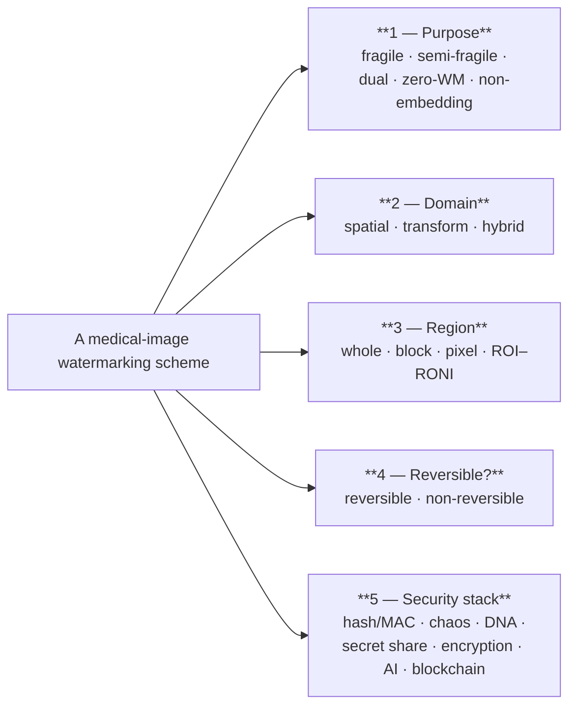
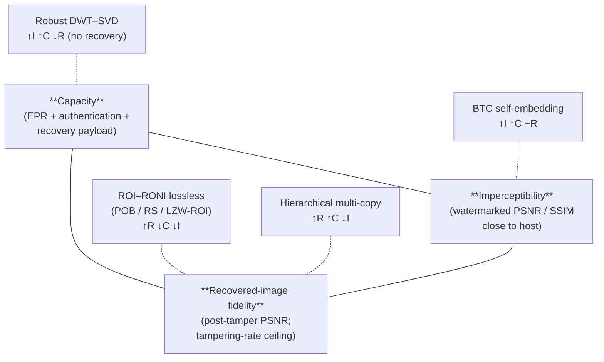

# Securing the Diagnostic Pixel: A Systematic Review of Watermarking-Based Tamper Detection, Localization, and Recovery in Medical Imaging (2018–2026)

## Abstract

**Context.** Medical images now circulate as freely editable digital objects across PACS systems, teleradiology links, cloud archives, and the Internet of Medical Things, exposing the diagnostic pixel to a widening attack surface — from clinically motivated content forgery to AI-generated lesion synthesis. **Objective.** This review systematically maps the active and passive watermarking literature published between 2018 and 2026 that addresses tamper detection, localization, and recovery in medical images, and answers three research questions: *what techniques have been developed and how is their performance evaluated*, *what recovery mechanisms are used and how effective are they*, and *what metrics, datasets, and experimental protocols are commonly used*. **Methods.** Following PRISMA 2020, we searched Scopus, Web of Science, IEEE Xplore, and PubMed, screened 230 deduplicated records, and included 109 primary studies after full-text eligibility assessment. Each study was charted against a 22-field schema covering purpose, embedding domain, region, reversibility, security stack, recovery mechanism, modality, datasets, and evaluation. **Findings.** Tamper detection is now a solved problem in the corpus (100 % of primary studies), and localization is an expected baseline capability (90 %); recovery, by contrast, is provided by only 47 % of active schemes and remains constrained by the imperceptibility–capacity–recovery trilemma. Evaluation is dominated by PSNR (70 %) and SSIM (38 %), no study reports clinical or task-based validation, and no community benchmark exists. **Implications.** Closing the gap requires DICOM-native benchmarks, clinically grounded distortion metrics, recovery schemes that survive AI-generated forgery, and lightweight edge deployments for IoMT.

**Keywords:** medical image security; digital watermarking; tamper detection; tamper localization; self-recovery; reversible data hiding; fragile watermarking; region of interest; telemedicine; Internet of Medical Things; systematic literature review; PRISMA 2020.

---

## 1. Introduction

### 1.1 The diagnostic pixel as a security asset

A medical image is no longer a static object on a film viewer; it is a network packet. Computed-tomography volumes, magnetic-resonance slices, X-ray plates, ultrasound clips, and digital pathology whole-slide scans now move continuously across Picture Archiving and Communication Systems (PACS), DICOM teleradiology links, cloud-hosted Electronic Health Records (EHRs), and the Internet of Medical Things (IoMT) [1], [2], [3]. At each hop the pixels can be re-encoded, lossily compressed, geometrically transformed, or — more troublingly — *edited*. Editing a diagnostic pixel is no longer a niche threat: lesions can be inserted or removed at sub-percentage volume fractions to influence diagnosis, billing, research outcomes, or even criminal evidence [4], [5], [6], and the same generative-AI techniques that are transforming clinical imaging itself can now also forge it [7], [8], [9].

The classical response — *passive* forensics that examines an image after the fact for traces of manipulation — is necessary but insufficient: it cannot certify integrity proactively, it depends on the survival of statistical fingerprints under benign processing, and it offers no path to reconstruct an altered region. *Active* defences, in which a watermark or authentication payload is embedded at the source, complement passive detection by binding the image to its provenance, localizing tampered regions, and — in their most ambitious form — self-recovering the original content from redundancy hidden in the image itself.

### 1.2 Why another review, and how this one is positioned

The active-watermarking literature for medical imaging is now mature enough that a substantial body of survey work already exists. Twelve survey or review articles appear in our included corpus alone [1], [2], [3], [10], [6], [4], [5], [11], [12], [13], [14], [15]; together they cover watermarking fundamentals, ROI–RONI region strategies, reversible data hiding, and cryptographic augmentation. What these surveys do *not* do uniformly is treat detection, localization, and recovery as the integrated triad that a clinically deployable scheme must deliver, nor do they read the literature against the actual *threat model* a medical image faces in 2026 — a threat model that now includes deep-learning forgery, watermark-aware adversaries, and adversarial channel processing in addition to classical signal-processing attacks.

This review takes a different angle. We organise the same 109 studies around the causal arc from *threat* to *defence* to *evaluation*: §2 makes the medical-image attack surface first-class; §3 describes how the corpus was assembled and what is in it; §4–§6 answer the three research questions framed below, with the internal organization of each driven by *design decisions* (§4), *what is restored* (§5), and *the gap between what is measured and what matters* (§6); §7 synthesises across the RQs through the imperceptibility–capacity–recovery trilemma and ends with a labelled answer block; §8 concludes.

### 1.3 Contributions

1. A *threat-led* framing that maps four families of adversary (content forgers, watermark-aware adversaries, channel processors, generative adversaries) onto the watermarking design choices that counter them — operationalised in Table 2.
2. A *design-decision* taxonomy of medical-image watermarking (Fig. 2) that replaces parallel inventories of domain/region/fragility with a single decision tree.
3. A "*what is restored?*" framing for self-recovery (Table 3), positioning the 47 recovery-capable schemes by restoration scope (full-image vs ROI-only) and fidelity (approximate vs lossless).
4. An evaluation-gap diagnosis (§6) that names what the field measures — and, more importantly, what it never measures: diagnostic-task fidelity, a community benchmark, an agreed tampering-rate grid.
5. A trilemma-centric synthesis (Fig. 3) and a six-item research agenda pinned back to the §2 attack families.

### 1.4 Reading guide

The new spine has eight sections. §2 lays out the attack surface and a watermarking primer. §3 reports PRISMA selection and corpus composition. §4–§6 answer RQ1, RQ2, and RQ3 respectively, in that order. §7 discusses cross-cutting findings and houses the explicit answer block. §8 concludes. References and a full-corpus charting table (Appendix A) follow.

### 1.5 Research questions

This review is driven by three research questions, stated verbatim:

> **RQ1.** What watermarking techniques have been developed for tamper detection and localization in medical images, and how are their performance and robustness evaluated?

> **RQ2.** What tamper recovery mechanisms are used in medical image watermarking schemes, and how effective are they in preserving diagnostic image integrity?

> **RQ3.** What evaluation metrics, datasets, and experimental protocols are commonly used to assess medical image watermarking techniques?

The three questions are restated at the head of §4, §5, and §6, and the explicit *answers* are collected in a labelled block in §7.5.

---

## 2. Background and the Attack Surface for Medical Images

### 2.1 A one-paragraph watermarking primer

A digital watermark for medical imaging is a payload — usually a hash, a patient identifier, the Electronic Patient Record (EPR), or a compressed copy of a region — embedded into the host image by an *embedding function* that modifies pixel values in a chosen domain (spatial, transform, or hybrid) and over a chosen region (the whole image, a block lattice, a pixel set, or a Region-of-Interest / Region-of-Non-Interest partition). At authentication time an *extraction function* recovers the payload from a possibly attacked image and compares it to the expected value; mismatch is the detection signal, the location of the mismatch is the localization signal, and any redundant payload that survives can drive *self-recovery*. The five canonical properties a scheme negotiates are *imperceptibility*, *robustness* (or its dual, *fragility*), *capacity*, *security*, and *reversibility* [1], [3], [14]. The surveys frame the field in these five properties; this review additionally insists on a sixth — *clinical adequacy* — which the corpus largely fails to measure (§6).

### 2.2 Four families of adversary

A scheme is only as strong as the attack model against which it is evaluated. The corpus collectively defends against four loose families of adversary, distinguished by *what the attacker does* and *how aware they are of the watermark*.

**2.2.1 Content forgers.** The most clinically salient adversary edits the visible content of the image: copy-move (duplicating a region within an image to mask a lesion), splicing (transplanting a region from another image), content removal (erasing a lesion or device), text addition (adding fake annotation), and inpainting (filling a region with plausible texture). The medical specialisation is *lesion injection* and *lesion removal* — Mirsky et al.'s CT-GAN demonstrated that injecting or removing nodules in CT changes radiologist diagnosis at high rates [8], and the active watermarking schemes that target this threat focus on detecting and localizing pixel-level changes [16], [17], [18], [19], [20], [21].

**2.2.2 Watermark-aware adversaries.** A more sophisticated attacker knows the scheme — or its broad family — and attacks the *watermark* rather than the image. The Vector Quantization (VQ) attack reuses authentic blocks from other watermarked images to defeat blockwise authentication, the *collage* attack combines authentic parts to create new content with valid local watermarks, the *constant-average* attack preserves the mean of each block to fool average-based detectors, and *border-region* and *block-replacement* attacks exploit padding and block boundaries. The most pointed entry in the corpus is Fedoseev and Denisova's "advanced fragile-preserving" attack, which crafts modifications that survive several fragile schemes — a demonstration that a scheme's robustness against *common* attacks does not imply security against *aware* adversaries [7]. Schemes that explicitly defend against VQ / collage / constant-average include [16], [17], [22], [15], [23], [24].

**2.2.3 Channel processors (benign or incidental).** Many "attacks" are not malicious: a JPEG / JPEG2000 transcode, a Gaussian or median filter, histogram equalisation, sharpening, rotation, scaling, and cropping are all common operations that nonetheless destroy fragile watermark payloads. Robust and semi-fragile schemes are evaluated against these channel processors [25], [26], [27], [28]; the *semi-fragile* boundary — the design point at which a scheme distinguishes a JPEG re-encoding from a content edit — is the central design problem for incidental-channel robustness and is treated in two of the corpus's most influential schemes [26], [29].

**2.2.4 Generative adversaries.** The newest family is the generative model. GAN- and diffusion-based image generators can now synthesize realistic medical content that no statistical-fingerprint detector trained on classical forgery reliably distinguishes from authentic data [9], [21], [30], [31], [32]. The corpus's response has two halves: passive deep-learning detectors that learn to recognize generative artefacts [9], [21], [30], [31], [32], [33], and active watermarking schemes that bind a verifiable payload at acquisition or PACS-ingestion time, immune to whatever the generator produces later [1], [3].

### 2.3 Active versus passive defence — and why this review centres on active

Of the 99 primary technique studies in our corpus, 86 are *active* watermarking schemes that embed authentication and/or recovery data, and 13 are *passive* deep-learning or keypoint-based forgery detectors that operate without any embedded payload. The two paradigms are complementary: active schemes give a *prior* integrity guarantee that survives untrusted distribution chains, while passive detectors give a *posterior* check that works on images that were never watermarked. This review centres on the active majority but folds the passive minority in wherever it carries attack-coverage that the active literature does not — particularly against generative adversaries (§4) and at the pixel-localization frontier (§5).

The four-family attack taxonomy of §2.2 reappears as the row labels of Table 2 (§4), where it is crossed against the design choices that counter each family.

---

## 3. Review Methodology

### 3.1 Protocol

The review follows PRISMA 2020. The protocol — research questions, search strategy, eligibility criteria, study selection, data extraction, and synthesis — was fixed before the search. Two reviewers performed independent screening and charting; disagreements were resolved by discussion.

### 3.2 Search, sources, and eligibility

Four databases were searched without overlap negotiation: **Scopus** (n = 150), **Web of Science** (n = 120), **IEEE Xplore** (n = 68), and **PubMed** (n = 11) — total **n = 349** identified records. PubMed was included specifically to widen biomedical coverage; its modest yield confirms that the field is reported predominantly in engineering venues. The search query joined three concept blocks — *technique*, *function*, *application domain* — with Boolean `AND` and intra-block `OR`/truncation:

> (`watermarking` OR `deep learning` OR `AI` OR `machine learning` OR `neural network`) AND (`tamper detect*` OR `tamper* localization` OR `tamper* recovery` OR `forgery detection`) AND (`medical imag*` OR `CT` OR `MRI` OR `X-ray` OR `ultrasound`)

The publication window was restricted to **2018–2026**. Eligibility used four inclusion criteria — peer-reviewed venue (IC2), within the window (IC1), explicit treatment of tamper detection (IC3), and — deliberately — *technical breadth* (IC4) that admits a small set of non-medical schemes for attack-category coverage [34], [35], [31]. Four exclusion criteria removed pure cryptography without watermarking (EC1), non-English (EC2), purely theoretical work without experimental validation (EC3), and patents / retracted / out-of-scope material (EC4).

### 3.3 Study selection

The PRISMA 2020 flow is shown in Fig. 1. Of the 349 records, 119 duplicates were removed (Covidence n = 111; manual n = 8), leaving 230 unique records for title-and-abstract screening. 20 records were excluded at screening — patents (5), retracted (1), not watermarking-related (11), non-English (1), audio/video focus (2) — leaving 210 reports sought for retrieval. 5 reports could not be retrieved; the 205 retrieved full texts were assessed for eligibility, and **96 were excluded** — hardware focus (2), low impact (75), non-English (2), no experimental data (1), not watermarking-related (6), no tamper detection (10) — yielding the final corpus of **109 primary studies**. The arithmetic is consistent: 349 − 119 = 230; 230 − 20 = 210; 210 − 5 = 205; 205 − 96 = 109.

**Fig. 1.** PRISMA 2020 flow diagram of the study-selection process.

### 3.4 Data extraction

Each included study was charted against a 22-field schema spanning bibliographic metadata (authors, year, venue, type), technique category (active watermarking / passive detection / survey), watermark type, embedding domain, region strategy, reversibility, detection and localization mechanisms, recovery mechanism, security primitives, AI / blockchain involvement, imaging modality, datasets, best reported quantitative metrics, attacks evaluated, stated limitations, and free-text notes. The full charting is reproduced as Appendix A.

### 3.5 Threats to validity

*Construct validity* — a single search string may miss work indexed under uncommon terminology; we mitigated by combining five technique synonyms, four function synonyms, six domain terms, and truncation, across four databases. *Internal validity* — the "low impact" exclusion of 75 reports at eligibility is partly subjective; dual independent charting limits but does not eliminate this. *External validity* — the 2018–2026 window and the English-language restriction bound the conclusions to the recent peer-reviewed state of the art. *Conclusion validity* — heterogeneous metrics and protocols (§6) make cross-study figures indicative, not strictly comparable; this review presents quantitative claims accordingly.

### 3.6 Corpus snapshot

Table 1 condenses the corpus into a single landing table — temporal trend, technique category, and dominant imaging modalities — synthesising the descriptive statistics of the 109 included studies.

**Table 1.** Corpus snapshot of the 109 included studies (publication year, technique category, and most-evaluated imaging modalities).

| Dimension | Distribution |
|---|---|
| **Year** | 2018: 7 · 2019: 6 · 2020: 9 · 2021: 20 · 2022: 13 · 2023: 15 · 2024: 15 · 2025: 17 · 2026: 7 |
| **Technique category** | Active watermarking 86 (79%) · Passive detection 13 (12%) · Surveys / reviews 10 (9%) |
| **Imaging modality (non-exclusive)** | CT 42 · X-ray 39 · MRI 36 · Ultrasound 22 · Retinal/OCT 5 · Mammography 4 · PET 4 · Microscopy 1 · "medical, modality unspecified" 28 · "general / natural" 31 |
| **Capabilities (99 primary studies)** | Detection 99 (100%) · Localization 89 (90%) · Recovery 47 (47%; 55% of active) |
| **Embedding (active 86)** | Spatial 36 · Hybrid multi-transform 32 · Hybrid spatial+transform 11 · Pure transform 5 |
| **Region (active 86)** | ROI–RONI 39 · Block-based 34 · Whole-image 16 · Pixel-based 7 |
| **Reversibility** | Reversible 37 · Non-reversible 48 |
| **AI / Blockchain** | AI inside the pipeline 24 · Blockchain 1 [36] |

The output of the field is sustained — 80 of the 109 studies (73%) appeared in 2021–2025 — and is concentrated on three modalities (CT, X-ray, MRI). Recovery, despite being the most clinically valuable capability, is the rarest (§5).

---

## 4. RQ1 — Watermarking Techniques for Tamper Detection and Localization

> **RQ1.** What watermarking techniques have been developed for tamper detection and localization in medical images, and how are their performance and robustness evaluated?

### 4.1 Five decisions every scheme makes

Rather than parade the literature through parallel inventories of *domain*, *region*, and *fragility* — a structure that makes the same paper appear three times under three classification heads — we read the 86 active watermarking schemes as the outcome of **five sequential design decisions** that every scheme makes implicitly or explicitly. The decision tree is shown in Fig. 2: *purpose* (fragility/role) → *domain* (spatial/transform/hybrid) → *region* (whole-image/block/pixel/ROI–RONI) → *reversibility* (reversible/non-reversible) → *security stack* (crypto, chaos, DNA, secret sharing, encryption, AI, blockchain). The same five decisions also organise §4.2–§4.6 below. The 13 passive deep-learning detectors, which embed nothing, sit outside the tree and are taken up in §4.7 as a *defence-of-last-resort* against generative adversaries.

**Fig. 2.** The five sequential design decisions of a medical-image watermarking scheme.

### 4.2 Decision 1 — What is the watermark *for*?

The corpus's central design choice is *fragility*. Of the 86 active schemes with an assigned watermark type, **54 are fragile** [16], [22], [18], [23], [27], [37], [19], [38], [39], [40], [41], [42], [43], [44], [45], [46], [47], [48], [49] — designed to break under the slightest content change so that any tampering becomes visible. **16 are dual (multipurpose)** [50], [21], [51], [52], [53], [9], [23], [54], pairing a robust copyright/EPR mark with a fragile authentication mark in two separate channels. **9 are purely robust** [40], [55], [56], [57], [58], [59], [60], serving an ROI-recovery or ownership role. **4 are zero-watermarking** schemes that derive an external authentication signature without modifying any host pixel [28], [61], [62], [63], and one is a **non-embedding** scheme that stores an MSB-driven reference at a third-party verifier [64]. Only **2 schemes are explicitly semi-fragile** — Priyadarshini and Naik [26] and Fragoso-Navarro et al. [29] — and we return to this gap in §4.8: semi-fragile schemes are the most clinically promising lane because they distinguish a JPEG transcode from a content edit, but they are the rarest in the corpus.

### 4.3 Decision 2 — *Where* in the signal does it live?

The choice of embedding domain trades imperceptibility against robustness. **Spatial-domain embedding is used by 36 active schemes** — least-significant-bit substitution [58], [34], [16], [39], pixel-differencing or interpolation-RDH [40], [39], MSB-driven schemes [64], [37], parity/intensity rules [44], [42], [47], and Arnold-scrambled spatial payloads [16], [27]. Spatial embedding is cheap and gives pixel-precise localization but is brittle against incidental channel processing.

**Transform-domain embedding is used by 5 schemes purely** and **43 in hybrid combinations**. The Discrete Wavelet Transform (DWT) and its Integer Wavelet Transform (IWT) lifting variant dominate [23], [50], [43], [65], [66], [20], [67], [68]; the Discrete Cosine Transform (DCT) appears in [23], [32], [40]; less common transforms include the Slant Transform [21], [18], [21], [23], the Redundant DWT [17], the Curvelet Transform [69], the Quantum Fourier Transform [31], and the Quaternion Fourier Transform variants used by [45]. Hybrid pipelines combine DWT with Singular Value Decomposition (DWT–SVD) [23], [70], [57], [59], [45], with QR factorisation (RDWT–QR) [17], with the Schur decomposition [52], or with Hessenberg / LU factorisations and matrix-norm-based payloads [52], [71]. The dominance of hybridisation (43 of 86 active schemes) shows that no single transform alone reconciles imperceptibility, capacity, and robustness — designers stack transforms to negotiate the trilemma directly (§7.2).

### 4.4 Decision 3 — *Which pixels* carry the mark?

Localization granularity is set by the region strategy. **Whole-image embedding (16 schemes)** [50], [23], [42], [40], [21] gives high capacity but coarse, image-level authentication. **Block-based embedding (34 schemes)** is the most common localization mechanism: block sizes range from 2×2 [16], [28], [72], [58], [53], [17] through 3×3 [73], [74], [75] and 4×4 [16], [37], [71], [76], to 8×8 [38], [49], [77] and up to 16×16 [76] or 64×64 with 4×4 sub-blocks [78], [79]. Smaller blocks give finer localization but raise the False-Positive Rate; this trade-off is treated in §4.8. **Pixel-based embedding (7 schemes)** [58], [8], [80], [81], [64] localises at the finest granularity, with the non-embedding scheme of Ouda [64] proving that *no* host pixel needs to be modified at all if the reference is stored externally. **ROI–RONI embedding (39 schemes)** [82], [27], [33], [74], [18], [68], [34], [8], [80], [66], [83], [84], [51], [85], [39], [86], [38], [68], [48], [79] — the most common region strategy in the corpus — protects only the diagnostic region from any embedding distortion by hiding the watermark in the medically irrelevant peripheral RONI. The ROI is delineated manually [39], [34], by intensity thresholding [33], [84], by morphological operators [74], or — increasingly — by deep learning: ANFIS [87], [88], an Attention U-Net [81], adaptive segmentation [24], or a custom segmentation network [35]. ROI–RONI schemes typically also authenticate the RONI [82], [74] because a forger can attack the RONI to destroy the recovery payload (§5).

### 4.5 Decision 4 — Can the host be exactly restored?

**Reversibility** — the ability to lift the watermark and recover the original host bit-exactly when no attack has occurred — is provided by **37 schemes** [42], [43], [52], [89], [82], [71], [27], [73], [7], [90], [68], [8], [9], [80], [67], [91], [66], [20], [84], [92] [93], built on histogram shifting, prediction-error expansion, integer-wavelet lifting, the Permutation Ordered Binary (POB) number system [90], [8], [80], [91], or hybrid combinations. **48 schemes are explicitly non-reversible**, accepting that the embedding introduces a small but permanent distortion. Reversibility is necessary for medico-legal traceability when the original must be re-presented for legal evidence, and it is largely complementary to *self-recovery* (§5): a scheme can be reversible (host restorable when no attack occurred) *and* have self-recovery (tampered regions restorable after an attack), but the two properties are independent.

### 4.6 Decision 5 — What scaffolding wraps the mark?

Security primitives augment the bare watermark. **Hashing and MACs (25 schemes)** bind the embedded payload cryptographically to the image: SHA family hashes [32], [40], [6], [94], digital-signature schemes built on ECDSA [94], and MAC-based per-block tags [47]. **Chaotic maps and the Arnold transform (28 schemes)** scramble payload locations to defeat block-mapping forgers [50], [95], [65], [16]; the Arnold transform in [16] is the canonical anti-VQ defence. **DNA encoding (5 schemes)** repurposes the four-letter alphabet for nonlinear payload diffusion [96], [92]. **Secret-sharing (8 schemes)** splits the payload across multiple host shares so that no single share leaks the watermark [97], [98], [1]. **Encryption (36 schemes)** is the most widespread augmentation, with full-image AES-style encryption preceding or following watermark embedding [75], [95], [92], [93]. **Artificial intelligence inside the watermarking pipeline (24 schemes)** appears in three distinct roles: (i) region selection / ROI segmentation [87], [88], [24], [35], [61], [81]; (ii) watermark generation or feature extraction (deep features as the payload) [99], [100]; (iii) optimisation, where a metaheuristic or neural model tunes embedding strength [23], [100], [36]. **Blockchain appears in just one scheme** — Aberna and Agilandeeswari's PoWBWM, which records authentication transactions on a Proof-of-Work chain [36] — confirming that blockchain integration remains an outlier despite its conceptual fit with medical-data provenance.

### 4.7 Passive detectors as a defence-of-last-resort

When an image was never watermarked, the only remaining defence is *passive* forgery detection. The 13 passive studies in the corpus split into classical and deep-learning detectors. Classical detectors use keypoint matching for copy-move localization [91], [101], scale-invariant descriptors, and statistical-moment analyses [102]. The deep-learning detectors are the corpus's response to generative adversaries (§2.2.4): Ghoneim et al.'s residual-exploitation CNN [103], Dixit & Dixit's distinguished-recognition model [101], the multi-scale attention network of Xu et al. [85], the segmentation networks of Shao et al. (for optical microscopy) [35] and Jaiswal & Srivastava [61], the CNN fusion of Doegar et al. [33], Mahdi et al.'s "one model for many fakes" detector targeting both GAN and diffusion images [5], Zhang et al.'s GAN-based small-region forgery detector [11], and the ECG-COVID model of Abd El-Latif & Khalifa [25]. Two recent studies treat *active* and *passive* defence in the same scheme [104], [30]. Passive detectors localise via pixel-level masks, achieve accuracies above 95% on CASIA / Columbia / CoMoFoD benchmarks, but, as §6 documents, almost never on medical images.

### 4.8 Defending against each attack family — the matched-pair view

Table 2 crosses the four attacker families of §2.2 against the design choices that counter each, with representative schemes drawn from the 86 active majority and the 13 passive defenders. The table is the central RQ1 evidence: a scheme that aspires to clinical deployment must answer all four rows, not just one.

**Table 2.** Attacker family (§2.2) crossed against the design choices that counter it, with representative schemes from the corpus.

| Attacker family | Watermarking response | Counter-design choices (§4.2–§4.6) | Representative schemes |
|---|---|---|---|
| Content forgers (copy-move, splicing, lesion inject/remove, content removal, text addition) | *Fragile or dual* watermark; pixel- or block-level localization; recovery (§5) | Fragile + small-block (2×2–4×4); ROI–RONI; hash/MAC | [16], [22], [17], [18], [27], [19], [38], [39], [40], [48], [49], [47], [44], [53], [68], [66], [79], [52], [71] |
| Watermark-aware adversaries (VQ, collage, constant-average, advanced fragile-preserving) | *Arnold or chaotic scrambling* of payload locations; multi-copy redundancy; reference-matrix mapping | Chaos/Arnold; magic-matrix or turtle-shell mapping; multi-block authentication codes | [16], [27], [17], [22], [75], [37], [105], [79], [44], [23], [15], [24], [50], [65], [92], [95], [72], [23], [7] |
| Channel processors (JPEG/JPEG2000, filtering, noise, geometric ops) | *Robust* or *semi-fragile* mark; transform-domain embedding; SVD/QR robustness anchors | Transform-domain; hybrid DWT–SVD / RDWT–QR; semi-fragile threshold | [26], [29], [25], [57], [59], [23], [50], [21], [28], [27], [9], [55], [56], [45], [51], [52], [71] |
| Generative adversaries (GAN, diffusion, deepfake medical imaging) | *Active binding* at acquisition; or *passive deep detector* of synthetic artefacts | Pre-distribution embedding; CNN/attention/transformer detectors trained on synthetic data | [103], [5], [11], [35], [61], [101], [33], [9], [104], [30], [31], [85], [25], [14] |

### 4.9 How performance and robustness are evaluated

Across the corpus, performance is reported on three axes: *imperceptibility* (the watermark is invisible), *fidelity-under-attack* (the localization and authentication still work), and *capacity* (enough payload). Imperceptibility is dominated by PSNR (76 studies) and SSIM (41 studies), with the de facto acceptability threshold at PSNR > 40 dB and SSIM ≈ 1; fidelity-under-attack is reported via the Tamper Detection Rate (TDR, 13 studies), Normalized Correlation NC/NCC (21 studies), Bit Error Rate (BER, 24 studies), and precision/recall/F1 (14 studies) at the pixel or block level; capacity is reported in bits-per-pixel (38 studies). Localization granularity is bounded above by the block size and below by the False-Positive Rate that small blocks induce — schemes mitigate this by *multi-pass detection* (Su et al.'s three-level pipeline [75], Shi et al.'s pixel/block/subband pass [79]) or by *reference-matrix mapping* (the turtle-shell schemes [22], [75], [79]). All numerical claims in this review are reported as the original authors stated them, under non-identical attack suites and datasets — a heterogeneity diagnosed systematically in §6.

**Answer to RQ1 (preview).** The corpus has converged on *fragile-or-dual* + *block- or ROI-based* + *hybrid-transform* + *chaos- or Arnold-scrambled* schemes as the dominant medical-image watermarking design point, with imperceptibility above 40 dB and detection accuracy at or near 100 % under classical attacks; the remaining frontier (semi-fragile lanes, generative-adversary resilience, clinical-grade localization) is treated in §7. The formal answer is collected in §7.5.

---

## 5. RQ2 — Tamper Recovery Mechanisms

> **RQ2.** What tamper recovery mechanisms are used in medical image watermarking schemes, and how effective are they in preserving diagnostic image integrity?

Detection and localization tell a clinician *that* and *where* an image was altered; recovery answers *what was there originally*. **Of the 109 included studies, 47 provide some form of recovery** — 43 % of the corpus and 55 % of the active majority. Recovery is therefore the rarest of the integrity-protection triad, and, as we show in §5.6, it is also the most heterogeneous in what it actually delivers.

### 5.1 "What is restored?" — a two-axis framing

We re-organise the 47 recovery-capable schemes along two axes that matter clinically: *what region* is restored — the **full image** or only the **ROI** — and *with what fidelity* — **approximate** or **lossless**. This 2×2 framing replaces the v1 inventory by mechanism and is reproduced in the second and third columns of Table 3.

The four quadrants are unevenly populated. **ROI-only / lossless** is the largest quadrant — perfect restoration of the diagnostic region, with the medically inert RONI sacrificed as the recovery host: this is the design of [74], [68], [72], [41], [86], [33], [34], [52], [84], [92], [93]. **Full-image / approximate** is the second-largest quadrant: self-embedding of a compressed block-approximation across the whole image, restoring tampered regions to a visually-recognisable but not bit-exact state — the BTC and MSB-averaging schemes of [16], [76], [105], [83], [79], [66]. **Full-image / lossless** is the smallest and most ambitious quadrant — the POB-based schemes of [90], [8], [80], [91], [1], [36] which reconstruct bit-exactly across the whole image but typically require a two-share or cloud-side store. **ROI-only / approximate** is rare and usually a degenerate of the BTC family with ROI-restricted payload [53], [27], [18], [39], [48].

This 2×2 also clarifies a routinely-conflated distinction. **Reversible host restoration** (lift the watermark, recover the host when no attack occurred) and **tamper self-recovery** (reconstruct a tampered region from redundancy embedded elsewhere) are independent. Reversibility is a property of the *embedding* and lives in §4.5; self-recovery is a property of the *defence against attack* and is the subject of this section.

### 5.2 Approximate recovery — when "good enough to triage" suffices

The dominant approximate-recovery mechanism is **Block Truncation Coding (BTC)**, in which a block is summarised by two reconstruction levels and a bitmap and the summary is hidden in a different block. BTC is cheap, gives a usable visual approximation at low bit cost, and is the basis of the seminal Tohidi–Paul scheme [76], [77], its content-adaptive successor OIBTC [105], and Singh and Singh's 2×2-block BTC variant [83]. Shi et al. extend BTC with a *compression-aware* selection in which texture and smooth blocks are treated differently [66], [79]. Several schemes blend BTC with the integer-wavelet coefficients of the ROI to raise recovered fidelity at low cost [60], [8], [53].

A simpler approximate family stores **MSB-averaged self-recovery bits**. The canonical example is Shehab et al.'s scheme, which derives the average of the five most-significant bits of each 4×4 block and disperses the resulting recovery bits via an Arnold transform to a distant block — so that contiguous tampering cannot destroy a block and its recovery copy together [16]. Hussan et al. distribute the recovery information across four sub-blocks so that restoration succeeds even when three of the four are tampered [18]. Geetha and Geetha's earlier baseline — frequently used as a benchmark by the BTC family — pre-dates the corpus's window but appears as the comparison reference in several included schemes [106], [83], [16]. Lin et al.'s efficient EPR-information-hiding scheme [107] and Kanwal et al.'s multi-step watermarking model [108] extend the same approximate-recovery family with capacity-vs-fidelity refinements.

### 5.3 Lossless recovery — when bit-exact is required

For medico-legal evidence or quantitative imaging, *approximate* recovery is not enough; the tampered region must come back bit-exactly. Three mechanism families provide this guarantee.

**The Permutation-Ordered-Binary (POB) number system** encodes pixel intensities as POB tuples that can be split into multiple shares so that the original is recoverable even if some shares are tampered. Gao and Gao combine JPEG-LS compression with POB encoding and split the result into two cloud shares, achieving lossless recovery even when one share is destroyed or up to 50 % of two shares are tampered [90]. Li et al. extend POB to *pixel-level* lossless recovery and verification [8]; Liu et al. add hierarchical refinement for two-level comparison and neighbour-based fallback [80]; Ren et al. introduce a *double-POB* scheme with bit-plane cross-reorganization and Huffman coding [30]. Mohammed and Samundiswary combine POB with visual secret sharing so the record is reconstructed even when one share is tampered [1], [98].

**Reed–Solomon error-correcting codes** recover *ROI pixels* exactly under bounded noise. Golea et al. use RS coding to restore 100 % of the ROI under up to 15 % salt-and-pepper noise [28].

**LZW-compressed ROI-into-RONI** is the simplest lossless route — the exact ROI is LZW-compressed and hidden in the RONI. Alshanbari reports 100 % ROI reversibility [41]; Sinhal et al. report the same property in a multipurpose dual scheme [51]; Ravichandran et al. recover the ROI with infinite PSNR (zero MSE) and 100 % localization accuracy [86]. Swaraja K et al. retrieve the ROI watermark losslessly from the RONI to replace a tampered ROI [23]. These designs deliver the ideal outcome — perfect restoration of the diagnostic region — *but only for the ROI, and only while the RONI carrying the copy survives*. The RONI is therefore typically authenticated as well [33], [74].

### 5.4 Redundancy engineering — surviving heavy tampering

A recovery scheme is only as good as the *mapping* that decides where each block's recovery copy is stored. A naive mapping makes the scheme vulnerable to *tamper coincidence*, in which a block and its recovery copy are destroyed by the same attack. Three engineering strategies dominate.

**Chaotic and Arnold block mapping** scatters recovery data pseudo-randomly so that contiguous tampering rarely strikes both a block and its copy [16], [18], [72], [50], [92]. Jagadeesh et al. base self-recovery on a chaotic block mapping enriched with DNA encoding and report restoration for up to 50 % tampering [72]; Hurrah et al.'s CADEN combines cellular automata with DNA-based block mapping [96].

**Structured matrix mapping** uses a magic-square or turtle-shell reference matrix to generate per-block parity at a lower visual cost than LSB embedding. Mendis et al.'s MATADOR uses magic-square transformations and regenerates lost recovery bits from nearby regions [105]; Su et al. and Palani–Loganathan ground their recovery payload in a *turtle-shell* matrix [22], [81]; Shi et al. use a dedicated reference matrix with cross-embedding, additionally hardening the scheme against SRNet steganalysis [79].

**Multi-copy and hierarchical recovery** pushes the tolerable tampering rate well past the single-copy ceiling. Bouarroudj et al. embed one authentication watermark and *four recovery watermarks* per 3×3 block and apply three-level recovery — from corresponding blocks, then from copies, then from a new inpainting pass — sustaining tampering rates up to 60 % [27]. Swaraja et al. provide three self-recovery schemes within one multilevel RDWT–QR framework [17]. Tohidi et al. embed two compressed copies of each block so the loss of one still permits recovery [105]; Liu et al.'s POB-based scheme performs hierarchical recovery through a two-level comparison plus neighbour and watermark-based refinement [80]. Hierarchical designs are the corpus's main answer to tamper coincidence and reconstruction dependency, and they are the schemes that report the highest tolerable tampering rates (§5.5).

### 5.5 Recovery effectiveness as a function of tampering rate

The decisive question for recovery is *how much* tampering it can absorb before failing, since the recovery payload is finite. Reported figures cluster around three operating points. **Single-copy schemes degrade by 25–45 %**: Singh–Singh report recovered PSNR 28.4–40 dB up to 50 % tampering [83]; Tohidi et al. 26–48 dB across 10–50 % [105]; Tohidi–Paul preserve "superior recovered quality" to ~25–45 % [76]. **Multi-copy and hierarchical schemes extend the ceiling to 60–80 %**: Bouarroudj et al. report 48.57 dB at 10 % tampering falling to 37.92 dB at 60 % [27]; Swaraja et al. 57 dB at 50 % [17]; Liu et al.'s hierarchical POB maintains lossless recovery and a true-positive rate of 1 up to 80 % tampering [80]. **Lossless POB / RS designs achieve infinite recovered PSNR** within their bounded model: [90], [8], [80], [91], [1], [28], [41], [86], [51].

Attack-specific recovery is also a frequent design target. Laishram and Manglem Singh restore the ROI specifically against geometric desynchronization and impulse-noise attacks [60]; Shehab et al.'s self-recovery bits are explicitly designed to survive the VQ attack [16]; Su et al. and Swaraja et al. validate recovery under collage, constant-average, and content-removal attacks [22], [17]; Fragoso-Navarro et al.'s robust logo remains recoverable when 25–40 % of the image is attacked, with interpolation restoring pixel quality [29]. Not all recovery is complete: Bhalerao et al.'s reversible ECG scheme provides only *partial* restoration of a tampered signal [89]; Shi et al. acknowledge that storage limits prevent fully restoring large tampered regions [79].

### 5.6 Recovery comparison table

Table 3 compares representative recovery-capable schemes by mechanism, *what is restored*, *what is required* for that restoration, recovered quality, and the maximum tampering rate handled — all as reported by the original authors under non-identical protocols.

**Table 3.** Representative tamper-recovery schemes positioned by what is restored, what is required, mechanism, recovered quality, and maximum tampering rate (figures as reported by the original authors).

| Ref. | Restored what | Requires what | Recovery mechanism | Recovered quality | Max. tampering |
|---|---|---|---|---|---|
| [16] | full image · approximate | one host, Arnold mapping | MSB-average self-recovery bits | high; low FPR/FNR | VQ-resilient |
| [76], [77] | full image · approximate | one host | BTC reference code | superior recovered quality | ~25–45 % |
| [83] | full image · approximate | one host | BTC, 2×2 blocks | PSNR 28.4–40 dB | 50 % |
| [105] | full image · approximate | one host, two copies | content-adaptive OIBTC | PSNR 26–48 dB; SSIM 0.85–0.99 | 45–50 % |
| [22] | full image · approximate | one host, turtle-shell | turtle-shell + DWT–SVD | PSNR 54–60 dB; detection 99.51 % | content removal |
| [75] | full image · approximate | one host | turtle-shell, two-hierarchical | PSNR ≤ 42.11 dB; TDR 99.83 % | collage, VQ |
| [27] | full image · approximate | one host, 4 recovery WMs | three-level recovery + inpainting | PSNR 48.57 dB @10% → 37.92 dB @60% | 60 % (up to 80 %) |
| [17] | full image · approximate | one host | three self-recovery schemes (RDWT–QR) | PSNR 57 dB @50% | 50 % (VQ, collage) |
| [79] | ROI · approximate | one host, reference matrix | reference-matrix + compression-aware | PSNR 45.02 dB; SSIM 0.98 | collage, copy-paste |
| [80] | full image · lossless | one host | POB, hierarchical refinement | ∞ PSNR (lossless) | 80 % |
| [90] | full image · lossless | two cloud shares | JPEG-LS + POB | ∞ PSNR | 50 % / one share lost |
| [8] | full image · lossless | one host | POB pixel-level | ∞ PSNR | > 50 % (two shares) |
| [91] | full image · lossless | one host | double POB, bit-plane reorganization | ∞ PSNR | encrypted-share tampering |
| [1], [98] | full image · lossless | secret-sharing shares | POB + visual secret sharing | ∞ PSNR | one share tampered |
| [74] | ROI · lossless | RONI carrier | recovery bits in RONI (53 bit / 3×3) | ∞ PSNR (zero MSE); 100 % localisation | ROI tampering |
| [28] | ROI · lossless | RONI carrier | Reed–Solomon ROI-pixel recovery | lossless ROI | 100 % ROI @15 % S&P noise |
| [41] | ROI · lossless | RONI carrier | LZW-compressed ROI | 100 % ROI | content removal, copy-paste |
| [51] | ROI · approximate / lossless | RONI carrier (8 segments) | adaptive-LSB recovery bits | PSNR > 40 dB; > 97 % accuracy | filtering, compression |
| [86] | ROI · lossless | RONI carrier | LZW-compressed ROI | ∞ PSNR; 100 % accuracy | full ROI |
| [52] | ROI · approximate | RONI carrier | ANN + RONI recovery (SLT) | high PSNR | > 20 attacks |
| [36] | full image · approximate / lossless | blockchain anchor | PoW blockchain + adaptive RDWT | high PSNR; tamper-evident | aware adversaries |
| [100] | ROI · approximate | one host | CNN + ADIWACO optimisation | recovery success 93 % | pixel alteration, cropping |
| [72] | full image · approximate | one host | chaotic block mapping + DNA | PSNR 44.78 dB; localisation 100 % | 50 % |

Three findings emerge. *First*, **recovery effectiveness is a strong function of mechanism**: lossless POB- and RS-based designs preserve diagnostic integrity perfectly but typically confine the guarantee to the ROI or to a two-share cloud model, while lossy BTC and MSB designs preserve integrity only approximately (recovered PSNR ≈ 26–48 dB) — adequate for visual reorientation but not necessarily for fine diagnosis. *Second*, **the tolerable tampering rate is set by recovery redundancy and mapping**: single-copy schemes degrade by ~25–45 %, multi-copy and hierarchical schemes remain useful to 60–80 %, at a direct imperceptibility cost. *Third*, **this exposes the recovery–payload–imperceptibility trade-off** (§7.2): recovery data competes with the EPR payload and with imperceptibility, so a scheme cannot simultaneously maximise watermarked-image PSNR, EPR capacity, recovered-image PSNR, and tolerable tampering rate.

**Answer to RQ2 (preview).** Recovery rests on four mechanism families — self-embedding of compressed approximations, reference-sharing block mapping, hierarchical multi-copy recovery, and lossless POB/RS/LZW designs — distributed unevenly across a 2×2 of "restored-what × fidelity." Lossless schemes restore the ROI bit-exactly but generally only the ROI; lossy schemes restore approximately and degrade with tampering rate; hierarchical multi-copy designs push the usable ceiling to 60–80 %. The headline gap is that **only 55 % of active schemes recover at all**. The formal answer is collected in §7.5.

---

## 6. RQ3 — Evaluation Metrics, Datasets, and Experimental Protocols

> **RQ3.** What evaluation metrics, datasets, and experimental protocols are commonly used to assess medical image watermarking techniques?

A technique is only as credible as the evidence offered for it. This section characterises how the corpus evaluates its schemes — the metrics that appear (§6.1, Table 4), the datasets and protocols that surround them (Table 5), and three structural *gaps* that the surveys themselves repeatedly flag [1], [109], [3], [13], [14], [15], [4], [5], [12], [11]: a *proxy gap* between signal-processing metrics and diagnostic adequacy (§6.2), a *dataset gap* (§6.3), and a *protocol gap* (§6.4).

### 6.1 What the corpus measures

Table 4 shows how often each metric family is used across the 109 studies. The pattern is *consensus on imperceptibility and fragmentation on everything else*.

**Table 4.** Frequency of evaluation-metric usage across the corpus (a study typically reports several; counts are non-exclusive).

| Metric family | Studies | Share | Primary role |
|---|--:|--:|---|
| PSNR | 76 | 70% | Imperceptibility |
| SSIM | 41 | 38% | Imperceptibility (structural) |
| Capacity / bpp | 38 | 35% | Payload |
| Accuracy | 28 | 26% | Classification / detection |
| BER | 24 | 22% | Watermark / authentication fidelity |
| NC / NCC | 21 | 19% | Robustness (watermark correlation) |
| Precision / Recall / F1 | 14 | 13% | Localization / detection quality |
| Tamper Detection Rate | 13 | 12% | Localization |
| FPR / FNR | 13 | 12% | Localization error |
| MSE / RMSE | 8 | 7% | Imperceptibility |
| NPCR / UACI | 5 | 5% | Encryption sensitivity |
| IoU / Dice | 3 | 3% | Segmentation overlap |

PSNR and SSIM form a near-universal imperceptibility vocabulary, BER plays a dual role (low BER signals watermark survival; *high* BER under tampering is the desired outcome for fragile schemes — schemes routinely report tamper-induced BER of 40–92 % as evidence of fragility), and NC/NCC are the standard robustness measure for robust and dual schemes. The localization-quality metrics — TDR, FPR/FNR, precision/recall/F1 — are individually sound but used by only 12–13 % of studies. NPCR and UACI are reported only by schemes with an encryption layer, with NPCR ≈ 99.6 % and UACI ≈ 33 % indicating good diffusion [95], [92], [93].

### 6.2 Gap 1 — The PSNR/SSIM proxy gap

PSNR and SSIM are *generic* fidelity metrics: a change imperceptible by PSNR may still be clinically significant, and the survey literature consistently flags this. Qasim et al. and Gull & Parah explicitly call for clinically grounded, radiologist-validated quality measures [1], [3]; Thabit and Capasso reinforce the same call [2], [4]. Rayachoti et al. report a weighted PSNR (WPSNR) that down-weights perceptually insensitive regions [21], and Showkat et al. additionally report a no-reference contrast-distortion image-quality metric (NR-CDIQA) for ROI-enhancing schemes [39]. These are partial mitigations, not solutions. Critically, **not a single study in the corpus reports a radiologist study, a diagnostic-task evaluation, or a clinically grounded distortion threshold**. Whether a "recovered" region at 35 dB supports the *same diagnosis* as the original is, across 109 studies, never tested.

### 6.3 Gap 2 — The dataset gap

Dataset practice is the weakest link in the evaluation chain. The corpus draws on three loosely defined pools — named public medical datasets, repurposed natural-image forensic benchmarks, and unnamed "standard medical images" — and no dataset acts as a community standard. Table 5 summarises the landscape.

**Table 5.** Dataset categories used across the corpus.

| Dataset category | Examples and representative users |
|---|---|
| Public medical, named | MedPix [16], [45], [39]; OpenI [26], [33], [66], [73]; OsiriX / OSIRIX DICOM collections [53], [93]; TCIA / AAPM [79]; OASIS / NIH ChestX-ray14 / CT-ORG [40], [5]; BraTS / LUNA16 [99], [11]; STARE retinal [16]; IRMA X-ray [37]; NEMA CT–MR [44]; COVID-19 radiography [25]; Kaggle medical and brain-MRI collections [38], [92], [100] |
| Forensic / natural benchmarks | CASIA v1/v2 [103], [61], [11], [33], [5]; CoMoFoD, Columbia, NIST'16 [35], [61], [85], [31]; MICC-F [5], [33]; UCID and USC-SIPI / SIPI [40], [46], [58], [47]; Stirmark robustness benchmark [25], [34] |
| Newly contributed | FakeParaEgg microscopy copy-move dataset [35] |
| Unnamed "standard medical images" | A few test images, no retrievable public source |

A large share of the active schemes evaluate on a handful of "standard medical images" without citing a retrievable public source. The modality coverage (Table 1) — CT, X-ray, MRI dominant; ultrasound moderate; mammography, PET, retinal imaging, and especially digital pathology marginal — is therefore overlaid on a dataset base that is largely non-standardised and, in many cases, not reproducible.

### 6.4 Gap 3 — The protocol gap

Four protocol dimensions vary widely across the corpus. **Attack suites** range from 4–6 attacks (the median) to 15 [73], 18 [71], and "more than 20" [52]; a few studies use the Stirmark benchmark to standardise the robustness battery [25], [34]. **Block sizes** for block-based schemes range from 2×2 [16], [53], [28], [17], [72], through 3×3 [73], [74], [75], 4×4 [16], [37], [71], 8×8 [38], [49], [77], to 16×16 [76] and 64×64 with 4×4 sub-blocks [78], [79] — rarely justified against a common rationale. **Tampering-rate grids** for recovery experiments are ad hoc: 5–40 % [89], 10–50 % [80], [105], up to 60 % [27], up to 80 % [80] — no shared reporting points, which prevents like-for-like recovery comparison. **Baseline benchmarking** is local: almost every study compares against two to five prior schemes — for example, against the Geetha and Geetha baseline [106] used by [83], [16], or the Shehab et al. baseline [16] used by [37], [75] — but the chosen baselines, datasets, and attacks differ from study to study, so the network of comparisons does not compose into a global ranking.

The defining gaps are therefore the absence of a standardised clinical benchmark, the complete absence of clinical / diagnostic validation, and limited reproducibility. The reviews — including the most recent ones [109], [5], [4] — converge on the same diagnosis.

**Answer to RQ3 (preview).** The corpus evaluates medical-image watermarking with a stable core of imperceptibility metrics (PSNR 70 %, SSIM 38 %) and capacity (bpp 35 %), supplemented by a diverse set of authentication and robustness metrics (BER, NC, accuracy, TDR, FPR/FNR, precision/recall/F1, IoU/Dice). Datasets are fragmented across named medical collections, repurposed forensic benchmarks, and unnamed "standard" images, with no dataset serving as a community standard. Protocols — attack suites, block sizes, tampering rates, baselines — vary so widely that results are not directly comparable. The formal answer is collected in §7.5.

---

## 7. Discussion and Open Challenges

### 7.1 Cross-cutting findings

Reading the three research-question sections together reveals four findings that no single RQ captures on its own.

*First*, **the integrity-protection triad has unequal coverage**: detection is universal (100 % of primary studies), localization is now an expected baseline (90 %), and recovery — the most clinically valuable capability — is provided by only 47 % of primary studies and 55 % of active schemes. The 39-percentage-point gap between localization and recovery is the headline structural finding of the corpus.

*Second*, **active and passive defences are converging on hybrid schemes**. Two recent studies — Ozden & Sahin's comparative localisation study [104] and Ren et al.'s authentication-and-data-hiding scheme [30] — combine active embedding with deep-learning detection in the same pipeline. This convergence is the practical answer to the limitations of either paradigm alone: active schemes fail on un-watermarked legacy data, passive detectors fail on novel generative artefacts.

*Third*, **the design space has stabilised but the evaluation space has not**. The five design decisions of §4.1 have converged on identifiable "centres of mass" — fragile-or-dual, hybrid-transform, block- or ROI-based, chaos-or-Arnold scrambled — but the evaluation protocols (§6.4) remain so heterogeneous that the dozens of pairwise "outperforms prior work" claims in the corpus do not aggregate into a global ranking.

*Fourth*, **ROI–RONI thinking is being challenged by full-image AI**. The ROI–RONI partition (39 active schemes) presumes a clean diagnostic / non-diagnostic separation that AI-driven downstream tasks increasingly violate — radiomic features can be computed from any region, and a Segmentation network may "see" the RONI. The non-embedding [64] and zero-watermarking [28], [61], [62], [63] schemes that avoid the partition entirely are an early sign of this re-thinking.

### 7.2 The capacity–imperceptibility–recovery trilemma

The recurring constraint that emerges from §4 and §5 is a three-axis trade-off: a scheme cannot simultaneously maximise *watermark capacity* (how much EPR + authentication + recovery payload it carries), *imperceptibility* (how invisible the embedding is), and *recovered-image fidelity under tampering* (how well it restores tampered regions). Pushing any vertex moves away from the other two — denser recovery payload reduces imperceptibility and consumes EPR capacity; lossless recovery (POB / RS) constrains capacity sharply [90], [8], [80]; high imperceptibility above 60 dB limits both EPR capacity and recovery redundancy [57], [40].

Fig. 3 visualises the trilemma and positions representative scheme families on it. The vertices are aspirational; real schemes sit inside the triangle and trade among the three.

**Fig. 3.** The capacity–imperceptibility–recovery trilemma with representative scheme families.

### 7.3 The AI double-edge

Artificial intelligence enters the corpus in three roles, in tension with each other. **AI inside watermarking (24 schemes)** improves ROI selection [87], [88], [24], [35], [81], optimises embedding strength [23], [100], and extracts deep-feature payloads [99], [100] — a clear net positive. **AI as passive forensic detector (13 schemes)** brings substantial detection accuracy on generative forgery [5], [11], [33], [21], [35] but inherits the brittleness of supervised models against out-of-distribution adversaries. **AI as attacker** is the disturbing third role: GAN- and diffusion-based generators can now insert or remove lesions at sub-percentage volume fractions [8], [9]. The defensive response is twofold: train passive detectors on generative artefacts (the current state of the art), and bind verifiable payloads at acquisition so that integrity is *prior* rather than *posterior* — but only one corpus scheme (Aberna and Agilandeeswari's PoWBWM) places that binding on a tamper-evident substrate (blockchain) [36]. End-to-end *learned* watermarking — where embedding and extraction are jointly optimised by a neural network — is largely absent from the corpus and is one of the largest open opportunities.

### 7.4 Six open challenges

Each of the following six challenges is pinned to the §2 attack family it most directly answers; together they form the research agenda this review puts forward.

1. **A DICOM-native, clinically validated community benchmark** (answering channel processors and protocol heterogeneity) — a shared dataset with documented modality, vendor, and protocol metadata, paired with an agreed attack suite and tampering-rate grid. No such benchmark exists; the closest is FakeParaEgg [35], restricted to optical microscopy copy-move.
2. **Diagnostic-task validation of recovered images** (answering content forgers) — a radiologist study or a downstream-task evaluation that asks whether a recovered region at PSNR 35–48 dB supports the *same* diagnosis as the original. Across 109 studies, no such evaluation appears.
3. **Generative-forgery-resilient active schemes** (answering generative adversaries) — schemes whose embedded payload is hard to reproduce from a generator's training data, possibly via end-to-end learned watermarking or via blockchain-anchored signatures [36].
4. **Lightweight, real-time schemes for edge and IoMT deployment** (answering channel processors at the IoMT edge) — the corpus has efficient designs [6], [95], [40], [47], but no agreed power / latency / capacity benchmark.
5. **Volumetric and multimodal watermarking** (answering content forgers in 3D imaging) — most schemes operate on single 2D slices; volumetric CT/MRI [93] and multimodal fusion are largely unaddressed.
6. **Adversarially robust, watermark-aware schemes** (answering watermark-aware adversaries) — defending against advanced fragile-preserving attacks of the kind catalogued by Fedoseev and Denisova [7] requires formal threat-model analysis, not empirical attack coverage.

### 7.5 Answer to the three research questions

The three formal answers are collected here.

**Answer to RQ1.** Across the 109 included studies, watermarking techniques for medical-image tamper detection and localization have converged onto a recognisable design space best read as the outcome of five sequential decisions (Fig. 2): *purpose* (54 fragile, 16 dual / multipurpose, 9 robust, 4 zero-watermarking, 2 semi-fragile, 1 non-embedding), *embedding domain* (36 spatial, 5 pure transform, 43 hybrid), *region strategy* (39 ROI–RONI, 34 block-based, 16 whole-image, 7 pixel-based), *reversibility* (37 reversible, 48 non-reversible), and *security stack* (encryption 36, chaos / Arnold 28, hash / MAC 25, secret sharing 8, DNA 5, AI 24, blockchain 1). Performance is evaluated almost universally with PSNR (70 % of studies) and SSIM (38 %), with localization-quality measured by TDR, FPR/FNR, precision / recall / F1 (12–14 %), and robustness measured by NC / NCC (19 %) and BER (22 %); reported imperceptibility typically exceeds 40 dB PSNR and SSIM ≈ 1, with tamper detection at or near 100 % under classical attacks. Robustness is reported against four attacker families (Table 2) — content forgers, watermark-aware adversaries, channel processors, and generative adversaries — but the breadth of attack testing varies from 4 to 20+ attacks across studies. The frontier is semi-fragile schemes (only 2 in the corpus) and end-to-end learned watermarking (absent).

**Answer to RQ2.** Tamper recovery is provided by 47 of 109 studies (43 % of the corpus; 55 % of the active majority) and rests on four mechanism families: self-embedding of compressed approximations (block averaging, MSB-based, BTC); reference-sharing and structured-matrix block mapping (chaotic / Arnold, magic-matrix, turtle-shell, ROI-into-RONI); hierarchical and multi-copy recovery; and reversible / lossless recovery (POB number system, Reed–Solomon codes, LZW-compressed ROI). Effectiveness in preserving diagnostic integrity decomposes by *what is restored* (full image vs ROI only) and *with what fidelity* (approximate vs lossless): lossless POB / RS / LZW schemes restore the ROI bit-exactly (∞ PSNR, zero MSE) but the guarantee is usually ROI-only or two-share-conditional; lossy BTC / MSB schemes restore content approximately at 26–48 dB recovered PSNR and degrade with tampering rate; hierarchical multi-copy designs extend the usable ceiling from ~25–45 % to 60–80 % tampering at a direct imperceptibility cost. The headline gap is that 45 % of active schemes provide no recovery at all, and where recovery is provided it is constrained by tamper coincidence, reconstruction dependency, and the capacity–imperceptibility–recovery trilemma (§7.2).

**Answer to RQ3.** The corpus evaluates medical-image watermarking with a stable core of imperceptibility metrics — PSNR (70 %), SSIM (38 %) — and capacity (bpp, 35 %), supplemented by a diverse but unevenly used set of authentication and robustness metrics: BER (22 %), NC / NCC (19 %), accuracy (26 %, mostly passive detectors), and the localization metrics TDR and FPR / FNR (12 % each), with precision / recall / F1 and IoU / Dice used by pixel-level localization studies. Datasets are fragmented across three pools — named public medical collections (MedPix, OpenI, OASIS, ChestX-ray14, BraTS, TCIA), repurposed natural-image forensic benchmarks (CASIA, CoMoFoD, Columbia, NIST'16, MICC-F, UCID, SIPI, Stirmark), and unnamed "standard medical images" — with no dataset acting as a community standard. Experimental protocols (attack suites of 4 to 20+; block sizes 2×2 to 64×64; ad-hoc tampering-rate grids; local baseline benchmarking) vary so widely that results are not directly comparable. The defining gaps are the absence of a standardised clinical benchmark, the complete absence of clinical / diagnostic validation, and limited reproducibility.

---

## 8. Conclusion

This systematic review read 109 studies from 2018–2026 on watermarking-based tamper detection, localization, and recovery in medical imaging through the causal arc from threat to defence to evaluation. Detection is now solved; localization is an expected baseline; recovery remains the hard problem and the rarest capability. The corpus has settled on a recognisable design space — fragile-or-dual, hybrid-transform, block- or ROI-based, chaos- or Arnold-scrambled, augmented with hashing, encryption, and an increasing dose of AI — and reports imperceptibility above 40 dB PSNR and detection at or near 100 % under classical attack suites. What the corpus has *not* done is close the gap to the clinic: no diagnostic-task validation of recovered images, no community benchmark, no agreed tampering-rate grid, scarcely any defence against generative adversaries, and almost no end-to-end learned watermarking. The integrity of the diagnostic pixel will be secured by closing those gaps, not by adding another scheme to the existing design space.

---

## References

[1] A. F. Qasim, F. Meziane, and R. Aspin, "Digital watermarking: Applicability for developing trust in medical imaging workflows state of the art review," *Computer Science Review*, vol. 27, pp. 45–60, 2018, doi: 10.1016/j.cosrev.2017.11.003.

[2] R. Thabit, "Review of medical image authentication techniques and their recent trends," *Multimedia Tools and Applications*, vol. 80, no. 9, pp. 13439–13473, 2021, doi: 10.1007/s11042-020-10421-7.

[3] S. Gull and S. A. Parah, "Advances in medical image watermarking: a state of the art review," *Multimedia Tools and Applications*, 2023, doi: 10.1007/s11042-023-15396-9.

[4] P. Capasso, G. Cattaneo, and M. de Marsico, "A Comprehensive Survey on Methods for Image Integrity," *ACM Transactions on Multimedia Computing, Communications and Applications*, vol. 20, no. 11, 2024, doi: 10.1145/3633203.

[5] M. A. Mahdi, M. A. Arshed, and A. Muneer, "One Model for Many Fakes: Detecting GAN and Diffusion-Generated Forgeries in Faces, Invoices, and Medical Heterogeneous Data," *Mathematics*, vol. 13, no. 19, 2025, doi: 10.3390/math13193093.

[6] S. A. Parah, J. A. Kaw, P. Bellavista, N. A. Loan, G. M. Bhat, K. Muhammad, and V. H. C. de Albuquerque, "Efficient Security and Authentication for Edge-Based Internet of Medical Things," *IEEE Internet of Things Journal*, vol. 8, no. 21, pp. 15652–15662, 2021, doi: 10.1109/JIOT.2020.3038009.

[7] V. Fedoseev and A. Denisova, "A Reversible Medical Image Watermarking Scheme for Advanced Image Tampering Detection," *SN Computer Science*, vol. 5, no. 4, 2024, doi: 10.1007/s42979-024-02692-w.

[8] Q. Li, Y. Fu, Z. Zhang, A. J. Fofanah, and T. Gao, "Medical images lossless recovery based on POB number system and image compression," *Multimedia Tools and Applications*, vol. 81, no. 8, pp. 11415–11440, 2022, doi: 10.1007/s11042-022-12266-8.

[9] X. Liu, J. Lou, H. Fang, Y. Chen, P. Ouyang, Y. Wang, B. Zou, and L. Wang, "A Novel Robust Reversible Watermarking Scheme for Protecting Authenticity and Integrity of Medical Images," *IEEE Access*, vol. 7, pp. 76580–76598, 2019, doi: 10.1109/ACCESS.2019.2921894.

[10] B. Madhushree, H. Basanth Kumar, and H. Chennamma, "An exhaustive review of authentication, tamper detection with localization and recovery techniques for medical images," *Multimedia Tools and Applications*, vol. 83, no. 13, pp. 39779–39821, 2024, doi: 10.1007/s11042-023-16706-x.

[11] J. Zhang, X. Huang, Y. Liu, Y. Han, and Z. Xiang, "GAN-based medical image small region forgery detection via a two-stage cascade framework," *PLoS ONE*, vol. 19, no. 1, 2024, doi: 10.1371/journal.pone.0290303.

[12] F. Z. Mehrjardi, A. M. Latif, M. S. Zarchi, and R. Sheikhpour, "A survey on deep learning-based image forgery detection," *Pattern Recognition*, vol. 144, 2023, doi: 10.1016/j.patcog.2023.109778.

[13] P. Sharma, M. Kumar, and H. Sharma, "Comprehensive analyses of image forgery detection methods from traditional to deep learning approaches: an evaluation," *Multimedia Tools and Applications*, vol. 82, no. 12, pp. 18117–18150, 2023, doi: 10.1007/s11042-022-13808-w.

[14] D. K. Shukla, A. Bansal, and P. Singh, "A survey on digital image forensic methods based on blind forgery detection," *Multimedia Tools and Applications*, vol. 83, no. 26, pp. 67871–67902, 2024, doi: 10.1007/s11042-023-18090-y.

[15] N. R. N. Raj and R. Shreelekshmi, "A survey on fragile watermarking based image authentication schemes," *Multimedia Tools and Applications*, vol. 80, no. 13, pp. 19307–19333, 2021, doi: 10.1007/s11042-021-10664-y.

[16] A. Shehab, M. Elhoseny, K. Muhammad, A. K. Sangaiah, P. Yang, H. Huang, and G. Hou, "Secure and robust fragile watermarking scheme for medical images," *IEEE Access*, vol. 6, pp. 10269–10278, 2018, doi: 10.1109/ACCESS.2018.2799240.

[17] K. Swaraja, K. Meenakshi, and P. Kora, "Hierarchical multilevel framework using RDWT-QR optimized watermarking in telemedicine," *Biomedical Signal Processing and Control*, vol. 68, 2021, doi: 10.1016/j.bspc.2021.102688.

[18] M. Hussan, S. A. Parah, S. Gull, and G. Qureshi, "Tamper Detection and Self-Recovery of Medical Imagery for Smart Health," *Arabian Journal for Science and Engineering*, vol. 46, no. 4, pp. 3465–3481, 2021, doi: 10.1007/s13369-020-05135-9.

[19] S. Bhalerao, I. A. Ansari, and A. Kumar, "A secure image watermarking for tamper detection and localization," *Journal of Ambient Intelligence and Humanized Computing*, vol. 12, no. 1, pp. 1057–1068, 2021, doi: 10.1007/s12652-020-02135-3.

[20] A. Ustubioglu, G. Ulutas, and B. Ustubioglu, "IWT-MDE based reversible thermal image watermarking enhanced with secret sharing mechanism," *Multimedia Tools and Applications*, vol. 78, no. 16, pp. 22269–22299, 2019, doi: 10.1007/s11042-019-7529-0.

[21] E. Rayachoti, S. Tirumalasetty, and S. C. Prathipati, "SLT based watermarking system for secure telemedicine," *Cluster Computing*, vol. 23, no. 4, pp. 3175–3184, 2020, doi: 10.1007/s10586-020-03078-2.

[22] G.-D. Su, C.-C. Chang, and C.-C. Lin, "Effective Self-Recovery and Tampering Localization Fragile Watermarking for Medical Images," *IEEE Access*, vol. 8, pp. 160840–160857, 2020, doi: 10.1109/ACCESS.2020.3019832.

[23] S. K., M. K., and P. Kora, "An optimized blind dual medical image watermarking framework for tamper localization and content authentication in secured telemedicine," *Biomedical Signal Processing and Control*, vol. 55, 2020, doi: 10.1016/j.bspc.2019.101665.

[24] S. Gull, M. Hussan, and S. A. Parah, "Automatic segmentation based watermarking technique for medical images in e-healthcare," *Health and Technology*, 2026, doi: 10.1007/s12553-025-01045-8.

[25] E. I. Abd El-Latif and N. E. Khalifa, "COVID-19 digital x-rays forgery classification model using deep learning," *IAES International Journal of Artificial Intelligence*, vol. 12, no. 4, pp. 1821–1827, 2023, doi: 10.11591/ijai.v12.i4.pp1821-1827.

[26] P. Priyadarshini and K. Naik, "Privacy protection and authentication of electronic patient information using hashing and multi watermarking technique," *Multimedia Tools and Applications*, vol. 83, no. 42, pp. 89893–89930, 2024, doi: 10.1007/s11042-024-18960-z.

[27] R. Bouarroudj, F. Harrou, N. Zerrouki, F. Souami, F. Z. Bellala, and Y. Sun, "Medical Image Authentication and Self-Recovery Using Fragile Watermarking in the Frequency Domain," in *6th IEEE International Conference on Image Processing, Applications and Systems, IPAS 2025 - Proceedings*, 2025, doi: 10.1109/IPAS63548.2025.10924548.

[28] N. E. H. Golea, K. E. Melkemi, and A. Behloul, "Zero-bit fragile watermarking for medical image tamper detection and recovery using RS code and lifting wavelet transform," *Imaging Science Journal*, vol. 69, no. 5, pp. 334–349, 2021, doi: 10.1080/13682199.2022.2161144.

[29] E. Fragoso-Navarro, R. E. Arevalo-Ancona, M. Cedillo-Hernandez, and F. J. Garcia-Ugalde, "Copyright protection and tamper detection in medical images via a dual watermark scheme," *Health and Technology*, 2026, doi: 10.1007/s12553-026-01054-1.

[30] F. Ren, X. Shi, E. Tang, and M. Zeng, "Data Hiding and Authentication Scheme for Medical Images Using Double POB," *Applied Sciences*, vol. 14, no. 6, 2024, doi: 10.3390/app14062664.

[31] K. S. Roy, S. Singh, R. A. Hazarika, S. M. Hassan, and H. R. Das, "Tamper Localisation Using Quantum Fourier Transform Signatures for Medical Image Authentication," *IET Quantum Communication*, vol. 6, no. 1, 2025, doi: 10.1049/qtc2.70023.

[32] C. Rupa, S. K. Arshiya Sultana, R. Pavana Malleswari, C. Dedeepya, T. Reddy Gadekallu, H.-K. Song, and M. Jalil Piran, "IoMT Privacy Preservation: A Hash-Based DCIWT Approach for Detecting Tampering in Medical Data," *IEEE Access*, vol. 12, pp. 97298–97308, 2024, doi: 10.1109/ACCESS.2024.3420688.

[33] A. Doegar, S. Hiriyannaiah, G. Siddesh, K. Srinivasa, and M. Dutta, "Cloud-Based Fusion of Residual Exploitation-Based Convolutional Neural Network Models for Image Tampering Detection in Bioinformatics," *BioMed Research International*, vol. 2021, 2021, doi: 10.1155/2021/5546572.

[34] L. Laouamer and O. Tayan, "Performance Evaluation of a Document Image Watermarking Approach with Enhanced Tamper Localization and Recovery," *IEEE Access*, vol. 6, pp. 26144–26166, 2018, doi: 10.1109/ACCESS.2018.2831599.

[35] H. -C. Shao, Y. -R. Liao, T. -Y. Tseng, Y. -L. Chuo, and F. -Y. Lin, "Copy-Move Detection in Optical Microscopy: A Segmentation Network and a Dataset," *IEEE Signal Processing Letters*, vol. 32, pp. 1106–1110, 2025, doi: 10.1109/LSP.2025.3547273.

[36] P. Aberna and L. Agilandeeswari, "PoWBWM: Proof of work consensus cryptographic blockchain-based adaptive watermarking system for tamper detection applications," *Alexandria Engineering Journal*, vol. 112, pp. 510–537, 2025, doi: 10.1016/j.aej.2024.10.016.

[37] R. Bakthula, S. Shivani, and S. Agarwal, "Self authenticating medical X-ray images for telemedicine applications," *Multimedia Tools and Applications*, vol. 77, no. 7, pp. 8375–8392, 2018, doi: 10.1007/s11042-017-4738-2.

[38] P. V. Sanivarapu, "Adaptive tamper detection watermarking scheme for medical images in transform domain," *Multimedia Tools and Applications*, vol. 81, no. 8, pp. 11605–11619, 2022, doi: 10.1007/s11042-022-12273-9.

[39] S. Showkat, S. A. Parah, and S. Gull, "Embedding in medical images with contrast enhancement and tamper detection capability," *Multimedia Tools and Applications*, vol. 80, no. 2, pp. 2009–2030, 2021, doi: 10.1007/s11042-020-09732-6.

[40] N. N. Hurrah, S. A. Parah, and J. A. Sheikh, "Embedding in medical images: an efficient scheme for authentication and tamper localization," *Multimedia Tools and Applications*, vol. 79, no. 29, pp. 21441–21470, 2020, doi: 10.1007/s11042-020-08988-2.

[41] H. S. Alshanbari, "Medical image watermarking for ownership & tamper detection," *Multimedia Tools and Applications*, vol. 80, no. 11, pp. 16549–16564, 2021, doi: 10.1007/s11042-020-08814-9.

[42] Atta-ur-Rahman, K. Sultan, N. Aldhafferi, A. Alqahtani, and M. Mahmud, "Reversible and Fragile Watermarking for Medical Images," *Computational and Mathematical Methods in Medicine*, vol. 2018, 2018, doi: 10.1155/2018/3461382.

[43] G. Azizoglu and A. N. Toprak, "A novel reversible fragile watermarking method in DWT domain for tamper localization and digital image authentication," *Biomedical Signal Processing and Control*, vol. 84, 2023, doi: 10.1016/j.bspc.2023.105015.

[44] X. Wei, W. Zhang, B. Yang, J. Wang, and Z. Xia, "Fragile Watermark in Medical Image Based on Prime Number Distribution Theory," *Journal of Digital Imaging*, vol. 34, no. 6, pp. 1447–1462, 2021, doi: 10.1007/s10278-021-00524-4.

[45] P. Singh, K. J. Devi, T. K. Nizami, C. S. Prakash, H. K. Thakkar, S. A. Hussain, and S. Mallik, "Ensuring integrity and security of medical image transmission in IoMT using highly imperceptible and robust watermarking approach," *Scientific Reports*, vol. 15, no. 1, 2025, doi: 10.1038/s41598-025-11023-9.

[46] S. Shivani, "Verifiable medical images for E-healthcare: A novel watermarking approach using robust bit-wise association of self-mutating offsprings of pixels," *Microprocessors and Microsystems*, vol. 90, 2022, doi: 10.1016/j.micpro.2022.104483.

[47] S. P. Vaidya, R. N. V. P. S. Kandala, P. Chandra Mouli, H. G. Zaini, A. Jaffar, P. Paramasivam, and S. S. M. Ghoneim, "A robust fragile watermarking approach for image tampering detection and restoration utilizing hybrid transforms," *Scientific Reports*, vol. 15, no. 1, 2025, doi: 10.1038/s41598-025-01297-4.

[48] R. Gothwal, S. Shivani, and S. Tiwari, "CT image authentication for telemedicine applications using self-embedding pixel-wise technique with chaotic coordinate mapping and lfsr," *Multimedia Tools and Applications*, vol. 84, no. 26, pp. 30903–30928, 2025, doi: 10.1007/s11042-024-20406-5.

[49] R. Thanki and S. Borra, "Fragile watermarking for copyright authentication and tamper detection of medical images using compressive sensing (CS) based encryption and contourlet domain processing," *Multimedia Tools and Applications*, vol. 78, no. 10, pp. 13905–13924, 2019, doi: 10.1007/s11042-018-6746-2.

[50] S. De, J. Bhaumik, D. Giri, and A. K. Das, "A new robust and fragile scheme based on chaotic maps and dwt for medical image security," *Multimedia Tools and Applications*, vol. 82, no. 8, pp. 11753–11792, 2023, doi: 10.1007/s11042-022-13585-6.

[51] R. Sinhal, S. Sharma, I. A. Ansari, and V. Bajaj, "Multipurpose medical image watermarking for effective security solutions," *Multimedia Tools and Applications*, vol. 81, no. 10, pp. 14045–14063, 2022, doi: 10.1007/s11042-022-12082-0.

[52] R. Bamal and S. S. Kasana, "Reversible medical image watermarking for tamper detection using ANN and SLT," *Multimedia Tools and Applications*, vol. 83, no. 8, pp. 21849–21882, 2024, doi: 10.1007/s11042-023-14737-y.

[53] S. Gull, R. F. Mansour, N. O. Aljehane, and S. A. Parah, "A self-embedding technique for tamper detection and localization of medical images for smart-health," *Multimedia Tools and Applications*, vol. 80, no. 19, pp. 29939–29964, 2021, doi: 10.1007/s11042-021-11170-x.

[54] F. Yan, Z. Wang, and K. Hirota, "Dual medical image watermarking using SRU-enhanced network and EICC chaotic map," *Complex and Intelligent Systems*, vol. 11, no. 1, 2025, doi: 10.1007/s40747-024-01723-6.

[55] P. Singh, K. J. Devi, H. K. Thakkar, and K. Kotecha, "Region-Based Hybrid Medical Image Watermarking Scheme for Robust and Secured Transmission in IoMT," *IEEE Access*, vol. 10, pp. 8974–8993, 2022, doi: 10.1109/ACCESS.2022.3143801.

[56] P. Singh, K. J. Devi, H. K. Thakkar, M. Bilal, A. Nayyar, and D. Kwak, "Robust and Secure Medical Image Watermarking for Edge-Enabled e-Healthcare," *IEEE Access*, vol. 11, pp. 135831–135845, 2023, doi: 10.1109/ACCESS.2023.3335172.

[57] H. Aljuaid and S. A. Parah, "Secure Patient Data Transfer Using Information Embedding and Hyperchaos," *Sensors*, vol. 21, no. 1, 2021, doi: 10.3390/s21010282.

[58] H. Aftab, M. Hussain, Q. Riaz, M. Zeeshan, and K.-H. Jung, "Hiding EPR and watermark in medical images using repeated pixel differencing," *Multimedia Tools and Applications*, vol. 83, no. 15, pp. 43577–43605, 2024, doi: 10.1007/s11042-023-15434-6.

[59] E. Rayachoti, "A robust and high embedding capacity watermarking technique for telemedicine," *Imaging Science Journal*, vol. 71, no. 6, pp. 537–548, 2023, doi: 10.1080/13682199.2023.2186569.

[60] D. Laishram and K. Manglem Singh, "A watermarking scheme for source authentication, ownership identification, tamper detection and restoration for color medical images," *Multimedia Tools and Applications*, vol. 80, no. 16, pp. 23815–23875, 2021, doi: 10.1007/s11042-020-10389-4.

[61] A. K. Jaiswal and R. Srivastava, "Fake region identification in an image using deep learning segmentation model," *Multimedia Tools and Applications*, vol. 82, no. 25, pp. 38901–38921, 2023, doi: 10.1007/s11042-023-15032-6.

[62] K. Hu, X. Wang, J. Hu, H. Wang, and H. Qin, "A novel robust zero-watermarking algorithm for medical images," *Visual Computer*, vol. 37, no. 9, pp. 2841–2853, 2021, doi: 10.1007/s00371-021-02168-5.

[63] M. AlShaikh, "A novel tamper detection watermarking approach for improving image integrity," *Multimedia Tools and Applications*, vol. 82, no. 7, pp. 10039–10060, 2023, doi: 10.1007/s11042-021-11840-w.

[64] O. Ouda, "A Non-Embedding Watermarking Framework Using MSB-Driven Reference Mapping for Distortion-Free Medical Image Authentication," *Electronics (Switzerland)*, vol. 15, no. 1, 2026, doi: 10.3390/electronics15010007.

[65] M. Nazari and A. Maneshi, "Chaotic Reversible Watermarking Method Based on IWT with Tamper Detection for Transferring Electronic Health Record," *Security and Communication Networks*, vol. 2021, 2021, doi: 10.1155/2021/5514944.

[66] H. Shi, Y. Wang, Y. Li, Y. Ren, and C. Guo, "Region-based reversible medical image watermarking algorithm for privacy protection and integrity authentication," *Multimedia Tools and Applications*, vol. 80, no. 16, pp. 24631–24667, 2021, doi: 10.1007/s11042-021-10853-9.

[67] P. Pal, B. Jana, and J. Bhaumik, "A secure reversible color image watermarking scheme based on LBP, lagrange interpolation polynomial and weighted matrix," *Multimedia Tools and Applications*, vol. 80, no. 14, pp. 21651–21678, 2021, doi: 10.1007/s11042-021-10651-3.

[68] M. Hussan, S. A. Parah, and G. J. Qureshi, "Reversible data hiding framework with content authentication capability for e-health," *Multimedia Tools and Applications*, 2023, doi: 10.1007/s11042-023-17019-9.

[69] R. Eswaraiah, T. Sudhir, and P. S. Chaitanya, "Curvelet Transform Based Watermarking for Telemedicine," *Wireless Personal Communications*, vol. 122, no. 1, pp. 309–329, 2022, doi: 10.1007/s11277-021-08900-7.

[70] H. M. Ahmed, "Mobile-based Telemedicine Application using SVD and F-XoR Watermarking for Medical Images," *Baghdad Science Journal*, vol. 17, no. 1, pp. 178–189, 2020, doi: 10.21123/bsj.2020.17.1.0178.

[71] R. Bouarroudj, F. Z. Bellala, and F. Souami, "High Capacity and Reversible Fragile Watermarking Method for Medical Image Authentication and Patient Data Hiding," *Journal of Medical Systems*, vol. 48, no. 1, 2024, doi: 10.1007/s10916-024-02110-x.

[72] S. Jagadeesh, A. K. Parida, and K. Meenakshi, "Tamper detection, localization and self-recovery using slant transform with DNA encoding for medical images," *Results in Engineering*, vol. 27, 2025, doi: 10.1016/j.rineng.2025.105907.

[73] R. Bouarroudj, F. Souami, F. Z. Bellala, N. Zerrouki, F. Harrou, and Y. Sun, "Secure and reversible fragile watermarking for accurate authentication and tamper localization in medical images," *Computers and Electrical Engineering*, vol. 123, 2025, doi: 10.1016/j.compeleceng.2025.110072.

[74] M. S. El-Tokhy, "Development of precise forgery detection algorithms in digital radiography images using convolution neural network," *Applied Soft Computing*, vol. 138, 2023, doi: 10.1016/j.asoc.2023.110174.

[75] S. Borra and R. Thanki, "Crypto-watermarking scheme for tamper detection of medical images," *Computer Methods in Biomechanics and Biomedical Engineering: Imaging and Visualization*, vol. 8, no. 4, pp. 345–355, 2020, doi: 10.1080/21681163.2019.1595730.

[76] F. Tohidi, M. Paul, M. R. Hooshmandasl, S. Chakraborty, and B. Pradhan, "Block-Wise Authentication and Recovery Scheme for Medical Images Focusing on Content Complexity," in *Lecture Notes in Computer Science*, vol. 11994 LNCS, pp. 86–99, 2020, doi: 10.1007/978-3-030-39770-8_7.

[77] F. Tohidi and M. Paul, "A New Image Watermarking Scheme for Efficient Tamper Detection, Localization and Recovery," in *2019 IEEE International Conference on Multimedia & Expo Workshops (ICMEW)*, pp. 19–24, 2019, doi: 10.1109/ICMEW.2019.0-117.

[78] B. Madhushree and H. Chennamma, "An Efficient Content-Based Authentication Scheme for Tamper Detection and Localization With Medical Images Using ORB Keypoints and Voronoi Tessellation," *Concurrency and Computation: Practice and Experience*, vol. 38, no. 5, 2026, doi: 10.1002/cpe.70621.

[79] H. Shi, K. Yan, J. Geng, and Y. Ren, "A cross-embedding based medical image tamper detection and self-recovery watermarking scheme," *Multimedia Tools and Applications*, vol. 83, no. 10, pp. 30319–30360, 2024, doi: 10.1007/s11042-023-16679-x.

[80] Y. Liu, Z. You, and T. Gao, "Lossless image hierarchical recovery based on POB number system," *Signal Processing*, vol. 167, 2020, doi: 10.1016/j.sigpro.2019.107293.

[81] A. Palani and A. Loganathan, "Semi-Blind watermarking using convolutional attention-based turtle shell matrix for tamper detection and recovery of medical images," *Expert Systems with Applications*, vol. 238, 2024, doi: 10.1016/j.eswa.2023.121903.

[82] S. Bhalerao, I. A. Ansari, and A. Kumar, "A Reversible Medical Image Watermarking for ROI Tamper Detection and Recovery," *Circuits, Systems, and Signal Processing*, vol. 42, no. 11, pp. 6701–6725, 2023, doi: 10.1007/s00034-023-02416-0.

[83] D. Singh and S. K. Singh, "Block Truncation Coding based effective watermarking scheme for image authentication with recovery capability," *Multimedia Tools and Applications*, vol. 78, no. 4, pp. 4197–4215, 2019, doi: 10.1007/s11042-017-5454-7.

[84] M. Vazhora Malayil and M. Vedhanayagam, "A novel image scaling based reversible watermarking scheme for secure medical image transmission," *ISA Transactions*, vol. 108, pp. 269–281, 2021, doi: 10.1016/j.isatra.2020.08.019.

[85] Y. Xu, M. Irfan, A. Fang, and J. Zheng, "Multiscale Attention Network for Detection and Localization of Image Splicing Forgery," *IEEE Transactions on Instrumentation and Measurement*, vol. 72, pp. 1–15, 2023, doi: 10.1109/TIM.2023.3300434.

[86] D. Ravichandran, P. Praveenkumar, S. Rajagopalan, J. B. B. Rayappan, and R. Amirtharajan, "ROI-based medical image watermarking for accurate tamper detection, localisation and recovery," *Medical and Biological Engineering and Computing*, vol. 59, no. 6, pp. 1355–1372, 2021, doi: 10.1007/s11517-021-02374-2.

[87] K. Balasamy, N. Krishnaraj, and K. Vijayalakshmi, "An Adaptive Neuro-Fuzzy Based Region Selection and Authenticating Medical Image Through Watermarking for Secure Communication," *Wireless Personal Communications*, vol. 122, no. 3, pp. 2817–2837, 2022, doi: 10.1007/s11277-021-09031-9.

[88] K. Balasamy, N. Krishnaraj, and K. Vijayalakshmi, "Improving the security of medical image through neuro-fuzzy based ROI selection for reliable transmission," *Multimedia Tools and Applications*, vol. 81, no. 10, pp. 14321–14337, 2022, doi: 10.1007/s11042-022-12367-4.

[89] S. Bhalerao, I. A. Ansari, and A. Kumar, "Reversible ECG Watermarking for Ownership Detection, Tamper Localization, and Recovery," *Circuits, Systems, and Signal Processing*, vol. 41, no. 9, pp. 5134–5159, 2022, doi: 10.1007/s00034-022-02024-4.

[90] H. Gao and T. Gao, "A secure lossless recovery for medical images based on image encoding and data self-embedding," *Cluster Computing*, vol. 25, no. 1, pp. 707–725, 2022, doi: 10.1007/s10586-021-03446-6.

[91] C. S. Prakash, H. Om, and S. Maheshkar, "Authentication of medical images using passive approach," *IET Image Processing*, vol. 13, no. 13, pp. 2420–2427, 2019, doi: 10.1049/iet-ipr.2018.6035.

[92] X. Fei, C. Wang, C. Zou, S. Cui, Y. Yang, and J. Liu, "Multiple Medical Images Encryption Scheme with Cloud Tamper Localization Based on Perceptual Compression and Watermarking," *IEEE Internet of Things Journal*, 2026, doi: 10.1109/JIOT.2026.3670881.

[93] H. Zeng, Y. Xing, S.-T. Kim, and X. Li, "Dualmodal and multifunctional steganography of three-dimensional integral imaging for the Internet of Medical Things," *Signal Processing*, vol. 239, 2026, doi: 10.1016/j.sigpro.2025.110217.

[94] R. Ch, N. Vivek K, G. Srivastava, and R. Gadekallu, "ECDSA-based tamper detection in medical data using a watermarking technique," *International Journal of Cognitive Computing in Engineering*, vol. 5, pp. 78–87, 2024, doi: 10.1016/j.ijcce.2024.01.003.

[95] M. E. H. Kahla, M. Beggas, A. Laouid, M. AlShaikh, and M. Hammoudeh, "An IoMT image crypto-system based on spatial watermarking and asymmetric encryption," *Multimedia Tools and Applications*, vol. 83, no. 39, pp. 86681–86706, 2024, doi: 10.1007/s11042-024-19632-8.

[96] N. N. Hurrah, E. Khan, and U. Khan, "CADEN: cellular automata and DNA based secure framework for privacy preserving in IoT based healthcare," *Journal of Ambient Intelligence and Humanized Computing*, vol. 14, no. 3, pp. 2631–2643, 2023, doi: 10.1007/s12652-022-04510-8.

[97] M. Z. Salim, A. J. Abboud, and R. Yildirim, "A visual cryptography-based watermarking approach for the detection and localization of image forgery," *Electronics (Switzerland)*, vol. 11, no. 1, 2022, doi: 10.3390/electronics11010136.

[98] A. Mohammed and P. Samundiswary, "Tamper Detection and Self-Recovery in a Visual Secret Sharing Based Security Mechanism for Medical Records," *IEEE Journal of Biomedical and Health Informatics*, vol. 30, no. 2, pp. 890–899, 2026, doi: 10.1109/JBHI.2024.3424334.

[99] A. Al Sharah, H. A. Owida, T. A. Alawneh, A. Quteishat, S. Abuowaida, N. Alshdaifat, and M. A. Jarajreh, "Enhancing Medical Images Security and Efficiency With Adaptive Compressed Sensing and SHA-3 in Telemedicine," *International Journal of Biomedical Imaging*, vol. 2025, no. 1, 2025, doi: 10.1155/ijbi/4643691.

[100] L. Prasanna Meda and E. Rayachoti, "Enhancing Telemedicine Security in Advanced Methods for Tamper Detection and Recovery in Color Medical Imaging," *IEEE Access*, vol. 13, pp. 217542–217555, 2025, doi: 10.1109/ACCESS.2025.3647088.

[101] A. Dixit and R. Dixit, "Forgery detection in medical images with distinguished recognition of original and tampered regions using density-based clustering technique," *Applied Soft Computing*, vol. 130, 2022, doi: 10.1016/j.asoc.2022.109652.

[102] T. Vijayanandh and A. Shenbagavalli, "Tamper detection of medical images using statistical moments against various attacks," *Multimedia Tools and Applications*, vol. 77, no. 8, pp. 10273–10284, 2018, doi: 10.1007/s11042-017-5473-4.

[103] A. Ghoneim, G. Muhammad, S. U. Amin, and B. Gupta, "Medical Image Forgery Detection for Smart Healthcare," *IEEE Communications Magazine*, vol. 56, no. 4, pp. 33–37, 2018, doi: 10.1109/MCOM.2018.1700817.

[104] M. Ozden and C. Sahin, "A Comparative Study for Localization of Forgery Regions in Images," *IEEE Access*, vol. 13, pp. 130701–130718, 2025, doi: 10.1109/ACCESS.2025.3591571.

[105] T. Mendis, F. Kandah, and L. Medury, "MATADOR: a magic matrix-based framework for tamper detection and image recovery," *Journal of King Saud University - Computer and Information Sciences*, vol. 37, no. 5, 2025, doi: 10.1007/s44443-025-00099-y.

[106] R. Geetha and S. Geetha, "Embedding electronic patient information in clinical images: an improved and efficient reversible data hiding technique," *Multimedia Tools and Applications*, vol. 79, no. 19, pp. 12869–12890, 2020, doi: 10.1007/s11042-019-08484-2.

[107] C. -C. Lin, C. -C. Chang, W. -J. Kao, and J. -F. Chang, "Efficient Electronic Patient Information Hiding Scheme With Tamper Detection Function for Medical Images," *IEEE Access*, vol. 10, pp. 18470–18485, 2022, doi: 10.1109/ACCESS.2022.3144322.

[108] S. Kanwal, F. Tao, R. Taj, Q. Abbas, and F. Amin, "Securing medical images using multi-step watermarking model," *Peer-to-Peer Networking and Applications*, vol. 18, no. 5, 2025, doi: 10.1007/s12083-025-02041-5.

[109] M. Rai and A. Kesarwani, "Image Watermarking in the Digital Era: A Review of Transform, ML-Based, and Evolutionary Methods," *Circuits, Systems, and Signal Processing*, 2025, doi: 10.1007/s00034-025-03437-7.

## Appendix A. Study-Characteristics Table (All 109 Included Studies)

The table charts every included study against the core extraction fields. Legend: **Cat.** = category; **Loc.** = tamper localization; **Rec.** = tamper recovery; **Rev.** = reversible; **AI** = uses AI/deep learning; Y = yes, N = no, – = not applicable. Metrics are best values reported by the original authors under non-identical protocols.

| Ref. | Study | Cat. | Watermark type | Domain | Region | Loc. | Rec. | Rev. | AI | Modality | Best reported metrics |
|------|-------|------|----------------|--------|--------|:----:|:----:|:----:|:--:|----------|-----------------------|
| [1] | Qasim et al. (2018) | Review | n/a | n/a | n/a | – | – | – | – | Medical images | Reviews MSE, PSNR, SSIM, BER, Accuracy Ratio |
| [2] | Thabit (2021) | Review | n/a | n/a | n/a | – | – | – | – | Medical images | Requirements table: imperceptibility |
| [3] | Gull & Parah (2023) | Review | n/a | n/a | n/a | – | – | – | N | Medical images | Discusses PSNR, SSIM, NCC, BER, bpp; calls for clinically-relevant benchmarks |
| [4] | Capasso et al. (2024) | Review | n/a | n/a | n/a | – | – | – | Y | General images | n/a |
| [5] | Mahdi et al. (2025) | Passive | n/a | n/a | whole-image | N | N | – | Y | Medical | Test accuracy 96.08%, weighted F1 0.9608, validation 96.20% |
| [6] | S. A. Parah et al. (2021) | Active | fragile | spatial | block-based | Y | N | Y | N | Medical | PSNR 41.95 dB, capacity 2.25 bpp, embedding time <0.2 s |
| [7] | Fedoseev & Denisova (2024) | Active | fragile | spatial | ROI-RONI | Y | N | Y | N | CT, X-ray, MRI, mammography,… | TPR 0.996-1.0; lower MSE with smart pixel selection |
| [8] | Li et al. (2022) | Active | fragile | spatial | ROI-based | Y | Y | Y | N | Medical images | Lossless recovery |
| [9] | Liu et al. (2019) | Active | robust reversible | SLT | ROI-RONI for watermark… | Y | Y | Y | N | CT, MRI, Ultrasound, X-ray, f… | Remarkable imperceptibility & robustness; lossless ROI+RONI recovery |
| [10] | Madhushree et al. (2024) | Review | n/a | n/a | n/a | – | – | – | – | Medical | Reviews PSNR/SSIM/embedded data |
| [11] | Zhang et al. (2024) | Passive | n/a | n/a | whole-image | Y | N | – | Y | CT | Ours-3D F1 = 1.0 on small-region GAN forgery detection |
| [12] | Mehrjardi et al. (2023) | Review | n/a | n/a | n/a | – | – | – | Y | General images | Reviews forgery-detection evaluation metrics |
| [13] | Sharma et al. (2023) | Review | n/a | n/a | n/a | – | – | – | Y | General images | Reviews accuracy and forensic evaluation criteria |
| [14] | Shukla et al. (2024) | Review | n/a | n/a | n/a | – | – | – | Y | General images | Reviews precision, recall, F1, accuracy, FPR, FNR |
| [15] | Raj & Shreelekshmi (2021) | Review | n/a | n/a | n/a | – | – | – | – | General + medical | Reviews PSNR, SSIM, TPR/TDR, FNR, FPR; evaluates 7 localization + 6 self-reco… |
| [16] | Shehab et al. (2018) | Active | fragile | spatial | block-based | Y | Y | N | N | Medical | Watermarked PSNR 50.17-51.25 dB; high recovered-image quality; low FPR/FNR |
| [17] | Swaraja et al. (2021) | Active | hybrid | RDWT | block-based | Y | Y | N | N | Medical images | TDR 99.7%, recovery PSNR 57 dB @50% tampering, watermarked PSNR ~58 dB |
| [18] | Hussan et al. (2021) | Active | fragile | spatial | block-based | Y | Y | N | N | Medical | Recovered PSNR > 33 dB; payload 2 bpp |
| [19] | Bhalerao et al. (2021) | Active | fragile | spatial | block-based | Y | N | N | N | Medical/general | High PSNR & SSIM; TDR 100%, FNR 0%, FPR varies with tampering % |
| [20] | Ustubioglu et al. (2019) | Active | fragile | IWT + Modified Difference Exp… | Border Region | Y | N | Y | N | Thermal medical images | High embedding capacity; supports ROI size ratio 93-98%; localization probabi… |
| [21] | Rayachoti et al. (2020) | Active | robust | SLT | ROI-RONI | Y | Y | N | N | MRI, PET, Ultrasound, CT | PSNR & WPSNR > 40 dB; NC/BER for robustness |
| [22] | Su et al. (2020) | Active | fragile | spatial | block-based | Y | Y | N | N | Medical | TDR 99.83%, recovered PSNR 42.11 dB; embedding <1.6 s, detection+recovery <1.… |
| [23] | Swaraja K et al. (2020) | Active | robust | DWT + Schur transform | ROI-RONI | Y | Y | N | N | Medical images | Avg tamper detection probability 0.98; lossless ROI recovery |
| [24] | Gull et al. (2026) | Active | dual | spatial | ROI-RONI | Y | Y | Y | N | Medical images | PSNR 49.61 dB, SSIM 0.9958, NCC near 1 under attacks |
| [25] | Abd El-Latif & Khalifa (2023) | Passive | n/a | n/a | whole-image | N | N | – | Y | X-ray | Accuracy 94.72% |
| [26] | Priyadarshini & Naik (2024) | Active | fragile + robust | IWT | ROI-RONI | Y | N | Y | N | X-ray, Ultrasound, MRI, CT | PSNR avg 65.78 dB, NC 0.99, embedding capacity 0.0468 bpp |
| [27] | Bouarroudj et al. (2025) | Active | fragile | DWT | block-based | Y | Y | N | N | Color retinal, grayscale ches… | Watermarked PSNR ~51.3 dB; recovered PSNR 48.57 dB @10% TR, 37.92 dB @60% TR;… |
| [28] | Golea et al. (2021) | Active | zero-watermarking + fragi… | Lifting Wavelet Transform | ROI-RONI | Y | Y | Y | N | Medical images | PSNR > 47 dB, capacity 2 bpp; ROI fully intact |
| [29] | Fragoso-Navarro et al. (2026) | Active | dual | spatial | block-based | Y | Y | N | N | CT, CR | PSNR 51.97/55.34/41.76 dB |
| [30] | Ren et al. (2024) | Active | fragile | spatial | ROS -> ROI-RONI | Y | Y | Y | N | Medical images | High embedding capacity; lossless recovery; perceptual quality preserved |
| [31] | Roy et al. (2025) | Active | fragile | QFT | block-based | Y | N | N | N | Medical images | Global PSNR ~71 dB, SSIM ~0.99999; QFT block-detection accuracy 0.9841; ROC A… |
| [32] | Rupa et al. (2024) | Active | fragile | DCIWT | ROI-RONI | Y | Y | N | N | Brain MRI | 99.5% of tampered images detected; PSNR/SSIM/MSE preserved; adaptive threshol… |
| [33] | Doegar et al. (2021) | Passive | n/a | n/a | whole-image | N | N | – | Y | General images | Accuracy: fine-tuned fusion 93.18%, fine-tuned ResNet-18 95.0%; fusion TPR 10… |
| [34] | Laouamer & Tayan (2018) | Active | robust | spatial | block-based | Y | Y | N | N | Document images | PSNR avg ~43 dB |
| [35] | H.-C. Shao et al. (2025) | Passive | n/a | n/a | whole-image | Y | N | – | Y | Optical microscopy | mF1 0.643, mIoU 0.437, Precision 0.887 on CASIA-CMFD; best generalization on… |
| [36] | Aberna & Agilandeeswari (2025) | Active | semi-fragile | Quaternion Graph-Based Transf… | adaptive | Y | Y | N | Y | HDR + RGB general images | PSNR up to 63.84 dB, SSIM 1.000, NCC avg 0.98-0.999, VDP 98.02 |
| [37] | Bakthula et al. (2018) | Active | fragile | spatial | ROI-NROI, pixel-based | Y | N | N | N | X-ray | PSNR ~33 dB avg, accuracy ~80-94%, FAR 0%, FRR 85% |
| [38] | Sanivarapu (2022) | Active | fragile | DWT | block-based | Y | N | N | N | X-ray medical images | PSNR 32-37.5 dB |
| [39] | Showkat et al. (2021) | Active | fragile | spatial | ROI-NROI | Y | N | Y | N | Medical | PSNR 47.58 dB, SSIM 0.9915, capacity up to 92,247 bits; NR-CDIQA contrast met… |
| [40] | Hurrah et al. (2020) | Active | fragile | spatial | block-based | Y | Y | Y | N | Medical | PSNR >47 dB |
| [41] | Alshanbari (2021) | Active | dual | DWT + SVD + principal compone… | ROI-RONI | Y | Y | Y | N | Ultrasound | PSNR ~48.15 dB, NC > 0.54, 100% ROI recovery |
| [42] | Atta-ur-Rahman et al. (2018) | Active | fragile | spatial | whole-image | Y | Y | Y | N | MRI, Ultrasound | PSNR 72.98 dB |
| [43] | Azizoglu & Toprak (2023) | Active | fragile | DWT | block-based | Y | N | Y | N | Medical images | Localization accuracy 0.95-0.99 |
| [44] | Wei et al. (2021) | Active | fragile | spatial | pixel-based | Y | N | N | N | Medical | PSNR ~43 dB; high tamper sensitivity |
| [45] | Singh et al. (2025) | Active | fragile + robust | hybrid DWT-SVD | ROI-RONI | Y | Y | N | N | Medical | PSNR >55 dB, SSIM ~1, BER ~0, NC ~1; tamper detection/recovery >=97% |
| [46] | Shivani (2022) | Active | fragile | spatial | pixel-based | Y | N | N | N | Medical | PSNR > 60 dB, high tamper detection rate, BER ~92% |
| [47] | Vaidya et al. (2025) | Active | fragile | DWT | block-based | Y | Y | N | N | General images | Watermarked PSNR 45 dB, recovered PSNR 43 dB |
| [48] | Gothwal et al. (2025) | Active | fragile | spatial | pixel-based | Y | N | N | N | CT | PSNR ~48 dB |
| [49] | Thanki & Borra (2019) | Active | fragile | NSCT | whole-image | N | N | N | N | Medical | PSNR up to 92.22 dB |
| [50] | De et al. (2023) | Active | hybrid | DWT | ROI-RONI | Y | N | N | N | General medical images | Robust watermark fully retrievable; quantitative PSNR not emphasized |
| [51] | Sinhal et al. (2022) | Active | multipurpose | Slantlet Transform | ROI-RONI | Y | Y | Y | N | Medical | High imperceptibility |
| [52] | Bamal & Kasana (2024) | Active | hybrid | Slantlet Transform | ROI-RONI | Y | Y | Y | Y | MRI | Robust to >20 attacks; capacity 61,440 bits in 256x256; BPP +410% over baseli… |
| [53] | Gull et al. (2021) | Active | fragile | spatial | block-based | Y | N | N | N | Medical images | PSNR 51.94 dB, SSIM 0.9962, capacity 262,144 bits, FPR 3.99 |
| [54] | Yan et al. (2025) | Active | dual | deep-feature | ROI-RONI | Y | N | N | Y | Medical images | PSNR 52.29 dB, SSIM 0.9962, NC > 0.84 under attacks |
| [55] | Singh et al. (2022) | Active | hybrid | spatial | ROI-RONI | Y | Y | N | N | Grayscale + color medical | Tamper detection/recovery >97%, recovered PSNR >40 dB; NC robust |
| [56] | Singh et al. (2023) | Active | fragile | spatial | Border region | Y | Y | Y | N | Medical | PSNR 41.03 dB, SSIM 0.99, NC 0.99, BER 0.0019, capacity 2 bpp; embed 0.88 s /… |
| [57] | Aljuaid & Parah (2021) | Active | fragile | spatial | whole-image | Y | N | Y | N | High-contrast medical images | PSNR 52.38 dB, SSIM 0.9849, payload 0.75 bpp |
| [58] | Aftab et al. (2024) | Active | fragile | spatial | block-based | Y | Y | Y | N | X-ray, MRI, US, CT, retina +… | PSNR 41.27 dB medical / 40.68 dB general; capacity 2.24-2.49 bpp; SSIM 0.94 |
| [59] | Rayachoti (2023) | Active | robust | Finite Ridgelet Transform | ROI-RONI | Y | Y | N | N | Medical | PSNR > 50 dB, embedding capacity 2 bpp, NC 0.9882, BER 0.0239 |
| [60] | Laishram & Manglem Singh (2021) | Active | robust | DCT | ROI-RONI | Y | Y | N | N | Color medical | NC/BER for logo/EPR/PHV; embedding rate 0.0066 bpp |
| [61] | Jaiswal & Srivastava (2023) | Passive | n/a | n/a | whole-image | Y | N | – | Y | General + medical | Precision/recall/accuracy/F1/MCC better than SOTA; ~3.69 s per 8-image batch |
| [62] | Hu et al. (2021) | Active | zero-watermarking | BEMD | block-based | Y | N | Y | N | Medical | NC = 1.000 under most attacks |
| [63] | AlShaikh (2023) | Active | fragile | spatial | block-based | Y | N | N | N | General images | PSNR 56.4 dB, SSIM 0.9983, payload 0.85 bpp, TDR 99.965%, F1 0.8969 |
| [64] | Ouda (2026) | Active | fragile | non-embedding | ROI-NROI | Y | N | Y | N | MRI | PSNR infinite, SSIM 1 |
| [65] | Nazari & Maneshi (2021) | Active | fragile | IWT | whole-image | Y | N | Y | N | Medical + general | PSNR >45.41 dB, BER >0.04, payload 432,538 bits; color capacity up to 1,946,4… |
| [66] | Shi et al. (2021) | Active | fragile + reversible | spatial | ROI-RONI | Y | Y | Y | N | Medical | PSNR 52.65-69.85 dB; SSIM 1, BER 0 |
| [67] | Pal et al. (2021) | Active | fragile | spatial | block-based | Y | N | Y | N | Color images | PSNR ~53 dB, payload 2.06 bpp, NCC/SSIM/Q-Index near 1; execution 0.514 s |
| [68] | Hussan et al. (2023) | Active | fragile | spatial | ROI-RONI | N | N | Y | N | Medical + general | PSNR 51.57 dB medical |
| [69] | Eswaraiah et al. (2022) | Active | robust | Curvelet Transform | ROI-RONI | Y | Y | N | N | CT, X-ray, MRI, Ultrasound, P… | PSNR > 50 dB, SSIM ~0.99, NC/BER tabulated per modality |
| [70] | Ahmed (2020) | Active | fragile | SVD-based | block-based | Y | Y | Y | N | General medical images | PSNR ~30 dB, NC 0.99 |
| [71] | Bouarroudj et al. (2024) | Active | fragile | DFT | pixel-wise / whole-image | N | N | Y | N | CT, MRI, radiographic, ultras… | PSNR >113 dB |
| [72] | Jagadeesh et al. (2025) | Active | semi-fragile | Slant Transform | block-based | Y | Y | N | N | Medical | PSNR 44.78 dB, SSIM 0.8371, TDR 94.95%, localization 100% |
| [73] | Bouarroudj et al. (2025) | Active | fragile | DWT | block-based | Y | N | Y | N | Color + grayscale medical | PSNR >88 dB |
| [74] | El-Tokhy (2023) | Passive | n/a | n/a | whole-image | Y | N | – | Y | X-ray | F-score up to 94.5%; AlexNet+MSVM and ResNet-18+ANN best |
| [75] | Borra & Thanki (2020) | Active | fragile | DCT + Compressive Sensing | whole-image | Y | N | N | N | X-ray, CT, MRI | PSNR up to 92 dB, SSIM 1.0, payload up to 1 bpp |
| [76] | Tohidi et al. (2020) | Active | fragile | spatial | block-based | Y | Y | N | N | Medical-applicable | Recovered PSNR 26-48 dB across 10-50% tampering; SSIM 0.85-0.99 |
| [77] | Tohidi & Paul (2019) | Active | fragile | spatial | block-based | Y | Y | N | N | General + medical | Superior tamper-detection accuracy and recovered-image quality |
| [78] | Madhushree & Chennamma (2026) | Active | fragile | spatial | ROI-RONI | Y | N | N | N | MRI, CT, X-ray, MR angiography | PSNR 72.90-82.37 dB, SSIM 1.0000, BER 0.000047 |
| [79] | Shi et al. (2024) | Active | robust + fragile | spatial | ROI-RONI | Y | Y | N | N | Medical images | ROI tamper detection ~100%, PSNR 45.02 dB @1.41 bpp, NC 0.99, SSIM 0.98 |
| [80] | Liu et al. (2020) | Active | fragile | spatial | block-based | Y | Y | Y | N | General images | PSNR infinite |
| [81] | Palani & Loganathan (2024) | Active | fragile + semi-blind + ze… | DWT-SVD + Turtle Shell Matrix… | block-based | Y | Y | N | Y | Medical | Imperceptibility PSNR 60.24 dB, tamper detection accuracy 99.51%; recovered P… |
| [82] | Bhalerao et al. (2023) | Active | fragile | spatial | ROI-RONI | Y | Y | Y | N | X-ray, CT, MRI, Ultrasound | PSNR ~55 dB, SSIM 0.99, payload 0.15 bpp |
| [83] | Singh & Singh (2019) | Active | fragile | spatial | block-based | Y | Y | N | N | General images | Watermarked PSNR 39.0 dB; recovered PSNR 28.42-40 dB up to 50% tampering; NCC… |
| [84] | Vazhora Malayil & Vedhanayagam (2021) | Active | fragile | spatial | whole-image | Y | N | Y | N | Medical images | SSIM = 1 and PSNR -> infinity |
| [85] | Xu et al. (2023) | Passive | n/a | n/a | whole-image | Y | N | – | Y | General images | F1 = 84.3% |
| [86] | Ravichandran et al. (2021) | Active | fragile | IWT | ROI-RONI | Y | Y | N | N | MRI, CT, CR, ultrasound, X-ra… | Localization 100%, recovery PSNR infinite |
| [87] | Balasamy et al. (2022) | Active | fragile | DWT | ROI | Y | N | N | Y | Brain MRI, Lung CT, Ultrasound | PSNR ~49.5 dB, NPCR ~98.6%, UACI ~33-38% |
| [88] | Balasamy et al. (2022) | Active | fragile | DWT + SVD | ROI | Y | N | N | Y | CT + general medical | PSNR ~49.5 dB, NPCR ~98%, UACI ~33% |
| [89] | Bhalerao et al. (2022) | Active | fragile | spatial | segment-based | Y | Y | Y | N | ECG signal | TDR 100%, max capacity 0.99 bps; reversible |
| [90] | Gao & Gao (2022) | Active | fragile | spatial | ROI-based | Y | Y | Y | N | Medical images + COVID-19 | NPCR 99.60%, UACI 33.46%; lossless recovery; embedding rate |
| [91] | Prakash et al. (2019) | Passive | n/a | n/a | whole-image | Y | N | – | N | Medical images | TPR 91.67% |
| [92] | Fei et al. (2026) | Active | robust | Block Compressed Sensing + DC… | per-image | Y | N | N | N | Medical images | NPCR ~99.6%, UACI ~33.46%; high key sensitivity |
| [93] | Zeng et al. (2026) | Active | dual-modal | histogram | 3D ROI-RONI | Y | N | N | Y | 3D integral-imaging medical d… | PSNR 58.68 dB, SSIM 0.9982 |
| [94] | Ch et al. (2024) | Active | robust | IWT-DCT | ROI | Y | N | N | N | Brain MRI | PSNR 68.67 dB, MSE 0.96, SSIM 0.98 |
| [95] | Kahla et al. (2024) | Active | fragile | spatial | whole-image | N | N | N | N | X-ray | High PSNR; entropy 7.82-7.86 |
| [96] | Hurrah et al. (2023) | Active | fragile | spatial | block-based | Y | N | N | N | Medical | PSNR >51 dB |
| [97] | Salim et al. (2022) | Active | fragile | Walsh-Hadamard transform + LB… | block-based | Y | N | Y | N | General/medical context | Precision/recall/F1 ~97%, TAF ~97%, NC ~96% |
| [98] | Mohammed & Samundiswary (2026) | Active | fragile | IWT + spatial | block-based | Y | Y | Y | N | General medical images/records | PSNR ~35 dB, SSIM ~1, BER ~0, embedding rate ~0.7 bpp |
| [99] | Al Sharah et al. (2025) | Active | fragile | Adaptive Compressed Sensing +… | ROI-driven sampling | Y | Y | – | N | X-ray, CT, MRI | PSNR 43.2 dB |
| [100] | Prasanna Meda & Rayachoti (2025) | Active | hybrid | GABF | ROI / segmentation | Y | Y | N | Y | Color medical imaging | Recovery success 93%, accuracy 0.85, regulatory compliance 100%, processing 2… |
| [101] | Dixit & Dixit (2022) | Passive | n/a | n/a | whole-image | Y | N | – | N | CT, X-ray, Ultrasound, MRI, P… | High TPR/F-measure/accuracy; distinguishes source vs target region via Harali… |
| [102] | Vijayanandh & Shenbagavalli (2018) | Passive | n/a | n/a | whole-image | N | N | – | N | Medical | Tamper-detection accuracy via Hausdorff distance; Hu moments outperform Zerni… |
| [103] | Ghoneim et al. (2018) | Passive | n/a | n/a | whole-image | N | N | – | Y | Mammogram | Accuracy 98.8-98.9% |
| [104] | Ozden & Sahin (2025) | Passive | n/a | DWT + DCT | whole-image | Y | N | – | Y | General images | Accuracy, precision, recall, Dice coefficient, F1 score |
| [105] | Mendis et al. (2025) | Active | fragile | spatial | block-based | Y | Y | N | N | Medical images | Improved tamper detection, lower FPR than DCT-coefficient and fragile-waterma… |
| [106] | Geetha & Geetha (2020) | Active | fragile | spatial | block-based | Y | N | Y | N | X-ray, Ultrasound, MRI, CT, c… | PSNR 47.35 dB @0.75 bpp, 42.34 dB @1.5 bpp; SSIM 0.983; capacity up to 3 bpp |
| [107] | C.-C. Lin et al. (2022) | Active | fragile | spatial | block-based | Y | Y | Y | N | X-ray, Ultrasound, MRI, CT, c… | PSNR ~49 dB |
| [108] | Kanwal et al. (2025) | Active | robust | DWT + DCT + SVD | RONI | N | N | N | Y | Medical images | PSNR 35.2-43 dB, SSIM 0.92-0.96, NC near 1, BER 0.010 |
| [109] | Rai & Kesarwani (2025) | Review | n/a | n/a | n/a | – | – | – | Y | General images | Reviews PSNR, SSIM, NC, BER |
