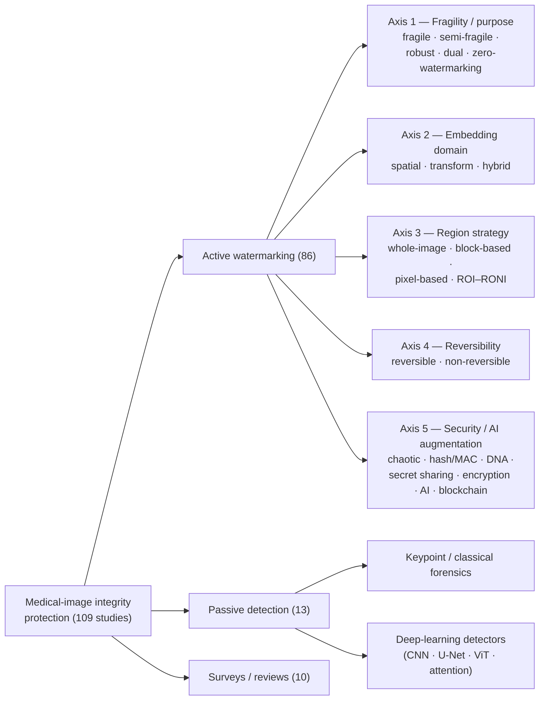
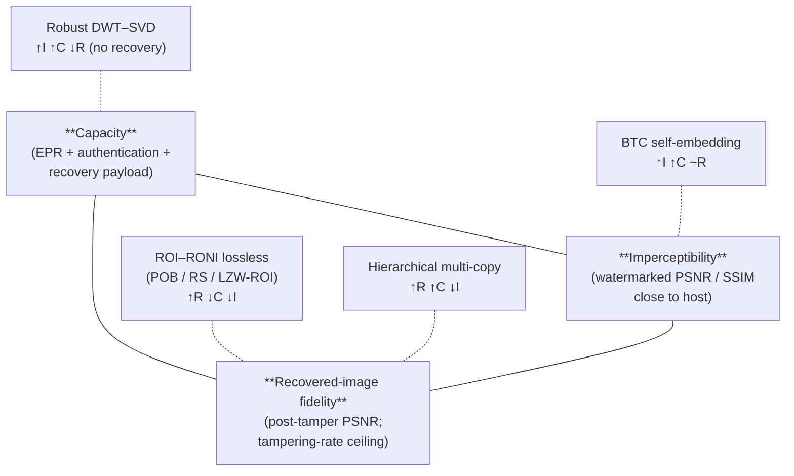

# Digital Watermarking Schemes for Tampering Detection, Localization, and Recovery in Medical Imaging: A Systematic Literature Review (2018–2026)

## Abstract

**Context.** Medical images now circulate continuously across DICOM teleradiology links, cloud-hosted Electronic Health Records, smart-hospital networks, and the Internet of Medical Things, exposing the diagnostic pixel to a widening attack surface — from classical copy–move and splicing to AI-generated lesion synthesis. The integrity and authenticity of a medical image have therefore become safety-critical, not merely security-critical. **Objective.** This review systematically maps the active and passive watermarking literature published between 2018 and 2026 that addresses *tamper detection*, *localization*, and *recovery* in medical images, and answers three research questions: which techniques have been developed and how is their performance evaluated (RQ1); which recovery mechanisms are used and how effective are they (RQ2); and which evaluation metrics, datasets, and experimental protocols are commonly used (RQ3). **Methods.** Following PRISMA 2020, four databases (Scopus, Web of Science, IEEE Xplore, PubMed) were searched, yielding 349 records that were reduced to a final corpus of **109 primary studies** through duplicate removal, title-and-abstract screening, retrievability, and full-text eligibility assessment. Each study was charted against a 22-field schema covering watermark type, embedding domain, region strategy, reversibility, security stack, recovery mechanism, modality, datasets, and reported metrics. **Findings.** Tamper detection is essentially solved in the corpus (100 % of primary studies), localization is now a baseline capability (90 %), and recovery — the most clinically valuable capability — is provided by only 47 % of primary studies and 55 % of active schemes. Schemes cluster around fragile or dual watermarks (70/86), hybrid transform-domain embedding (43/86), block- or ROI–RONI region strategies (73/86), and chaotic- or Arnold-scrambled security stacks (28/86), with artificial intelligence appearing in 24 schemes and blockchain in one. Evaluation is dominated by PSNR (70 %) and SSIM (38 %); no study reports clinical or task-based validation, and no community benchmark exists. **Implications.** Closing the gap between laboratory metrics and clinical adequacy requires DICOM-native benchmark datasets, clinically validated distortion measures, recovery schemes resilient to generative forgery, and lightweight designs suitable for IoMT edge deployment.

**Keywords:** medical image security; digital watermarking; tamper detection; tamper localization; self-recovery; reversible data hiding; fragile watermarking; region of interest; telemedicine; Internet of Medical Things; systematic literature review; PRISMA 2020.

---

## 1. Introduction

### 1.1 Background and motivation

Medical imaging is one of the foundations of contemporary clinical practice. Computed tomography (CT), magnetic resonance imaging (MRI), X-ray radiography, ultrasound, mammography, and positron-emission tomography (PET) generate the visual evidence on which diagnosis, treatment planning, surgical guidance, and longitudinal monitoring depend. These images are no longer physical films: they are digital objects, encoded predominantly in the Digital Imaging and Communications in Medicine (DICOM) standard and managed through Picture Archiving and Communication Systems (PACS) [1], [2]. The same digitisation that enables instant retrieval and computer-aided analysis also turns the image into a *transmissible* and *editable* asset.

Telemedicine, Electronic Health Records (EHRs), cloud-hosted PACS, smart hospitals, and the Internet of Medical Things (IoMT) have pushed medical images out of the closed hospital network and onto shared, bandwidth-constrained, and frequently untrusted infrastructure [3], [4], [5]. A radiograph acquired at a rural clinic may be relayed to a tertiary centre for a specialist opinion; a CT volume may be staged in a public cloud before a deep-learning triage service inspects it; an IoMT edge node may forward an ultrasound frame over a wireless channel. At every hop the image is exposed to interception, accidental corruption, and deliberate manipulation. Because a diagnostic decision — and, downstream, a patient's treatment — is taken on the assumption that the displayed pixels faithfully represent the patient's anatomy, the *integrity* and *authenticity* of a medical image are prerequisites for safe care, not secondary security properties [1], [2].

### 1.2 Threats to medical image integrity

Three forces make medical images an attractive and tractable target for tampering. *First*, the clinical consequences are severe: inserting or erasing a lesion can cause a healthy patient to be treated or a sick patient to be discharged. *Second*, the motives are diverse and well documented — insurance and billing fraud, concealment of malpractice, ransomware leverage, falsification of clinical-trial or research data, and the manipulation of legal evidence have all been identified as drivers of medical-image forgery [4]. *Third*, the tools are widely available: classical copy–move and splicing operations require only consumer image editors, while inpainting and, more recently, Generative Adversarial Networks (GANs) and diffusion models can synthesise or remove anatomically plausible structures that defeat the human eye [6], [7], [8].

The attack surface is correspondingly broad. **Content-level forgeries** include copy–move (cloning a region within the image to mask a lesion), splicing or collage (importing content from another image), and content removal or inpainting [6], [9], [10], [11]. **Watermarking-specific attacks** include the vector-quantisation (VQ) attack, the collage attack, the constant-average attack, and content-only attacks, all of which are engineered to forge a region while leaving block-level authentication data superficially consistent [12], [13], [14]. **Geometric and signal-processing operations** — rotation, scaling, cropping, filtering, noise, and lossy compression — additionally stress any embedded authentication data [15]. Finally, the emergence of **GAN- and diffusion-generated content**, exemplified by the CT-GAN attack that injects or removes pulmonary nodules occupying less than one percent of the image, defines a new and difficult frontier [7], [8]. A robust integrity solution for medical imaging must therefore contend not with a single attack but with an evolving adversary.

### 1.3 Digital watermarking as an active authentication paradigm

Two broad families of techniques address image integrity. *Passive* (blind) forensics analyses an image for the statistical, geometric, or device-level traces left by manipulation, without requiring any information to have been inserted beforehand [6], [9], [11]. *Active* approaches, by contrast, deliberately attach verifiable information to the image at, or soon after, acquisition; digital watermarking is the dominant active paradigm for medical images [1], [2].

A digital watermark is a payload — a hospital logo, a cryptographic hash, the patient's Electronic Patient Record (EPR), or self-referential recovery data — embedded into the host image so that its presence and integrity can later be verified. For tamper authentication the watermark is engineered to be *fragile* or *semi-fragile*: any modification of the image disturbs the watermark, and the pattern of that disturbance reveals not only *whether* the image was altered but *where*. The most capable schemes go one step further and embed a compressed self-representation of the image, so that the content of a tampered region can be approximately or losslessly reconstructed. This progression — **detection** (was the image altered?), **localization** (which pixels or blocks were altered?), and **recovery** (what did the altered region originally contain?) — defines the functional triad examined in this review. Medical applications add a distinctive constraint: the diagnostically critical Region of Interest (ROI) must not be perceptibly degraded, which has motivated ROI–RONI region models, reversible data hiding, and zero- or non-embedding watermarking, all of which feature prominently in the corpus.

### 1.4 Motivation for this review

Watermarking and image forensics are mature enough to have attracted numerous surveys, and the corpus reviewed here itself contains ten review articles. Table 1 positions them against the present SLR on five dimensions — domain focus, the approaches covered (active watermarking, passive forensics, or both), whether tamper recovery is treated as a dedicated analysis dimension, the latest body of work covered, and adherence to a systematic (PRISMA) protocol. The ten span general medical-image watermarking and authentication surveys [1], [2], [3], [4], a survey dedicated to fragile watermarking [12], deep-learning and forgery-detection surveys [6], [9], [10], [11], and a survey of transform, machine-learning, and evolutionary watermarking methods [15].

**Table 1.** Comparative positioning of the ten prior review articles in the corpus against this SLR. *Recovery treated:* Yes = dedicated analysis or classification dimension; Partial = mentioned without dedicated treatment; No = not addressed.

| Prior survey | Domain focus | Approaches | Recovery treated | Latest work | PRISMA |
|---|---|---|---|---|---|
| Qasim et al. [1] (2018) | Medical watermarking | Active | No | 2018 | No |
| Thabit [2] (2021) | Medical authentication | Active | Yes | 2021 | No |
| Gull and Parah [3] (2023) | Medical watermarking | Active | Partial | 2023 | No |
| Madhushree et al. [4] (2024) | Medical authentication | Active | Yes | 2024 | No |
| Capasso et al. [6] (2024) | General image integrity | Both | No | 2024 | No |
| Mehrjardi et al. [9] (2023) | General forgery detection | Passive | No | 2023 | No |
| Sharma et al. [10] (2023) | General forgery detection | Both | No | 2023 | No |
| Shukla et al. [11] (2024) | General blind forensics | Passive | No | 2024 | No |
| Raj and Shreelekshmi [12] (2021) | General fragile watermarking | Active | Yes | 2021 | No |
| Rai and Kesarwani [15] (2025) | General watermarking | Active | No | 2025 | No |
| **This review (2026)** | **Medical watermarking** | **Both** | **Yes (dedicated RQ2)** | **2026** | **Yes** |

These works are valuable within their scope — four are specific to medical imaging [1], [2], [3], [4], and three treat tamper recovery explicitly [2], [4], [12] — but, as Table 1 makes explicit, they leave a specific gap. Several are not medicine-specific [6], [9], [10], [11], [15]; several treat detection and localization without a sustained, comparative analysis of *recovery* effectiveness [3], [1]; and, to the best of our knowledge, no prior survey is simultaneously medical-specific, unifying of active and passive approaches, dedicated in its treatment of tamper recovery, PRISMA-based, and current to **2026** — the period in which AI-assisted watermarking and generative forgery have materially reshaped the field. The present SLR is designed to fill exactly that gap by systematically charting, classifying, and synthesising 109 primary studies under a single extraction schema.

### 1.5 Contributions

This review makes the following contributions:

1. It delivers, to the best of our knowledge, the first PRISMA-based systematic literature review focused specifically on the **detection–localization–recovery triad** for medical-image watermarking, covering 109 primary studies published between 2018 and 2026.
2. It proposes a consolidated **five-axis taxonomy** of medical-image tamper-detection watermarking schemes — fragility class, embedding domain, region strategy, recovery capability, and security / AI augmentation — and positions every primary study within it.
3. It answers three research questions through **per-RQ synthesis**, supported by comparison tables that span the entire corpus, on watermarking techniques and their robustness (RQ1), recovery mechanisms and their effectiveness (RQ2), and evaluation metrics, datasets, and experimental protocols (RQ3).
4. It quantifies **trends and gaps** across the corpus — including the distribution of fragility classes, embedding domains, modalities, and metric usage; the 39-percentage-point gap between localization-capable and recovery-capable schemes; and the post-2021 concentration of AI adoption — and distils them into an agenda of open challenges.
5. It provides a complete **data-extraction appendix** charting all 109 studies, intended as a reusable reference for researchers and practitioners.

### 1.6 Research questions

The review is structured around three research questions, stated verbatim:

- **RQ1.** What watermarking techniques have been developed for tamper detection and localization in medical images, and how are their performance and robustness evaluated?
- **RQ2.** What tamper recovery mechanisms are used in medical image watermarking schemes, and how effective are they in preserving diagnostic image integrity?
- **RQ3.** What evaluation metrics, datasets, and experimental protocols are commonly used to assess medical image watermarking techniques?

RQ1 is addressed in Section 5, RQ2 in Section 6, and RQ3 in Section 7; Section 8 then consolidates the cross-cutting findings and houses the formal answer to each RQ as a labelled paragraph in §8.1.

### 1.7 Organisation of the paper

The remainder of this paper is organised as follows. **Section 2** establishes the background and preliminaries: watermarking fundamentals, the tamper-detection–localization–recovery workflow, the integrity-threat and attacker-family taxonomy, and the active-versus-passive defence framing. **Section 3** details the review methodology, including data sources, search strategy, inclusion and exclusion criteria, the PRISMA 2020 study-selection flow, the data-extraction schema, and threats to the validity of the review. **Section 4** gives a quantitative overview of the 109 selected studies and presents the proposed five-axis taxonomy. **Sections 5, 6, and 7** answer RQ1, RQ2, and RQ3 respectively, each closing with a synthesis subsection and a comparison table. **Section 8** discusses the cross-cutting findings, the central capacity–imperceptibility–recovery trade-off, the role of artificial intelligence, and the open challenges and future research directions. **Section 9** concludes. A complete IEEE-numbered reference list and a 109-row study-characteristics appendix (Appendix A) follow.

---

## 2. Background and Preliminaries

### 2.1 Watermarking fundamentals

This subsection defines the terms used throughout the rest of the paper. The concepts introduced here — watermark *type*, embedding *domain*, *region* strategy, and the canonical *properties* — are the same five-decision design space that organises the taxonomy in §4.3 and the answers to RQ1–RQ3 in §5–§7.

**Embedding and extraction pipeline.** A digital watermark for medical imaging is an authentication *payload* — typically a cryptographic hash, a patient identifier, the Electronic Patient Record (EPR), a compressed approximation of the host content, or some combination — that is inserted into the host image by an *embedding function*. The embedding modifies host pixel values according to a chosen *domain*, a chosen *region*, and a chosen *fragility regime* (defined below). At authentication time, an *extraction function* recovers the payload from a possibly attacked image and compares it to the expected value: a mismatch is the *detection* signal, the spatial location of the mismatch is the *localization* signal, and any redundant payload that survives can be used to *recover* the original content of the tampered region.

**Watermark type and purpose.** A *fragile* watermark is designed to break under any pixel modification, so that even single-pixel tampering becomes visible. A *robust* watermark is designed to survive both benign channel processing and malicious attack, so that it can carry ownership or EPR information through untrusted distribution chains. A *semi-fragile* watermark is engineered to distinguish benign processing (for instance, a JPEG re-encoding) from content-altering attacks. A *dual* or *multipurpose* watermark embeds a robust and a fragile payload in two separate channels of the same host. A *zero-watermarking* scheme derives an authentication signature from the host without modifying any pixel, and a *non-embedding* scheme stores that signature at a third-party verifier for later comparison.

**Embedding domain.** *Spatial-domain* embedding modifies pixel intensities directly — for example by replacing the Least-Significant Bit (LSB) or the Most-Significant Bit (MSB) of selected pixels with payload bits, by pixel-differencing, or by interpolation-based Reversible Data Hiding (RDH). Spatial schemes are cheap and give pixel-precise localization but are brittle against incidental channel processing. *Transform-domain* embedding first projects the image into a frequency-like representation — typically the Discrete Wavelet Transform (DWT), the Integer Wavelet Transform (IWT) lifting variant, the Discrete Cosine Transform (DCT), the Redundant Discrete Wavelet Transform (RDWT), the Slant Transform, the Curvelet Transform, the Quantum Fourier Transform (QFT), or the Quaternion Fourier Transform — and modifies a subset of the coefficients; the perturbation is spread spatially when the inverse transform is applied, making the watermark harder to remove without visible damage. *Hybrid* embedding stacks transforms or pairs a transform with a matrix factorisation such as Singular Value Decomposition (SVD), QR, the Schur, Hessenberg, or Lower–Upper (LU) decompositions, trading imperceptibility, capacity, and robustness in a controlled way.

**Region strategy.** *Whole-image* embedding distributes the payload across the entire host. *Block-based* embedding divides the host into a lattice of non-overlapping blocks (typically 2×2 to 64×64) and treats each block as the unit of authentication and localization. *Pixel-based* embedding targets individual pixels selected by a key. *ROI–RONI* embedding partitions the image into a clinically critical **Region of Interest (ROI)** and a clinically irrelevant **Region of Non-Interest (RONI)**, embedding the payload only in the RONI so that no diagnostic content is altered. ROI delineation can be manual, threshold-based, morphological, or — increasingly — driven by deep-learning segmentation.

**Canonical properties and clinical adequacy.** A scheme negotiates five canonical properties: *imperceptibility* (the watermark is visually invisible to a human observer); *robustness* (or its dual, *fragility*); *capacity* (the payload size the host can carry); *security* (the scheme resists known-attack adversaries); and *reversibility* (whether the unmarked host can be recovered bit-exactly when no attack has occurred) [1], [3], [11]. The surveys frame the field in these five properties; this review additionally insists on a sixth — *clinical adequacy* — meaning that imperceptibility must be evaluated against diagnostic-task fidelity, not only against the standard Peak Signal-to-Noise Ratio (PSNR) and Structural Similarity Index (SSIM) defined in §7.1. As §7.2 documents, the corpus largely fails to measure this sixth property.

### 2.2 Tamper detection, localization, and self-recovery workflow

A complete authentication scheme follows a five-stage workflow that maps onto the integrity-protection triad introduced in §1.3. **Stage 1 — payload preparation.** The signer generates the watermark payload: a hash or MAC of the host, the EPR, a compressed approximation, or some combination. **Stage 2 — embedding.** The payload is inserted into the host according to the chosen domain, region, and fragility regime, producing the watermarked image distributed over the (possibly untrusted) channel. **Stage 3 — extraction.** The verifier recovers the payload from the received image; for blind schemes only the received image is needed, while non-blind schemes additionally require side information from the signer. **Stage 4 — comparison.** The extracted payload is compared against the expected value: equality means the image is authentic; inequality means it has been altered. The spatial distribution of mismatches yields the localization signal at the granularity dictated by the region strategy — pixel-precise for spatial / pixel schemes, block-precise for block-based schemes, region-precise for ROI–RONI schemes. **Stage 5 — recovery (optional).** If the payload included redundant approximations of the host content, the verifier uses surviving copies to reconstruct the tampered region — approximately (BTC, MSB-averaged) or losslessly (POB, Reed–Solomon, LZW-ROI). The depth of this workflow that a scheme implements — detection only, detection + localization, or the full triad — is the headline classification axis of this review and is quantified in §4.2.

### 2.3 Threat model and attacker families

A scheme is only as strong as the attack model against which it is evaluated. The corpus collectively defends against four loose families of adversary, distinguished by *what the attacker does* and *how aware they are of the watermark*.

**Content forgers.** The most clinically salient adversary edits the visible content of the image: copy–move (duplicating a region within the image to mask a lesion), splicing (transplanting a region from another image), content removal (erasing a lesion or device), text addition (adding fake annotation), and inpainting (filling a region with plausible texture). The medical specialisation is *lesion injection* and *lesion removal* — Mirsky et al.'s CT-GAN demonstrated that injecting or removing pulmonary nodules in CT changes radiologist diagnosis at high rates [7], and the active watermarking schemes that target this threat focus on detecting and localizing pixel-level changes [13], [14], [16], [17], [18], [19].

**Watermark-aware adversaries.** A more sophisticated attacker knows the scheme — or its broad family — and attacks the *watermark* rather than the image. The Vector Quantisation (VQ) attack reuses authentic blocks from other watermarked images to defeat blockwise authentication; the *collage* attack combines authentic parts to create new content with valid local watermarks; the *constant-average* attack preserves the block mean to fool average-based detectors; *border-region* and *block-replacement* attacks exploit padding and block boundaries. The most pointed entry in the corpus is Fedoseev and Denisova's "advanced fragile-preserving" attack, which crafts modifications that survive several fragile schemes — a demonstration that a scheme's robustness against *common* attacks does not imply security against *aware* adversaries [20]. Schemes that explicitly defend against VQ / collage / constant-average include [13], [14], [21], [12], [22], [23].

**Channel processors (benign or incidental).** Many "attacks" are not malicious: a JPEG or JPEG2000 transcode, a Gaussian or median filter, histogram equalisation, sharpening, rotation, scaling, and cropping are all common operations that nonetheless destroy fragile watermark payloads. Robust and semi-fragile schemes are evaluated against these channel processors [24], [25], [26], [27]. The *semi-fragile* boundary — the design point at which a scheme distinguishes a JPEG re-encoding from a content edit — is the central design problem for incidental-channel robustness and is treated in two of the corpus's most influential schemes [25], [28].

**Generative adversaries.** The newest family is the generative deep-learning model. GAN- and diffusion-based image generators can now synthesise realistic medical content that no statistical-fingerprint detector trained on classical forgery reliably distinguishes from authentic data [29], [19], [30], [31], [32]. The corpus's response has two halves: passive deep-learning detectors — typically Convolutional Neural Networks (CNNs), U-Net-style segmentation networks, attention networks, or Vision Transformers — that learn to recognise generative artefacts [29], [19], [30], [31], [32], [33], and active watermarking schemes that bind a verifiable payload at acquisition or PACS-ingestion time, immune to whatever the generator produces later [1], [3].

### 2.4 Active versus passive defence

Of the 99 primary technique studies in the corpus, 86 are *active* watermarking schemes that embed authentication and / or recovery data, and 13 are *passive* deep-learning or keypoint-based forgery detectors that operate without any embedded payload. The two paradigms are complementary: active schemes give a *prior* integrity guarantee that survives untrusted distribution chains, while passive detectors give a *posterior* check that works on images that were never watermarked. This review centres on the active majority but folds the passive minority in wherever it carries attack-coverage that the active literature does not — particularly against generative adversaries (§5.5) and at the pixel-localization frontier (§5.7). Two recent corpus entries combine both paradigms in a single pipeline [34], [30], pre-figuring a hybrid direction that we return to in §8.5.

---

## 3. Review Methodology

This review was conducted as a Systematic Literature Review (SLR) following the **Preferred Reporting Items for Systematic Reviews and Meta-Analyses (PRISMA 2020)** guidelines. The methodology comprises three phases — *preparing* the review (research questions, sources, search strategy, eligibility criteria), *conducting* the review (the four-stage identification–screening–eligibility–inclusion flow), and *reporting* the review (data extraction and synthesis). Each phase is described below.

### 3.1 Research questions

The review is driven by the three research questions stated in §1.6. RQ1 concerns the watermarking techniques used for tamper detection and localization and the evaluation of their performance and robustness; RQ2 concerns tamper recovery mechanisms and their effectiveness in preserving diagnostic integrity; and RQ3 concerns the evaluation metrics, datasets, and experimental protocols used across the field. The three questions are complementary: together they trace a scheme from how it *finds* tampering, through how it *repairs* tampering, to how the community *measures* both.

### 3.2 Data sources and search strategy

A comprehensive search was executed across four major academic databases selected for their coverage of computer science, engineering, and biomedical literature: **Scopus**, **Web of Science**, **IEEE Xplore**, and **PubMed**. The inclusion of PubMed alongside the three engineering-oriented indices was intended to capture biomedical-informatics venues.

The search used a single structured query combining three concept blocks — *technique*, *function*, and *application domain* — joined by Boolean `AND`, with intra-block synonyms joined by `OR` and truncation (`*`) applied to capture morphological variants:

> (`"watermarking"` OR `"deep learning"` OR `"AI"` OR `"machine learning"` OR `"neural network"`) AND (`"tamper detect*"` OR `"tamper* localization"` OR `"tamper* recovery"` OR `"forgery detection"`) AND (`"medical imag"` OR `"CT"` OR `"MRI"` OR `"X-ray"` OR `"ultrasound"`)

The technique block deliberately admits both watermarking and learning-based terms so that *passive* deep-learning forgery detectors would be captured alongside *active* watermarking schemes; this is why the final corpus contains a distinct passive-detection subset. The function block spans the detection–localization–recovery triad and the domain block enumerates the principal imaging modalities. The publication window was restricted to **2018–2026**.

### 3.3 Inclusion and exclusion criteria

Eligibility criteria were defined *a priori* to retain suitable manuscripts and remove unsuitable ones.

**Inclusion criteria.**
- **IC1 — Time window:** published between 2018 and 2026.
- **IC2 — Publication type:** peer-reviewed journal articles and conference papers only.
- **IC3 — Functional scope:** the proposed scheme must explicitly address tamper detection (and ideally localization and / or recovery), rather than focusing solely on robust watermarking for copyright protection.
- **IC4 — Technical breadth:** to ensure attack-category coverage, the application scope was selectively widened beyond strictly medical-imaging contexts where a study contributes attack-category coverage.

**Exclusion criteria.**
- **EC1:** papers focusing purely on cryptographic encryption without incorporating any watermarking or data-hiding mechanism.
- **EC2:** studies published in languages other than English.
- **EC3:** theoretical papers or proposals lacking adequate experimental validation and quantitative performance analysis.
- **EC4:** patents, retracted papers, and works outside the subject area (audio / video, hardware-only), excluded during screening and eligibility assessment.

Criterion IC4 explains the presence in the corpus of a small number of high-quality non-medical studies — for instance document-image and high-dynamic-range watermarking [35], [36], [31] and general-purpose splicing detectors [31], [33] — retained specifically for their coverage of attack categories and flagged as such throughout the synthesis.

### 3.4 Study selection — the PRISMA 2020 flow

Study selection followed the four PRISMA stages — identification, screening, eligibility, and inclusion — summarised in Fig. 1.

**Identification.** The database search yielded **349 records**: 150 from Scopus, 120 from Web of Science, 68 from IEEE Xplore, and 11 from PubMed. **119 duplicate records were removed** — 111 automatically via the Covidence systematic-review platform and 8 by manual inspection — leaving **230 unique records**.

**Screening.** The 230 records underwent title-and-abstract screening, at which **20 records were excluded**: patent documents (5), retracted papers (1), records not related to watermarking (11), one non-English record, and records with an audio / video focus (2). **210 reports** remained and were sought for full-text retrieval; of these, **5 reports could not be retrieved**, leaving **205 reports assessed for eligibility**.

**Eligibility.** The full texts of the 205 retrieved reports were assessed against the eligibility criteria, and **96 reports were excluded**: hardware focus (2), low impact (75), non-English (2), lack of experimental data (1), not related to watermarking (6), and no tamper detection (10).

**Inclusion.** The selection process produced a final corpus of **109 primary studies**. The PRISMA arithmetic is internally consistent: 349 − 119 = 230; 230 − 20 = 210; 210 − 5 = 205; 205 − 96 = 109, with the screening exclusions summing to 20, the not-retrieved count being 5, and the eligibility exclusions summing to 96 — together yielding 101 reports removed between the 210 sought for retrieval and the 109 finally included.

**Fig. 1.** PRISMA 2020 flow diagram of the study-selection process.

### 3.5 Data extraction and synthesis

The full text of each of the 109 included studies was read and charted against a structured 22-field extraction schema: reference number; authors; year; venue; publication type; technique category (active watermarking, passive detection, or survey); watermark type; reversibility; embedding domain; region strategy; detection mechanism; localization granularity; recovery mechanism; security primitives; AI component; use of blockchain; imaging modality; datasets; best reported quantitative metrics (PSNR, SSIM, capacity, tamper-detection rate, accuracy, and others); attacks evaluated; stated limitations; and free-text notes. Extraction was recorded in a machine-readable form and is reproduced in full in Appendix A. The review was conducted by two reviewers who charted the studies independently; the results were then consolidated collectively, with discrepancies resolved by discussion. Synthesis proceeded in two complementary modes. *Quantitative synthesis* computed descriptive statistics over the charted fields, reported in §4. *Narrative synthesis*, organised by research question in §5–§7, grouped studies by methodological family, compared their reported performance, and identified consensus, divergence, and gaps. Because the primary studies report heterogeneous metrics under heterogeneous protocols, no statistical meta-analysis (e.g., pooled effect sizes) was attempted; this heterogeneity is itself a finding, discussed under RQ3.

### 3.6 Threats to the validity of the review

Four classes of validity threat are acknowledged. **Construct validity** — a single search string may miss studies that use unconventional terminology; mitigated by combining five technique synonyms, four function synonyms, six domain terms, and truncation across four databases. **Internal validity** — the "low impact" exclusion of 75 reports at eligibility is partly subjective; independent dual charting reduces, but does not eliminate, extraction subjectivity. **External validity** — the 2018–2026 window and the English-language restriction bound the conclusions to the recent peer-reviewed state of the art. **Conclusion validity** — the comparison of schemes relies on metrics as reported by the original authors, under datasets and attack protocols that — as §7 documents — are not standardised; reported figures are therefore presented as indicative rather than as a like-for-like ranking.

---

## 4. Overview of the Selected Studies

Before answering the research questions, this section gives a quantitative overview of the 109 included studies and introduces the five-axis taxonomy that organises the subsequent synthesis. All figures derive from the data-extraction schema of §3.5 and the complete charting in Appendix A.

### 4.1 Distribution by publication year

The corpus spans the full 2018–2026 window defined by IC1. Table 2 shows a clear upward trend: the five years 2021–2025 contribute 80 of the 109 studies (73 %), with a single-year peak of 20 studies in 2021. The lower counts for 2018–2020 reflect a smaller but established body of early work, while the count for 2026 (7 studies) represents papers published or in press at the time of the search and is necessarily partial. The sustained output after 2021 confirms that medical-image tamper detection, localization, and recovery is an active and growing research area rather than a saturated one.

**Table 2.** Distribution of the 109 included studies by publication year.

| Year | Studies | Share | Year | Studies | Share |
|------|--------:|------:|------|--------:|------:|
| 2018 | 7 | 6.4 % | 2023 | 15 | 13.8 % |
| 2019 | 6 | 5.5 % | 2024 | 15 | 13.8 % |
| 2020 | 9 | 8.3 % | 2025 | 17 | 15.6 % |
| 2021 | 20 | 18.3 % | 2026 | 7 | 6.4 % |
| 2022 | 13 | 11.9 % | **Total** | **109** | **100 %** |

At the identification stage the 349 retrieved records were distributed across Scopus (150), Web of Science (120), IEEE Xplore (68), and PubMed (11); the small PubMed yield indicates that this research is reported predominantly in engineering and computer-science venues rather than in clinical biomedical journals.

### 4.2 Distribution by technique category and imaging modality

Each study was assigned to one of three **technique categories**. **Active watermarking** schemes — which embed authentication and / or recovery data — number **86 (78.9 %)** and are the primary subject of the review. **Passive detection** studies — which analyse an image for manipulation traces without prior embedding — number **13 (11.9 %)** and are retained largely under IC4 for attack-category coverage; they include classical keypoint forensics [37], [38] and a substantial set of deep-learning detectors [39], [38], [33], [36], [40], [7], [41], [8], [24]. **Survey** articles number **10 (9.2 %)**.

Beyond category, the corpus is best characterised by the tamper-handling *capability* each study provides, following the detection–localization–recovery progression introduced in §2.2. Table 3 reports this capability for the **99 primary technique studies** — the 86 active watermarking schemes and 13 passive detectors — with the 10 review articles excluded because they propose no scheme of their own. All 99 perform tamper or forgery **detection**. Tamper **localization** is provided by 89 of them (90 %): 81 of the 86 active schemes (94 %), but only 8 of the 13 passive detectors (62 %), because several passive studies classify an image as forged without indicating *where* the manipulation lies. Tamper **recovery** is markedly rarer — only 47 studies (47 % overall, and 55 % of the active schemes; no passive detector attempts it) reconstruct the altered content. Read as an exclusive ladder of the highest capability each study reaches, 10 studies stop at detection, 42 advance to localization, and 47 complete the full triad. This **39-percentage-point gap between localization and recovery** — localization has become an expected baseline capability, whereas recovery has not — is one of the headline findings of the review and is examined under RQ2.

**Table 3.** Tamper-handling capability of the 99 primary technique studies (86 active watermarking and 13 passive detection studies; the 10 review articles are excluded). Percentages are of the column total.

| Capability | Active watermarking (n = 86) | Passive detection (n = 13) | All primary studies (n = 99) |
|---|---:|---:|---:|
| **Cumulative — provides the capability** | | | |
| Tamper detection | 86 (100 %) | 13 (100 %) | 99 (100 %) |
| Tamper localization | 81 (94 %) | 8 (62 %) | 89 (90 %) |
| Tamper recovery | 47 (55 %) | 0 (0 %) | 47 (47 %) |
| **Exclusive — highest capability reached** | | | |
| Detection only | 5 (6 %) | 5 (38 %) | 10 (10 %) |
| Detection and localization | 34 (40 %) | 8 (62 %) | 42 (42 %) |
| Detection, localization, and recovery | 47 (55 %) | 0 (0 %) | 47 (47 %) |

In terms of **imaging modality**, medical content overwhelmingly dominates, with many studies evaluating on more than one modality. CT is the most frequently used modality (42 studies), followed closely by X-ray (39) and MRI (36); ultrasound appears in 22 studies, and retinal / OCT, mammography, and PET in a small number each (Table 4). Twenty-eight studies report only generic "medical images" without specifying a modality, and 31 studies additionally evaluate on general or natural images — the latter group including both the IC4 attack-coverage studies and medical schemes that benchmark on standard test images. Microscopy / histopathology appears in only one study [36], a notable under-representation given the importance of digital pathology.

**Table 4.** Imaging modalities evaluated (a study may use several; counts are therefore non-exclusive).

| Modality | Studies | Modality | Studies |
|----------|--------:|----------|--------:|
| CT | 42 | Ultrasound | 22 |
| X-ray | 39 | Retinal / OCT | 5 |
| MRI | 36 | Mammography | 4 |
| General / natural (also used) | 31 | PET | 4 |
| Medical, modality unspecified | 28 | Microscopy / histopathology | 1 |

### 4.3 A taxonomy of medical-image tamper-detection watermarking schemes

Synthesising the charted data, we organise the 86 active watermarking schemes along **five orthogonal axes**; the passive-detection and survey studies are treated as separate branches. The taxonomy is shown in Fig. 2 and quantified in Table 5.

**Fig. 2.** Five-axis taxonomy of the reviewed schemes.

**Axis 1 — fragility / purpose.** Among schemes with a defined watermark type, **fragile watermarking dominates with 54 schemes**, reflecting the field's central concern with tamper sensitivity. **Dual / multipurpose** designs that pair a robust and a fragile mark account for 16 schemes; purely **robust** schemes (in which robustness serves an ROI-recovery or ownership role) account for 9; **zero-watermarking** for 4 [27], [40], [42], [43]; and explicitly **semi-fragile** designs for 2 [25], [28]. The remaining studies are passive or survey works without an assigned watermark type. Ouda's **non-embedding** scheme [44] sits outside the fragility ladder, deriving an MSB-based external reference instead of modifying the host.

**Axis 2 — embedding domain.** Among the active schemes, **spatial-domain embedding is used by 36 schemes** and **hybrid pipelines by 43** — 32 combining multiple transforms (or a transform with a matrix factorisation) and 11 combining spatial and transform embedding — while only 5 schemes use a single pure transform. Hybridisation is the prevailing strategy for reconciling imperceptibility, capacity, and robustness.

**Axis 3 — region strategy.** The **ROI–RONI** model is the most common, used by 39 schemes, followed by **block-based** partitioning (34 schemes), **whole-image** embedding (16), and **pixel-based** embedding (7).

**Axis 4 — reversibility.** **37 schemes are reversible** and 48 explicitly non-reversible, with the remainder being passive or survey works; reversibility is therefore a substantial but minority property, concentrated in reversible-data-hiding and ROI-recovery designs.

**Axis 5 — security / AI augmentation.** Cryptographic augmentation is widespread: encryption or a dedicated cryptosystem appears in 36 studies, chaotic maps or Arnold scrambling in 28, hashing or message-authentication codes in 25, secret sharing in 8, and DNA encoding in 5. **Artificial intelligence appears in 24 studies and blockchain in only one** [45]; both are concentrated after 2021 and are analysed in §5.5 and §8.5.

**Table 5.** Design-space distribution of the 86 active watermarking schemes (axis subtotals may differ from 86 where a field is unspecified or multiply assigned).

| Axis | Categories and counts |
|------|----------------------|
| Fragility / purpose | fragile 54 · dual / multipurpose 16 · robust 9 · zero-watermarking 4 · semi-fragile 2 · non-embedding 1 |
| Embedding domain | spatial 36 · hybrid (multi-transform) 32 · hybrid (spatial + transform) 11 · pure transform 5 |
| Region strategy | ROI–RONI 39 · block-based 34 · whole-image 16 · pixel-based 7 |
| Reversibility | reversible 37 · non-reversible 48 |
| Localization / recovery | localization-capable 81 · recovery-capable 47 |
| Security / AI | encryption 36 · chaotic / Arnold 28 · hash / MAC 25 · secret sharing 8 · DNA 5 · AI 24 · blockchain 1 |

This taxonomy structures the three research-question sections that follow: §5 (RQ1) traverses Axes 1–3 and 5 from the standpoint of detection and localization; §6 (RQ2) develops Axis 4 and the recovery dimension; and §7 (RQ3) addresses the evaluation of all axes.

---

## 5. RQ1 — Watermarking Techniques for Tamper Detection and Localization

> **RQ1.** What watermarking techniques have been developed for tamper detection and localization in medical images, and how are their performance and robustness evaluated?

This section answers RQ1 by traversing the corpus along the technical axes of the taxonomy. §5.1–§5.3 organise the schemes by embedding domain and region strategy; §5.4 examines fragility design; §5.5 covers AI-based detection and localization; §5.6 covers cryptographic and blockchain augmentation; and §5.7 synthesises performance and robustness, closing with the comparison Table 6.

### 5.1 Spatial-domain schemes

Spatial-domain schemes — 36 of the 86 active studies — modify pixel values directly. They are favoured for tamper authentication because they are computationally light, offer high embedding capacity, and can localize tampering down to the individual pixel.

**LSB and parity-based embedding.** The Least-Significant-Bit (LSB) family remains a workhorse. AlShaikh encodes a common-code watermark with Code Division Multiple Access into the LSB plane and verifies it semi-blindly through a Walsh table, reaching a Tamper Detection Rate (TDR) of 99.965 % at 56.4 dB PSNR [43]. Bakthula et al. argue that *pixel-based* rather than block-based detection is needed for exact tamper pinpointing in telemedicine X-rays [46]. Wei et al. modulate pixel parity using a payload derived from prime-number distribution theory and a chaotic map [47], while Shivani generates eight "self-mutating offsprings" per pixel and resolves a single authentication bit through a 16×1 multiplexer, achieving pixel-level localization above 90 % accuracy at PSNR > 60 dB [48].

**Pixel-differencing and interpolation-based reversible data hiding.** A large spatial sub-family achieves *reversibility* by predicting pixels and embedding in the prediction residue. Aftab et al. hide both the Electronic Patient Record (EPR) and a fragile watermark through repeated pixel differencing with conditional permutation, reaching 2.24–2.49 bpp [49]. Interpolation-based Reversible Data Hiding (RDH) is especially prominent: Geetha and Geetha introduce Rhombus Mean Interpolation for higher capacity [50]; C.-C. Lin et al. expand 2×2 blocks to 3×3 with Enhanced Neighbour Mean Interpolation, embedding a one-bit authentication code plus four secret bits per block [51]; Singh et al. apply Neighbour Mean Interpolation in an edge-enabled e-healthcare scheme with two-level (global plus local) detection [52]; and Aljuaid and Parah pair a new interpolation cover with hyperchaotic encryption for Health 4.0 EHR transfer [53]. Prediction-error and difference expansion underpin the reversible ECG and ROI schemes of Bhalerao et al. [54], [55] and the three-dimensional-watermark scheme of Shi et al. [56].

**MSB-driven, histogram, and matrix-based embedding.** Because the Most-Significant Bits (MSBs) carry the perceptually and diagnostically important content, several schemes derive authentication data from the MSBs while embedding in the LSBs: Gull et al. build the authentication watermark from the four MSBs and harden it with DNA encoding [57]; Gothwal et al. derive authentication bits from the five MSBs through Chaotic Coordinate Mapping and report a zero False-Positive Rate (FPR) on CT [58]. Ouda takes this idea to its logical conclusion with a **non-embedding** framework — ROI hashes are mapped to RONI pixels whose MSB class matches and the coordinates are stored at an encrypted external verifier, leaving the host bit-for-bit unaltered (∞ PSNR, SSIM = 1) yet fully verifiable [44]. **Histogram-bin-shifting** schemes provide multiple peak points for higher reversible capacity [59] or simultaneous ROI contrast enhancement [60]. **Matrix-based embedding** binds pixel content to spatial arrangement: Mendis et al.'s MATADOR selects one of eight magic-square transformations per block by block mean [61]; Pal et al. combine a weighted matrix, Lagrange interpolation, and the Local Binary Pattern for a reversible colour scheme [62]; Bhalerao et al. XOR a SHA-1 block hash with a block key to resist the constant-average attack [17]; and Parah et al. place a checksum digit on each block's main diagonal for edge-based IoMT [5]. Across this group, imperceptibility is consistently high — Madhushree and Chennamma's ORB / Voronoi content-based design reaches 72.9–82.4 dB [63] — and localization is fine-grained, but robustness to signal processing is by design negligible.

### 5.2 Transform-domain schemes

Transform-domain schemes embed in the coefficients of a frequency or multiresolution transform, trading capacity for energy compaction, controllable imperceptibility, and — where desired — robustness.

**Wavelet and lifting variants.** The Discrete Wavelet Transform (DWT) is the most common transform: Azizoglu and Toprak embed a reversible fragile watermark in a two-level DWT and correct integer-rounding errors with differential evolution [64]; De et al. use a two-level Haar DWT in a combined robust-and-fragile design [65]; and Sanivarapu and Vaidya et al. pair DWT with the Schur decomposition — computationally cheaper than SVD — to derive authenticated block bits [66], [67]. The **Integer Wavelet Transform (IWT)** is preferred when reversibility and low complexity matter together: Nazari and Maneshi build a lightweight reversible scheme for real-time IoT [68], and Priyadarshini and Naik, Ravichandran et al., and Mohammed and Samundiswary use IWT for ROI authentication and recovery [69], [25], [70]. Ustubioglu et al. combine IWT with Modified Difference Expansion for reversible thermal-image watermarking [18], and Golea et al. embed in the **lifting wavelet transform** of the RONI while keeping the ROI lossless [27].

**Slantlet, redundant, and directional transforms.** The **Slantlet transform (SLT)**, which offers better time localization than the DWT, appears in several high-performing schemes: Liu et al. combine SLT with SVD and recursive dither modulation for a robust *reversible* watermark [29]; Rayachoti et al., Bamal and Kasana, and Sinhal et al. use SLT for ROI-recovery and multipurpose designs [71], [19], [72]. Swaraja et al. adopt the **Redundant DWT (RDWT) with QR decomposition** to avoid the false-positive problem of SVD-based watermarking while retaining shift invariance [14]. Directional transforms tuned to curved anatomical edges are also represented: Eswaraiah et al. embed in **curvelet** middle-scale coefficients [73], Rayachoti uses the **finite ridgelet transform** for high-capacity robust embedding [74], and Thanki and Borra embed in **non-subsampled contourlet** coefficients with compressive-sensing encryption [75].

**DCT, frequency hybrids, and novel domains.** Borra and Thanki combine the Discrete Cosine Transform (DCT) with compressive sensing to hide an encrypted biometric watermark [76], and Laishram and Manglem Singh embed a 256-bit perceptual hash in mid-frequency DCT blocks of colour medical images [77]. The Bouarroudj group makes notable use of **frequency hybrids**: a DFT-embedding / DCT-authentication design reaches an average PSNR above 113 dB at 3 bpp [78], and a later DWT-generation / DFT-embedding scheme localizes 4×4 blocks — about 0.005 % of the image — at PSNR above 88 dB [79], the finest granularity in the corpus. Two studies explore genuinely novel domains: Hu et al. use bi-dimensional empirical mode decomposition, where the finest intrinsic mode function provides fragile tamper detection and the residue a robust copyright mark simultaneously [42]; and Roy et al. embed phase-only signatures in the **Quantum Fourier Transform (QFT)** mid-band, reaching ≈ 71 dB PSNR and SSIM ≈ 0.99999 in a quantum-ready design, at the cost of sensitivity to small geometric distortions [31]. Matrix factorisations rarely stand alone: SVD is cascaded with DWT or SLT [80], [81], [29], [82], [83], while the **Schur** [66], [67] and **QR** [14] decompositions are adopted as lighter or false-positive-free alternatives.

### 5.3 Region-based schemes: ROI–RONI, block, and pixel strategies

Region strategy is the axis on which localization granularity is decided.

**The ROI–RONI model.** Used by 39 schemes, the ROI–RONI partition reflects a medical-specific requirement: the diagnostic region must remain pristine, so authentication and recovery payloads are diverted into the non-interest region. Schemes differ in how the ROI is delineated. Many use **manual** delineation [55], [25], [83]. Others segment **automatically**: Rayachoti et al. and De et al. use thresholding and Canny edges [65], [19]; Rupa et al. introduce adaptive thresholding so that segmentation adapts to image quality [32]; Balasamy et al. apply an Adaptive Neuro-Fuzzy Inference System (ANFIS) [84], [85]; Shi et al. use an active-contour model [56]; Gull et al. use morphological segmentation that needs no overhead location data [23]; and Zeng et al. employ an Attention U-Net for three-dimensional ROI segmentation [86]. A recurring design subtlety is that the RONI must *itself* be authenticated, since an attacker could otherwise corrupt the recovery data and induce a false reconstruction [55], [72]. Liu et al. offer an elegant variant: they divide ROI and RONI only to *generate* the watermark, not to *embed* it, eliminating the segmentation-related security weakness [29].

**Block-based partitioning.** Used by 34 schemes, block partitioning makes block size the dominant lever on localization. Small blocks of 2×2 or 3×3 [49], [26], [51], [50], [87], [52] localize finely and minimise blocking artefacts but raise the false-positive rate at low tampering, whereas larger 8×8 or 16×16 blocks [64], [88], [89] are stable but coarse. Bouarroudj et al.'s 4×4 localization [79] and Fragoso-Navarro et al.'s 12×12 localization on native DICOM [28] illustrate the two ends of the practical range.

**Pixel-based embedding.** Seven schemes authenticate individual pixels for the finest possible localization. Bakthula et al. [46], Gothwal et al. [58], and Shivani [48] all argue that pixel-wise self-embedding avoids the elevated false-positive rate of block schemes and removes any need for manual ROI selection, with Gothwal et al. reporting a zero false-positive rate on CT [58].

### 5.4 Fragility design

**Fragile watermarking** — 54 schemes — is the default for tamper authentication: the watermark is engineered to break under any change, and the *pattern* of breakage localizes the tamper. The corpus shows continual refinement of fragility against the watermarking-specific attacks of §2.3. Shehab et al.'s widely cited baseline embeds dual authentication and self-recovery bits explicitly to survive the Vector Quantisation (VQ) attack [13]; Bhalerao et al. design block keys to defeat the constant-average attack [17]; Gull et al. detect collage and multi-region attacks that earlier schemes miss [57]; and Fedoseev and Denisova identify a new "advanced" attack that preserves an LSB / QIM fragile watermark and counter it with key-dependent variable quantisation steps [20].

**Semi-fragile watermarking** is comparatively rare (2 schemes) but conceptually important for clinical deployment, where standardised compression is routine. Fragoso-Navarro et al. tune a semi-fragile mark to a bit-error-rate threshold of 0.07 so that DICOM JPEG / JPEG2000 compression is accepted while copy-paste and cropping are rejected [28]; Aberna and Agilandeeswari use a semi-fragile design within a blockchain-backed system [45].

**Dual and multipurpose watermarking** — 16 schemes — embeds a robust mark (ownership / copyright) and a fragile mark (authentication) in one image. Alshanbari combines a robust DWT–SVD watermark with a fragile SHA-256 signature [81]; Singh et al. and Swaraja et al. build region-based hybrid schemes that carry both [22], [83], [14]; Sinhal et al. provide tamper localization for the ROI *and* eight separate RONI segments [72]; Yan et al. pair a fragile LSB mark with a deep-feature zero-watermark [90].

**Zero-watermarking** — 4 schemes — constructs the authentication signature from image features and registers it externally, modifying no pixel at all. Hu et al. derive both fragile and robust signatures from BEMD components [42]; Vazhora Malayil and Vedhanayagam scale the host up to create redundancy for an adaptive authentication code [91]; and Golea et al. and Yan et al. integrate zero-watermarking with a fragile or deep-learning layer [27], [90]. Zero-watermarking achieves perfect imperceptibility but, like Ouda's non-embedding scheme [44], shifts the burden onto secure external storage.

### 5.5 Deep-learning and AI-based detection and localization

Artificial intelligence appears in 24 studies in two distinct roles.

**AI inside the watermarking pipeline (active).** Here learning models support, but do not replace, the watermark. Balasamy et al. use an ANFIS to select the ROI automatically [84], [85]; Bamal and Kasana generate the watermark with an artificial neural network [71]; Kanwal et al. use a CNN to identify the non-critical region in which to embed [92]; Palani–Loganathan and Aberna–Agilandeeswari generate an attack-invariant watermark with a CoAtNet convolution-attention model [45], [82]; Prasanna Meda and Rayachoti combine a CNN classifier with PSO-derived optimisation [93]; Yan et al. extract deep features with an SRU-enhanced SCNeXt network [90]; and Zeng et al. segment the three-dimensional ROI with an Attention U-Net [86]. AI here automates region selection, watermark generation, or optimisation.

**AI as a passive detector.** The 13 passive-detection studies localize or classify forgery directly from pixels without prior embedding. Early work uses classical features — Ghoneim et al. fuse a noise map with SVM and Extreme Learning Machine classifiers [39], and Dixit & Dixit and Prakash et al. use keypoint and transform features for copy-move forensics [38], [37]. The bulk, however, is deep: Doegar et al. fuse ResNet variants [33]; El-Tokhy and Abd El-Latif & Khalifa apply pretrained CNNs to radiography forgery [24], [94]; Jaiswal & Srivastava localize forged regions with a modified U-Net [40]; Xu et al. and Ozden & Sahin localize splicing with multiscale attention and frequency-aware CNNs [34], [41]; Shao et al. release a microscopy copy-move dataset and a co-saliency segmentation network [36]; and, addressing generative forgery, Mahdi et al. detect GAN- and diffusion-generated fakes across domains with a Vision Transformer [7], while Zhang et al. catch sub-1 %-area CT-GAN tumour injection with a two-stage cascade [8]. Passive detectors offer localization without host distortion but perform worse on the low-texture content typical of medical images (84.3 % accuracy on mammograms versus ~ 99 % on natural images) [39] — a key argument for the active, watermarking-based approach.

### 5.6 Cryptographic and blockchain augmentation

Most schemes layer cryptographic primitives onto the watermark to protect confidentiality and strengthen authentication. **Hashing and Message Authentication Codes (MACs)** generate content signatures: Secure Hash Algorithm (SHA)-256 of the ROI is embedded in the RONI in many ROI–RONI designs [81], [95], [70], [32], [72]; SHA-1 and SHA-3 appear in block and compressed-sensing schemes [96], [17], [74]; and Hussan et al. use a MAC [59]. **Chaotic maps** (logistic, Hénon, Chen, Lorenz, and coupled variants) and the **Arnold transform** scramble the payload or embedding order in 28 studies [97], [65], [57], [74], [13], [21]. **DNA encoding** hardens the watermark in five studies [57], [23], [98]. **Secret sharing** distributes recovery data so that the loss of one share is survivable [69], [99], [18]. Conventional **encryption** — Advanced Encryption Standard (AES), RC4, Elliptic Curve Digital Signature Algorithm (ECDSA) signatures, hyperchaos, and compressive-sensing ciphers — adds a confidentiality layer in 36 studies [53], [95], [5], [75]. Kahla et al. integrate spatial watermarking with asymmetric Twin Message Fusion encryption for resource-constrained IoMT, validated on a Raspberry Pi [100]. **Blockchain** is, strikingly, used by only a single study: Aberna and Agilandeeswari chain block hashes through a Proof-of-Work consensus so that the authentication record is immutable and externally verifiable [45]. Several authors name blockchain integration as planned future work [95], [93], confirming that blockchain-backed medical-image watermarking is essentially unexplored despite its conceptual fit with medical-data provenance.

### 5.7 Synthesis: performance and robustness of detection and localization

Three robustness regimes emerge clearly from the corpus. **Fragile** schemes (the majority) treat every change as tampering: they deliver the highest tamper sensitivity and the finest localization — Tamper Detection Rates of 99–100 % and false-negative rates near zero are routinely reported [17], [58], [98], [21] — but offer no robustness, so they suit closed authentication workflows. **Robust and dual** schemes survive signal processing, reporting normalised correlation near unity under filtering, noise, and JPEG [73], [42], [29], [14], and suit copyright protection or ROI-recovery roles. **Semi-fragile** schemes occupy the operationally important middle ground, separating benign compression from malicious edits [28].

Imperceptibility is uniformly strong: the median reported watermarked-image PSNR is comfortably above 45 dB, with non-embedding and zero-watermarking schemes attaining infinite PSNR [44], [91]; frequency-domain schemes exceeding 88–113 dB [78], [79], [75]; and content-based spatial schemes reaching 72–82 dB [63]. Localization granularity ranges from whole-image fragility [97] through block sizes of 12×12 down to 4×4 [79], [28] to true pixel-level detection [46], [58], [48]. The persistent design tension is between granularity and the false-positive rate, and the most robust answers to the watermarking-specific attacks come from dual authentication bits [13], cross-block checks [88], hierarchical or three-level detection [101], [21], and key-dependent variable embedding [20]. Table 6 compares representative detection-and-localization schemes across the embedding domains; the complete charting of all 109 studies is given in Appendix A.

**Table 6.** Representative tamper-detection and localization schemes across embedding domains (PSNR values are watermarked-image figures as reported by the original authors under non-identical protocols; "—" denotes not emphasised).

| Ref. | Domain | Region | Watermark type | Detection mechanism | Localization granularity | PSNR (dB) |
|------|--------|--------|----------------|---------------------|--------------------------|-----------|
| [43] | Spatial (LSB / CDMA) | Block | Fragile, semi-blind | Walsh-table verification matrix | Block (TDR 99.97 %) | 56.4 |
| [46] | Spatial (LSB) | ROI–NROI, pixel | Fragile | Pixel-wise authentication | Pixel (exact) | ~33 |
| [58] | Spatial (chaotic mapping) | Pixel | Fragile, self-embedding | Auth. bits from 5 MSBs | Pixel (FPR 0) | ~48–54 |
| [102] | Spatial (LSB + mean) | Block 4×4 | Fragile, reversible | Per-block fragile bit | Block 4×4 | > 47 |
| [63] | Spatial (LSB) | ROI–RONI (ORB / Voronoi) | Fragile, content-based | Region-based signatures | Block | 72.9–82.4 |
| [44] | Non-embedding (MSB map) | ROI–NROI | Fragile, distortion-free | SHA-256 ROI hash, MSB-class map | Block (100 % detection) | ∞ |
| [48] | Spatial (bit-wise) | Pixel | Fragile, self-embedding | 8 self-mutating offsprings / pixel | Pixel (> 90 %) | > 60 |
| [64] | DWT (2-level) | Block 8×8 | Fragile, reversible | WBE / MD5-hash bits | Block (acc. 0.95–0.99) | High |
| [79] | DWT + DFT | Block 4×4 | Fragile, reversible, blind | DWT watermark, DFT embedding | Block 4×4 (~ 0.005 %) | 89–113 |
| [78] | DFT + DCT | Whole-image | Fragile, reversible, blind | DCT auth. watermark vs recomputed | — (detection only) | > 113 |
| [31] | Quantum Fourier Transform | Block | Fragile, phase-only | Phase residuals, adaptive threshold | Block → pixel (acc. 0.984) | ~71 |
| [42] | BEMD + SVD | Block 2×2 | Zero-watermarking | First IMF for tamper detection | Block (NC < 0.98) | ∞ (no change) |
| [66] | DWT + Schur | Block 64×64 / 4×4 | Fragile | Authenticated block bits from Schur traces | Pixel | 32–37.5 |
| [28] | Spatial (12×12) + conv. coding | Block 12×12 | Dual (robust + semi-fragile) | Semi-fragile mark, BER threshold 0.07 | Block 12×12 | 41.8–55.3 |
| [20] | Spatial (QIM) | ROI–RONI | Fragile, reversible | Variable-step QIM watermark | High (TPR ≈ 1.0) | — (low MSE) |
| [29] | SLT + SVD + RDM | ROI–RONI | Robust, reversible | Whole-image hash + per-block CRC | ROI block | High |
| [17] | Spatial (block) | Block (16 px) | Fragile | SHA-1 block hash XOR block key | Block (TDR 100 %) | High |
| [98] | Spatial (block) | Block 4×4 / 2×2 | Fragile, blind | CADEN watermark corruption (BER) | Sub-block 2×2 (TDR 100 %) | > 51 |
| [45] | Quaternion graph transform | Adaptive blocks | Semi-fragile | Blockchain hash-chaining + CoAtNet | Block | up to 63.8 |
| [90] | Deep features + LSB | ROI–RONI | Dual (fragile + zero) | SCNeXt features + fragile LSB | Block | 52.3 |
| [39] | Passive (noise map) | Whole-image | n/a | Noise map + SVM / ELM | Image-level (no localization) | n/a |
| [40] | Passive (modified U-Net) | Whole-image | n/a | CNN segmentation | Pixel (segmentation) | n/a |
| [8] | Passive (two-stage CNN) | Whole-image | n/a | Local CNN + global GLCM classifier | Small-region (F1 = 1.0) | n/a |

**Answer to RQ1 (preview).** Medical-image tamper detection and localization is achieved by a broad spectrum of watermarking techniques, dominated by *fragile* watermarks (54 schemes) and increasingly by *dual* designs (16). Embedding is split between fast, high-capacity, finely localizing *spatial* methods (36 schemes) and more controllable *transform / hybrid* pipelines (43 schemes), and the medical-specific *ROI–RONI* region model (39 schemes) is the most common way to protect diagnostic content. Localization is now a near-universal capability (94 % of active schemes), with granularity tunable from whole-image to single-pixel. Performance and robustness are evaluated chiefly through imperceptibility (PSNR, SSIM, typically > 45 dB) and authentication metrics (TDR, FPR / FNR, NC, BER), with the strongest schemes specifically engineered against the VQ, collage, constant-average, and advanced fragile-preserving attacks. The principal weaknesses are the granularity / false-positive trade-off, the near-absence of clinically validated robustness testing (§7), and limited resilience to generative forgery (§8.4). The formal answer is collected in §8.1.

---

## 6. RQ2 — Tamper Recovery and Self-Recovery Mechanisms

> **RQ2.** What tamper recovery mechanisms are used in medical image watermarking schemes, and how effective are they in preserving diagnostic image integrity?

Detection and localization tell a clinician *that* and *where* an image was altered; recovery attempts to tell them *what the altered region originally contained*. Of the 109 studies, **47 (43 % of the corpus, 55 % of the active schemes)** provide some form of recovery. This section first clarifies what "recovery" means across the corpus, then organises the recovery-capable schemes by mechanism (§6.1–§6.4), examines their behaviour under specific attacks and high tampering rates (§6.5), and synthesises their effectiveness (§6.6).

It is important to distinguish two notions that the corpus sometimes conflates. **Reversible host restoration** means that the *original, untampered* host can be reconstructed bit-exactly once the payload is removed — a property of reversible data-hiding schemes that holds only when no attack has occurred [49], [102]. **Tamper self-recovery** means that the content of a region *found to be tampered* can be approximately or losslessly reconstructed from redundant data hidden elsewhere in the same image. RQ2 is concerned primarily with the second, stronger notion, while noting that reversibility and self-recovery are frequently combined (§6.4). A complementary framing — *what is restored*: full image vs ROI only, approximate vs lossless — is used in the closing Table 7 of §6.6.

### 6.1 Self-embedding recovery with compressed approximations

The dominant recovery paradigm is *self-embedding*: a compressed approximation of each image block is computed at embedding time and hidden, as a recovery watermark, in a different block. When a region is later declared tampered, its approximation is read back from the surviving host.

**Block-averaging and MSB-based approximations.** The simplest approximation is a block's mean intensity or its high-order bits. Shehab et al.'s influential scheme stores, for each 4×4 block, self-recovery bits formed from the average of the five MSBs, dispersed by an Arnold transform to distant blocks so that a localised attack cannot destroy a block and its recovery copy together [13]. Hussan et al. distribute recovery information across four sub-blocks so that restoration succeeds even when three of the four are tampered [16].

**Block Truncation Coding (BTC).** BTC — which represents a block by two reconstruction values and a bitmap — is the most popular compressed-approximation method because it is cheap and gives a usable visual approximation at low bit cost. Tohidi and Paul embed a BTC reference code in an Arnold-determined destination block and cross-check the source and destination blocks to cut false negatives [88]. Singh and Singh combine BTC with small 2×2 blocks to suppress blocking artefacts while recovering up to 50 % tampering [87]. Tohidi et al. extend BTC to an optimised / improved form (OIBTC) and, crucially, make it *content-adaptive*: smooth blocks and textured blocks receive different recovery encodings according to content complexity [103]. Liu et al. generate recovery information from the integer-wavelet coefficients of the ROI together with BTC [29], and Shi et al. apply compression-aware recovery in which texture and smooth blocks are treated differently [101].

### 6.2 Reference-sharing and block-mapping recovery

A recovery scheme is only as good as its *mapping* — the rule that decides where each block's recovery data is stored. A poor mapping makes the scheme vulnerable to *tamper coincidence*, in which a block and its recovery copy are destroyed together.

**Chaotic and Arnold block mapping.** Many schemes use a chaotic map or the Arnold transform to scatter recovery data pseudo-randomly so that contiguous tampering rarely strikes both a block and its copy [16], [13]. Jagadeesh et al. base self-recovery on chaotic block mapping and report restoration for up to 50 % tampering [104].

**Magic-matrix and turtle-shell mapping.** Two structured matrix techniques recur. Mendis et al.'s MATADOR uses magic-square transformations to generate block-specific parity and regenerates lost recovery bits from nearby regions [61]. The **turtle-shell matrix** — a 256 × 256 reference matrix whose hexagonal cells minimise the visual distortion induced when payload digits are embedded by coordinate look-up — underpins Su et al.'s and Palani–Loganathan's recovery schemes, where it carries self-recovery information at lower visual cost than LSB embedding [82], [21]. Shi et al. use a dedicated reference matrix with cross-embedding, additionally hardening the scheme against SRNet (a steganalysis CNN) [101].

**ROI-into-RONI reference sharing.** In the ROI–RONI model, recovery is reference sharing across regions: a compressed copy of the ROI is embedded in the RONI and read back if the ROI is attacked. This is the design of Bhalerao et al. [55], Rupa et al. [32], Eswaraiah et al. [73], Rayachoti et al. [74], [19], Singh et al. [83], [105], and Bamal and Kasana [71]. Its robustness depends on the RONI surviving, which is why these schemes also authenticate the RONI (§5.3).

### 6.3 Hierarchical and multi-level recovery

To raise the tampering rate a scheme can tolerate, several designs make recovery *hierarchical* — multiple recovery copies, multiple comparison passes, or a fallback chain. Bouarroudj et al. embed **one authentication watermark and four recovery watermarks** per block and apply three-level recovery — from corresponding blocks, then from copies, then from an inpainting fallback — sustaining tampering rates up to 60 % [26]. Swaraja et al. provide **three self-recovery schemes** within one multilevel RDWT–QR framework [14]. Su et al. use **two-hierarchical restoration** with a three-level detection front-end [21]; Shi et al. add three-level (pixel / block / subband) detection feeding the recovery stage [101]. Liu et al.'s POB-based scheme performs **hierarchical recovery** through a two-level comparison followed by neighbour-based and watermark-based refinement [106]. Tohidi et al. embed **two compressed copies** of each block so that the loss of one still permits recovery [103]. Hierarchical designs are the corpus's main answer to tamper coincidence and reconstruction dependency, and they are precisely the schemes that report the highest tolerable tampering rates (§6.5).

### 6.4 Reversible and lossless recovery

The strongest form of recovery is *lossless*: the tampered region is restored bit-exactly, giving infinite PSNR and zero MSE.

**The POB number system.** The Permutation-Ordered-Binary (POB) number system is the corpus's principal vehicle for lossless recovery. Gao and Gao encode the image with JPEG-LS and POB and split it into two shares for cloud storage, achieving lossless recovery even when one share is destroyed or two shares are tampered up to 50 % [99]. Li et al. extend this to *pixel-level* lossless recovery and verification [107]; Liu et al. add hierarchical refinement [106]; Ren et al. introduce a *double*-POB scheme with bit-plane cross-reorganisation and Huffman coding [30]; Mohammed and Samundiswary combine POB with visual secret sharing so that a medical record is reconstructed even when one share is tampered [69].

**Reed–Solomon and ROI-lossless designs.** Golea et al. use a Reed–Solomon error-correcting code to recover tampered ROI pixels exactly — 100 % of the ROI under up to 15 % salt-and-pepper noise [27]. Several ROI–RONI schemes achieve lossless ROI recovery by storing an LZW (Lempel–Ziv–Welch) compressed exact copy of the ROI in the RONI: Alshanbari reports 100 % ROI reversibility [81], Sinhal et al. likewise [72], and Ravichandran et al. recover the ROI with infinite PSNR (zero MSE) and 100 % localization accuracy [70]. Swaraja K et al. losslessly retrieve the ROI watermark from the RONI to replace a tampered ROI [22]. These designs deliver the ideal outcome — perfect restoration of the diagnostic region — but only for the ROI, and only while the RONI carrying the copy survives.

### 6.5 Recovery under specific attacks and high tampering rates

The decisive question for recovery is *how much* tampering it can absorb before it fails, since the recovery payload is finite.

**High tampering rates.** The best schemes report graceful degradation well beyond 50 %. Liu et al.'s hierarchical POB scheme maintains lossless recovery and a true-positive rate of 1 up to 80 % tampering [106]. Bouarroudj et al. report a recovered PSNR of 48.57 dB at 10 % tampering, falling to 37.92 dB at 60 % [26]. Swaraja et al. report a recovered PSNR of 57 dB at 50 % tampering [14], and Su et al. 42.11 dB [21]. Tohidi et al. sustain recovery across 10–50 % tampering with recovered PSNR of 26–48 dB [103], and Singh and Singh 28.42–40 dB up to 50 % [87]. The clear pattern is that recovered quality declines monotonically with tampering rate, and that hierarchical or multi-copy designs (§6.3) push the usable ceiling from ~ 25 % to 60–80 %.

**Attack-specific recovery.** Some schemes target particular attack profiles. Laishram and Manglem Singh restore the ROI specifically against geometric desynchronisation and impulse-noise attacks [77]. Golea et al.'s recovery is tuned to salt-and-pepper noise, with recovery capacity bounded by the Reed–Solomon parameters [27]. Shehab et al.'s self-recovery bits are explicitly designed to survive the VQ attack [13], and Su et al. and Swaraja et al. validate recovery under collage, constant-average, and content-removal attacks [21], [14]. Fragoso-Navarro et al. report that their robust logo remains recoverable when 25–40 % of the image is attacked, with interpolation restoring pixel quality [28].

**Partial and approximate recovery.** Not all recovery is complete. Bhalerao et al.'s reversible ECG scheme provides only *partial* restoration of a tampered signal from mapped feature data [54]; Aberna and Agilandeeswari note that recovery is impaired when few adaptive blocks are available [45]; and Shi et al. acknowledge that storage limits prevent fully restoring large tampered regions [101]. These cases underline that "recovery" in the corpus is a spectrum, from approximate visual reconstruction to bit-exact restoration.

### 6.6 Synthesis: recovery effectiveness and the recovery–payload trade-off

Table 7 compares representative recovery-capable schemes by mechanism, recovered quality, and the maximum tampering rate handled. The "what is restored" framing of the opening paragraph — full image vs ROI only, approximate vs lossless — is reflected in the column structure: lossless ROI–RONI designs in the lower half of the table, lossy or hierarchical full-image designs in the upper half.

**Table 7.** Representative tamper-recovery schemes (recovered-image quality and tampering rates as reported by the original authors under non-identical protocols).

| Ref. | Recovery mechanism | Granularity | Recovered quality | Max. tampering handled |
|------|--------------------|-------------|-------------------|------------------------|
| [13] | MSB-average self-recovery bits, Arnold dispersal | Block 4×4 | High; low FPR / FNR | VQ-attack resilient |
| [88] | BTC reference code, cross-block check | Block 8×8 | Superior recovered quality | ~ 25–45 % |
| [87] | BTC, 2×2 blocks | Block 2×2 | PSNR 28.4–40 dB | 50 % |
| [103] | Content-adaptive OIBTC, two copies | Block 4×4 / 8×8 | PSNR 26–48 dB; SSIM 0.85–0.99 | 45–50 % |
| [21] | Turtle-shell, two-hierarchical restoration | Block | PSNR up to 42.11 dB; TDR 99.83 % | Collage, VQ |
| [82] | Turtle-shell + DWT–SVD recovery info | Block 4×4 | PSNR 54–60 dB; detection 99.51 % | Content removal |
| [26] | Four recovery watermarks, three-level | Block 3×3 | PSNR 48.57 dB @10 % → 37.92 dB @60 % | 60 % (up to 80 %) |
| [14] | Three self-recovery schemes, RDWT–QR | Block 2×2 | PSNR 57 dB @50 % | 50 % (VQ, collage) |
| [106] | POB, hierarchical refinement | Pixel / block | Lossless (∞ PSNR) | 80 % |
| [99] | JPEG-LS + POB, two shares | ROI block | Lossless (∞ PSNR) | 50 % / one share lost |
| [107] | POB, pixel-level | Pixel | Lossless (∞ PSNR) | > 50 % on two shares |
| [30] | Double POB, bit-plane reorganisation | Pixel | Lossless | Encrypted-share tampering |
| [70] | Recovery bits in RONI (53 bit / 3×3) | ROI block | Lossless ROI (∞ PSNR, zero MSE) | ROI tampering |
| [27] | Reed–Solomon ROI-pixel recovery | Pixel (ROI) | Lossless ROI pixels | 100 % ROI @15 % S&P noise |
| [72] | LZW-compressed ROI copy in RONI | ROI + 8 RONI segments | Lossless ROI (100 %) | Content removal, copy-paste |
| [71] | ANN watermark, RONI recovery (SLT) | ROI | High PSNR | > 20 attacks |
| [101] | Reference matrix, compression-aware | ROI block | PSNR 45.02 dB; SSIM 0.98 | Collage, copy-paste |
| [83] | Adaptive-LSB recovery bits in RONI | ROI block | PSNR > 40 dB; > 97 % accuracy | Filtering, compression |
| [105] | LTDRB bits in RONI | ROI 3×3 block | PSNR > 55 dB; > 97 % accuracy | Geometric, hybrid |
| [69] | POB + visual secret sharing | Block | Lossless after single-share attack | One share tampered |
| [104] | Chaotic block mapping, DNA | Block 2×2 | PSNR 44.78 dB; localisation 100 % | 50 % |
| [93] | CNN + ADIWACO optimisation | ROI / segment | Recovery success 93 % | Pixel alteration, cropping |

Three findings emerge. *First*, **recovery effectiveness is a strong function of mechanism**: lossless POB- and RS-based designs [99], [27], [107], [106], [70], [30] preserve diagnostic integrity perfectly but typically confine that guarantee to the ROI or to a two-share cloud model; lossy BTC / MSB designs [88], [13], [87], [103] preserve integrity only approximately, with recovered PSNR of roughly 26–48 dB — adequate for visual reorientation but not necessarily for fine diagnosis. *Second*, **the tolerable tampering rate is set by recovery redundancy and mapping**: single-copy schemes degrade by ~ 25–45 %, whereas multi-copy and hierarchical schemes [26], [106], [14], [103] remain useful to 60–80 %, at a direct imperceptibility cost. *Third*, **this exposes the recovery-quality versus payload trade-off**: recovery data competes with the EPR payload and with imperceptibility, so a scheme cannot simultaneously maximise watermarked-image PSNR, EPR capacity, recovered-image PSNR, and tolerable tampering rate — the recovery face of the trilemma analysed in §8.3.

**Answer to RQ2 (preview).** Recovery is provided by 47 of the 109 studies and rests on four mechanism families: self-embedding of compressed approximations (block averaging, MSB-based, and especially BTC); reference-sharing and block-mapping (chaotic / Arnold dispersal, magic-matrix, turtle-shell, ROI-into-RONI); hierarchical / multi-level recovery with multiple copies; and reversible / lossless recovery (POB, Reed–Solomon, LZW-compressed ROI copies). In terms of *effectiveness in preserving diagnostic integrity*, lossless schemes restore the ROI bit-exactly but generally only the ROI; lossy self-embedding schemes restore content approximately (≈ 26–48 dB recovered PSNR) and degrade with tampering rate; and hierarchical designs extend the usable range to 60–80 % tampering. The headline gap remains that **only 55 % of active schemes recover at all**, and recovery is constrained by tamper coincidence, reconstruction dependency, and the payload trade-off — making full-image, high-fidelity recovery under heavy tampering an open problem (§8.4). The formal answer is collected in §8.1.

---

## 7. RQ3 — Evaluation Metrics, Datasets, and Experimental Protocols

> **RQ3.** What evaluation metrics, datasets, and experimental protocols are commonly used to assess medical image watermarking techniques?

A technique is only as credible as the evidence offered for it. This section characterises how the corpus evaluates its schemes: the imperceptibility metrics (§7.1), robustness and authentication metrics (§7.2), capacity metrics (§7.3), and recovery-quality metrics (§7.4); the datasets and modalities used (§7.5); and the experimental protocols — attack models, block sizes, tampering rates, and baselines (§7.6). §7.7 synthesises the consistency, gaps, and reproducibility of evaluation practice. Table 8 reports how often each metric family is used across the 109 studies.

**Table 8.** Frequency of evaluation-metric usage across the corpus (a study typically reports several; counts are non-exclusive).

| Metric family | Studies | Share | Primary role |
|---------------|--------:|------:|--------------|
| PSNR | 76 | 70 % | Imperceptibility |
| SSIM | 41 | 38 % | Imperceptibility (structural) |
| Capacity / bpp | 38 | 35 % | Payload |
| Accuracy | 28 | 26 % | Classification / detection |
| BER | 24 | 22 % | Watermark / authentication fidelity |
| NC / NCC | 21 | 19 % | Robustness (watermark correlation) |
| Precision / Recall / F1 | 14 | 13 % | Localization / detection quality |
| Tamper Detection Rate (TDR) | 13 | 12 % | Localization |
| FPR / FNR | 13 | 12 % | Localization error |
| MSE / RMSE | 8 | 7 % | Imperceptibility |
| NPCR / UACI | 5 | 5 % | Encryption sensitivity |
| IoU / Dice | 3 | 3 % | Segmentation overlap |

### 7.1 Imperceptibility metrics

Imperceptibility is the most consistently reported property. The **Peak Signal-to-Noise Ratio (PSNR)** is near-universal, reported by 76 of 109 studies (70 %); it expresses the watermarked image's fidelity to the host on a logarithmic decibel scale derived from the Mean-Squared Error (MSE), which is itself reported explicitly by 8 studies. A watermarked PSNR above 40 dB is the de facto acceptability threshold in the corpus, and reported values span a very wide range — from roughly 30 dB in low-capacity or early schemes [80], [46], [66], through the typical 45–55 dB band, up to 70–113 dB for frequency-domain and content-based designs [78], [79], [63], [75] and infinite PSNR for non-embedding and zero-watermarking schemes [42], [44], [91].

The **Structural Similarity Index (SSIM)**, reported by 41 studies (38 %), is increasingly used alongside PSNR because it correlates better with perceived structural fidelity; reported SSIM values cluster very close to 1 (0.98–1.00 is typical). A few studies adopt region- or perception-aware variants: Rayachoti et al. report a weighted PSNR (WPSNR) that down-weights perceptually insensitive regions [19], and Showkat et al., whose scheme deliberately enhances ROI contrast, additionally report a no-reference contrast-distortion image-quality metric (NR-CDIQA) [60]. Critically, the survey literature warns that PSNR and SSIM are *generic* fidelity measures that do **not** capture diagnostic relevance: a change imperceptible by PSNR may still be clinically significant, and Qasim et al. and Gull & Parah explicitly call for clinically grounded, radiologist-validated quality measures [3], [1], [2].

### 7.2 Robustness and authentication metrics

Robustness and authentication are measured by a more heterogeneous set of metrics, reflecting the diversity of scheme objectives.

**Watermark fidelity.** The **Normalised Correlation (NC / NCC)** between the embedded and extracted watermark, reported by 21 studies, is the standard robustness measure for robust and dual schemes; values near 1 under attack indicate the watermark survived [65], [73], [29], [14]. The **Bit-Error Rate (BER)**, reported by 24 studies, plays a dual role: for robust watermarks a low BER signals survival, whereas for fragile watermarks a *high* BER under tampering is the desired outcome and the very basis of detection — schemes routinely report tamper-induced BER of 40–92 % as evidence of fragility [49], [50], [98], [48].

**Localization quality.** The **Tamper Detection Rate (TDR)** — equivalently the true-positive rate — is reported by 13 studies, frequently at or near 100 % [17], [70], [21]. The **False-Positive Rate (FPR)** and **False-Negative Rate (FNR)** (13 studies) quantify localization errors and are essential for honest evaluation, since a high TDR is meaningless without a low FPR; the block-size / FPR trade-off of §5.3 makes FPR particularly informative. **Precision, recall, and F1** (14 studies) are used both by passive detectors with pixel-level masks [36], [40], [34], [41] and by active schemes that localize spliced regions [43]. **Accuracy** (28 studies) is dominated by the passive deep-learning detectors, which frame forgery detection as classification [39], [24], [33], [94], [7]. **IoU and the Dice coefficient** (3 studies) measure segmentation overlap for pixel-level forgery localization [36], [34], and Roy et al. additionally report ROC-AUC, noting that it falls under class imbalance [31].

**Encryption sensitivity.** Schemes with an encryption layer report the **Number of Pixels Change Rate (NPCR)** and the **Unified Average Changing Intensity (UACI)** — 5 studies — with NPCR ≈ 99.6 % and UACI ≈ 33 % indicating good diffusion [96], [84], [99], [108].

### 7.3 Capacity and payload metrics

Embedding **capacity**, reported by 38 studies (35 %), is expressed either as bits per pixel (bpp) or as total embeddable bits for a stated image size. It matters because the host must carry the EPR, the authentication data, and — for recovery-capable schemes — the recovery reference. Reported capacities range from very low values around 0.0066–0.047 bpp in conservative ROI schemes [77], [25], through the common 0.5–2.25 bpp band [53], [27], [102], [5], to high-capacity reversible designs reaching 3 bpp [78], [50] and the 3× redundancy of image-scaling reversible watermarking [91]. Several schemes report capacity *gains* over a baseline rather than absolute figures (e.g., a 410 % bpp increase in [71]), which complicates cross-study comparison.

### 7.4 Recovery-quality metrics

Recovery-capable schemes (§6) require their own metrics. The dominant one is the **recovered-image PSNR** (and recovered SSIM), reported *as a function of the tampering rate* — the most informative protocol, exemplified by Bouarroudj et al.'s 48.57 dB at 10 % tampering falling to 37.92 dB at 60 % [26] and Tohidi et al.'s 26–48 dB across 10–50 % [103]. Lossless schemes report infinite recovered PSNR and zero MSE [99], [107], [106], [70]. Prasanna Meda and Rayachoti instead report a **recovery success rate** of 93 % [93]. The corpus has no standard tampering-rate grid, however, so recovered-PSNR figures are reported at incompatible operating points and cannot be tabulated like-for-like.

### 7.5 Datasets and imaging modalities

Dataset practice is the weakest link in the evaluation chain. The corpus draws on three loosely defined pools.

**Named public medical datasets** are used by a minority of studies and are highly fragmented. They include MedPix [49], [76], [25], [75]; the OpenI biomedical repository [17], [23], [98], [37]; OsiriX / OSIRIX DICOM collections [91], [109]; The Cancer Imaging Archive (TCIA) and AAPM [58]; OASIS, the NIH ChestX-ray14 set, and CT-ORG [96], [44]; BraTS and LUNA16 [96], [84], [85]; the STARE retinal set [49]; the IRMA X-ray set [46]; the NEMA CT–MR repository [48]; a COVID-19 radiography set [24]; and Kaggle-hosted medical and brain-MRI collections [61], [32], [52], [105].

**Forensic / natural-image benchmarks** are used mainly by the passive detectors and by the IC4 attack-coverage studies: CASIA v1 / v2 [39], [45], [43], [94], [10]; CoMoFoD, Columbia, and NIST'16 [36], [40], [34], [41]; the MICC-F family [33], [94]; UCID and USC-SIPI / SIPI [98], [68], [62], [5], [67]; and the Stirmark robustness benchmark [43], [35]. Shao et al. contribute a *new* dataset, FakeParaEgg, for copy-move forgery in optical microscopy — a rare instance of dataset creation [36].

**Unnamed "standard medical images"** are used by a large share of the active schemes, which evaluate on a handful of test images without citing a retrievable public source. Table 9 summarises the dataset landscape.

**Table 9.** Dataset categories used across the corpus.

| Dataset category | Examples (with representative studies) | Typical users |
|------------------|----------------------------------------|---------------|
| Public medical, named | MedPix [76], OpenI [17], OASIS / ChestX-ray14 / CT-ORG [44], BraTS / LUNA16 [96], TCIA / AAPM [58] | A minority of active schemes |
| Forensic / natural benchmarks | CASIA, CoMoFoD, Columbia, NIST'16, MICC-F, UCID, USC-SIPI, Stirmark | Passive detectors; IC4 attack-coverage studies |
| Newly contributed | FakeParaEgg microscopy copy-move dataset [36] | One study |
| Unnamed "standard medical images" | A few test images, no retrievable source | A large share of active schemes |

The modality coverage (§4.2) — CT, X-ray, and MRI dominant; ultrasound moderate; mammography, PET, retinal imaging, and especially digital pathology marginal — is therefore overlaid on a dataset base that is largely non-standardised and, in many cases, not reproducible.

### 7.6 Experimental protocols

Four protocol dimensions vary widely across the corpus.

**Attack models.** There is no agreed attack suite. Fragile schemes are tested against tampering attacks — copy-paste, copy-move, text addition, content removal, collage (first and second kind), constant-average, and VQ — while robust and dual schemes add signal-processing and geometric attacks: JPEG / JPEG2000, filtering, noise, histogram equalisation, sharpening, rotation, scaling, cropping. The breadth of testing ranges from 4–6 attacks in many studies to 15 attacks [79], 18 attacks [78], and "more than 20" attacks [71]. A few studies use the Stirmark benchmark to standardise the robustness battery [43], [35].

**Block sizes.** For block-based schemes the block size — which fixes localization granularity — ranges from 2×2 [49], [51], [50], [5], [87], [14] through 3×3 and 4×4 [79], [57], [13], [21], and 8×8 [64], [88], [103], to 16×16 [89] and 64×64 with 4×4 sub-blocks [66]. Studies rarely justify the choice against a common rationale.

**Tampering rates.** Recovery experiments use ad-hoc tampering-rate grids — 5–40 % [54], 10–50 % [106], [103], up to 60 % [26], and up to 80 % [106] — with no shared reporting points, which (as §7.4 noted) prevents like-for-like recovery comparison.

**Baseline benchmarking.** Almost every study compares against two to five prior schemes — for example against the Geetha and Geetha baseline [51], [50] or the Shehab et al. baseline [13], [21] — but the chosen baselines, datasets, and attacks differ from study to study, so the network of comparisons does not compose into a global ranking. The dual-reviewer charting protocol used in *this* review (§3.5) is, by contrast, an example of a documented procedure.

### 7.7 Synthesis: consistency, gaps, and reproducibility

The evaluation picture is one of **consensus on imperceptibility and fragmentation on everything else**. PSNR and SSIM form a near-universal, well-understood imperceptibility vocabulary, and the authentication metrics (TDR, FPR / FNR, BER, NC) are individually sound. But three systemic gaps undermine cross-study evidence.

**Gap 1 — No standard benchmark.** There is no common medical-image tamper-detection dataset, no common attack suite, and no common tampering-rate grid. Consequently, the hundreds of quantitative results in the corpus are not strictly commensurable, and the many pairwise "outperforms prior work" claims do not aggregate into a field-level ranking. This is why the present review reports all figures as indicative (§3.6) and why the surveys repeatedly call for unified benchmarks [3], [1], [15], [12].

**Gap 2 — No clinical validation.** Evaluation is conducted entirely with signal-processing metrics. Not a single study in the corpus reports a radiologist study, a diagnostic-task evaluation, or a clinically grounded distortion threshold; PSNR / SSIM are assumed to be diagnostic proxies, an assumption the surveys explicitly question [3], [1], [2]. Whether a "recovered" region at 35 dB supports the *same diagnosis* as the original is, across 109 studies, never tested.

**Gap 3 — Limited reproducibility.** The widespread use of unnamed "standard medical images", the absence of shared code or watermarked-image releases, and the heterogeneity of attack scripts make most studies difficult to reproduce exactly. Dataset contributions such as FakeParaEgg [36] are the exception rather than the rule.

**Answer to RQ3 (preview).** The corpus evaluates medical-image watermarking with a stable core of imperceptibility metrics — PSNR (70 % of studies) and SSIM (38 %) — supplemented by capacity (bpp, 35 %) and a diverse set of authentication and robustness metrics: BER (22 %), NC (19 %), accuracy (26 %, mostly passive detectors), and the localization metrics TDR and FPR / FNR (12 % each), with precision / recall / F1 and IoU used for pixel-level localization. Datasets are fragmented across named public medical collections, repurposed natural-image forensic benchmarks, and unnamed "standard" images, with no dataset serving as a community standard. Experimental protocols — attack suites, block sizes, tampering rates, and baselines — vary so widely that results are not directly comparable. The defining gaps are the absence of a standardised clinical benchmark, the complete absence of clinical / diagnostic validation, and limited reproducibility — gaps that frame the future-research agenda of §8.4. The formal answer is collected in §8.1.

---

## 8. Discussion and Open Challenges

This section synthesises the cross-cutting findings from the three research-question chapters, collects the formal answer to each RQ as a labelled block (§8.1), examines the central design trade-off and the role of artificial intelligence, and sets out the open challenges and research directions that follow.

### 8.1 Consolidated answers to the three research questions

The formal answers to RQ1, RQ2, and RQ3 are collected here in three labelled paragraphs. Together they constitute the synthesised verdict of the review.

**Answer to RQ1.** Across the 109 included studies, watermarking techniques for medical-image tamper detection and localization have converged onto a recognisable design space organised by five orthogonal axes (Table 5): *fragility / purpose* (54 fragile, 16 dual / multipurpose, 9 robust, 4 zero-watermarking, 2 semi-fragile, 1 non-embedding); *embedding domain* (36 spatial, 5 pure transform, 43 hybrid); *region strategy* (39 ROI–RONI, 34 block-based, 16 whole-image, 7 pixel-based); *reversibility* (37 reversible, 48 non-reversible); and *security / AI augmentation* (encryption 36, chaotic / Arnold 28, hash / MAC 25, secret sharing 8, DNA 5, AI 24, blockchain 1). Performance is evaluated almost universally with PSNR (70 % of studies) and SSIM (38 %), with localization quality measured by TDR, FPR / FNR, precision / recall / F1 (12–14 %), and robustness measured by NC / NCC (19 %) and BER (22 %); reported imperceptibility typically exceeds 40 dB PSNR and SSIM ≈ 1, with tamper detection at or near 100 % under classical attacks. The breadth of attack testing varies from 4 to 20+ attacks across studies. The principal frontiers are semi-fragile schemes (only 2 in the corpus) and end-to-end learned watermarking (absent).

**Answer to RQ2.** Tamper recovery is provided by 47 of 109 studies (43 % of the corpus; 55 % of the active majority) and rests on four mechanism families: self-embedding of compressed approximations (block averaging, MSB-based, BTC); reference-sharing and structured-matrix block mapping (chaotic / Arnold, magic-matrix, turtle-shell, ROI-into-RONI); hierarchical and multi-copy recovery; and reversible / lossless recovery (POB, Reed–Solomon, LZW-compressed ROI). Effectiveness in preserving diagnostic integrity decomposes by *what is restored*: lossless POB / RS / LZW schemes restore the ROI bit-exactly (∞ PSNR, zero MSE) but the guarantee is usually ROI-only or two-share-conditional; lossy BTC / MSB schemes restore content approximately at 26–48 dB recovered PSNR and degrade with tampering rate; hierarchical multi-copy designs extend the usable ceiling from ~ 25–45 % to 60–80 % tampering at a direct imperceptibility cost. The headline gap is that 45 % of active schemes provide no recovery at all, and where recovery is provided it is constrained by tamper coincidence, reconstruction dependency, and the capacity–imperceptibility–recovery trilemma (§8.3).

**Answer to RQ3.** The corpus evaluates medical-image watermarking with a stable core of imperceptibility metrics — PSNR (70 %), SSIM (38 %) — and capacity (bpp, 35 %), supplemented by a diverse but unevenly used set of authentication and robustness metrics: BER (22 %), NC / NCC (19 %), accuracy (26 %, mostly passive detectors), and the localization metrics TDR and FPR / FNR (12 % each). Datasets are fragmented across three pools — named public medical collections (MedPix, OpenI, OASIS, ChestX-ray14, BraTS, TCIA), repurposed natural-image forensic benchmarks (CASIA, CoMoFoD, Columbia, NIST'16, MICC-F, UCID, SIPI, Stirmark), and unnamed "standard medical images" — with no dataset acting as a community standard. Experimental protocols (attack suites of 4 to 20+; block sizes 2×2 to 64×64; ad-hoc tampering-rate grids; local baseline benchmarking) vary so widely that results are not directly comparable. The defining gaps are the absence of a standardised clinical benchmark, the complete absence of clinical / diagnostic validation, and limited reproducibility.

### 8.2 Cross-cutting performance benchmarking

Taken together, the three RQ chapters describe a field that has largely solved *detection and localization* and is still working on *recovery* and *evaluation*. Although the protocol heterogeneity documented under RQ3 prevents a strict ranking, three robust performance patterns hold across the corpus.

*First*, **imperceptibility is essentially a solved problem**. The median reported watermarked PSNR sits well above 45 dB, and entire design families — non-embedding [44], zero-watermarking [42], [91], frequency-hybrid [78], [79], [75] — push it to 88–113 dB or to infinity. Imperceptibility is therefore rarely the binding constraint; capacity, recovery quality, and robustness are.

*Second*, **there is an inverse relationship between fragility and robustness, and schemes succeed by choosing a lane**. Fragile schemes report TDR of 99–100 % and FNR near zero but zero robustness; robust and dual schemes report NC near unity under attack but coarser tamper evidence; semi-fragile schemes [45], [28] deliberately sit between the two. No scheme escapes this opposition, and the most operationally promising designs are the semi-fragile ones that explicitly separate benign processing from malicious tampering.

*Third*, **recovered quality degrades predictably with tampering rate**, and the differentiator is recovery redundancy: single-copy schemes are useful to ≈ 25–45 % tampering, hierarchical / multi-copy schemes to 60–80 % [26], [106], [14], [103]. High recovered-PSNR figures should therefore always be read together with the tampering rate at which they were measured.

### 8.3 The capacity–imperceptibility–recovery trilemma

The single most important cross-cutting finding is that the six watermarking properties of §2.1 are not independent but form a coupled trade-off space, and that medical schemes face a sharpened version of it — a **capacity–imperceptibility–recovery trilemma**. A recovery-capable scheme must embed three competing payloads in one host: the EPR, the authentication data, and the recovery reference. Enlarging any one of them either reduces the others or degrades imperceptibility. This is visible throughout the corpus: schemes with the highest watermarked PSNR carry little or no recovery data [78], [44], [31]; schemes with the highest recovered quality and tampering tolerance pay for it in capacity and embedding distortion [26], [14], [103]; and lossless-recovery schemes contain the cost by restricting the guarantee to the ROI [27], [70], [72]. The surveys frame the same point as the impossibility of satisfying all medical-image-authentication requirements at once [12], [2]. Fig. 3 visualises the trilemma and positions representative scheme families.

**Fig. 3.** The capacity–imperceptibility–recovery trilemma with representative scheme families positioned by which vertex they prioritise.

The practical consequence is that scheme design is the principled selection of an *operating point* on this trilemma for a *specific* deployment, not a search for a universally optimal scheme.

### 8.4 The role of artificial intelligence across the pipeline

AI appears in 24 studies (22 %), entirely after 2021, and the corpus shows it entering the watermarking pipeline at four distinct points. In **region selection**, neuro-fuzzy systems and CNNs choose the ROI or RONI automatically [84], [85], [92], and an Attention U-Net segments the 3D ROI [86]. In **watermark generation**, ANNs and CoAtNet convolution-attention models produce attack-invariant or feature-derived watermarks [45], [71], [82], [90]. In **optimisation**, learning-derived procedures tune embedding parameters [93]. As **passive detectors**, deep networks — CNNs, ResNet, U-Net, DenseNet, multiscale-attention networks, and Vision Transformers — localize or classify forgery directly [24], [33], [94], [36], [40], [7], [34], [41], [8].

Two observations follow. *First*, in active watermarking AI is still an *auxiliary*: it automates a sub-task but the integrity guarantee still rests on the watermark, not on the network. A genuinely end-to-end *learned* medical watermarking pipeline — encoder, differentiable tamper layer, and decoder trained jointly — does not appear in the corpus. *Second*, AI is double-edged: the same generative models that power deepfake medical forgery [7], [8] are, per Capasso et al., also the most promising defence [6]. The field's AI engagement is therefore real but early, and concentrated on the passive-detection side.

### 8.5 Open challenges and future research directions

The synthesis exposes a field that is strong on detection and localization, uneven on recovery, and weak on standardised, clinically grounded evaluation. Six challenge areas, each paired with a research direction, follow.

**1 — DICOM integration and standardisation.** Almost every scheme operates on raw pixel arrays, outside any clinical information standard, yet medical images live inside DICOM objects with structured metadata, transfer syntaxes, and standardised compression. Only a few studies engage this reality directly: Fragoso-Navarro et al. design for native high-bit-depth DICOM and tolerate DICOM JPEG / JPEG2000 compression [28], Fedoseev and Denisova evaluate on DICOM data [20], and Ouda's non-embedding scheme is fully DICOM-compliant because it alters no pixel [44]. *Direction:* DICOM-native, semi-fragile watermarking standards that distinguish standardised compression from tampering by construction.

**2 — A community benchmark and unified evaluation protocols.** RQ3 established that the corpus has no common dataset, no common attack suite, and no common tampering-rate grid. *Direction:* a public benchmark comprising (i) a multi-modality medical-image corpus with curated, reproducible tampering of clinically meaningful regions; (ii) a standardised attack battery spanning content forgery, the watermarking-specific attacks (VQ, collage, constant-average, advanced fragile-preserving), signal processing, and generative manipulation; (iii) a fixed tampering-rate grid for recovery reporting; and (iv) shared reference implementations. FakeParaEgg [36] illustrates both the value and the rarity of such resources.

**3 — Clinically grounded evaluation.** Not one of the 109 studies validates its scheme against a diagnostic task or a radiologist assessment; PSNR and SSIM are used as diagnostic proxies despite explicit warnings from the surveys [3], [1], [2]. *Direction:* clinically anchored quality metrics and evaluation protocols — diagnostic-task studies, reader studies, and region-specific perceptual thresholds — co-designed with radiologists.

**4 — Resilience to AI-generated forgery.** Classical copy-move and splicing are giving way to GAN- and diffusion-generated manipulation that synthesises anatomically plausible structures — CT-GAN injects or removes a tumour occupying under 1 % of the image [8]. Only three corpus studies engage this frontier, all on the *passive* side [6], [7], [8], and no *active* watermarking scheme is evaluated against generative forgery. *Direction:* evaluate watermarking schemes explicitly against generative forgery, and investigate hybrid active–passive defences that combine an embedded watermark with a learned generative-artefact detector.

**5 — Lightweight schemes for edge and IoMT deployment.** IoMT and edge deployment impose latency, memory, and energy budgets that many transform-domain, optimisation-based, or deep-learning schemes do not meet. A capable sub-literature already targets the constraint [96], [100], [68], [5], [52] — Al Sharah et al. achieve millisecond-scale tamper detection [96] and Kahla et al. validate on a Raspberry Pi [100] — but no agreed power / latency / capacity benchmark exists. *Direction:* systematic co-design for constrained hardware, with quantified latency / energy budgets and FPGA / embedded implementations reported as first-class results.

**6 — Volumetric, multimodal, and learned watermarking.** The corpus is overwhelmingly 2-D and grayscale; volumetric (CT / MRI stacks) [86], temporal, multimodal, and non-image (ECG) [54] data are barely addressed, and digital pathology appears only once [36]. Likewise, end-to-end *learned* watermarking — encoder, differentiable tamper layer, and decoder trained jointly under an imperceptibility-and-recovery objective — is absent despite being established in general-media watermarking. *Direction:* watermarking that operates natively on 3-D and 4-D volumes, on physiological signals, and on whole-slide pathology images, and end-to-end learned medical-image watermarking with clinically constrained tamper localization and recovery — evaluated against the standardised, clinically validated benchmarks called for in challenges 2 and 3.

Collectively these directions point the same way: the field should move from proposing yet another scheme on private images toward **standardised, clinically validated, deployment-aware, and generative-forgery-resilient** integrity protection for medical imaging.

---

## 9. Conclusion

This systematic literature review charted 109 primary studies (2018–2026) on digital watermarking for tamper detection, localization, and recovery in medical imaging, selected under a PRISMA 2020 protocol and synthesised around three research questions. The overall picture is clear. Medical-image tamper **detection and localization is a mature capability**: fragile and dual watermarking localize tampering finely — 94 % of active schemes localize — at an imperceptibility that is, in effect, a solved problem (median watermarked PSNR comfortably above 45 dB). **Recovery and evaluation, by contrast, are the field's unfinished work**: only 55 % of active schemes reconstruct tampered content, all recovery is bounded by the capacity–imperceptibility–recovery trilemma, no standardised and clinically validated benchmark exists, and GAN- and diffusion-generated forgery has yet to be confronted by any active scheme. The open challenges set out in §8.5 form a concrete agenda whose pursuit would move the field from proposing yet another scheme on private images toward dependable, deployable integrity protection for the medical images on which patient care increasingly depends. For researchers and practitioners, this review offers a structured map of the state of the art — a five-axis taxonomy, three per-question syntheses, nine comparison tables, two figures and a PRISMA flow diagram, and a study-characteristics appendix charting all 109 studies — and a baseline for the standardised, clinically grounded research the field now needs.

---

## References

[1] A. F. Qasim, F. Meziane, and R. Aspin, "Digital watermarking: Applicability for developing trust in medical imaging workflows state of the art review," *Computer Science Review*, vol. 27, pp. 45–60, 2018, doi: 10.1016/j.cosrev.2017.11.003.

[2] R. Thabit, "Review of medical image authentication techniques and their recent trends," *Multimedia Tools and Applications*, vol. 80, no. 9, pp. 13439–13473, 2021, doi: 10.1007/s11042-020-10421-7.

[3] S. Gull and S. A. Parah, "Advances in medical image watermarking: a state of the art review," *Multimedia Tools and Applications*, 2023, doi: 10.1007/s11042-023-15396-9.

[4] B. Madhushree, H. Basanth Kumar, and H. Chennamma, "An exhaustive review of authentication, tamper detection with localization and recovery techniques for medical images," *Multimedia Tools and Applications*, vol. 83, no. 13, pp. 39779–39821, 2024, doi: 10.1007/s11042-023-16706-x.

[5] S. A. Parah, J. A. Kaw, P. Bellavista, N. A. Loan, G. M. Bhat, K. Muhammad, and V. H. C. de Albuquerque, "Efficient Security and Authentication for Edge-Based Internet of Medical Things," *IEEE Internet of Things Journal*, vol. 8, no. 21, pp. 15652–15662, 2021, doi: 10.1109/JIOT.2020.3038009.

[6] P. Capasso, G. Cattaneo, and M. de Marsico, "A Comprehensive Survey on Methods for Image Integrity," *ACM Transactions on Multimedia Computing, Communications and Applications*, vol. 20, no. 11, 2024, doi: 10.1145/3633203.

[7] M. A. Mahdi, M. A. Arshed, and A. Muneer, "One Model for Many Fakes: Detecting GAN and Diffusion-Generated Forgeries in Faces, Invoices, and Medical Heterogeneous Data," *Mathematics*, vol. 13, no. 19, 2025, doi: 10.3390/math13193093.

[8] J. Zhang, X. Huang, Y. Liu, Y. Han, and Z. Xiang, "GAN-based medical image small region forgery detection via a two-stage cascade framework," *PLoS ONE*, vol. 19, no. 1, 2024, doi: 10.1371/journal.pone.0290303.

[9] F. Z. Mehrjardi, A. M. Latif, M. S. Zarchi, and R. Sheikhpour, "A survey on deep learning-based image forgery detection," *Pattern Recognition*, vol. 144, 2023, doi: 10.1016/j.patcog.2023.109778.

[10] P. Sharma, M. Kumar, and H. Sharma, "Comprehensive analyses of image forgery detection methods from traditional to deep learning approaches: an evaluation," *Multimedia Tools and Applications*, vol. 82, no. 12, pp. 18117–18150, 2023, doi: 10.1007/s11042-022-13808-w.

[11] D. K. Shukla, A. Bansal, and P. Singh, "A survey on digital image forensic methods based on blind forgery detection," *Multimedia Tools and Applications*, vol. 83, no. 26, pp. 67871–67902, 2024, doi: 10.1007/s11042-023-18090-y.

[12] N. R. N. Raj and R. Shreelekshmi, "A survey on fragile watermarking based image authentication schemes," *Multimedia Tools and Applications*, vol. 80, no. 13, pp. 19307–19333, 2021, doi: 10.1007/s11042-021-10664-y.

[13] A. Shehab, M. Elhoseny, K. Muhammad, A. K. Sangaiah, P. Yang, H. Huang, and G. Hou, "Secure and robust fragile watermarking scheme for medical images," *IEEE Access*, vol. 6, pp. 10269–10278, 2018, doi: 10.1109/ACCESS.2018.2799240.

[14] K. Swaraja, K. Meenakshi, and P. Kora, "Hierarchical multilevel framework using RDWT-QR optimized watermarking in telemedicine," *Biomedical Signal Processing and Control*, vol. 68, 2021, doi: 10.1016/j.bspc.2021.102688.

[15] M. Rai and A. Kesarwani, "Image Watermarking in the Digital Era: A Review of Transform, ML-Based, and Evolutionary Methods," *Circuits, Systems, and Signal Processing*, 2025, doi: 10.1007/s00034-025-03437-7.

[16] M. Hussan, S. A. Parah, S. Gull, and G. Qureshi, "Tamper Detection and Self-Recovery of Medical Imagery for Smart Health," *Arabian Journal for Science and Engineering*, vol. 46, no. 4, pp. 3465–3481, 2021, doi: 10.1007/s13369-020-05135-9.

[17] S. Bhalerao, I. A. Ansari, and A. Kumar, "A secure image watermarking for tamper detection and localization," *Journal of Ambient Intelligence and Humanized Computing*, vol. 12, no. 1, pp. 1057–1068, 2021, doi: 10.1007/s12652-020-02135-3.

[18] A. Ustubioglu, G. Ulutas, and B. Ustubioglu, "IWT-MDE based reversible thermal image watermarking enhanced with secret sharing mechanism," *Multimedia Tools and Applications*, vol. 78, no. 16, pp. 22269–22299, 2019, doi: 10.1007/s11042-019-7529-0.

[19] E. Rayachoti, S. Tirumalasetty, and S. C. Prathipati, "SLT based watermarking system for secure telemedicine," *Cluster Computing*, vol. 23, no. 4, pp. 3175–3184, 2020, doi: 10.1007/s10586-020-03078-2.

[20] V. Fedoseev and A. Denisova, "A Reversible Medical Image Watermarking Scheme for Advanced Image Tampering Detection," *SN Computer Science*, vol. 5, no. 4, 2024, doi: 10.1007/s42979-024-02692-w.

[21] G.-D. Su, C.-C. Chang, and C.-C. Lin, "Effective Self-Recovery and Tampering Localization Fragile Watermarking for Medical Images," *IEEE Access*, vol. 8, pp. 160840–160857, 2020, doi: 10.1109/ACCESS.2020.3019832.

[22] S. K., M. K., and P. Kora, "An optimized blind dual medical image watermarking framework for tamper localization and content authentication in secured telemedicine," *Biomedical Signal Processing and Control*, vol. 55, 2020, doi: 10.1016/j.bspc.2019.101665.

[23] S. Gull, M. Hussan, and S. A. Parah, "Automatic segmentation based watermarking technique for medical images in e-healthcare," *Health and Technology*, 2026, doi: 10.1007/s12553-025-01045-8.

[24] E. I. Abd El-Latif and N. E. Khalifa, "COVID-19 digital x-rays forgery classification model using deep learning," *IAES International Journal of Artificial Intelligence*, vol. 12, no. 4, pp. 1821–1827, 2023, doi: 10.11591/ijai.v12.i4.pp1821-1827.

[25] P. Priyadarshini and K. Naik, "Privacy protection and authentication of electronic patient information using hashing and multi watermarking technique," *Multimedia Tools and Applications*, vol. 83, no. 42, pp. 89893–89930, 2024, doi: 10.1007/s11042-024-18960-z.

[26] R. Bouarroudj, F. Harrou, N. Zerrouki, F. Souami, F. Z. Bellala, and Y. Sun, "Medical Image Authentication and Self-Recovery Using Fragile Watermarking in the Frequency Domain," in *6th IEEE International Conference on Image Processing, Applications and Systems, IPAS 2025 - Proceedings*, 2025, doi: 10.1109/IPAS63548.2025.10924548.

[27] N. E. H. Golea, K. E. Melkemi, and A. Behloul, "Zero-bit fragile watermarking for medical image tamper detection and recovery using RS code and lifting wavelet transform," *Imaging Science Journal*, vol. 69, no. 5, pp. 334–349, 2021, doi: 10.1080/13682199.2022.2161144.

[28] E. Fragoso-Navarro, R. E. Arevalo-Ancona, M. Cedillo-Hernandez, and F. J. Garcia-Ugalde, "Copyright protection and tamper detection in medical images via a dual watermark scheme," *Health and Technology*, 2026, doi: 10.1007/s12553-026-01054-1.

[29] X. Liu, J. Lou, H. Fang, Y. Chen, P. Ouyang, Y. Wang, B. Zou, and L. Wang, "A Novel Robust Reversible Watermarking Scheme for Protecting Authenticity and Integrity of Medical Images," *IEEE Access*, vol. 7, pp. 76580–76598, 2019, doi: 10.1109/ACCESS.2019.2921894.

[30] F. Ren, X. Shi, E. Tang, and M. Zeng, "Data Hiding and Authentication Scheme for Medical Images Using Double POB," *Applied Sciences*, vol. 14, no. 6, 2024, doi: 10.3390/app14062664.

[31] K. S. Roy, S. Singh, R. A. Hazarika, S. M. Hassan, and H. R. Das, "Tamper Localisation Using Quantum Fourier Transform Signatures for Medical Image Authentication," *IET Quantum Communication*, vol. 6, no. 1, 2025, doi: 10.1049/qtc2.70023.

[32] C. Rupa, S. K. Arshiya Sultana, R. Pavana Malleswari, C. Dedeepya, T. Reddy Gadekallu, H.-K. Song, and M. Jalil Piran, "IoMT Privacy Preservation: A Hash-Based DCIWT Approach for Detecting Tampering in Medical Data," *IEEE Access*, vol. 12, pp. 97298–97308, 2024, doi: 10.1109/ACCESS.2024.3420688.

[33] A. Doegar, S. Hiriyannaiah, G. Siddesh, K. Srinivasa, and M. Dutta, "Cloud-Based Fusion of Residual Exploitation-Based Convolutional Neural Network Models for Image Tampering Detection in Bioinformatics," *BioMed Research International*, vol. 2021, 2021, doi: 10.1155/2021/5546572.

[34] M. Ozden and C. Sahin, "A Comparative Study for Localization of Forgery Regions in Images," *IEEE Access*, vol. 13, pp. 130701–130718, 2025, doi: 10.1109/ACCESS.2025.3591571.

[35] L. Laouamer and O. Tayan, "Performance Evaluation of a Document Image Watermarking Approach with Enhanced Tamper Localization and Recovery," *IEEE Access*, vol. 6, pp. 26144–26166, 2018, doi: 10.1109/ACCESS.2018.2831599.

[36] H. -C. Shao, Y. -R. Liao, T. -Y. Tseng, Y. -L. Chuo, and F. -Y. Lin, "Copy-Move Detection in Optical Microscopy: A Segmentation Network and a Dataset," *IEEE Signal Processing Letters*, vol. 32, pp. 1106–1110, 2025, doi: 10.1109/LSP.2025.3547273.

[37] C. S. Prakash, H. Om, and S. Maheshkar, "Authentication of medical images using passive approach," *IET Image Processing*, vol. 13, no. 13, pp. 2420–2427, 2019, doi: 10.1049/iet-ipr.2018.6035.

[38] A. Dixit and R. Dixit, "Forgery detection in medical images with distinguished recognition of original and tampered regions using density-based clustering technique," *Applied Soft Computing*, vol. 130, 2022, doi: 10.1016/j.asoc.2022.109652.

[39] A. Ghoneim, G. Muhammad, S. U. Amin, and B. Gupta, "Medical Image Forgery Detection for Smart Healthcare," *IEEE Communications Magazine*, vol. 56, no. 4, pp. 33–37, 2018, doi: 10.1109/MCOM.2018.1700817.

[40] A. K. Jaiswal and R. Srivastava, "Fake region identification in an image using deep learning segmentation model," *Multimedia Tools and Applications*, vol. 82, no. 25, pp. 38901–38921, 2023, doi: 10.1007/s11042-023-15032-6.

[41] Y. Xu, M. Irfan, A. Fang, and J. Zheng, "Multiscale Attention Network for Detection and Localization of Image Splicing Forgery," *IEEE Transactions on Instrumentation and Measurement*, vol. 72, pp. 1–15, 2023, doi: 10.1109/TIM.2023.3300434.

[42] K. Hu, X. Wang, J. Hu, H. Wang, and H. Qin, "A novel robust zero-watermarking algorithm for medical images," *Visual Computer*, vol. 37, no. 9, pp. 2841–2853, 2021, doi: 10.1007/s00371-021-02168-5.

[43] M. AlShaikh, "A novel tamper detection watermarking approach for improving image integrity," *Multimedia Tools and Applications*, vol. 82, no. 7, pp. 10039–10060, 2023, doi: 10.1007/s11042-021-11840-w.

[44] O. Ouda, "A Non-Embedding Watermarking Framework Using MSB-Driven Reference Mapping for Distortion-Free Medical Image Authentication," *Electronics (Switzerland)*, vol. 15, no. 1, 2026, doi: 10.3390/electronics15010007.

[45] P. Aberna and L. Agilandeeswari, "PoWBWM: Proof of work consensus cryptographic blockchain-based adaptive watermarking system for tamper detection applications," *Alexandria Engineering Journal*, vol. 112, pp. 510–537, 2025, doi: 10.1016/j.aej.2024.10.016.

[46] R. Bakthula, S. Shivani, and S. Agarwal, "Self authenticating medical X-ray images for telemedicine applications," *Multimedia Tools and Applications*, vol. 77, no. 7, pp. 8375–8392, 2018, doi: 10.1007/s11042-017-4738-2.

[47] X. Wei, W. Zhang, B. Yang, J. Wang, and Z. Xia, "Fragile Watermark in Medical Image Based on Prime Number Distribution Theory," *Journal of Digital Imaging*, vol. 34, no. 6, pp. 1447–1462, 2021, doi: 10.1007/s10278-021-00524-4.

[48] S. Shivani, "Verifiable medical images for E-healthcare: A novel watermarking approach using robust bit-wise association of self-mutating offsprings of pixels," *Microprocessors and Microsystems*, vol. 90, 2022, doi: 10.1016/j.micpro.2022.104483.

[49] H. Aftab, M. Hussain, Q. Riaz, M. Zeeshan, and K.-H. Jung, "Hiding EPR and watermark in medical images using repeated pixel differencing," *Multimedia Tools and Applications*, vol. 83, no. 15, pp. 43577–43605, 2024, doi: 10.1007/s11042-023-15434-6.

[50] R. Geetha and S. Geetha, "Embedding electronic patient information in clinical images: an improved and efficient reversible data hiding technique," *Multimedia Tools and Applications*, vol. 79, no. 19, pp. 12869–12890, 2020, doi: 10.1007/s11042-019-08484-2.

[51] C. -C. Lin, C. -C. Chang, W. -J. Kao, and J. -F. Chang, "Efficient Electronic Patient Information Hiding Scheme With Tamper Detection Function for Medical Images," *IEEE Access*, vol. 10, pp. 18470–18485, 2022, doi: 10.1109/ACCESS.2022.3144322.

[52] P. Singh, K. J. Devi, H. K. Thakkar, M. Bilal, A. Nayyar, and D. Kwak, "Robust and Secure Medical Image Watermarking for Edge-Enabled e-Healthcare," *IEEE Access*, vol. 11, pp. 135831–135845, 2023, doi: 10.1109/ACCESS.2023.3335172.

[53] H. Aljuaid and S. A. Parah, "Secure Patient Data Transfer Using Information Embedding and Hyperchaos," *Sensors*, vol. 21, no. 1, 2021, doi: 10.3390/s21010282.

[54] S. Bhalerao, I. A. Ansari, and A. Kumar, "Reversible ECG Watermarking for Ownership Detection, Tamper Localization, and Recovery," *Circuits, Systems, and Signal Processing*, vol. 41, no. 9, pp. 5134–5159, 2022, doi: 10.1007/s00034-022-02024-4.

[55] S. Bhalerao, I. A. Ansari, and A. Kumar, "A Reversible Medical Image Watermarking for ROI Tamper Detection and Recovery," *Circuits, Systems, and Signal Processing*, vol. 42, no. 11, pp. 6701–6725, 2023, doi: 10.1007/s00034-023-02416-0.

[56] H. Shi, Y. Wang, Y. Li, Y. Ren, and C. Guo, "Region-based reversible medical image watermarking algorithm for privacy protection and integrity authentication," *Multimedia Tools and Applications*, vol. 80, no. 16, pp. 24631–24667, 2021, doi: 10.1007/s11042-021-10853-9.

[57] S. Gull, R. F. Mansour, N. O. Aljehane, and S. A. Parah, "A self-embedding technique for tamper detection and localization of medical images for smart-health," *Multimedia Tools and Applications*, vol. 80, no. 19, pp. 29939–29964, 2021, doi: 10.1007/s11042-021-11170-x.

[58] R. Gothwal, S. Shivani, and S. Tiwari, "CT image authentication for telemedicine applications using self-embedding pixel-wise technique with chaotic coordinate mapping and lfsr," *Multimedia Tools and Applications*, vol. 84, no. 26, pp. 30903–30928, 2025, doi: 10.1007/s11042-024-20406-5.

[59] M. Hussan, S. A. Parah, and G. J. Qureshi, "Reversible data hiding framework with content authentication capability for e-health," *Multimedia Tools and Applications*, 2023, doi: 10.1007/s11042-023-17019-9.

[60] S. Showkat, S. A. Parah, and S. Gull, "Embedding in medical images with contrast enhancement and tamper detection capability," *Multimedia Tools and Applications*, vol. 80, no. 2, pp. 2009–2030, 2021, doi: 10.1007/s11042-020-09732-6.

[61] T. Mendis, F. Kandah, and L. Medury, "MATADOR: a magic matrix-based framework for tamper detection and image recovery," *Journal of King Saud University - Computer and Information Sciences*, vol. 37, no. 5, 2025, doi: 10.1007/s44443-025-00099-y.

[62] P. Pal, B. Jana, and J. Bhaumik, "A secure reversible color image watermarking scheme based on LBP, lagrange interpolation polynomial and weighted matrix," *Multimedia Tools and Applications*, vol. 80, no. 14, pp. 21651–21678, 2021, doi: 10.1007/s11042-021-10651-3.

[63] B. Madhushree and H. Chennamma, "An Efficient Content-Based Authentication Scheme for Tamper Detection and Localization With Medical Images Using ORB Keypoints and Voronoi Tessellation," *Concurrency and Computation: Practice and Experience*, vol. 38, no. 5, 2026, doi: 10.1002/cpe.70621.

[64] G. Azizoglu and A. N. Toprak, "A novel reversible fragile watermarking method in DWT domain for tamper localization and digital image authentication," *Biomedical Signal Processing and Control*, vol. 84, 2023, doi: 10.1016/j.bspc.2023.105015.

[65] S. De, J. Bhaumik, D. Giri, and A. K. Das, "A new robust and fragile scheme based on chaotic maps and dwt for medical image security," *Multimedia Tools and Applications*, vol. 82, no. 8, pp. 11753–11792, 2023, doi: 10.1007/s11042-022-13585-6.

[66] P. V. Sanivarapu, "Adaptive tamper detection watermarking scheme for medical images in transform domain," *Multimedia Tools and Applications*, vol. 81, no. 8, pp. 11605–11619, 2022, doi: 10.1007/s11042-022-12273-9.

[67] S. P. Vaidya, R. N. V. P. S. Kandala, P. Chandra Mouli, H. G. Zaini, A. Jaffar, P. Paramasivam, and S. S. M. Ghoneim, "A robust fragile watermarking approach for image tampering detection and restoration utilizing hybrid transforms," *Scientific Reports*, vol. 15, no. 1, 2025, doi: 10.1038/s41598-025-01297-4.

[68] M. Nazari and A. Maneshi, "Chaotic Reversible Watermarking Method Based on IWT with Tamper Detection for Transferring Electronic Health Record," *Security and Communication Networks*, vol. 2021, 2021, doi: 10.1155/2021/5514944.

[69] A. Mohammed and P. Samundiswary, "Tamper Detection and Self-Recovery in a Visual Secret Sharing Based Security Mechanism for Medical Records," *IEEE Journal of Biomedical and Health Informatics*, vol. 30, no. 2, pp. 890–899, 2026, doi: 10.1109/JBHI.2024.3424334.

[70] D. Ravichandran, P. Praveenkumar, S. Rajagopalan, J. B. B. Rayappan, and R. Amirtharajan, "ROI-based medical image watermarking for accurate tamper detection, localisation and recovery," *Medical and Biological Engineering and Computing*, vol. 59, no. 6, pp. 1355–1372, 2021, doi: 10.1007/s11517-021-02374-2.

[71] R. Bamal and S. S. Kasana, "Reversible medical image watermarking for tamper detection using ANN and SLT," *Multimedia Tools and Applications*, vol. 83, no. 8, pp. 21849–21882, 2024, doi: 10.1007/s11042-023-14737-y.

[72] R. Sinhal, S. Sharma, I. A. Ansari, and V. Bajaj, "Multipurpose medical image watermarking for effective security solutions," *Multimedia Tools and Applications*, vol. 81, no. 10, pp. 14045–14063, 2022, doi: 10.1007/s11042-022-12082-0.

[73] R. Eswaraiah, T. Sudhir, and P. S. Chaitanya, "Curvelet Transform Based Watermarking for Telemedicine," *Wireless Personal Communications*, vol. 122, no. 1, pp. 309–329, 2022, doi: 10.1007/s11277-021-08900-7.

[74] E. Rayachoti, "A robust and high embedding capacity watermarking technique for telemedicine," *Imaging Science Journal*, vol. 71, no. 6, pp. 537–548, 2023, doi: 10.1080/13682199.2023.2186569.

[75] R. Thanki and S. Borra, "Fragile watermarking for copyright authentication and tamper detection of medical images using compressive sensing (CS) based encryption and contourlet domain processing," *Multimedia Tools and Applications*, vol. 78, no. 10, pp. 13905–13924, 2019, doi: 10.1007/s11042-018-6746-2.

[76] S. Borra and R. Thanki, "Crypto-watermarking scheme for tamper detection of medical images," *Computer Methods in Biomechanics and Biomedical Engineering: Imaging and Visualization*, vol. 8, no. 4, pp. 345–355, 2020, doi: 10.1080/21681163.2019.1595730.

[77] D. Laishram and K. Manglem Singh, "A watermarking scheme for source authentication, ownership identification, tamper detection and restoration for color medical images," *Multimedia Tools and Applications*, vol. 80, no. 16, pp. 23815–23875, 2021, doi: 10.1007/s11042-020-10389-4.

[78] R. Bouarroudj, F. Z. Bellala, and F. Souami, "High Capacity and Reversible Fragile Watermarking Method for Medical Image Authentication and Patient Data Hiding," *Journal of Medical Systems*, vol. 48, no. 1, 2024, doi: 10.1007/s10916-024-02110-x.

[79] R. Bouarroudj, F. Souami, F. Z. Bellala, N. Zerrouki, F. Harrou, and Y. Sun, "Secure and reversible fragile watermarking for accurate authentication and tamper localization in medical images," *Computers and Electrical Engineering*, vol. 123, 2025, doi: 10.1016/j.compeleceng.2025.110072.

[80] H. M. Ahmed, "Mobile-based Telemedicine Application using SVD and F-XoR Watermarking for Medical Images," *Baghdad Science Journal*, vol. 17, no. 1, pp. 178–189, 2020, doi: 10.21123/bsj.2020.17.1.0178.

[81] H. S. Alshanbari, "Medical image watermarking for ownership & tamper detection," *Multimedia Tools and Applications*, vol. 80, no. 11, pp. 16549–16564, 2021, doi: 10.1007/s11042-020-08814-9.

[82] A. Palani and A. Loganathan, "Semi-Blind watermarking using convolutional attention-based turtle shell matrix for tamper detection and recovery of medical images," *Expert Systems with Applications*, vol. 238, 2024, doi: 10.1016/j.eswa.2023.121903.

[83] P. Singh, K. J. Devi, H. K. Thakkar, and K. Kotecha, "Region-Based Hybrid Medical Image Watermarking Scheme for Robust and Secured Transmission in IoMT," *IEEE Access*, vol. 10, pp. 8974–8993, 2022, doi: 10.1109/ACCESS.2022.3143801.

[84] K. Balasamy, N. Krishnaraj, and K. Vijayalakshmi, "An Adaptive Neuro-Fuzzy Based Region Selection and Authenticating Medical Image Through Watermarking for Secure Communication," *Wireless Personal Communications*, vol. 122, no. 3, pp. 2817–2837, 2022, doi: 10.1007/s11277-021-09031-9.

[85] K. Balasamy, N. Krishnaraj, and K. Vijayalakshmi, "Improving the security of medical image through neuro-fuzzy based ROI selection for reliable transmission," *Multimedia Tools and Applications*, vol. 81, no. 10, pp. 14321–14337, 2022, doi: 10.1007/s11042-022-12367-4.

[86] H. Zeng, Y. Xing, S.-T. Kim, and X. Li, "Dualmodal and multifunctional steganography of three-dimensional integral imaging for the Internet of Medical Things," *Signal Processing*, vol. 239, 2026, doi: 10.1016/j.sigpro.2025.110217.

[87] D. Singh and S. K. Singh, "Block Truncation Coding based effective watermarking scheme for image authentication with recovery capability," *Multimedia Tools and Applications*, vol. 78, no. 4, pp. 4197–4215, 2019, doi: 10.1007/s11042-017-5454-7.

[88] F. Tohidi and M. Paul, "A New Image Watermarking Scheme for Efficient Tamper Detection, Localization and Recovery," in *2019 IEEE International Conference on Multimedia & Expo Workshops (ICMEW)*, pp. 19–24, 2019, doi: 10.1109/ICMEW.2019.0-117.

[89] M. Z. Salim, A. J. Abboud, and R. Yildirim, "A visual cryptography-based watermarking approach for the detection and localization of image forgery," *Electronics (Switzerland)*, vol. 11, no. 1, 2022, doi: 10.3390/electronics11010136.

[90] F. Yan, Z. Wang, and K. Hirota, "Dual medical image watermarking using SRU-enhanced network and EICC chaotic map," *Complex and Intelligent Systems*, vol. 11, no. 1, 2025, doi: 10.1007/s40747-024-01723-6.

[91] M. Vazhora Malayil and M. Vedhanayagam, "A novel image scaling based reversible watermarking scheme for secure medical image transmission," *ISA Transactions*, vol. 108, pp. 269–281, 2021, doi: 10.1016/j.isatra.2020.08.019.

[92] S. Kanwal, F. Tao, R. Taj, Q. Abbas, and F. Amin, "Securing medical images using multi-step watermarking model," *Peer-to-Peer Networking and Applications*, vol. 18, no. 5, 2025, doi: 10.1007/s12083-025-02041-5.

[93] L. Prasanna Meda and E. Rayachoti, "Enhancing Telemedicine Security in Advanced Methods for Tamper Detection and Recovery in Color Medical Imaging," *IEEE Access*, vol. 13, pp. 217542–217555, 2025, doi: 10.1109/ACCESS.2025.3647088.

[94] M. S. El-Tokhy, "Development of precise forgery detection algorithms in digital radiography images using convolution neural network," *Applied Soft Computing*, vol. 138, 2023, doi: 10.1016/j.asoc.2023.110174.

[95] R. Ch, N. Vivek K, G. Srivastava, and R. Gadekallu, "ECDSA-based tamper detection in medical data using a watermarking technique," *International Journal of Cognitive Computing in Engineering*, vol. 5, pp. 78–87, 2024, doi: 10.1016/j.ijcce.2024.01.003.

[96] A. Al Sharah, H. A. Owida, T. A. Alawneh, A. Quteishat, S. Abuowaida, N. Alshdaifat, and M. A. Jarajreh, "Enhancing Medical Images Security and Efficiency With Adaptive Compressed Sensing and SHA-3 in Telemedicine," *International Journal of Biomedical Imaging*, vol. 2025, no. 1, 2025, doi: 10.1155/ijbi/4643691.

[97] Atta-ur-Rahman, K. Sultan, N. Aldhafferi, A. Alqahtani, and M. Mahmud, "Reversible and Fragile Watermarking for Medical Images," *Computational and Mathematical Methods in Medicine*, vol. 2018, 2018, doi: 10.1155/2018/3461382.

[98] N. N. Hurrah, E. Khan, and U. Khan, "CADEN: cellular automata and DNA based secure framework for privacy preserving in IoT based healthcare," *Journal of Ambient Intelligence and Humanized Computing*, vol. 14, no. 3, pp. 2631–2643, 2023, doi: 10.1007/s12652-022-04510-8.

[99] H. Gao and T. Gao, "A secure lossless recovery for medical images based on image encoding and data self-embedding," *Cluster Computing*, vol. 25, no. 1, pp. 707–725, 2022, doi: 10.1007/s10586-021-03446-6.

[100] M. E. H. Kahla, M. Beggas, A. Laouid, M. AlShaikh, and M. Hammoudeh, "An IoMT image crypto-system based on spatial watermarking and asymmetric encryption," *Multimedia Tools and Applications*, vol. 83, no. 39, pp. 86681–86706, 2024, doi: 10.1007/s11042-024-19632-8.

[101] H. Shi, K. Yan, J. Geng, and Y. Ren, "A cross-embedding based medical image tamper detection and self-recovery watermarking scheme," *Multimedia Tools and Applications*, vol. 83, no. 10, pp. 30319–30360, 2024, doi: 10.1007/s11042-023-16679-x.

[102] N. N. Hurrah, S. A. Parah, and J. A. Sheikh, "Embedding in medical images: an efficient scheme for authentication and tamper localization," *Multimedia Tools and Applications*, vol. 79, no. 29, pp. 21441–21470, 2020, doi: 10.1007/s11042-020-08988-2.

[103] F. Tohidi, M. Paul, M. R. Hooshmandasl, S. Chakraborty, and B. Pradhan, "Block-Wise Authentication and Recovery Scheme for Medical Images Focusing on Content Complexity," in *Lecture Notes in Computer Science*, vol. 11994 LNCS, pp. 86–99, 2020, doi: 10.1007/978-3-030-39770-8_7.

[104] S. Jagadeesh, A. K. Parida, and K. Meenakshi, "Tamper detection, localization and self-recovery using slant transform with DNA encoding for medical images," *Results in Engineering*, vol. 27, 2025, doi: 10.1016/j.rineng.2025.105907.

[105] P. Singh, K. J. Devi, T. K. Nizami, C. S. Prakash, H. K. Thakkar, S. A. Hussain, and S. Mallik, "Ensuring integrity and security of medical image transmission in IoMT using highly imperceptible and robust watermarking approach," *Scientific Reports*, vol. 15, no. 1, 2025, doi: 10.1038/s41598-025-11023-9.

[106] Y. Liu, Z. You, and T. Gao, "Lossless image hierarchical recovery based on POB number system," *Signal Processing*, vol. 167, 2020, doi: 10.1016/j.sigpro.2019.107293.

[107] Q. Li, Y. Fu, Z. Zhang, A. J. Fofanah, and T. Gao, "Medical images lossless recovery based on POB number system and image compression," *Multimedia Tools and Applications*, vol. 81, no. 8, pp. 11415–11440, 2022, doi: 10.1007/s11042-022-12266-8.

[108] X. Fei, C. Wang, C. Zou, S. Cui, Y. Yang, and J. Liu, "Multiple Medical Images Encryption Scheme with Cloud Tamper Localization Based on Perceptual Compression and Watermarking," *IEEE Internet of Things Journal*, 2026, doi: 10.1109/JIOT.2026.3670881.

[109] T. Vijayanandh and A. Shenbagavalli, "Tamper detection of medical images using statistical moments against various attacks," *Multimedia Tools and Applications*, vol. 77, no. 8, pp. 10273–10284, 2018, doi: 10.1007/s11042-017-5473-4.

## Appendix A. Study-Characteristics Table (All 109 Included Studies)

The table charts every included study against the core extraction fields. Legend: **Cat.** = category; **Loc.** = tamper localization; **Rec.** = tamper recovery; **Rev.** = reversible; **AI** = uses AI/deep learning; Y = yes, N = no, – = not applicable. Metrics are best values reported by the original authors under non-identical protocols.

| Ref. | Study | Cat. | Watermark type | Domain | Region | Loc. | Rec. | Rev. | AI | Modality | Best reported metrics |
|------|-------|------|----------------|--------|--------|:----:|:----:|:----:|:--:|----------|-----------------------|
| [1] | Qasim et al. (2018) | Review | n/a | n/a | n/a | – | – | – | – | Medical images | Reviews MSE, PSNR, SSIM, BER, Accuracy Ratio |
| [2] | Thabit (2021) | Review | n/a | n/a | n/a | – | – | – | – | Medical images | Requirements table: imperceptibility |
| [3] | Gull & Parah (2023) | Review | n/a | n/a | n/a | – | – | – | N | Medical images | Discusses PSNR, SSIM, NCC, BER, bpp; calls for clinically-relevant benchmarks |
| [4] | Madhushree et al. (2024) | Review | n/a | n/a | n/a | – | – | – | – | Medical | Reviews PSNR/SSIM/embedded data |
| [5] | S. A. Parah et al. (2021) | Active | fragile | spatial | block-based | Y | N | Y | N | Medical | PSNR 41.95 dB, capacity 2.25 bpp, embedding time <0.2 s |
| [6] | Capasso et al. (2024) | Review | n/a | n/a | n/a | – | – | – | Y | General images | n/a |
| [7] | Mahdi et al. (2025) | Passive | n/a | n/a | whole-image | N | N | – | Y | Medical | Test accuracy 96.08%, weighted F1 0.9608, validation 96.20% |
| [8] | Zhang et al. (2024) | Passive | n/a | n/a | whole-image | Y | N | – | Y | CT | Ours-3D F1 = 1.0 on small-region GAN forgery detection |
| [9] | Mehrjardi et al. (2023) | Review | n/a | n/a | n/a | – | – | – | Y | General images | Reviews forgery-detection evaluation metrics |
| [10] | Sharma et al. (2023) | Review | n/a | n/a | n/a | – | – | – | Y | General images | Reviews accuracy and forensic evaluation criteria |
| [11] | Shukla et al. (2024) | Review | n/a | n/a | n/a | – | – | – | Y | General images | Reviews precision, recall, F1, accuracy, FPR, FNR |
| [12] | Raj & Shreelekshmi (2021) | Review | n/a | n/a | n/a | – | – | – | – | General + medical | Reviews PSNR, SSIM, TPR/TDR, FNR, FPR; evaluates 7 localization + 6 self-reco… |
| [13] | Shehab et al. (2018) | Active | fragile | spatial | block-based | Y | Y | N | N | Medical | Watermarked PSNR 50.17-51.25 dB; high recovered-image quality; low FPR/FNR |
| [14] | Swaraja et al. (2021) | Active | hybrid | RDWT | block-based | Y | Y | N | N | Medical images | TDR 99.7%, recovery PSNR 57 dB @50% tampering, watermarked PSNR ~58 dB |
| [15] | Rai & Kesarwani (2025) | Review | n/a | n/a | n/a | – | – | – | Y | General images | Reviews PSNR, SSIM, NC, BER |
| [16] | Hussan et al. (2021) | Active | fragile | spatial | block-based | Y | Y | N | N | Medical | Recovered PSNR > 33 dB; payload 2 bpp |
| [17] | Bhalerao et al. (2021) | Active | fragile | spatial | block-based | Y | N | N | N | Medical/general | High PSNR & SSIM; TDR 100%, FNR 0%, FPR varies with tampering % |
| [18] | Ustubioglu et al. (2019) | Active | fragile | IWT + Modified Difference Exp… | Border Region | Y | N | Y | N | Thermal medical images | High embedding capacity; supports ROI size ratio 93-98%; localization probabi… |
| [19] | Rayachoti et al. (2020) | Active | robust | SLT | ROI-RONI | Y | Y | N | N | MRI, PET, Ultrasound, CT | PSNR & WPSNR > 40 dB; NC/BER for robustness |
| [20] | Fedoseev & Denisova (2024) | Active | fragile | spatial | ROI-RONI | Y | N | Y | N | CT, X-ray, MRI, mammography,… | TPR 0.996-1.0; lower MSE with smart pixel selection |
| [21] | Su et al. (2020) | Active | fragile | spatial | block-based | Y | Y | N | N | Medical | TDR 99.83%, recovered PSNR 42.11 dB; embedding <1.6 s, detection+recovery <1.… |
| [22] | Swaraja K et al. (2020) | Active | robust | DWT + Schur transform | ROI-RONI | Y | Y | N | N | Medical images | Avg tamper detection probability 0.98; lossless ROI recovery |
| [23] | Gull et al. (2026) | Active | dual | spatial | ROI-RONI | Y | Y | Y | N | Medical images | PSNR 49.61 dB, SSIM 0.9958, NCC near 1 under attacks |
| [24] | Abd El-Latif & Khalifa (2023) | Passive | n/a | n/a | whole-image | N | N | – | Y | X-ray | Accuracy 94.72% |
| [25] | Priyadarshini & Naik (2024) | Active | fragile + robust | IWT | ROI-RONI | Y | N | Y | N | X-ray, Ultrasound, MRI, CT | PSNR avg 65.78 dB, NC 0.99, embedding capacity 0.0468 bpp |
| [26] | Bouarroudj et al. (2025) | Active | fragile | DWT | block-based | Y | Y | N | N | Color retinal, grayscale ches… | Watermarked PSNR ~51.3 dB; recovered PSNR 48.57 dB @10% TR, 37.92 dB @60% TR;… |
| [27] | Golea et al. (2021) | Active | zero-watermarking + fragi… | Lifting Wavelet Transform | ROI-RONI | Y | Y | Y | N | Medical images | PSNR > 47 dB, capacity 2 bpp; ROI fully intact |
| [28] | Fragoso-Navarro et al. (2026) | Active | dual | spatial | block-based | Y | Y | N | N | CT, CR | PSNR 51.97/55.34/41.76 dB |
| [29] | Liu et al. (2019) | Active | robust reversible | SLT | ROI-RONI for watermark… | Y | Y | Y | N | CT, MRI, Ultrasound, X-ray, f… | Remarkable imperceptibility & robustness; lossless ROI+RONI recovery |
| [30] | Ren et al. (2024) | Active | fragile | spatial | ROS -> ROI-RONI | Y | Y | Y | N | Medical images | High embedding capacity; lossless recovery; perceptual quality preserved |
| [31] | Roy et al. (2025) | Active | fragile | QFT | block-based | Y | N | N | N | Medical images | Global PSNR ~71 dB, SSIM ~0.99999; QFT block-detection accuracy 0.9841; ROC A… |
| [32] | Rupa et al. (2024) | Active | fragile | DCIWT | ROI-RONI | Y | Y | N | N | Brain MRI | 99.5% of tampered images detected; PSNR/SSIM/MSE preserved; adaptive threshol… |
| [33] | Doegar et al. (2021) | Passive | n/a | n/a | whole-image | N | N | – | Y | General images | Accuracy: fine-tuned fusion 93.18%, fine-tuned ResNet-18 95.0%; fusion TPR 10… |
| [34] | Ozden & Sahin (2025) | Passive | n/a | DWT + DCT | whole-image | Y | N | – | Y | General images | Accuracy, precision, recall, Dice coefficient, F1 score |
| [35] | Laouamer & Tayan (2018) | Active | robust | spatial | block-based | Y | Y | N | N | Document images | PSNR avg ~43 dB |
| [36] | H.-C. Shao et al. (2025) | Passive | n/a | n/a | whole-image | Y | N | – | Y | Optical microscopy | mF1 0.643, mIoU 0.437, Precision 0.887 on CASIA-CMFD; best generalization on… |
| [37] | Prakash et al. (2019) | Passive | n/a | n/a | whole-image | Y | N | – | N | Medical images | TPR 91.67% |
| [38] | Dixit & Dixit (2022) | Passive | n/a | n/a | whole-image | Y | N | – | N | CT, X-ray, Ultrasound, MRI, P… | High TPR/F-measure/accuracy; distinguishes source vs target region via Harali… |
| [39] | Ghoneim et al. (2018) | Passive | n/a | n/a | whole-image | N | N | – | Y | Mammogram | Accuracy 98.8-98.9% |
| [40] | Jaiswal & Srivastava (2023) | Passive | n/a | n/a | whole-image | Y | N | – | Y | General + medical | Precision/recall/accuracy/F1/MCC better than SOTA; ~3.69 s per 8-image batch |
| [41] | Xu et al. (2023) | Passive | n/a | n/a | whole-image | Y | N | – | Y | General images | F1 = 84.3% |
| [42] | Hu et al. (2021) | Active | zero-watermarking | BEMD | block-based | Y | N | Y | N | Medical | NC = 1.000 under most attacks |
| [43] | AlShaikh (2023) | Active | fragile | spatial | block-based | Y | N | N | N | General images | PSNR 56.4 dB, SSIM 0.9983, payload 0.85 bpp, TDR 99.965%, F1 0.8969 |
| [44] | Ouda (2026) | Active | fragile | non-embedding | ROI-NROI | Y | N | Y | N | MRI | PSNR infinite, SSIM 1 |
| [45] | Aberna & Agilandeeswari (2025) | Active | semi-fragile | Quaternion Graph-Based Transf… | adaptive | Y | Y | N | Y | HDR + RGB general images | PSNR up to 63.84 dB, SSIM 1.000, NCC avg 0.98-0.999, VDP 98.02 |
| [46] | Bakthula et al. (2018) | Active | fragile | spatial | ROI-NROI, pixel-based | Y | N | N | N | X-ray | PSNR ~33 dB avg, accuracy ~80-94%, FAR 0%, FRR 85% |
| [47] | Wei et al. (2021) | Active | fragile | spatial | pixel-based | Y | N | N | N | Medical | PSNR ~43 dB; high tamper sensitivity |
| [48] | Shivani (2022) | Active | fragile | spatial | pixel-based | Y | N | N | N | Medical | PSNR > 60 dB, high tamper detection rate, BER ~92% |
| [49] | Aftab et al. (2024) | Active | fragile | spatial | block-based | Y | Y | Y | N | X-ray, MRI, US, CT, retina +… | PSNR 41.27 dB medical / 40.68 dB general; capacity 2.24-2.49 bpp; SSIM 0.94 |
| [50] | Geetha & Geetha (2020) | Active | fragile | spatial | block-based | Y | N | Y | N | X-ray, Ultrasound, MRI, CT, c… | PSNR 47.35 dB @0.75 bpp, 42.34 dB @1.5 bpp; SSIM 0.983; capacity up to 3 bpp |
| [51] | C.-C. Lin et al. (2022) | Active | fragile | spatial | block-based | Y | Y | Y | N | X-ray, Ultrasound, MRI, CT, c… | PSNR ~49 dB |
| [52] | Singh et al. (2023) | Active | fragile | spatial | Border region | Y | Y | Y | N | Medical | PSNR 41.03 dB, SSIM 0.99, NC 0.99, BER 0.0019, capacity 2 bpp; embed 0.88 s /… |
| [53] | Aljuaid & Parah (2021) | Active | fragile | spatial | whole-image | Y | N | Y | N | High-contrast medical images | PSNR 52.38 dB, SSIM 0.9849, payload 0.75 bpp |
| [54] | Bhalerao et al. (2022) | Active | fragile | spatial | segment-based | Y | Y | Y | N | ECG signal | TDR 100%, max capacity 0.99 bps; reversible |
| [55] | Bhalerao et al. (2023) | Active | fragile | spatial | ROI-RONI | Y | Y | Y | N | X-ray, CT, MRI, Ultrasound | PSNR ~55 dB, SSIM 0.99, payload 0.15 bpp |
| [56] | Shi et al. (2021) | Active | fragile + reversible | spatial | ROI-RONI | Y | Y | Y | N | Medical | PSNR 52.65-69.85 dB; SSIM 1, BER 0 |
| [57] | Gull et al. (2021) | Active | fragile | spatial | block-based | Y | N | N | N | Medical images | PSNR 51.94 dB, SSIM 0.9962, capacity 262,144 bits, FPR 3.99 |
| [58] | Gothwal et al. (2025) | Active | fragile | spatial | pixel-based | Y | N | N | N | CT | PSNR ~48 dB |
| [59] | Hussan et al. (2023) | Active | fragile | spatial | ROI-RONI | N | N | Y | N | Medical + general | PSNR 51.57 dB medical |
| [60] | Showkat et al. (2021) | Active | fragile | spatial | ROI-NROI | Y | N | Y | N | Medical | PSNR 47.58 dB, SSIM 0.9915, capacity up to 92,247 bits; NR-CDIQA contrast met… |
| [61] | Mendis et al. (2025) | Active | fragile | spatial | block-based | Y | Y | N | N | Medical images | Improved tamper detection, lower FPR than DCT-coefficient and fragile-waterma… |
| [62] | Pal et al. (2021) | Active | fragile | spatial | block-based | Y | N | Y | N | Color images | PSNR ~53 dB, payload 2.06 bpp, NCC/SSIM/Q-Index near 1; execution 0.514 s |
| [63] | Madhushree & Chennamma (2026) | Active | fragile | spatial | ROI-RONI | Y | N | N | N | MRI, CT, X-ray, MR angiography | PSNR 72.90-82.37 dB, SSIM 1.0000, BER 0.000047 |
| [64] | Azizoglu & Toprak (2023) | Active | fragile | DWT | block-based | Y | N | Y | N | Medical images | Localization accuracy 0.95-0.99 |
| [65] | De et al. (2023) | Active | hybrid | DWT | ROI-RONI | Y | N | N | N | General medical images | Robust watermark fully retrievable; quantitative PSNR not emphasized |
| [66] | Sanivarapu (2022) | Active | fragile | DWT | block-based | Y | N | N | N | X-ray medical images | PSNR 32-37.5 dB |
| [67] | Vaidya et al. (2025) | Active | fragile | DWT | block-based | Y | Y | N | N | General images | Watermarked PSNR 45 dB, recovered PSNR 43 dB |
| [68] | Nazari & Maneshi (2021) | Active | fragile | IWT | whole-image | Y | N | Y | N | Medical + general | PSNR >45.41 dB, BER >0.04, payload 432,538 bits; color capacity up to 1,946,4… |
| [69] | Mohammed & Samundiswary (2026) | Active | fragile | IWT + spatial | block-based | Y | Y | Y | N | General medical images/records | PSNR ~35 dB, SSIM ~1, BER ~0, embedding rate ~0.7 bpp |
| [70] | Ravichandran et al. (2021) | Active | fragile | IWT | ROI-RONI | Y | Y | N | N | MRI, CT, CR, ultrasound, X-ra… | Localization 100%, recovery PSNR infinite |
| [71] | Bamal & Kasana (2024) | Active | hybrid | Slantlet Transform | ROI-RONI | Y | Y | Y | Y | MRI | Robust to >20 attacks; capacity 61,440 bits in 256x256; BPP +410% over baseli… |
| [72] | Sinhal et al. (2022) | Active | multipurpose | Slantlet Transform | ROI-RONI | Y | Y | Y | N | Medical | High imperceptibility |
| [73] | Eswaraiah et al. (2022) | Active | robust | Curvelet Transform | ROI-RONI | Y | Y | N | N | CT, X-ray, MRI, Ultrasound, P… | PSNR > 50 dB, SSIM ~0.99, NC/BER tabulated per modality |
| [74] | Rayachoti (2023) | Active | robust | Finite Ridgelet Transform | ROI-RONI | Y | Y | N | N | Medical | PSNR > 50 dB, embedding capacity 2 bpp, NC 0.9882, BER 0.0239 |
| [75] | Thanki & Borra (2019) | Active | fragile | NSCT | whole-image | N | N | N | N | Medical | PSNR up to 92.22 dB |
| [76] | Borra & Thanki (2020) | Active | fragile | DCT + Compressive Sensing | whole-image | Y | N | N | N | X-ray, CT, MRI | PSNR up to 92 dB, SSIM 1.0, payload up to 1 bpp |
| [77] | Laishram & Manglem Singh (2021) | Active | robust | DCT | ROI-RONI | Y | Y | N | N | Color medical | NC/BER for logo/EPR/PHV; embedding rate 0.0066 bpp |
| [78] | Bouarroudj et al. (2024) | Active | fragile | DFT | pixel-wise / whole-image | N | N | Y | N | CT, MRI, radiographic, ultras… | PSNR >113 dB |
| [79] | Bouarroudj et al. (2025) | Active | fragile | DWT | block-based | Y | N | Y | N | Color + grayscale medical | PSNR >88 dB |
| [80] | Ahmed (2020) | Active | fragile | SVD-based | block-based | Y | Y | Y | N | General medical images | PSNR ~30 dB, NC 0.99 |
| [81] | Alshanbari (2021) | Active | dual | DWT + SVD + principal compone… | ROI-RONI | Y | Y | Y | N | Ultrasound | PSNR ~48.15 dB, NC > 0.54, 100% ROI recovery |
| [82] | Palani & Loganathan (2024) | Active | fragile + semi-blind + ze… | DWT-SVD + Turtle Shell Matrix… | block-based | Y | Y | N | Y | Medical | Imperceptibility PSNR 60.24 dB, tamper detection accuracy 99.51%; recovered P… |
| [83] | Singh et al. (2022) | Active | hybrid | spatial | ROI-RONI | Y | Y | N | N | Grayscale + color medical | Tamper detection/recovery >97%, recovered PSNR >40 dB; NC robust |
| [84] | Balasamy et al. (2022) | Active | fragile | DWT | ROI | Y | N | N | Y | Brain MRI, Lung CT, Ultrasound | PSNR ~49.5 dB, NPCR ~98.6%, UACI ~33-38% |
| [85] | Balasamy et al. (2022) | Active | fragile | DWT + SVD | ROI | Y | N | N | Y | CT + general medical | PSNR ~49.5 dB, NPCR ~98%, UACI ~33% |
| [86] | Zeng et al. (2026) | Active | dual-modal | histogram | 3D ROI-RONI | Y | N | N | Y | 3D integral-imaging medical d… | PSNR 58.68 dB, SSIM 0.9982 |
| [87] | Singh & Singh (2019) | Active | fragile | spatial | block-based | Y | Y | N | N | General images | Watermarked PSNR 39.0 dB; recovered PSNR 28.42-40 dB up to 50% tampering; NCC… |
| [88] | Tohidi & Paul (2019) | Active | fragile | spatial | block-based | Y | Y | N | N | General + medical | Superior tamper-detection accuracy and recovered-image quality |
| [89] | Salim et al. (2022) | Active | fragile | Walsh-Hadamard transform + LB… | block-based | Y | N | Y | N | General/medical context | Precision/recall/F1 ~97%, TAF ~97%, NC ~96% |
| [90] | Yan et al. (2025) | Active | dual | deep-feature | ROI-RONI | Y | N | N | Y | Medical images | PSNR 52.29 dB, SSIM 0.9962, NC > 0.84 under attacks |
| [91] | Vazhora Malayil & Vedhanayagam (2021) | Active | fragile | spatial | whole-image | Y | N | Y | N | Medical images | SSIM = 1 and PSNR -> infinity |
| [92] | Kanwal et al. (2025) | Active | robust | DWT + DCT + SVD | RONI | N | N | N | Y | Medical images | PSNR 35.2-43 dB, SSIM 0.92-0.96, NC near 1, BER 0.010 |
| [93] | Prasanna Meda & Rayachoti (2025) | Active | hybrid | GABF | ROI / segmentation | Y | Y | N | Y | Color medical imaging | Recovery success 93%, accuracy 0.85, regulatory compliance 100%, processing 2… |
| [94] | El-Tokhy (2023) | Passive | n/a | n/a | whole-image | Y | N | – | Y | X-ray | F-score up to 94.5%; AlexNet+MSVM and ResNet-18+ANN best |
| [95] | Ch et al. (2024) | Active | robust | IWT-DCT | ROI | Y | N | N | N | Brain MRI | PSNR 68.67 dB, MSE 0.96, SSIM 0.98 |
| [96] | Al Sharah et al. (2025) | Active | fragile | Adaptive Compressed Sensing +… | ROI-driven sampling | Y | Y | – | N | X-ray, CT, MRI | PSNR 43.2 dB |
| [97] | Atta-ur-Rahman et al. (2018) | Active | fragile | spatial | whole-image | Y | Y | Y | N | MRI, Ultrasound | PSNR 72.98 dB |
| [98] | Hurrah et al. (2023) | Active | fragile | spatial | block-based | Y | N | N | N | Medical | PSNR >51 dB |
| [99] | Gao & Gao (2022) | Active | fragile | spatial | ROI-based | Y | Y | Y | N | Medical images + COVID-19 | NPCR 99.60%, UACI 33.46%; lossless recovery; embedding rate |
| [100] | Kahla et al. (2024) | Active | fragile | spatial | whole-image | N | N | N | N | X-ray | High PSNR; entropy 7.82-7.86 |
| [101] | Shi et al. (2024) | Active | robust + fragile | spatial | ROI-RONI | Y | Y | N | N | Medical images | ROI tamper detection ~100%, PSNR 45.02 dB @1.41 bpp, NC 0.99, SSIM 0.98 |
| [102] | Hurrah et al. (2020) | Active | fragile | spatial | block-based | Y | Y | Y | N | Medical | PSNR >47 dB |
| [103] | Tohidi et al. (2020) | Active | fragile | spatial | block-based | Y | Y | N | N | Medical-applicable | Recovered PSNR 26-48 dB across 10-50% tampering; SSIM 0.85-0.99 |
| [104] | Jagadeesh et al. (2025) | Active | semi-fragile | Slant Transform | block-based | Y | Y | N | N | Medical | PSNR 44.78 dB, SSIM 0.8371, TDR 94.95%, localization 100% |
| [105] | Singh et al. (2025) | Active | fragile + robust | hybrid DWT-SVD | ROI-RONI | Y | Y | N | N | Medical | PSNR >55 dB, SSIM ~1, BER ~0, NC ~1; tamper detection/recovery >=97% |
| [106] | Liu et al. (2020) | Active | fragile | spatial | block-based | Y | Y | Y | N | General images | PSNR infinite |
| [107] | Li et al. (2022) | Active | fragile | spatial | ROI-based | Y | Y | Y | N | Medical images | Lossless recovery |
| [108] | Fei et al. (2026) | Active | robust | Block Compressed Sensing + DC… | per-image | Y | N | N | N | Medical images | NPCR ~99.6%, UACI ~33.46%; high key sensitivity |
| [109] | Vijayanandh & Shenbagavalli (2018) | Passive | n/a | n/a | whole-image | N | N | – | N | Medical | Tamper-detection accuracy via Hausdorff distance; Hu moments outperform Zerni… |
